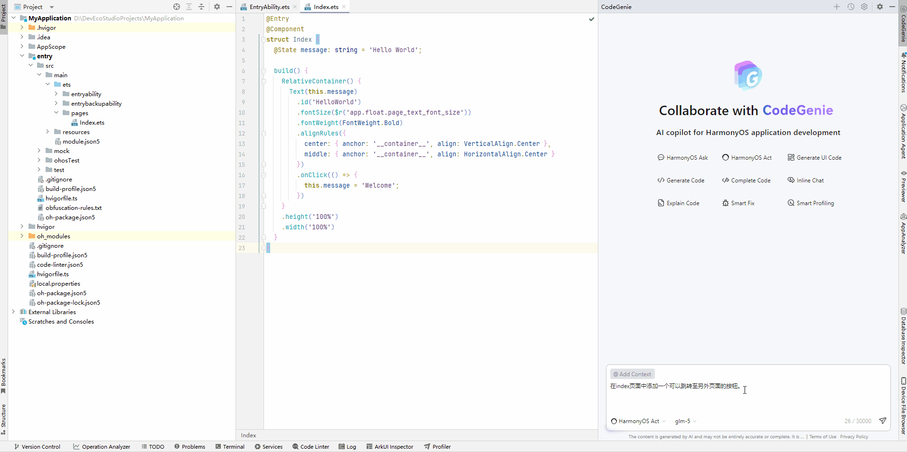

# 代码生成

更新时间：2026-04-20 06:32:02

来源：https://developer.huawei.com/consumer/cn/doc/harmonyos-guides/ide--code-generation

CodeGenie具备自然语言代码生成能力，在**对话框内**输入代码需求描述，点击

发送，将自动生成符合要求的代码段。
 
DevEco Studio 6.0.2 Beta1之前版本，生成的代码一键复制

或一键插入

至编辑区当前光标位置。
 
在DevEco Studio 6.0.2 Beta1版本，生成的代码直接应用到代码文件中；在**Changed Files**中可查看被修改的文件，修改前后内容对比，逐项接受或拒绝；代码还原；以及支持在问答区编译验证功能。
 
从DevEco Studio 6.0.2 Release版本开始，使用HarmonyOS Act智能体时，生成的代码直接应用到代码文件中；在**Changed Files**中可查看被修改的文件，修改前后内容对比，逐项接受或拒绝；代码还原，以及支持在问答区编译验证。
 

 
以DevEco Studio 6.0.2 Release和DevEco Studio 6.0.1 Release版本为例说明，如下。
 
**DevEco Studio 6.0.2 Release**
 
**操作步骤**
 1. 选择HarmonyOS Act智能体，在对话框输入功能描述，点击

发送，等待生成。
2. 在问答区域的**Changed Files**可以查看被修改的文件，点击文件对比修改前后差异；将鼠标悬浮在文件路径上，点击

可接受或拒绝该文件的修改；点击**Accept All****/Reject All**按钮，接受或拒绝所有文件的修改；在编辑器右键**Local History** > **Show History**，查看历史修改文件还原代码。
3. 点击问答区中**Run**，可以编译验证；开启**Auto Run**开关，可以开启自动编译验证。Auto Run更多描述可参考[Agent配置](https://developer.huawei.com/consumer/cn/doc/harmonyos-guides/ide-agent-use#section2075893021715)。
 
**示例**
 
在index页面中添加一个可以跳转至另外页面的按钮。
 

 

 
**DevEco Studio 6.0.1 Release****版本**
 
**操作步骤**
 
在对话区域输入代码需求描述，点击

发送，将自动生成符合要求的代码段，将代码段一键复制

或一键插入

至编辑区当前光标位置。
 
**示例**
 
使用ArkTs语言写一段代码，在页面中间部分插入Swiper组件，其中有3个Image组件，其图片资源名分别为app.media.phone，app.media.watch，app.media.glasses。这些Image组件的宽度撑满父布局，高度为600，图片缩放类型为保持图片宽高比不变，将图片完全显示在边界内。 Swiper组件设置为自动播放，播放时间间隔为2秒。
 

