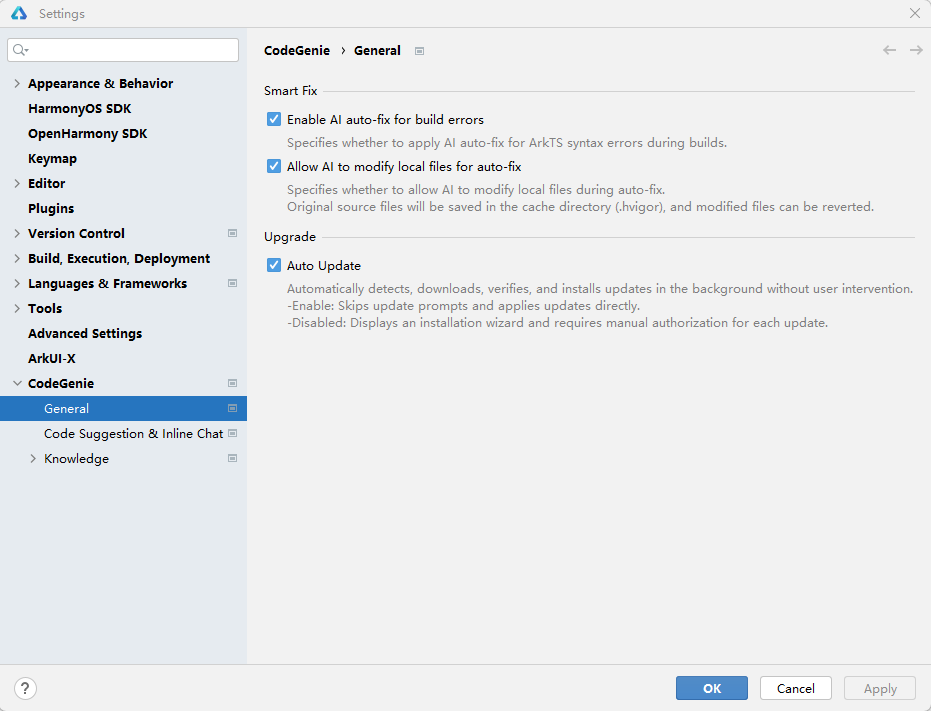
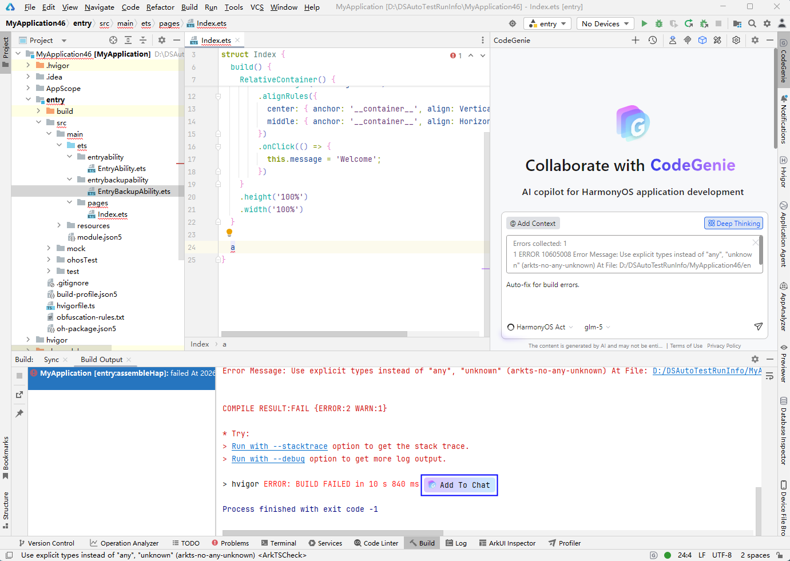

# 编译报错智能分析

更新时间：2026-04-24 09:16:30

来源：https://developer.huawei.com/consumer/cn/doc/harmonyos-guides/ide-compilation-error-analysis

当DevEco Studio构建ArkTS工程出现失败时，CodeGenie仅能够对ArkTS语法相关的错误进行智能分析，提供错误原因及修复方案，帮助开发者快速解决编译构建问题。
 
在DevEco Studio 6.0.2 Beta1版本，编译报错修复的交互过程进一步优化，支持编辑区显示修改前后的差异点，以及开启自动编译验证。
 
从DevEco Studio 6.0.2 Release版本开始，编译报错智能修复能力使用的是HarmonyOS Act智能体。
 
从DevEco Studio 6.1.0 Beta2开始，不支持在编辑区点击Accept/Reject来接受/拒绝AI提供的修复方案；支持使用和切换模型。
 

##### 操作步骤

1. 如需开启编译报错智能分析和自动修复，进入**File > Settings**（macOS为**DevEco Studio > Preferences/Settings**）** > CodeGenie**** ****> General**页面，勾选**Enable AI ****auto-fix for build errors**和**Allow AI to modify local files for auto-fix**。

  

2. 当ArkTS工程出现构建报错时，点击报错信息后方**Add To Chat**图标，CodeGenie将自动引用构建报错信息。

  开发者可在输入框中选择对当前报错修复任务进行补充指令，帮助开发者进行定制化修复，使修复更准确，如“当前工程为API 24工程，注意兼容性”等，点击或回车发送对话后，CodeGenie会分析该报错及开发者输入信息，并提供可能的错误原因，针对语法错误问题将参考开发者诉求，提供恰当的修复方案。

  若弹窗提醒"Please sign in to access DevEco CodeGenie"，请先登录CodeGenie后，再次点击**Add To Chat**图标查看解决方案。

  

3. CodeGenie提供的修复方案被自动应用到代码中。

  
DevEco Studio 6.1.0 Beta2之前版本：
点击编辑区**Accept**（或使用快捷键**Ctrl+Shift+Y**），确认和接受AI提供的修复方案；点击**Reject**（或使用快捷键**Ctrl+Shift+N**）拒绝。
4. 点击右侧对话框中的**Accept All****/Reject All**按钮，接受或拒绝所有文件的修改；将鼠标悬浮在文件路径上，点击

可接受或拒绝该文件的修改。
5. DevEco Studio 6.1.0 Beta2及之后版本：
点击右侧对话框中的**Accept All****/Reject All**按钮，接受或拒绝所有文件的修改；将鼠标悬浮在文件路径上，点击

可接受或拒绝该文件的修改。
6. 点击**Run**编译验证，所需时间见提示，时间单位是秒。

  DevEco Studio 6.1.0 Beta2及之后版本，勾选对话问答结果中的**Auto Run**，或者Agent中**Auto Run**，开启自动编译验证开关。取消勾选Agent中**Auto Run**选项，关闭自动编译验证开关。

  DevEco Studio 6.1.0 Beta2之前版本，勾选对话问答结果中的**Automatically compile and verify without prompting**，或者**File ****>**** Settings****> CodeGenie >****General**中的**Allow AI to automatically run compilation verification during auto-fix**，开启自动编译验证开关。取消勾选**File ****>**** Settings****> CodeGenie >****Genera****l**中**Allow AI to automatically run compilation verification during auto-fix**选项，关闭自动编译验证开关。

  

