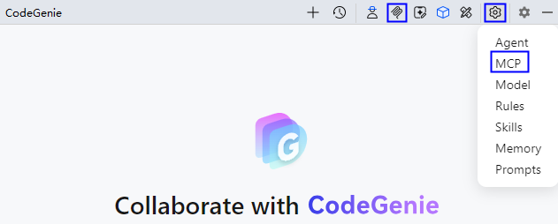
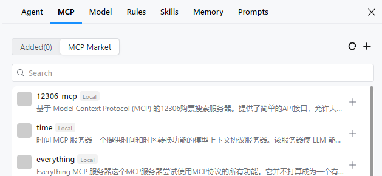

# 模型上下文协议（MCP）配置

更新时间：2026-05-14 10:06:01

来源：https://developer.huawei.com/consumer/cn/doc/harmonyos-guides/ide-agent-mcp

#### 功能介绍

模型上下文协议（Model Context Protocol，简称MCP）是一种开放协议，允许大型语言模型（LLMs）访问自定义的工具和服务，可以通过部署MCP Server并将其集成到自定义智能体中来使用。关于 MCP 的更多信息，请参考 [MCP 官方文档](https://modelcontextprotocol.io/introduction)。
 
从DevEco Studio 6.0.1 Beta1开始，CodeGenie支持配置MCP。
 
从DevEco Studio 6.1.0 Beta2开始，支持在MCP配置界面添加Node (npx) Path和Python (uvx) Path，以及支持从MCP市场添加MCP工具。
 
 

#### 使用约束

为保证MCP Server正常启动，需要安装npx和uvx，可在配置MCP工具时在Node (npx) Path和Python (uvx) Path中添加。
 
- npx：依赖于Node.js，建议使用Node.js的LTS版本。
- uvx：基于Python的快速执行工具，建议安装Python 3.9 以上的版本。

 
 

#### 操作步骤
1. 点击界面右上方

按钮，或者点击界面右上方**Settings**

按钮，选择**MCP**，进入配置页面。

  

2. 添加MCP工具。点击

按钮或**Add Manually**手动添加，点击**MCP Market**或**Add from MCP Market**从MCP市场添加。

  

  
**手动添加**：在编辑框中填写MCP工具的配置信息，填写完成后点击**Add**。
> [!NOTE]
> MCP Server支持三种通信方式：Stdio 、Server-Sent Events (SSE) 和Streamable HTTP。 Stdio方式支持配置cmd、args和env字段，SSE和Streamable HTTP方式支持配置url字段。

  

3. **从MCP市场添加**：在搜索框中搜索目标MCP工具，点击

按钮添加。

4. 在**MCP Tools**列表中，展示所有MCP工具信息，包括名称、连接状态、启用状态。同时，将鼠标悬浮在工具上会显示三个操作按钮：刷新、编辑和删除，方便开发者管理工具。

  

名称：MCP工具名称，如time。
5. 连接状态：工具连接状态，包括“成功”、“失败”和“连接中”三种状态。
6. 启用状态：工具是否已启用。
