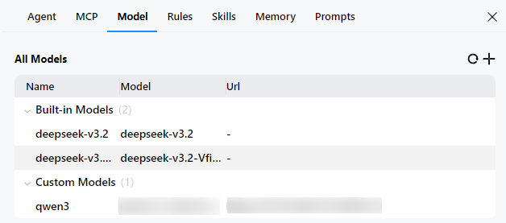

# 模型（Model）配置

更新时间：2026-05-21 06:15:30

来源：https://developer.huawei.com/consumer/cn/doc/harmonyos-guides/ide-agent-model

CodeGenie支持通过Anthropic-API、Gemini-API和OpenAI-API协议接入第三方模型，为自定义Agent提供多样化的模型选择。
 
从DevEco Studio 6.0.1 Beta1开始，CodeGenie支持通过OpenAI-API协议接入第三方模型。
 
从DevEco Studio 6.0.2 Beta1开始，CodeGenie支持通过Anthropic-API、Gemini-API协议接入第三方模型，以及新增Built-in Models内置模型。
 
从DevEco Studio 6.0.2 Release（6.0.2.646）开始， 支持通过服务提供商接入三方模型，URL接入时支持使用Ollama协议的三方模型。
 

##### 操作步骤
1. 点击界面右上方

按钮，或者点击界面右上方**Settings**

按钮，选择**Model**，进入配置页面。

  

2. 点击

按钮添加模型，当前支持通过Service Provider（服务提供商）和URL两种方式添加，推荐优先使用Service Provider方式。

  
通过服务提供商添加。填写**Name**、**Provider**、**API Key**、**Model**字段后，点击**Add**，校验成功后模型将被添加到列表中。
**Name**：模型名称。
3. **Provider**：模型的提供商，可选项包括OpenAI、Gemini、Anthropic、DeepSeek、Alibaba Cloud、Z.ai。
4. **API Key**：模型的访问密钥，在提供商网站申请。
5. **Model**：模型的标识。
6. 通过URL添加。填写**Name**、**Protocol**、**Url**、**API Key**、**Model**字段后，点击**Add**，校验成功后模型将被添加到列表中。
**Name**：模型名称。
7. **Url**：模型的访问地址。
8. **Protocol**：模型的协议，可选项包括OpenAI、Anthropic、Gemini、Ollama。
9. **API Key**：模型的访问密钥，在提供商网站申请。
10. **Model**：模型的标识。
11. 在**All Models**下展示所有添加成功的模型，Built-in Models为内置模型，Custom Models为三方模型（自定义模型）。将鼠标悬浮在三方模型上会显示两个操作按钮：编辑、删除，方便开发者管理三方模型。

  

