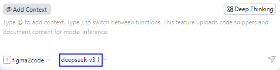
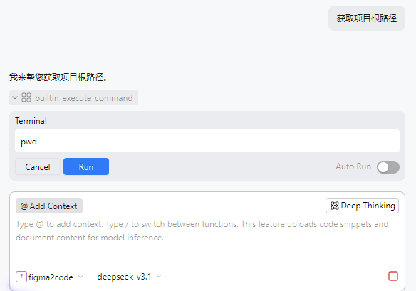
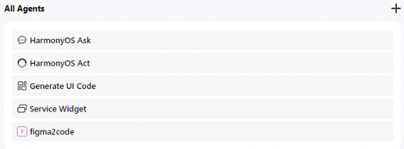
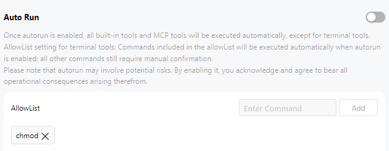
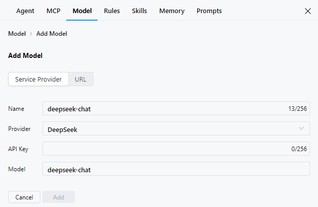
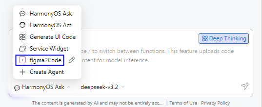

# 自定义智能体（Agent）配置和调用

更新时间：2026-05-14 10:06:01

来源：https://developer.huawei.com/consumer/cn/doc/harmonyos-guides/ide-agent-use

从DevEco Studio 6.0.1 Beta1开始，CodeGenie支持用户添加模型和自定义Agent，增强AI问答能力，提升AI辅助编程和分析能力。
 
从DevEco Studio 6.0.2 Beta1开始，自定义Agent配置时支持添加DevEco Studio内置的工具Built-in Tools、Auto Run和Blocklist。
 
从DevEco Studio 6.0.2 Release（6.0.2.646）开始，DevEco Studio内置工具新增To Do工具，以及支持Agent智能体切换模型和配置三方模型。
 
从DevEco Studio 6.1.0 Beta2开始，DevEco Studio内置工具新增Web Rag工具；Blocklist变更为AllowList，在调用命令行工具执行命令时，白名单中的命令会自动执行。
 
从DevEco Studio 6.1.0 Release（6.1.0.830）版本开始，DevEco Studio内置工具新增Skill工具。
 

#### Agent配置
1. 点击界面右上方

按钮；或者点击界面右上方**Settings**

按钮，选择**Agent**；或者在输入框左下角下拉框选择**Create Agent**，进入配置页面。

  

2. 点击

按钮，填写自定义Agent的相关信息。点击**Add**，将创建自定义Agent。

  
**Name**：必填，自定义Agent的名称。
3. **Prompt Description**：可选，自定义Agent的提示词。
4. **MCP Tools**：可选，添加MCP工具，具体请参考[MCP配置](https://developer.huawei.com/consumer/cn/doc/harmonyos-guides/ide-agent-mcp)。
5. **Built-in Tools**：可选，开启或关闭File Manager、Terminal、Compile and Build、Web Rag、To Do、Skill，默认开启。
File Manager开启后，支持读写本地的代码文件。
6. Terminal开启后，在CodeGenie对话框执行命令时可自动拉起Terminal终端。
7. Compile and Build开启后，支持编译与构建项目。
8. Web Rag开启后，支持在问答过程中检索鸿蒙相关的资料，提升答复准确性。
9. To Do开启后，支持把一个复杂任务拆解成多步执行，帮助CodeGenie聚焦任务，避免遗忘任务，提升答复准确性。
10. Skill开启后，支持在自定义智能体中使用配置的Skill。
11. **Select Model**：必填，选择需要使用的模型，具体请参考[模型（Model）配置](https://developer.huawei.com/consumer/cn/doc/harmonyos-guides/ide-agent-model)。
12. 在**All Agents**下展示所有智能体。

  

13. 设置自动执行开关和白名单列表。

  
**Auto Run**：内置工具（命令行工具除外）和MCP工具被调用过程中，自动执行的开启开关。开启时，工具被调用可自动执行和输出内容；关闭时，工具被调用需开发者授权。默认关闭。
14. **AllowList**：白名单列表，开启Auto Run后，白名单中的命令同样会自动执行。点击**Enter Command**中输入命令，点击**Add**可将命令添加至白名单列表；点击命令后×，可将命令从白名单列表中删除。
15. 选择自定义智能体后，开发者可以切换模型，包括内置模型/默认模型（deepseek-v3.2、glm-5）和三方模型（如deepseek）。

  

16. 点击置灰的三方模型会跳转到Service Provider配置界面（如**deepseek-chat**），填写**API Key**字段即可添加模型。

  

 
 

#### Agent调用
1. Agent配置完成后，可以通过如下两种方式开启调用：

  
在对话区域输入"/"调出命令，选择自定义的Agent（如**figma2code**）。从DevEco Studio 6.1.0 Beta2开始不支持。
2. 在输入框左下角HarmonyOS Ask处下拉框中选择自定义的Agent（如**figma2code**）。
3. 选择自定义Agent后，在右侧可以切换模型，默认使用配置Agent时添加的模型。

  

4. 根据业务需要，进行智能问答、代码生成、代码智能解读等，CodeGenie将会调用自定义Agent和选择的模型生成内容。

  

