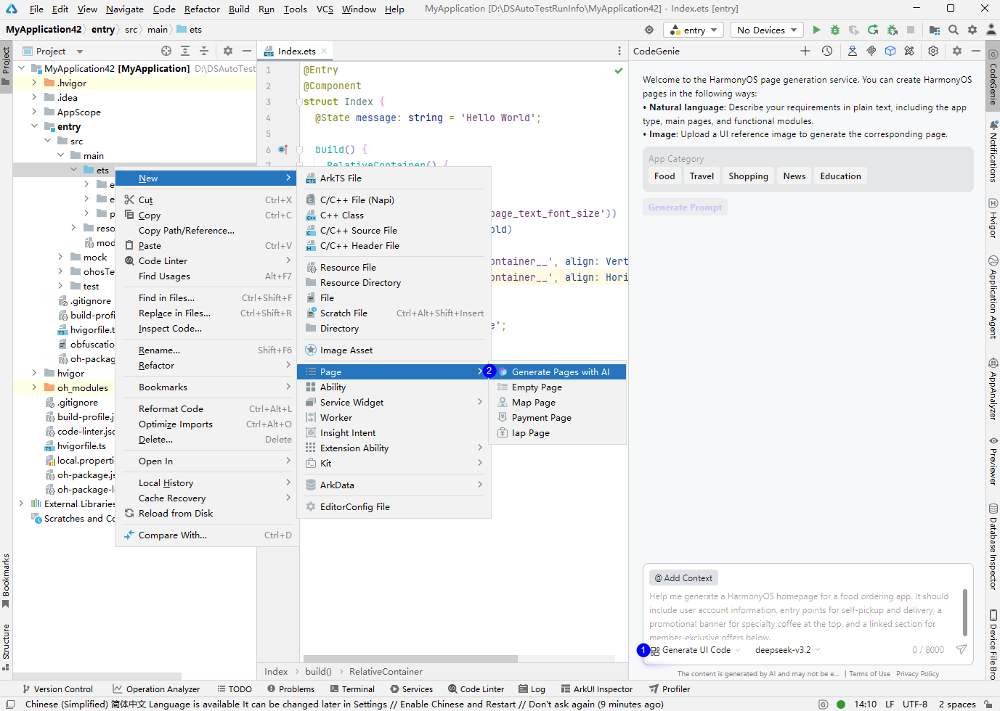
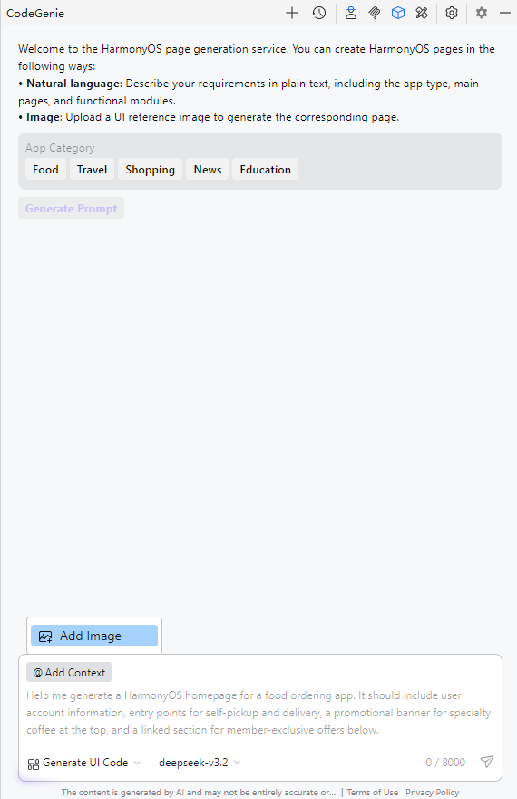
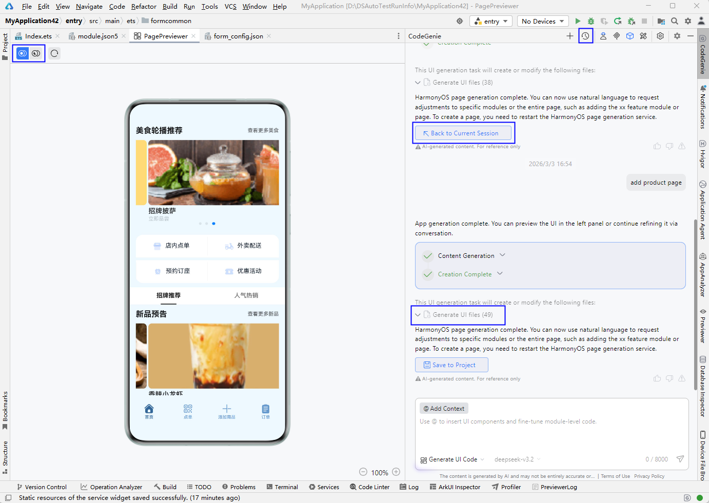
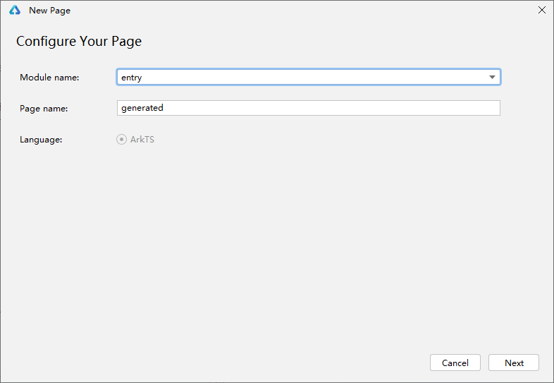
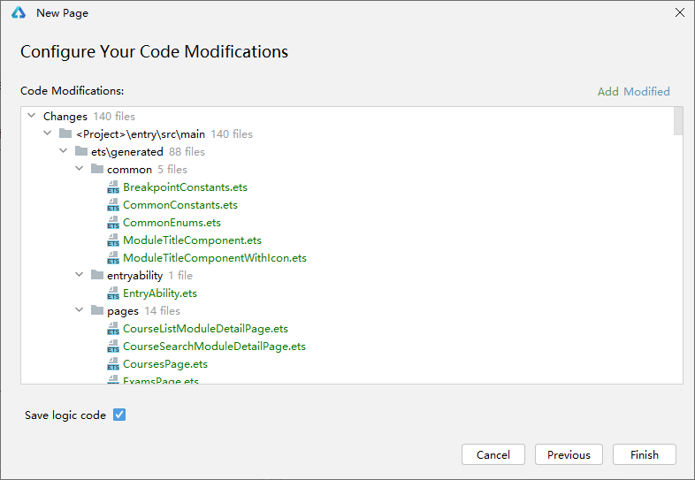

# 页面生成

更新时间：2026-04-28 02:22:30

来源：https://developer.huawei.com/consumer/cn/doc/harmonyos-guides/ide-page-generation

CodeGenie当前支持生成美食、旅游、购物、新闻和教育五大垂域的页面。通过自由输入、快捷模板、上传页面参考图片的方式生成应用/元服务可用的页面代码，生成结果支持实时预览，帮助开发者快速完成页面搭建。

 从DevEco Studio 6.1.0 Beta1开始，生成页面后，预览时支持切换亮色和暗色模式。

 从DevEco Studio 6.1.0 Beta2开始，页面生成时支持使用和切换模型。使用三方模型，预览时仅支持亮色模式；使用内置模型，预览时支持暗色和亮色模式切换；用户完成一轮会话，保存工程或清空会话后，可切换模型；支持查看历史生成信息，以及支持生成文件信息查看。

## 操作步骤

点击页面右侧菜单栏CodeGenie图标完成登录后，可以通过如下三种方式进入页面生成窗口：在对话框输入"/"调出命令，选择**Generate UI Code**。从DevEco Studio 6.1.0 Beta2版本开始不支持。在对话框左下角下拉框选择**Generate UI Code****。**DevEco Studio 6.0.1 Beta1版本新增。在模块右键选择**New > Page**** > ****Generate Pages with AI**。DevEco Studio 6.0.2 Beta1版本新增。

可以通过如下方式生成页面：在对话框输入页面主题要求，点击

图标，等待生成页面；勾选模板中的APP分类（APP Category）和功能模块（Feature Modules），点击**Generate Prompt**，根据提示信息生成页面；点击对话框中** @Add Context**** > Add Image**，直接上传一张页面参考图片，等待生成页面。

对生成的页面进行预览，预览时支持切换亮色和暗色模式；点击历史对话中的**Back to Current Session**回退到之前的页面；点击**Generate**** UI files**查看生成的UI文件内容；新增和修改页面/页面中的关键信息，通过多轮对话完善页面。

点击**Save to Project**，在弹窗中设置页面名称及指定页面所保存的模块。

点击**Next**将生成的代码文件及资源保存至工程中。弹窗中绿色文件为新增，蓝色文件表示该文件存在更改，点击**Finish**完成添加。

