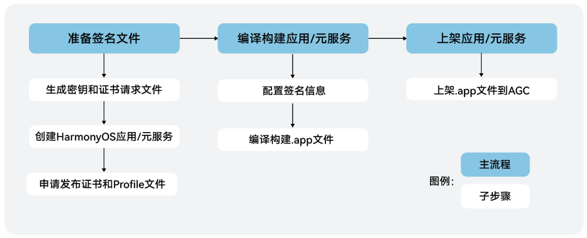
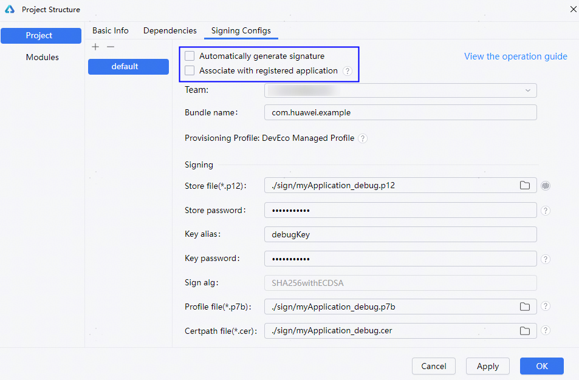
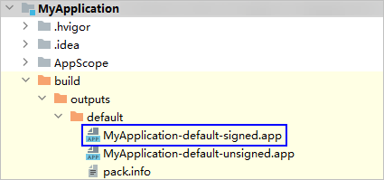
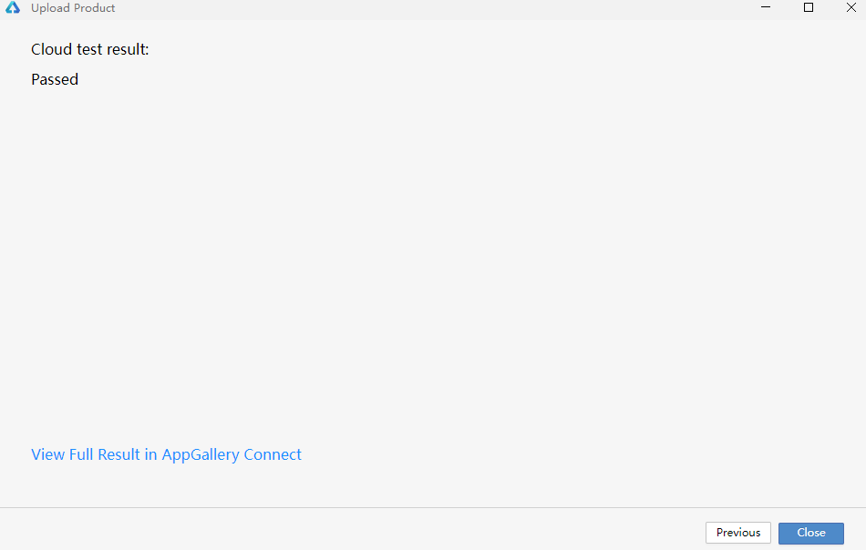
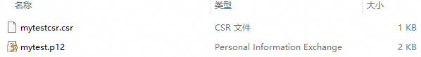
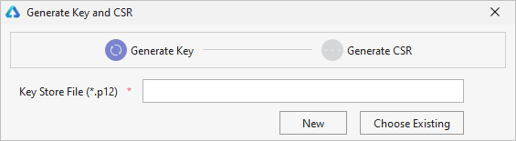
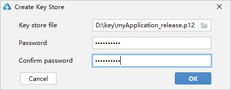
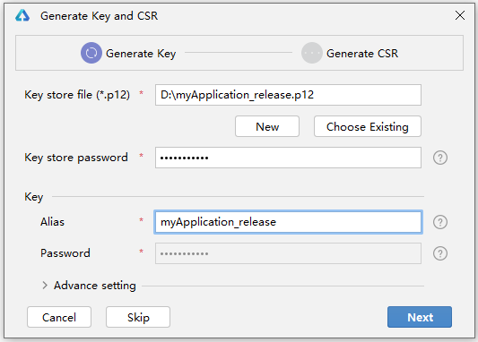
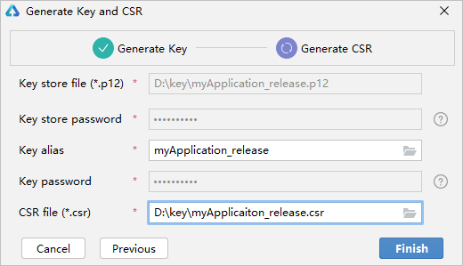

# 发布应用

更新时间：2026-06-15 08:14:01

来源：https://developer.huawei.com/consumer/cn/doc/harmonyos-guides/ide-publish-app

HarmonyOS通过数字证书与Profile文件等签名信息来保证应用/元服务的完整性，应用/元服务上架到AppGallery Connect（AGC）必须通过签名校验。因此，您需要使用发布证书和Profile文件对应用/元服务进行签名后才能发布。

26.0.0 Beta1以下的版本，开发者需要准备签名所需的密钥、证书请求文件、发布证书、Profile文件等，对应用进行手动签名和编译构建后，将软件包上传到AGC。

从26.0.0 Beta1版本开始，开发者只需将应用进行编译构建后上传到AGC。在上传的过程中，无论应用之前是否已签名，DevEco Studio都会对应用重新进行签名，支持使用AGC自动生成的[云管理证书](https://developer.huawei.com/consumer/cn/doc/app/agc-help-cloud-cert-0000002572233173)，也支持使用开发者创建的证书。

#### 26.0.0 Beta1及以上版本

#### 编译构建.app文件

应用上架时，要求应用包类型为Release类型。

1. 单击**Build > Build Hap(s)/APP(s) > Build APP(s)**，等待编译构建生成应用包。

  
> [!TIP]
> 构建模式是&lt;Default&gt;时，构建APP包，默认Release模式；构建HAP/HSP/HAR包，默认Debug模式。更多说明请参考 构建模式 。

2. 编译构建完成后，可以在工程目录**build > outputs > {product}**下，获取应用包。

  

#### 上传软件包

**约束与限制**

 - 该功能仅支持中国境内（香港特别行政区、澳门特别行政区、中国台湾除外）。
 - 该功能将会把您的应用包传至AppGallery Connect用于测试或上架。为了您的信息安全，请勿上传带有个人敏感信息的数据（如密码、源代码、私钥、调试安装包、业务日志等信息）。
 - 仅支持上传工程build/outputs目录下的软件包，上传前请确保工程已构建App包。

**操作步骤**
1. 在DevEco Studio菜单栏，点击**Build > Upload Product。**若未登录，请点击**Sign in**登录华为开发者账号。

  

2. 登录成功后，返回DevEco Studio进入软件包上传界面，确认用户名称和团队信息，在当前工程已构建的App包列表中选择需要上传的软件包，点击**Distribute App**开始上传。

  

3. 选择所需的上传类型，上传类型包含AppGallery Connect、Testing Only、Custom三种，然后点击**Next**。

  
 - **AppGallery Connect**：使用云管理证书和Profile，对应用重新签名；将软件包上传到AGC用于测试和发布，同时上传符号表信息。

4. **Testing Only**：使用云管理证书和Profile，对应用重新签名；将软件包上传到AGC用于测试，同时上传符号表信息。

5. **Custom**：自定义上传配置。

6. 检查应用是否[在AGC注册或关联创建待发布的应用](https://developer.huawei.com/consumer/cn/doc/app/agc-help-create-app-0000002247955506#section16423184171915)，未注册或未关联待发布的应用可在DevEco Studio中创建或关联。

  
应用未在AGC注册，在窗口中配置应用名称、应用包名等信息，创建应用和发布应用，点击**Next**。         
**Project**：项目名称，可创建新项目或选择团队已有项目。

7. **App type**：应用类型，从软件包中获取。

8. **App name**：应用名称。

9. **App package name**：应用包名，从软件包中获取。

10. **App category**：应用分类。

11. **Device Type**：设备类型。

12. **Language**：默认语言。

13. 应用在AGC已注册但未关联创建待发布的应用，在窗口中配置**App name**（应用名称）、**App package name**（应用包名）、**Device Type**（设备类型）、**Language**（默认语言），点击**Next**，会同步在AGC上关联创建待发布的应用。         各选项更多说明请参考[为APP ID关联创建待发布的HarmonyOS应用](https://developer.huawei.com/consumer/cn/doc/app/agc-help-create-app-0000002247955506#section1502161513011)。

  

14. 应用已在AGC注册并且已关联创建待发布的应用，选择**AppGallery Connect**或**Testing Only**的上传类型，会跳转至[步骤8](#li1944219257111)查看软件包上传结果；选择**Custom**上传类型，进入下一步配置软件包的使用场景。

15. 选择Custom上传类型，点击**Next**，进入签名配置界面。使用场景如下：

  
**Upload to AppGallery Connect for test and publish**：上传的软件包用于测试和发布。

16. **Upload to AppGallery Connect for test**：上传的软件包用于测试。

17. **Upload Symbol table**：上传符号表。

18. **Manage Build Version**：自动管理构建版本，Build Version值由AGC计算后更新。

19. 选择签名管理方式。

  
**Automatically manage signing**：自动管理签名，使用云管理证书和Profile，对应用重新签名。

20. **Manually manage signing**：手动管理签名，开发者自行配置签名信息。

21. **创建或导入证书**          创建证书，操作界面如下，各选项含义和填写要求请参考[生成密钥和证书请求文件](#section1079214271414)。创建完成后，在AGC申请[发布Profile](https://developer.huawei.com/consumer/cn/doc/app/agc-help-release-profile-0000002248341090)。

  导入证书，则需要导入本地已有的密钥库文件（.p12的密钥库文件）和证书（.cer文件）。

  

22. **导入或下载Profile**          导入Profile，在本地选择与证书匹配的.p7b文件，或在AGC下载Profile后导入。

  下载Profile，开发者可以选择.p7b文件，选择后会从AGC下载到本地。

  

23. 签名成功后，在选择的软件包路径下会生成"re-signed.app"为后缀的软件包，检查软件包信息，点击**Upload**上传软件包。

  

24. 上传软件包成功后，点击**AppGallery Connect**可进入AGC查看软件包上传记录和检测结果，具体请参考[上传软件包](https://developer.huawei.com/consumer/cn/doc/app/agc-help-release-app-upload-pkg-0000002277983368)。点击**OK**，关闭上传页面。

  

  

  #### 发布.app文件到应用市场

  将HarmonyOS应用/元服务打包成.app文件后上架到应用市场，发布详细操作指导请参考[发布HarmonyOS应用](https://developer.huawei.com/consumer/cn/doc/app/agc-help-release-app-0000002271695230)或[发布元服务](https://developer.huawei.com/consumer/cn/doc/app/agc-help-release-atomic-0000002327731065)。

  

  #### 26.0.0 Beta1以下版本

  

  #### 发布流程

  开发者完成HarmonyOS应用/元服务开发后，需要将应用/元服务打包成App Pack（.app文件），用于上架到AppGallery Connect。发布应用/元服务的流程如下图所示：

  

  

  #### 生成密钥和证书请求文件

  HarmonyOS应用/元服务通过数字证书（.cer文件）和Profile文件（.p7b文件）来保证应用/元服务的完整性。在申请数字证书和Profile文件前，需要提前生成密钥（存储在格式为.p12的密钥库文件中）和证书请求文件（.csr文件）。

  **基本概念**      
**密钥**：包含非对称加密中使用的公钥和私钥，存储在密钥库文件中，格式为.p12，公钥和私钥对用于数字签名和验证。
 - **证书请求文件**：格式为.csr，全称为Certificate Signing Request，包含密钥对中的公钥和公共名称、组织名称、组织单位等信息，用于向AppGallery Connect申请数字证书。
 - **数字证书**：格式为.cer，由AppGallery Connect颁发。
 - **Profile文件**：格式为.p7b，包含HarmonyOS应用/元服务的包名、数字证书信息、描述应用/元服务允许申请的证书权限列表，以及允许应用/元服务调试的设备列表（如果应用/元服务类型为Release类型，则设备列表为空）等内容，每个应用/元服务包中均必须包含一个Profile文件。

当前支持通过DevEco Studio和[CertificateTool](#section72897415171)两种方式生成密钥和证书请求文件。

> [!TIP]
> CertificateTool生成密钥和证书请求文件的操作界面与DevEco Studio 6.1.0 Beta2及以上版本一致，文档以DevEco Studio进行说明。 使用CertificateTool生成时，操作界面中各选项的含义和填写要求请参考DevEco Studio 6.1.0 Beta2及以上版本。

**DevEco Studio 6.1.0 Beta2及以上版本**
1. 在主菜单栏单击**Build > Generate Key** **and CSR**。

  
> [!NOTE]
> 如果本地已有对应的密钥，无需新生成密钥，可以在 Generate Key 界面中单击下方的Skip跳过密钥生成过程，直接使用已有密钥生成证书请求文件。

2. 填写密钥库文件，若已有的密钥库文件（存储有密钥的.p12文件），单击**Select an existing key**进行选择。下面以新创建密钥库文件为例进行说明。

  

3. 在**Generate Key**窗口，填写密钥库信息后，点击**Next**。

  
 - **Keystore Name**：填写p12文件名称，仅允许包含字母、数字、下划线（_）、中划线（-）、句点（．）。

4. **Select file save path**：设置密钥库文件存储路径。

5. **Key store Password**：设置密钥库密码，必须由大写字母、小写字母、数字和特殊符号中的两种以上字符的组合，长度至少为8位。请记住该密码，后续签名配置需要使用。

6. **Confirm password**：再次输入密钥库密码。

7. **Alias**：密钥别名。请记住该别名，后续签名配置需要使用。

8. **Advance Setting**：密钥库文件的高级设置，选填。         
**Validity(years)：**选填，证书有效期，建议设置为25年及以上，覆盖应用/元服务的完整生命周期。

9. **First and last name：**选填，通用名称，可填写应用名称或开发者姓名等。

10. **Organizational unit**：选填，组织单位，可填写部门名称或个人开发等。

11. **Organization：**选填，组织名称，可填写公司全称或开发者姓名等。

12. **City or locality：**选填，城市或地区。

13. **State or province：**选填，州或省。

14. **Country code(XX)：**选填，[国家码](https://developer.huawei.com/consumer/cn/doc/app/agc-help-connect-api-appendix-countrycode-0000002236201362)。

15. 在**Generate**** Certificate Request File (CSR)**窗口，设置CSR文件名和CSR文件存储路径后，点击**Finish**。

  
**CSR File Name**：填写CSR文件名称，仅允许包含字母、数字、下划线（_）、中划线（-）、句点（．）。

16. **Select file save path**：设置CSR文件存储路径。

17. 创建CSR文件成功，可以在存储路径下获取生成的密钥库文件（.p12）、证书请求文件（.csr）。

  

  **DevEco Studio 6.1.0 Beta2以下版本**

1. 在主菜单栏单击**Build > Generate Key** **and CSR**。

  
> [!NOTE]
> 如果本地已有对应的密钥，无需新生成密钥，可以在 Generate Key 界面中单击下方的Skip跳过密钥生成过程，直接使用已有密钥生成证书请求文件。

2. 在**Key Store File**中，可以单击**Choose Existing**选择已有的密钥库文件（存储有密钥的.p12文件）；如果没有密钥库文件，单击**New**进行创建。下面以新创建密钥库文件为例进行说明。

  

3. 在**Create Key Store**窗口中，填写密钥库信息后，单击**OK**。

  
**Key Store File**：设置密钥库文件存储路径，并填写p12文件名。

4. **Password**：设置密钥库密码，必须由大写字母、小写字母、数字和特殊符号中的两种以上字符的组合，长度至少为8位。请记住该密码，后续签名配置需要使用。

5. **Confirm Password**：再次输入密钥库密码。

6. 在**Generate Key** **and CSR**界面中，继续填写密钥信息后，单击**Next**。

  
**Alias**：必填，别名，用于标识密钥名称。请记住该别名，后续签名配置需要使用。

7. **Password**：必填，密码，与密钥库密码保持一致，无需手动输入。

8. **Validity(years)：**选填，证书有效期，建议设置为25年及以上，覆盖应用/元服务的完整生命周期。

9. **First and last name：**选填，通用名称，可填写应用名称或开发者姓名等。字符长度为（0，64），且不可使用（双引号）"、（斜杠）\、（反引号）`。

10. **Organizational unit**：选填，组织单位，可填写部门名称或个人开发等。字符长度为（0，64），且不可使用（双引号）"、（斜杠）\、（反引号）`。

11. **Organization：**选填，组织名称，可填写公司全称或开发者姓名等。字符长度为（0，64），且不可使用（双引号）"、（斜杠）\、（反引号）`。

12. **City or locality：**选填，城市或地区。字符长度为（0，64），且不可使用（双引号）"、（斜杠）\、（反引号）`。

13. **State or province：**选填，州或省。字符长度为（0，64），且不可使用（双引号）"、（斜杠）\、（反引号）`。

14. **Country code(XX)：**选填，[国家码](https://developer.huawei.com/consumer/cn/doc/app/agc-help-connect-api-appendix-countrycode-0000002236201362)。

15. 在**Generate Key** **and CSR**界面，设置CSR文件存储路径和CSR文件名。

  

16. 单击**OK**按钮，创建CSR文件成功，可以在存储路径下获取生成的密钥库文件（.p12）和证书请求文件（.csr）。

  

  

  #### 申请发布证书和发布Profile文件

1. 创建HarmonyOS应用/元服务。在AGC中创建一个HarmonyOS应用/元服务，用于申请发布证书和Profile文件，具体请参考[创建HarmonyOS应用](https://developer.huawei.com/consumer/cn/doc/app/agc-help-create-app-0000002247955506)和[创建元服务](https://developer.huawei.com/consumer/cn/doc/app/agc-help-create-atomic-service-0000002247795706)。

2. 申请发布证书和发布Profile文件。在AGC中申请、下载发布证书和Profile文件，具体请参考[申请发布证书](https://developer.huawei.com/consumer/cn/doc/app/agc-help-release-cert-0000002283336729)和[申请发布Profile](https://developer.huawei.com/consumer/cn/doc/app/agc-help-release-profile-0000002248341090)。

3. 申请完发布证书和发布Profile文件后，请在DevEco Studio中进行签名，具体请参考[配置签名信息](#section945904791115)。       
> [!NOTE]
> 如果申请元服务的签名证书，在“创建应用”操作时，“是否元服务”选项请选择“ 是 ”。 使用发布证书和发布Profile文件进行手动签名，只能用来打包应用上架，不能用来运行调试工程。

  

  #### 配置签名信息

  使用制作的私钥（.p12）文件、在AppGallery Connect中申请的证书（.cer）文件和Profile（.p7b）文件，在DevEco Studio配置工程的签名信息，构建携带发布签名信息的APP。

  在**File > ****Project Structure > ****Project > Signing Configs**** > default**界面中，取消勾选“Automatically generate signature”和“Associate with registered application”，分别配置密钥(.p12文件)、Profile(.p7b文件)和数字证书(.cer文件)的路径等信息。      
**Store File**：选择密钥库文件，文件后缀为.p12。
 - **Store Password**：输入密钥库密码。
 - **Key Alias**：输入密钥的别名信息。
 - **Key Password**：输入密钥的密码。
 - **Sign Alg**：签名算法，固定为SHA256withECDSA。
 - **Profile File**：选择申请的发布Profile文件，文件后缀为.p7b。
 - **Certpath File**：选择申请的发布数字证书文件，文件后缀为.cer。

设置完签名信息后，单击**OK**进行保存，然后使用DevEco Studio生成APP，请参考[编译构建.app文件](#section212415961214)。

#### 编译构建.app文件

应用上架时，要求应用包类型为Release类型。

1. 单击**Build > Build Hap(s)/APP(s) > Build APP(s)**，等待编译构建完成已签名的应用包。

  
> [!NOTE]
> 当未指定 构建模式 时，构建APP包，默认Release模式；构建HAP/HSP/HAR包，默认Debug模式。 即 Build APP(s) 时，默认构建的APP包为Release类型，符合上架要求，开发者无需进行另外设置。

2. 编译构建完成后，可以在工程目录**build > outputs > default**下，获取带签名的应用包。

  

#### 上传软件包

DevEco Studio 5.0.5.200版本开始，支持在DevEco Studio内上传应用软件包。上传软件包前，请先[创建应用](https://developer.huawei.com/consumer/cn/doc/app/agc-help-create-app-0000002247955506)。

**约束与限制**

 - 该功能仅支持中国境内（香港特别行政区、澳门特别行政区、中国台湾除外）。
 - 该功能将会把您的应用包传至AppGallery Connect用于测试或上架。为了您的信息安全，请勿上传带有个人敏感信息的数据（如密码、源代码、私钥、调试安装包、业务日志等信息）。
 - 仅Build Mode为Release的应用支持上传软件包，且确保软件包已配置Release签名。
 - 同时支持通过[AppGallery Connect上传软件包](https://developer.huawei.com/consumer/cn/doc/app/agc-help-release-app-upload-pkg-0000002277983368)。

**操作步骤**
1. 在DevEco Studio菜单栏，点击**Build > Upload Product。**若未登录，请点击**Sign in**登录华为开发者账号。

  

2. 登录成功后，返回DevEco Studio进入软件包上传界面。确认当前工程的product信息，选择需要上传的软件包类型，点击**OK**开始上传。

  
若当前上传的软件包仅做测试发布，请选择**Generate app package and upload it to AppGallery Connect for test**。
3. 若软件包需要在全网正式发布，请选择**Generate app package and upload it to AppGallery Connect for test and publish**。
4. 上传完成后，出现云测试的结果，点击**View Full result in AppGallery Connect**可进入AGC查看软件包上传记录和检测结果，具体请参考[上传软件包](https://developer.huawei.com/consumer/cn/doc/app/agc-help-release-app-upload-pkg-0000002277983368)。点击**Close**关闭上传页面。

  

#### 发布.app文件到应用市场

将HarmonyOS应用/元服务打包成.app文件后上架到应用市场，发布详细操作指导请参考[发布HarmonyOS应用](https://developer.huawei.com/consumer/cn/doc/app/agc-help-release-app-0000002271695230)或[发布元服务](https://developer.huawei.com/consumer/cn/doc/app/agc-help-release-atomic-0000002327731065)。

#### 附录

#### CertificateTool下载

| 平台 | 包名 | 版本号 | SHA256校验码 | 更新时间 |
| --- | --- | --- | --- | --- |
| Windows(64-bit) | certificate-tool-windows-x64-1.0.0.1.zip | 1.0.0.1 | dee6c2ae3b300fd7450bbeb2aadd96f1099ee5235ae627afcfad9b3ed3ded7da | 2026/04/20 |
| Mac(64-bit) | certificate-tool-mac-x64-1.0.0.1.zip | 1.0.0.1 | 8afc53e6714cb7e8840114065012b5f706c265c056491c240e5433be311bf084 | 2026/04/20 |
| Mac(ARM64) | certificate-tool-mac-arm64-1.0.0.1.zip | 1.0.0.1 | 07283684624b11c2db0c2ce2654729b5114b3085df68736a43967eda247a7b4e | 2026/04/20 |
