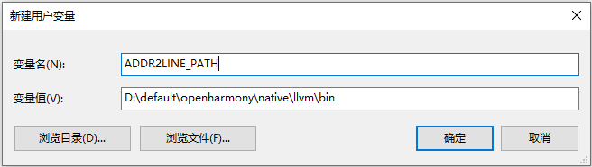
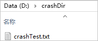
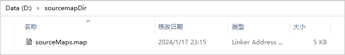
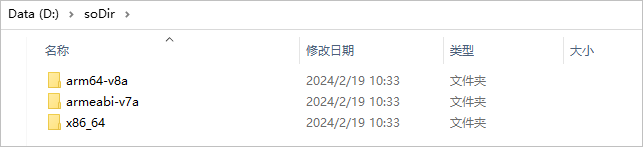
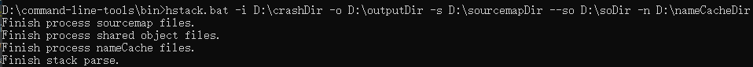
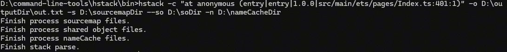
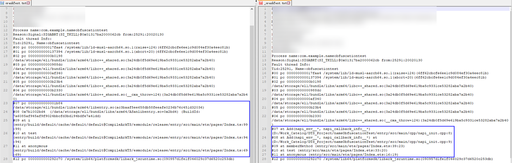

# 堆栈解析工具（hstack）

更新时间：2026-04-30 02:42:31

来源：https://developer.huawei.com/consumer/cn/doc/harmonyos-guides/ide-command-line-hstack

## 简介

hstack是为开发人员提供的用于将release应用混淆后的crash堆栈解析为源码对应堆栈的工具，支持Windows、Mac、Linux三个平台，关于堆栈解析的原理，请查看[异常堆栈解析原理](https://developer.huawei.com/consumer/cn/doc/harmonyos-guides/ide-exception-stack-parsing-principle)。 hstack命令行格式为：
```text
hstack [options]
```

 options: 可选配置，请参考[表hstack命令行配置](#table25697717185)。
| 指令 | 说明 |
| --- | --- |
| -i/--input | 可选，指定工程crash文件归档目录。 |
| -c/--crash | 可选，指定一条crash堆栈。 |
| -o/--output | 可选，指定解析结果输出目录（输入指定为-c时， -o参数指定一个输出文件）。 |
| -s/--sourcemapDir | 可选，指定工程sourceMap文件归档目录。 |
| --so/--soDir | 可选，指定工程shared object文件归档目录。 |
| -n/--nameObfuscation | 可选 ，指定工程nameCache文件归档目录。 |
| -v/--version | 查看hstack版本。 |
| -h/--help | 查询hstack命令行帮助。 |


> [!NOTE]
> crash文件归档目录与crash堆栈必须且只能提供一项。sourceMap与shared object文件归档目录至少提供一项。如果需要对方法名进行解析还原，则需要同时提供sourceMap与nameCache文件。路径参数不支持以下特殊字符：`~!@#\$^&*=|{};,\s\[\]?~！@#￥……&*（）——|{}【】‘；：。，、？


## 环境配置

hstack工具在Command Line Tools的bin目录下，需要[将bin目录配置到PATH变量中](https://developer.huawei.com/consumer/cn/doc/harmonyos-guides/ide-commandline-get#section17776863449)。本工具依赖Node环境，需要[将Node.js配置到环境变量中](https://developer.huawei.com/consumer/cn/doc/harmonyos-guides/ide-command-line-building-app#section159168531288)。如果需要对C++文件产生的异常进行解析，则需要将SDK中的native\llvm\bin目录配置到环境变量中，变量名设置为“ADDR2LINE_PATH”。


## 使用示例

将应用产生的crash文件归档到crashDir目录下（或者-c指定一条crash堆栈），关于堆栈的获取方式请参考[崩溃检测](https://developer.huawei.com/consumer/cn/doc/harmonyos-guides/fault-detection-overview)。

使用-o指定输出目录，当不指定时，会输出至-i指定的crashDir目录下（通过-c输入为crash堆栈时，可以使用-o指定一个输出文件，或不指定，直接将结果输出至控制台）。使用-s指定工程对应sourceMap文件归档目录（可选，与shared object文件归档目录至少提供一项）。

使用--so指定shared object文件归档目录（可选，与sourceMap归档目录至少提供一项）。

使用-n指定nameCache文件归档目录（可选）。

执行以下命令，可将release应用crash堆栈解析为源码对应堆栈。
```text
# 通过-i指定crash文件归档目录，并将解析结果输出至outputDir目录
hstack -i D:\crashDir -o D:\outputDir -s D:\sourcemapDir --so D:\soDir -n D:\nameCacheDir
# 通过-c指定一条堆栈，并将解析结果输出至out.txt文件
hstack -c "at anonymous (entry|entry|1.0.0|src/main/ets/pages/Index.ts:401:1)" -o D:\outputDir\out.txt -s D:\sourcemapDir --so D:\soDir -n D:\nameCacheDir
```



如果是指定crash文件归档目录，解析完成后，outputDir目录下会生成对应的解析结果，文件以原始crash文件名加“_”前缀进行命名。crash堆栈中的C++日志以及ArkTS日志均已解析为源码对应的文件路径以及行列号，结果如下图所示：

在构建Release应用时，so文件是默认不包含符号表信息的，如果需要在构建Release应用时生成包含符号表的so文件，需要在工程的模块级build-profile.json5文件的buildOption属性中，配置如下信息：
```text
"buildOption": {
  "externalNativeOptions": {
    "arguments": "-DCMAKE_BUILD_TYPE=RelWithDebInfo"
  }
}
```


## 堆栈解析方案说明

以如下代码为例。 Entry模块通过独立har包形式引用har模块中的har方法：
```text
import {har} from 'Har'
@Entry
@Component
struct Index {
  @State har: string = 'Har';
  build() {
    Row() {
      Column() {
        Text(this.har)
          .fontSize(50)
          .fontWeight(FontWeight.Bold)
          .onClick(() => {
            let entryClass = new EntryClass();
            entryClass.callHarFunction();
          })
      }
      .width('100%')
    }
    .height('100%')
  }
}

class EntryClass {
  callHarFunction() {
    har()
  }
}
```


```text
@Component
export struct MainPage {
  @State message: string = 'Hello World';

  build() {
    Row() {
      Column() {
        Text(this.message)
          .fontSize(50)
          .fontWeight(FontWeight.Bold)
      }
      .width('100%')
    }
    .height('100%')
  }
}

export function har() {
  BigInt(1.1)
}
```

 生成的crash如下：
```text
at har (entry|har|1.0.0|src/main/ets/components/mainpage/MainPage.js:58:58)
at i (entry|entry|1.0.0|src/main/ets/pages/Index.ts:71:71)
at anonymous (entry|entry|1.0.0|src/main/ets/pages/Index.ts:55:55)
```

 crash中，包含混淆后的方法名（或属性名）、路径信息以及混淆后的行列号信息，其中： 方法名在配置相应混淆规则后，会进行混淆处理（例如上述例子中EntryClass的callHarFunction被混淆为i）。方法名混淆前后的映射关系保存在对应模块编译产物的nameCache文件中。路径信息格式为：引用方entry-packageName|被引用方packageName|version|源码相对路径，其中packageName以及version保存在对应模块编译产物的sourceMap文件中。行列号混淆前后的映射关系保存在对应模块编译产物的sourceMap文件中，可利用文件对应的mappings字段进行解析还原。 在对堆栈进行还原时，可分为以下三步： 根据路径信息，找到引用方模块sourceMap。例如第一条堆栈：
```text
at har (entry|har|1.0.0|src/main/ets/components/mainpage/MainPage.js:58:58)
```

 根据路径信息entry|har|1.0.0|src/main/ets/components/mainpage/MainPage.js，可在entry模块sourceMap文件中找到如下字段：
```text
"entry|har|1.0.0|src/main/ets/components/mainpage/MainPage.js": {
    "version": 3,
    "file": "MainPage.js",
    "sources": [
      "oh_modules/.ohpm/Har@ue9rwlwgmslvadnmypsedjcin6a=/oh_modules/Har/src/main/ets/components/mainpage/MainPage.js"
    ],
    "names": [],
    "mappings": "AAAA,IAAA,CAAA,CAAA,sBAAA,IAAA,MAAA,CAAA,SAAA,CAAA,EAAA;IACA,OAAA,CAAA,GAAA,CAAA,MAAA,CAAA,SAAA,EAAA,sBAAA,EAAA,GAAA,EAAA,GAAA,CAAA,CAAA,CAAA;CACA;AACA,MAAA,OAAA,QAAA,SAAA,MAAA;IACA,YAAA,CAAA,EAAA,EAAA,EAAA,CAAA,EAAA,CAAA,GAAA,CAAA,CAAA,EAAA,CAAA,GAAA,SAAA,EAAA,CAAA;QACA,KAAA,CAAA,CAAA,EAAA,CAAA,EAAA,CAAA,EAAA,CAAA,CAAA,CAAA;QACA,IAAA,OAAA,CAAA,KAAA,UAAA,EAAA;YACA,IAAA,CAAA,gBAAA,GAAA,CAAA,CAAA;SACA;QACA,IAAA,EAAA,GAAA,IAAA,wBAAA,CAAA,aAAA,EAAA,IAAA,EAAA,SAAA,CAAA,CAAA;QACA,IAAA,CAAA,yBAAA,IAAA,CAAA;QACA,IAAA,CAAA,oBAAA,EAAA,CAAA;IACA,CAAA;IACA,yBAAA,CAAA,EAAA;QACA,IAAA,GAAA,OAAA,KAAA,SAAA,EAAA;YACA,IAAA,CAAA,OAAA,GAAA,GAAA,OAAA,CAAA;SACA;IACA,CAAA;IACA,eAAA,CAAA,CAAA;IACA,CAAA;IACA,iCAAA,CAAA,CAAA;QACA,IAAA,EAAA,CAAA,uBAAA,CAAA,CAAA,CAAA,CAAA;IACA,CAAA;IACA,gBAAA;QACA,IAAA,EAAA,CAAA,gBAAA,EAAA,CAAA;QACA,iBAAA,CAAA,GAAA,EAAA,CAAA,MAAA,CAAA,IAAA,CAAA,IAAA,EAAA,CAAA,CAAA;QACA,IAAA,CAAA,wBAAA,EAAA,CAAA;IACA,CAAA;IACA,IAAA,OAAA;QACA,OAAA,IAAA,EAAA,CAAA,GAAA,EAAA,CAAA;IACA,CAAA;IACA,IAAA,OAAA,CAAA,EAAA;QACA,IAAA,EAAA,CAAA,GAAA,IAAA,CAAA;IACA,CAAA;IACA,aAAA;QACA,IAAA,CAAA,yBAAA,CAAA,CAAA,CAAA,EAAA,EAAA,EAAA,EAAA;YACA,GAAA,CAAA,MAAA,EAAA,CAAA;YACA,GAAA,CAAA,MAAA,CAAA,MAAA,CAAA,CAAA;QACA,CAAA,EAAA,GAAA,CAAA,CAAA;QACA,IAAA,CAAA,yBAAA,CAAA,CAAA,CAAA,EAAA,CAAA,EAAA,EAAA;YACA,MAAA,CAAA,MAAA,EAAA,CAAA;YACA,MAAA,CAAA,KAAA,CAAA,MAAA,CAAA,CAAA;QACA,CAAA,EAAA,MAAA,CAAA,CAAA;QACA,IAAA,CAAA,yBAAA,CAAA,CAAA,CAAA,EAAA,CAAA,EAAA,EAAA;YACA,IAAA,CAAA,MAAA,CAAA,IAAA,CAAA,OAAA,CAAA,CAAA;YACA,IAAA,CAAA,QAAA,CAAA,EAAA,CAAA,CAAA;YACA,IAAA,CAAA,UAAA,CAAA,UAAA,CAAA,IAAA,CAAA,CAAA;QACA,CAAA,EAAA,IAAA,CAAA,CAAA;QACA,IAAA,CAAA,GAAA,EAAA,CAAA;QACA,MAAA,CAAA,GAAA,EAAA,CAAA;QACA,GAAA,CAAA,GAAA,EAAA,CAAA;IACA,CAAA;IACA,QAAA;QACA,IAAA,CAAA,mBAAA,EAAA,CAAA;IACA,CAAA;CACA;AACA,MAAA,UAAA,GAAA;IACA,MAAA,CAAA,GAAA,CAAA,CAAA;AACA,CAAA",
    "entry-package-info": "entry|1.0.0",
    "package-info": "har|1.0.0"
  }
```

 利用对应sourceMap信息进行堆栈路径以及行列号还原：基于步骤1找到的sourceMap信息，根据sources及mappings字段进行解析，可以将路径以及行列号还原如下：
```text
at har (oh_modules/.ohpm/Har@ue9rwlwgmslvadnmypsedjcin6a=/oh_modules/Har/src/main/ets/components/mainpage/MainPage.js:58:58)
```

 该文件位于entry模块oh_modules路径下。 如果对应sourceMap中包含package-info字段，则可以利用package-info中对应模块的sourceMap，对该条堆栈进行二次解析。例如该堆栈中包package-info为har|1.0.0，可利用har中的sourceMap对该堆栈进行再次解析，方案如下： 由路径中最后一个oh_modules起，向下两级，截断上述第一次解析结果路径，结果如下：
```text
src/main/ets/components/mainpage/MainPage.js
```

 上述路径拼接package-info， 拼接方式为：packageName|packageName|version|截断路径，得到拼接路径如下：
```text
har|har|1.0.0|src/main/ets/components/mainpage/MainPage.js
```

 利用拼接后的路径，在har模块sourceMap文件中找到如下字段：
```text
"har|har|1.0.0|src/main/ets/components/mainpage/MainPage.js": {
  "version": 3,
  "file": "MainPage.ets",
  "sources": [
    "har/src/main/ets/components/mainpage/MainPage.ets"
  ],
  "names": [],
  "mappings": ";;;AAEA,MAAA,OAAA,QAAA,SAAA,MAAA;IADA,YAAA,CAAA,EAAA,CAAA,EAAA,CAAA,EAAA,IAAA,CAAA,CAAA,EAAA,IAAA,SAAA,EAAA,CAAA;;;;;;;;IADyB,CAAA;;;;;;;;;;;;;;;;;;;;;;IAKvB,aAAA;;;;;;;;;;;;YAGM,IAAA,CAAA,UAAA,CAAA,UAAA,CAAA,IAAA,CAAA,CAAA;;;;;IAOL,CAAA;;;;;AAGH,MAAA,UAAA,GAAA;;AAEA,CAAA",
  "entry-package-info": "har|1.0.0"
}
```

 根据该sourceMap的sources及mappings字段进行再次解析，可得到该堆栈对应的源码信息为：
```text
at har (har/src/main/ets/components/mainpage/MainPage.ets:20:1)
```

利用nameCache文件，对方法名进行解析还原。以第二条堆栈为例：
```text
at i (entry|entry|1.0.0|src/main/ets/pages/Index.ts:71:71)
```

 通过步骤1与步骤2，将该堆栈路径以及行列号信息进行解析，结果如下：
```text
at i (entry/src/main/ets/pages/Index.ets:25:3)
```

 在对应模块编译产物中的nameCache文件中，通过解析后的文件路径找到如下字段：
```text
"entry/src/main/ets/pages/Index.ets": {
  "IdentifierCache": {
    "Index#initialRender#__function": "o",
    "Index#initialRender#$2#__function": "t",
    "Index#initialRender#$2#$0#entryClass": "u",
    "$0#__function": "a1"
  },
  "MemberMethodCache": {
    "initialRender:6:20": "initialRender",
    "callHarFunction:24:26": "i"
  },
  "obfName": "entry/src/main/ets/pages/Index.ets"
}
```

 该字段的IdentifierCache与MemberMethodCache中保存了方法名混淆前后的映射关系，对应格式为： "源码方法名:该方法起始行号:该方法结束行号":"混淆后方法名"。 第二条堆栈混淆后的方法名为"i"，利用上述字段对该方法名进行还原： 在上述字段中找出所有混淆后方法名为"i"的条目，可能存在多个，该字段中为：
```text
"callHarFunction:24:26": "i"
```

 找到行号范围包含步骤2中还原后行号的条目，根据步骤2得到还原后的行号为25，包含在24-26之内，因此可以得到源码对应方法名为"callHarFunction"。 通过上述方式，可以得到源码的方法名。 步骤2与步骤3所得结果进行整合，得到最终堆栈结果如下：
```text
at har (har/src/main/ets/components/mainpage/MainPage.ets:20:1)
at callHarFunction (entry/src/main/ets/pages/Index.ets:25:3)
at anonymous (entry/src/main/ets/pages/Index.ets:14:47)
```

通过上述方式，即可利用编译产物对release应用的crash信息进行解析还原。
