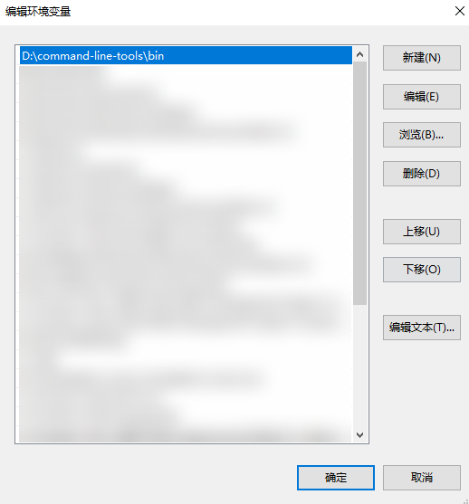

# 获取命令行工具

更新时间：2026-04-20 06:32:02

来源：https://developer.huawei.com/consumer/cn/doc/harmonyos-guides/ide-commandline-get

该命令行工具集合了HarmonyOS应用开发所用到的系列工具，包括代码检查codelinter、堆栈解析hstack、命令行构建hvigorw、三方依赖管理ohpm和SDK中包含的一系列工具，本文主要讲解codelinter、hstack、hvigorw等工具的使用方式，关于SDK中包含的工具的使用指导请参考[SDK命令行工具](https://developer.huawei.com/consumer/cn/doc/harmonyos-guides/command-line-tools-overview)。


## 命令行工具获取

请前往[下载中心](https://developer.huawei.com/consumer/cn/download/command-line-tools-for-hmos)获取命令行工具Command Line Tools，并根据下载中心页面**工具完整性**指导进行完整性校验。
> [!NOTE]
> HarmonyOS SDK已嵌入命令行工具中，无需额外下载配置。


## 配置环境变量

将命令行工具进行解压，codelinter、hstack等工具存放在Command Line Tools的bin目录下，需要将该目录配置到PATH环境变量中。

## Windows

命令行工具解压后，将\${Command Line Tools解压路径}\command-line-tools\bin目录配置到系统或者用户的PATH环境变量中，配置完成后重新打开命令行窗口。 例如将命令行工具解压到D盘根目录，示例如下。


## macOS/Linux

将下载后的命令行工具解压到本地。打开终端工具，执行以下命令，根据输出结果分别执行不同命令。
```text
echo $SHELL
```

 如果输出结果为/bin/bash，则执行以下命令，打开.bash_profile文件。
```text
vi ~/.bash_profile
```

 如果输出结果为/bin/zsh，则执行以下命令，打开.zshrc文件。
```text
vi ~/.zshrc
```

单击字母“i”，进入**Insert**模式。输入以下内容，在PATH路径下添加环境变量。请以实际命令行工具存储路径为准。
```text
export PATH=${Command Line Tools解压路径}/command-line-tools/bin:$PATH
```

 编辑完成后，单击**Esc**键，退出编辑模式，然后输入“:wq”，单击**Enter**键保存。执行以下命令，使配置的环境变量生效。如果[步骤2](#zh-cn_topic_0000001169160500_zh-cn_topic_0000001056725590_li56571525162613)时打开的是.bash_profile文件，请执行如下命令：
```text
source ~/.bash_profile
```

 如果[步骤2](#zh-cn_topic_0000001169160500_zh-cn_topic_0000001056725590_li56571525162613)时打开的是.zshrc文件，请执行如下命令：
```text
source ~/.zshrc
```


> [!NOTE]
> 如需验证是否配置成功，可以使用相关命令验证，例如执行codelinter -v指令，检查是否可以正确获取codelinter工具版本。
