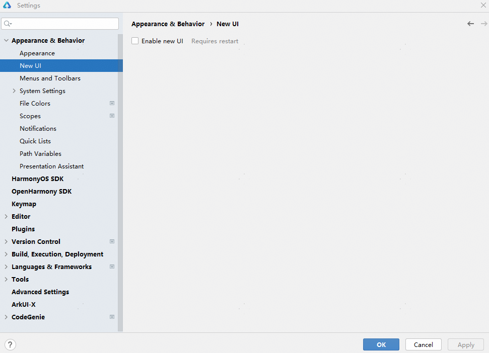
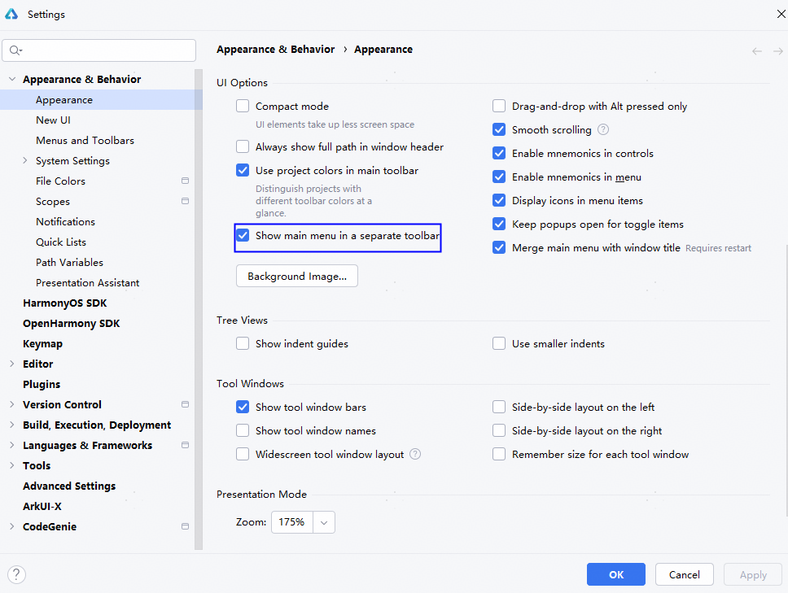
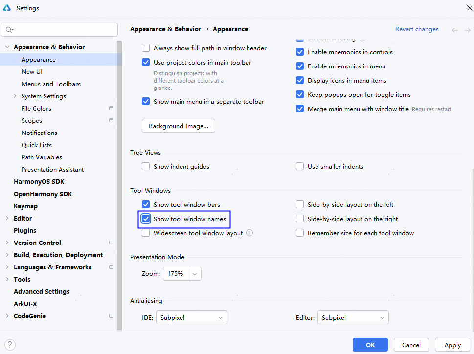
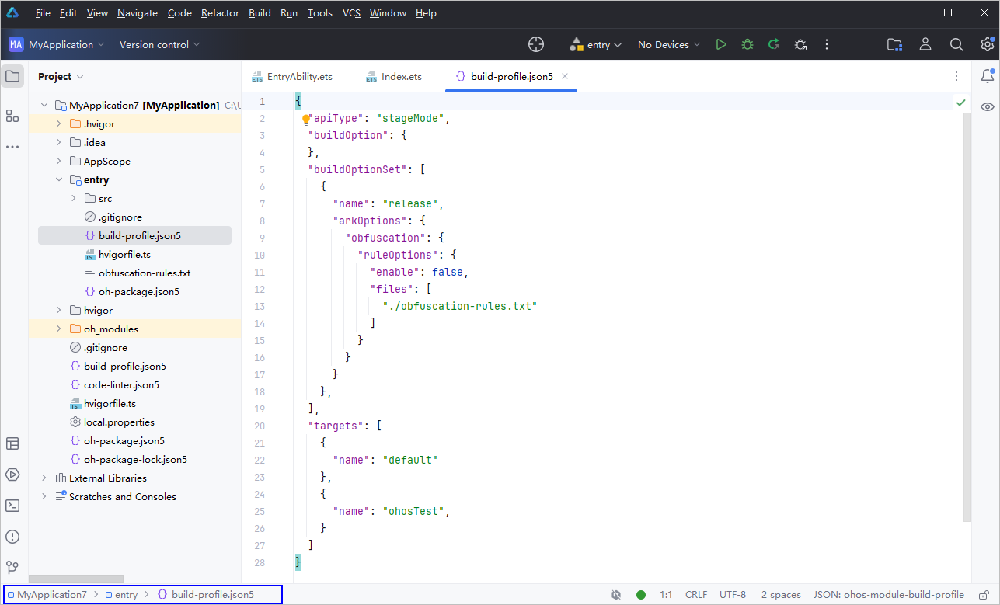

# 使用新UI

更新时间：2026-01-15 06:51:04

来源：https://developer.huawei.com/consumer/cn/doc/harmonyos-guides/ide-new-ui

从DevEco Studio 6.0.0 Beta1版本开始，IntelliJ 2024.3.3底座升级，提供全新的用户界面（User Interface，简称UI），简化工具布局，优化图标、窗口等显示效果，带来更简洁的外观及开发体验。
 

#### 开启或关闭新UI

启动DevEco Studio时，将有弹窗提示是否启用新用户界面。点击**Enable and Restart**，将重启DevEco Studio开始体验新UI。
 

 
此外，可以在菜单栏进入**File > Settings...**（macOS系统为**DevEco Studio > Preferences/Settings...**）**> Appearance & Behavior > New UI**，勾选**Enable new UI**，点击**Apply**，在弹窗中点击**Restart**重启完成后体验新UI。
 

 
如需切换回原有的经典UI，在界面左上角点击

图标，进入**File > Settings... **（macOS系统为**DevEco Studio > Preferences/Settings...**）**> Appearance & Behavior > New UI**，取消勾选**Enable new UI**，点击**Apply**，在弹窗中点击**Restart**重启即可完成切换。
 
 

#### 菜单栏体验变化

原有固定于界面上方的菜单栏，在新UI中收起到页面左上角工具栏中Main Menu主菜单

图标内。点击图标即可展开菜单，继续选择需要执行的功能或操作。
 

 
如需将菜单栏展开并固定在主界面，可以在菜单栏进入**File > Settings... > Appearance & Behavior > Appearance** > **UI Options**中，勾选**Show main menu in a separate toolbar**，点击**Apply**在主界面固定显示菜单栏。
 

 
 

#### 工具窗口优化

主窗口两侧的工具窗口提供更丰富的功能选择。与经典UI相比，ArkUI Inspector、Services、Terminal、Problems、Version Control等功能图标在左侧工具窗口中呈现。点击工具窗口中Project

图标，显示当前工程目录。
 

 
在菜单栏进入**File > Settings... > Appearance & Behavior > Appearance** > **Tool Windows，**勾选**Show tool window names**后点击**Apply**，或将鼠标放置于工具窗口区域右键选择**Show Tool Window Names**，选择在界面中展示各功能图标的名称。
 

 
 

#### 文件路径展示位置变化

在新UI中，当前编辑的文件所在的工程路径将展示在页面左下方。
 

 
 
> [!NOTE]
> 更多新用户界面变化详情，请参见 new UI 。
