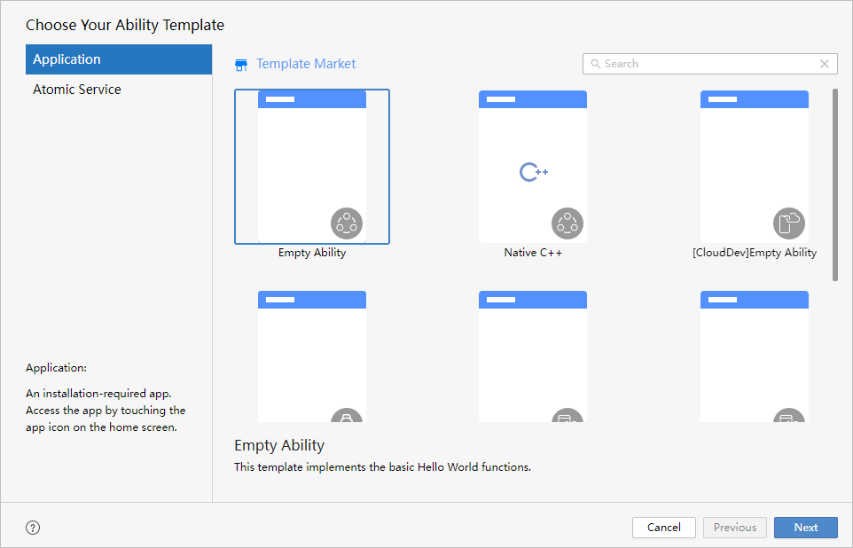

# 工程模板介绍

更新时间：2026-01-15 06:51:04

来源：https://developer.huawei.com/consumer/cn/doc/harmonyos-guides/ide-template

DevEco Studio支持多种品类的应用/元服务开发，预置丰富的工程模板，可以根据工程向导轻松创建适应于各类设备的工程，并自动生成对应的代码和资源模板。同时，DevEco Studio还提供了多种编程语言供开发者进行应用/元服务开发，包括ArkTS、JS和C/C++。
 

 

 
工程模板支持的开发语言及模板说明如下表所示：
  
| 模板名称 | 说明 |
| --- | --- |
| Empty Ability | 用于Phone、Tablet、2in1、Car、Wearable、TV设备的模板，展示基础的Hello World功能。 |
| Native C++ | 用于Phone、Tablet、2in1、Car、Wearable、TV设备的模板，作为应用调用C++代码的示例工程，界面显示“Hello World”。 |
| [CloudDev]Empty Ability | 端云一体化开发通用模板。更多信息请参见端云一体化开发。 约束与限制：该功能仅支持中国境内（香港特别行政区、澳门特别行政区、中国台湾除外）。 |
| [Lite]Empty Ability | 用于Lite Wearable设备的模板，展示了基础的Hello World功能。可基于此模板，修改设备类型及RuntimeOS，进行小型嵌入式设备开发。 |
| Flexible Layout Ability | 用于创建跨设备应用开发的三层工程结构模板。三层工程结构包含common（公共能力层）、features（基础特性层）、products（产品定制层）。 |
| Embeddable Ability | 用于开发支持被其他应用嵌入式运行的元服务的工程模板。 |
| [ArkUI-X]Empty Ability | 创建一个展示基础的Hello World功能的模板，构建基于HarmonyOS应用的跨平台应用包。更多信息请参见ArkUI-X概览。 |
| [ArkUI-X]Library | 用于基于HarmonyOS应用构建跨平台应用的依赖包。依赖包支持添加到已有的应用中。更多信息请参见ArkUI-X概览。 |
| [ArkUI-X]Native C++ | 创建一个调用C++代码的示例工程，构建基于HarmonyOS应用的跨平台应用包。更多信息请参见ArkUI-X概览。 |
