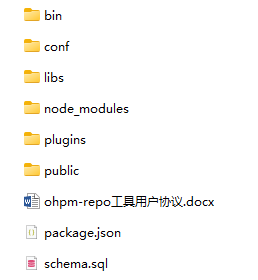
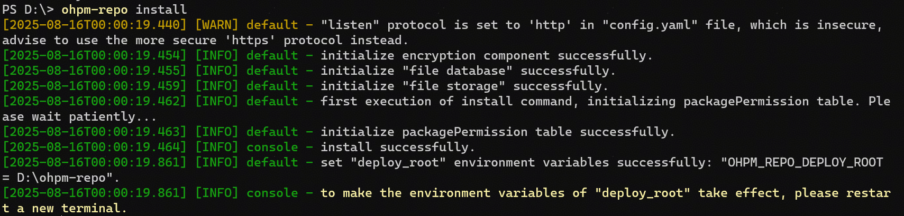
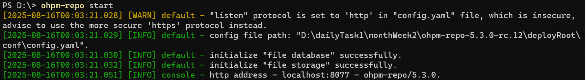
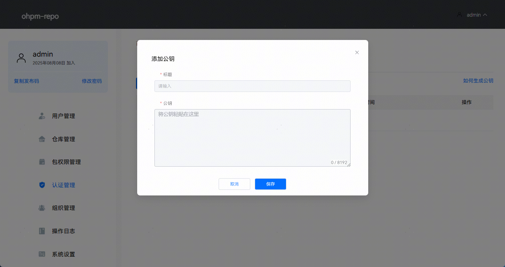
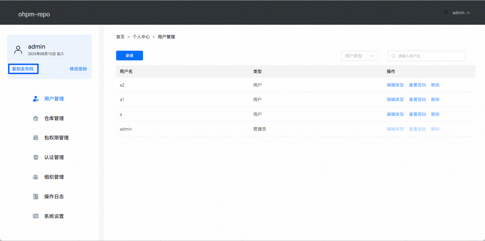
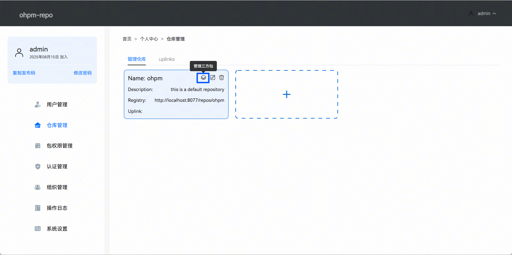
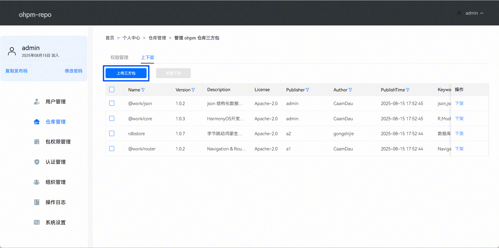

# 快速开始

更新时间：2026-04-30 02:42:31

来源：https://developer.huawei.com/consumer/cn/doc/harmonyos-guides/ide-ohpm-repo-quickstart

> [!NOTE]
> ohpm-repo私仓不允许在Linux或macOS系统中使用root用户启动，请使用普通用户安装运行。


## 如何安装

ohpm-repo依赖于Node运行，请提前安装Nodejs，并完成环境变量的配置，推荐Node.js18.x版本。具体安装请参考[Node.js官方网站](https://nodejs.org/download/release/latest/)。 下载ohpm-repo私仓工具包。请在[下载中心](https://developer.huawei.com/consumer/cn/download/ohpm-repo)获取最新的ohpm-repo，并根据下载中心页面**工具完整性**指导进行完整性校验。 解压ohpm-repo私仓工具包。

请将ohpm-repo工具包解压目录中bin目录的路径配置到[系统环境变量](https://developer.huawei.com/consumer/cn/doc/harmonyos-guides/ide-ohpm-repo-faq#section24117279211)path中，执行如下查询命令:
```text
ohpm-repo -v
```

终端输出版本号（如：2.0.0），则表示安装包解压无问题。如有报错，请参考[常见问题FAQ](https://developer.huawei.com/consumer/cn/doc/harmonyos-guides/ide-ohpm-repo-faq)解决。

针对Linux和Mac系统，建议使用bash或zsh作为命令行界面。如果使用其他类型shell，写入ohpm-repo部署根目录[deploy_root](https://developer.huawei.com/consumer/cn/doc/harmonyos-guides/ide-ohpm-repo-configuration#zh-cn_topic_0000001745376470_deploy_root)的环境变量时，默认写入.bashrc文件中。   在启动ohpm-repo前，需要先按照如下方式完成配置修改：进入ohpm-repo解压目录的conf目录内，打开config.yaml[配置文件](https://developer.huawei.com/consumer/cn/doc/harmonyos-guides/ide-ohpm-repo-configuration)。
> [!NOTE]
> ohpm-repo成功启动后修改配置文件方法： 首次启动ohpm-repo时执行install命令已指定配置文件：找到指定的配置文件进行文件内容修改，然后重新执行install指定修改后的配置文件，再执行start启动ohpm-repo。首次启动ohpm-repo时执行install命令未指定配置文件：默认使用ohpm-repo压缩包解压路径下conf目录中的配置文件，修改该文件内容，然后重新执行install和start操作。

 检查[listen](https://developer.huawei.com/consumer/cn/doc/harmonyos-guides/ide-ohpm-repo-configuration#zh-cn_topic_0000001745376470_listen)配置，默认配置为localhost:8088，表示仅支持监听本机地址；如果希望其他机器通过ip/域名访问，则建议修改listen配置为ohpm-repo部署机器的ip：
```text
listen: :8088
```

 检查[deploy_root](https://developer.huawei.com/consumer/cn/doc/harmonyos-guides/ide-ohpm-repo-configuration#zh-cn_topic_0000001745376470_deploy_root)配置：如果不配置，会存储在默认地址中。该路径不允许配置为ohpm-repo解压根目录。检查[db](https://developer.huawei.com/consumer/cn/doc/harmonyos-guides/ide-ohpm-repo-configuration#zh-cn_topic_0000001745376470_db)和[store](https://developer.huawei.com/consumer/cn/doc/harmonyos-guides/ide-ohpm-repo-configuration#zh-cn_topic_0000001745376470_store)配置，db是元数据存储的配置项，store是文件存储的配置项。db支持fileDB本地存储和mysql数据库存储，store支持file storage本地存储，sftp storage存储和custom storage自定义插件存储。db和store不能随意搭配，需要符合表1的匹配规范。配置文件默认db使用fileDB本地存储，store使用file storage本地存储。
| db：元数据存储 | 与db所适配的store类型 |
| --- | --- |
| fileDB | file storage |
| mysql | file storage，sftp storage， custom storage |

检查是否配置了[store.config.server](https://developer.huawei.com/consumer/cn/doc/harmonyos-guides/ide-ohpm-repo-configuration#zh-cn_topic_0000001745376470_store)，用于指定ohpm-repo仓库内容的下载地址、不配置取默认值，详情见：[server: 仓库内容的下载地址](https://developer.huawei.com/consumer/cn/doc/harmonyos-guides/ide-ohpm-repo-configuration#zh-cn_topic_0000001745376470_li922300957171146)。如果[listen](https://developer.huawei.com/consumer/cn/doc/harmonyos-guides/ide-ohpm-repo-configuration#zh-cn_topic_0000001745376470_listen)的host为0.0.0.0，且本机存在多个网络接口，那么该值必须配置，建议手动修改host为本机指定的ip/域名，例如listen为0.0.0.0:8088，故server需配置为http://:8088。
> [!NOTE]
> 如果为ohpm-repo服务配置了反向代理服务器，则该地址需要填写为反向代理服务器的地址。如果ohpm-repo以多实例方式启动，必须配置反向代理服务器，多个实例之间需要统一的下载地址。config.yaml中各项配置的详细描述请见：配置文件。

 进入ohpm-repo工具包解压目录中的bin目录下，执行安装命令:
```text
ohpm-repo install
```

结果实例：

安装成功后，**必须**根据给出的提示信息刷新部署目录的环境变量，针对Windows系统和Linux/Mac系统，有不同处理方式：Windows系统：关闭当前窗口，重新开启一个窗口。Linux/Mac系统：在命令行中执行刷新命令：当shell为bash时执行*source ~/.bashrc*或者.*** ****~/.bashrc*；当shell为zsh时执行*source ~/.zshrc*或者.* ~/.zshrc*。

## 如何启动

ohpm-repo安装成功后，进入ohpm-repo工具包解压目录下的bin目录下，执行如下命令，启动ohpm-repo：
```text
ohpm-repo start
```

启动成功，将会出现以下日志信息：

> [!NOTE]
> ohpm-repo首次启动时，默认创建一个管理员账号，账号名称：admin，密码：12345Qq!。该账号在首次登录时，需要修改其密码，请修改密码后，重新登录该账号。


## 从ohpm-repo获取三方库

可以为所有项目配置该私有仓，例如执行以下命令：
```text
ohpm config set registry /repos/ohpm
ohpm install
```

 或者在命令行中配置参数--registry使用，例如以下命令：
```text
ohpm install @ohos/lottie --registry /repos/ohpm
```


> [!NOTE]
> ：配置文件中store.config.server的地址信息，例如：store.config.server:为http://127.0.0.1:8088，故registry为：http://127.0.0.1:8088/repos/ohpm。如果store.config.server没有配置，取默认值。


## 将三方库发布到ohpm-repo

三方库包含静态共享包HAR包和动态共享包HSP包，可以通过ohpm命令行工具和使用Web页面两种方式发布。
> [!NOTE]
> 从ohpm命令行工具1.3.0版本和ohpm-repo私仓1.1.0版本开始，支持动态共享包HSP包以.tgz文件形式发布到ohpm-repo，之前版本仅支持发布以.har文件形式的静态共享包。


## 使用命令行工具发布

利用工具ssh-keygen生成公、私钥，可执行以下命令：
```text
ssh-keygen -m PEM -t RSA -b 4096 -f
```


> [!NOTE]
> ：配置公钥和私钥的名称和存放路径，仅包含名称时，以当前命令行工作路径为存储目录。OHPM包管理器只支持加密密钥认证，请在生成公私钥时输入密码。

 示例：
```text
ssh-keygen -m PEM -t RSA -b 4096 -f D:\path\my_key_path
```


> [!NOTE]
> 公钥和私钥存储在D盘的path目录下，公钥和私钥名称分别为my_key_path.pub和my_key_path。

登录ohpm-repo私仓管理地址，单击主页右上角的个人中心 > 认证管理，新增公钥，将公钥文件（.pub）的内容粘贴到公钥输入框中。

打开命令行工具，执行如下命令设置私钥路径。
```text
ohpm config set key_path
```

登录ohpm-repo私仓管理地址，单击主页右上角的个人中心，复制发布码。

将发布码配置到.ohpmrc文件中，可执行如下命令：
```text
ohpm config set publish_id
```

 三方库包含静态共享包HAR包和动态共享包HSP包，发布方式存在不同。静态共享包HAR包执行 ''ohpm publish '' 命令发布HAR包， 指向的文件后缀需为.har文件的具体路径。例如执行以下命令：
```text
ohpm config set publish_registry /repos/ohpm
ohpm publish demo.har
```

 或在命令行中配置参数--publish_registry使用，例如以下命令：
```text
ohpm publish demo.har --publish_registry /repos/ohpm
```

动态共享包HSP包动态共享包HSP包不能直接发布在ohpm-repo内，需要先转换为.tgz包，转换方法见：[编译HSP模块](https://developer.huawei.com/consumer/cn/doc/harmonyos-guides/ide-hsp#section1833373964217)。TGZ包的发布流程同HAR一致。 执行 ''ohpm publish '' 命令发布TGZ包， 指向的文件后缀需为.tgz文件的具体路径。例如执行以下命令：
```text
ohpm config set publish_registry /repos/ohpm
ohpm publish demo.tgz
```

 或在命令行中配置参数--publish_registry使用，例如以下命令：
```text
ohpm publish demo.tgz --publish_registry /repos/ohpm
```


> [!NOTE]
> 开发HAR包和HSP包，HSP生成.tgz包和.tgz格式共享包转换为.har格式等更详细内容请参考：开发及引用共享包。发布时ohpm-repo私仓管理地址填写规则如下：listen的host不为0.0.0.0时， 管理地址使用listen的完整格式，例如：当listen：localhost:8088，此处ohpm-repo私仓管理地址应填写：http://localhost:8088。listen的host为0.0.0.0时，host需更改为ohpm-repo私仓部署机器的ip/域名，例如：当listen：0.0.0.0:8088，此处ohpm-repo私仓管理地址应填写：http://:8088。


## 使用Web页面发布

在Web页面用管理员账号登录ohpm-repo私仓管理地址，在个人中心 > 仓库管理中，点击管理三方包 > 上传三方包，包的后缀名必须为.har或者.tgz。


