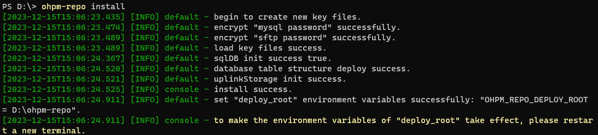
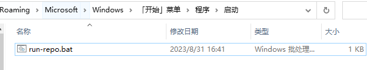

# 多实例部署

更新时间：2026-03-09 07:00:31

来源：https://developer.huawei.com/consumer/cn/doc/harmonyos-guides/ide-ohpm-deploy-multiple-instances

> [!NOTE]
> ohpm-repo私仓不允许在Linux或macOS系统中使用root用户启动，请使用普通用户安装运行。 只有db存储为mysql且store存储为sftp或者custom时，才支持多实例方式部署。本章节多实例部署以db存储为mysql，store存储为sftp为例。

 

#### 环境准备
1. 准备mysql数据库服务；
2. 准备至少一个sftp存储服务，ohpm-repo最大支持连接3个sftp服务；
3. 安装Node.js18.x版本。
 
> [!NOTE]
> 确保sftp服务端口能够被外部机器访问。 sftp服务的读写用户应该指定相同的存储根目录。

 
 

#### 安装ohpm-repo工具
1. 解压ohpm-repo工具包。


2. 请将ohpm-repo工具包解压目录中bin目录的路径配置到[系统环境变量](https://developer.huawei.com/consumer/cn/doc/harmonyos-guides/ide-ohpm-repo-faq#section24117279211)path中，执行如下查询命令:
```text
ohpm-repo -v
```
 终端输出版本号（如：2.0.0），则表示安装包解压无问题。如有报错，请参考[FAQ](https://developer.huawei.com/consumer/cn/doc/harmonyos-guides/ide-ohpm-repo-faq#section82-执行命令-ohpm-repo-command报错-ohpm-repo-不存在或者-command-命令不存在)解决。

  

 

  针对Linux和Mac系统，建议使用bash作为命令行界面。
3. 进入ohpm-repo解压目录的conf目录中，修改配置文件config.yaml：
检查[listen](https://developer.huawei.com/consumer/cn/doc/harmonyos-guides/ide-ohpm-repo-configuration#zh-cn_topic_0000001745376470_listen)配置，默认配置为localhost:8088 ，表示仅支持监听本机地址；如果希望其他机器通过ip/域名访问，则建议修改listen配置为ohpm-repo部署机器的ip地址：
```text
listen: <部署ohpm-repo机器的ip>:8088
```

4. 检查[deploy_root](https://developer.huawei.com/consumer/cn/doc/harmonyos-guides/ide-ohpm-repo-configuration#zh-cn_topic_0000001745376470_deploy_root)配置：如果选择不配置，会存储在默认地址中。禁止该路径配置为ohpm-repo解压根目录。
5. 数据存储db模块使用mysql：
```text
db:                         
  type: mysql
  config:
    host: "localhost"
    port: 3306
    username: "tctAdmin"
    password: "password"
    database: "repo"
```

6. 文件存储store模块使用sftp，sftp配置最多只能设置3个：
```text
store:                               
  type: sftp                         
  config:
    location:
      -      
        name: test_one_sftp          
        host: "localhost"           
        port: 22                     
        read_username: "read"   
        read_password: "password" 
        write_username: "write"   
        write_password: "password" 
        path: /source22 
      -  
        name: test_two_sftp
        host: "localhost"
        port: 24
        read_username: "read"
        read_password: "password"
        write_username: "write"
        write_password: "password"
        path: /source24
    #server: http://localhost:8088
```


  

 

  1、ohpm-repo文件的存储路径为： &lt;sftp服务器配置的存储根目录&gt; +<store配置的[path](https://developer.huawei.com/consumer/cn/doc/harmonyos-guides/ide-ohpm-repo-configuration#zh-cn_topic_0000001745376470_li1275312401171146)路径>，其中path只支持相对路径，必须以/开头。例如sftp服务器存储根目录为/user/sftp/data，store中[path](https://developer.huawei.com/consumer/cn/doc/harmonyos-guides/ide-ohpm-repo-configuration#zh-cn_topic_0000001745376470_li1275312401171146)配置的路径为/source，故最终ohpm-repo文件存储路径为/user/sftp/data/source。

  2、多实例部署ohpm-repo时，必须配置反向代理服务器，转发客户端请求到部署的多个ohpm-repo实例服务器中，故[store.config.server](https://developer.huawei.com/consumer/cn/doc/harmonyos-guides/ide-ohpm-repo-configuration#zh-cn_topic_0000001745376470_store)必须手动配置为反向代理服务器的域名/ip地址，且需要配置[use_reverse_proxy](https://developer.huawei.com/consumer/cn/doc/harmonyos-guides/ide-ohpm-repo-configuration#section1074004784011)值为true。
1. 进入ohpm-repo解压目录的bin目录下，执行安装命令:
```text
ohpm-repo install
```


  
> [!NOTE]
> 不配置参数--config，则默认使用ohpm-repo解压目录中conf目录内自带的配置文件config.yaml。


  安装成功日志信息如下：

  


2. 安装成功后，必须根据给出的提示信息刷新环境变量，针对Windows系统和Linux/Mac系统，有不同处理方式：
> [!NOTE]
> Windows系统： 关闭当前窗口，重新开启一个窗口。 Linux系统或Mac系统： 在命令行中执行刷新命令：当shell为bash时执行 source ~/.bashrc 或者 . ~/.bashrc ；当shell为zsh时，执行 source ~/.zshrc 或者 . ~/.zshrc 。

 
 

#### 部署首个节点

进入ohpm-repo解压目录的bin目录中，命令行启动ohpm-repo。
 
```text
ohpm-repo start
```
 
启动成功日志信息如下：
 



 
 

#### 打包和部署

为帮助更方便地完成多实例部署，已提供打包和部署命令。
 
 

#### 打包

在完成了多实例配置并首次启动过ohpm-repo服务实例的机器上，执行ohpm-repo pack &lt;deploy_root&gt;。
 
```text
ohpm-repo pack D:\ohpm-repo
```
 
> [!NOTE]
> 该命令用来打包备份ohpm-repo的&lt;deploy_root&gt;/conf，&lt;deploy_root&gt;/meta目录，并在命令行工作目录下生成压缩包。

 
打包成功日志信息如下：
 


 
 

#### 部署

将pack命令的产物拷贝到其他机器中。在解压ohpm-repo压缩包后，使用ohpm-repo deploy &lt;file_path&gt;命令部署新的实例。
 
```text
ohpm-repo deploy D:\ohpm-repo\bin\pack_1695805599689.zip --deploy_root D:\new-ohpm-repo\ohpm-repo-deploy
```
 
> [!NOTE]
> &lt;file_path&gt;： 参数指定备份压缩包地址。 --deploy_root： 指定部署根目录，用于存储ohpm-repo启动时生成的文件，默认使用 &lt;现有用户home目录&gt;/ohpm-repo。

 
部署成功日志信息如下：
 


 
部署成功后可执行ohpm-repo start启动ohpm-repo。
 


 
 

#### 配置自动重启（可选）

为ohpm-repo实例配置系统重启时自动重启的功能。
 
> [!NOTE]
> 在进行该配置前需要将ohpm-repo工具bin目录配置到 系统环境变量 path中。

 
 

#### Linux
1. 在ohpm-repo工具的bin目录下创建自动运行脚本run-repo.sh：
```text
touch run-repo.sh
```

2. 写入下面内容，保存并关闭文件：
> [!NOTE]
> 当mysql或sftp服务与ohpm-repo部署在同一服务器上时，请将mysql和sftp的启动命令放在ohpm-repo start命令之前。


  
```bash
#!/bin/bash
ohpm-repo start
```

3. 将该脚本设置为可执行文件：
```text
chmod +x run-repo.sh
```

4. 使用linux的定时任务工具crontab重启自动执行脚本。编辑当前用户的crontab配置：
```text
crontab -e
```

5. 当前用户的crontab配置写入下面内容，保存并关闭文件：
```text
@reboot /bin/sh run-repo.sh >/dev/null 2>&1
```

 
其中run-repo.sh表示要执行的脚本路径；>/dev/null 2>&1表示将输出重定向到空设备，即不输出任何信息。
 
现在，每次系统启动时，都会自动执行run-repo.sh脚本中的命令。
 
 

#### Windows
1. 新建run-repo.bat文件，写入下面内容：
> [!NOTE]
> 当mysql或sftp服务与ohpm-repo部署在同一服务器上时，请将mysql和sftp的启动命令放在ohpm-repo start命令之前。


  
```text
@echo off
call ohpm-repo start
exit
```

2. 按下win+R，输入shell:startup，回车：弹出启动文件框；将run-repo.bat文件剪切到启动文件夹下即可。


 
现在，每次系统启动时，都会自动执行run-repo.bat脚本中的命令。
