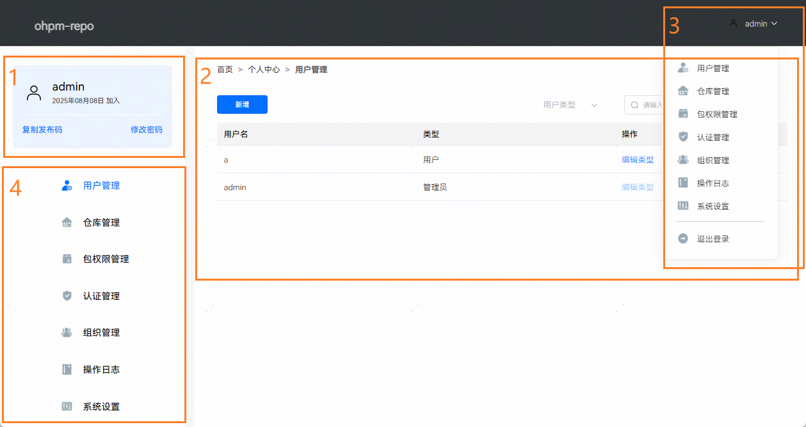

# 个人中心主页

更新时间：2026-03-17 02:59:31

来源：https://developer.huawei.com/consumer/cn/doc/harmonyos-guides/ide-ohpm-web-user-center

个人中心主页是ohpm-repo私仓的核心管理页面，整个系统在此进行集中管理和操作，页面效果如下图所示：
 

 

 
- 区域1：个人信息区域，显示登录用户的信息。其中有复制发布码和修改密码两个功能。
复制发布码：点击后可将用户的发布码publish_id复制到剪贴板中。使用ohpm命令行工具发布包时，如果采用证书认证方式，必须配置发布码，其详细发布流程见：[使用命令行工具发布](https://developer.huawei.com/consumer/cn/doc/harmonyos-guides/ide-ohpm-repo-quickstart#zh-cn_topic_0000001792256157_使用命令行工具发布)。
- 修改密码：点击后可以修改用户的密码。

 

 

为保障账户安全，请勿使用简单或重复密码，并定期更换密码。
 

 - 区域2：后台管理区域，显示区域4的相应菜单的操作面板。
- 区域3：登录注册区域，用户登录后将鼠标放在此区域的用户名位置会弹出功能菜单，选择退出登录即可更换账户重新登录，其他功能同区域4。
- 区域4：功能菜单区域，展示个人中心的用户管理、仓库管理、包权限管理、认证管理、组织管理，操作日志和系统设置七大功能，点击相应功能后会在区域2显示该功能的具体操作面板。管理员拥有全部菜单权限，普通用户只拥有认证管理、包权限管理、组织管理权限。
管理员菜单：

  

- 普通用户菜单：

  

