# 仓库管理

更新时间：2026-04-20 06:32:02

来源：https://developer.huawei.com/consumer/cn/doc/harmonyos-guides/ide-ohpm-depot-management

仓库管理主要负责管理仓库信息，包括仓库中所有包权限管理，包的上传与下架和uplinks管理。

## 管理仓库

ohpm-repo从5.3.0开始支持多仓配置，并且支持对每个仓库进行权限编辑。 仓库权限分为读权限和写权限。当用户在执行下载包、上传包、下架现有包和编辑包标签时，需要同时具有仓库的对应权限和[包的对应权限](https://developer.huawei.com/consumer/cn/doc/harmonyos-guides/ide-package-permission-management)，缺一不可。
| 仓库权限类型 | 前提条件 | 可执行操作 | 典型场景 |
| --- | --- | --- | --- |
| 可读 | 1. 公开可读 2. 授权可读，用户位于授权可读白名单中 | 下载包 | 开发者获取依赖包 |
| 可写 | 1. 公开可写 2. 授权可写，用户位于授权可写白名单中 | 下载包上传包下架现有包编辑包标签（Tag） | 维护者更新仓库内容 |

管理仓库页面展示当前所拥有的仓库信息，包含如下四个功能： 管理ohpm仓库三方包。编辑仓库。删除仓库。新增仓库。
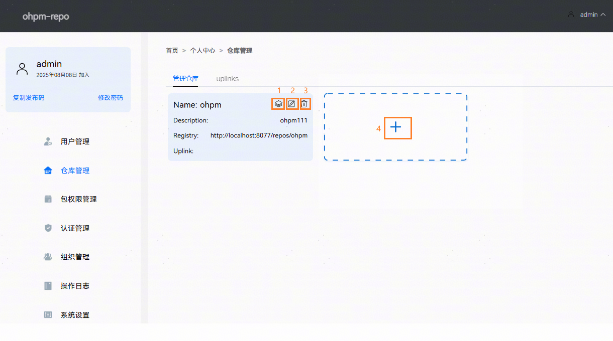

## 管理三方包

管理三方包页面包含权限管理和上下架两部分。

## 权限管理

ohpm-repo从5.3.0版本开始支持配置包级别的访问权限。系统管理员能够对仓库中所有的包进行权限管理，支持配置包的可见性、白名单和管理所有者。支持通过包名模糊检索到需要管理权限的包。
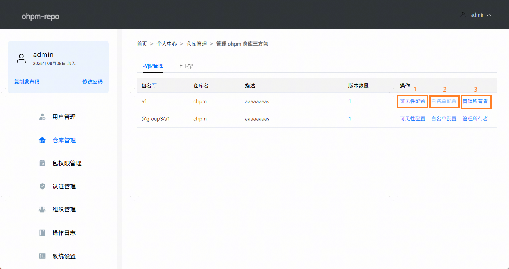
区域1：可见性配置，能够配置一个包的可见性，默认为公开可读。当配置为授权可读时，支持在区域2中添加可读白名单。当包设置为公开可读时，所有用户对包具有下载和查看权限；当包设置为授权可读时，仅添加在可读白名单中的用户具有包的下载权限。
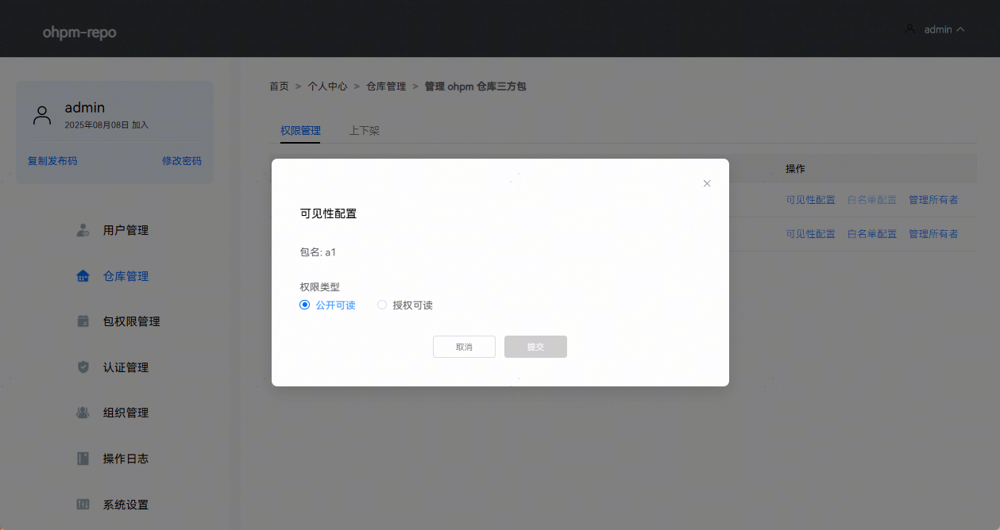
区域2：白名单配置，在白名单中的用户将具有包的下载和查看权限，包的所有者和维护者会自动添加到包的白名单中。点击“新增用户”或“删除”按钮，可以在白名单配置中添加或者删除查看者用户，所有者和维护者用户禁止被删除。
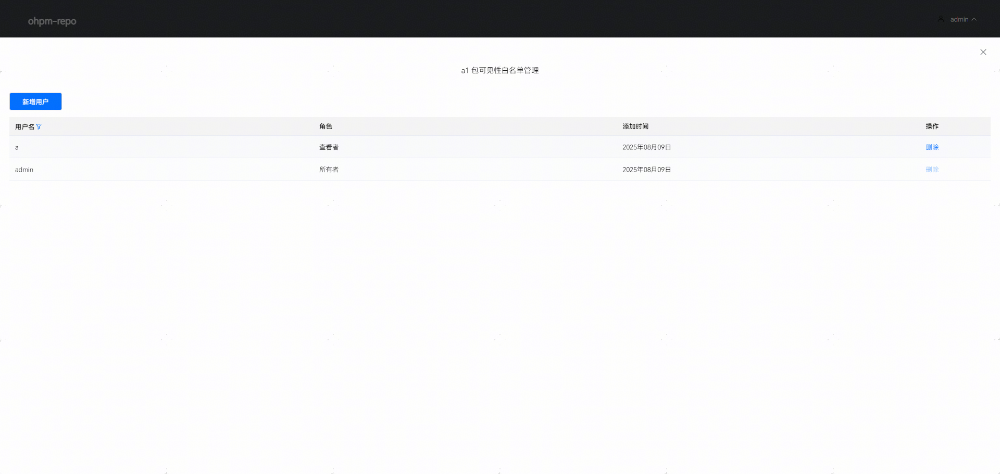
区域3：管理所有者，包的所有者具有包的下载，上传，下架和编辑包tag权限。支持对包所有者进行新增和删除，当包仅剩唯一一个所有者用户时，禁止被删除。
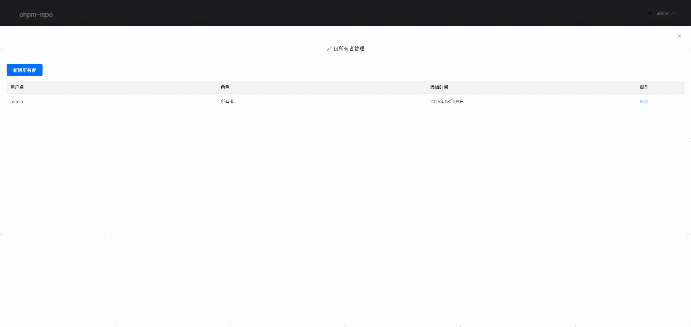

## 上下架

点击“管理ohpm仓库三方包”按钮，进入仓库管理详情面板，展示所有已上传至ohpm-repo的三方包信息。上下架包含上传三方包、单个包下架、批量包下架和搜索三方包四个功能。
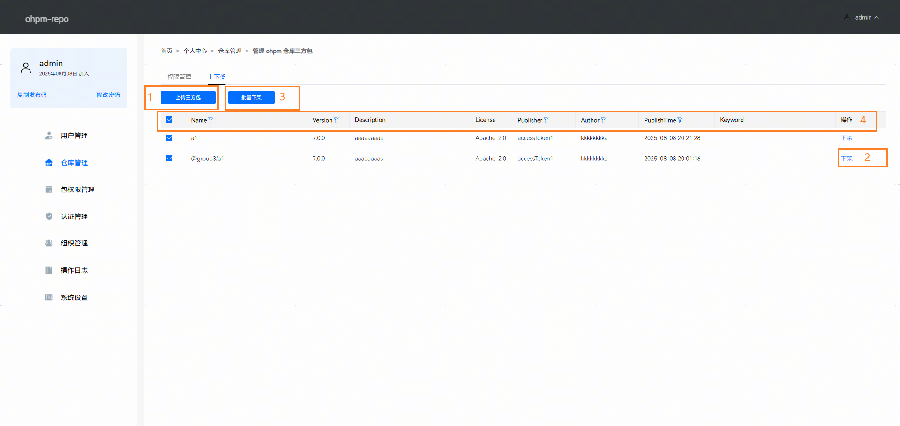
区域1：上传三方包，点击“上传三方包”按钮，能够上传指定的包文件或选择本地三方包文件，将其上传至仓库中，页面效果如下图所示：
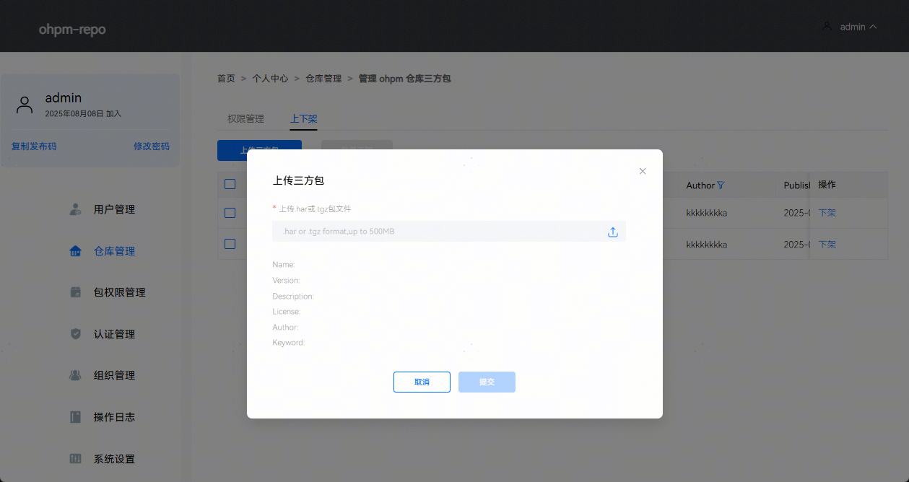
区域2：下架，点击指定包右边的“下架”按钮，进行单个包下架操作，输入下架原因即可完成包的下架，页面效果如下图所示：
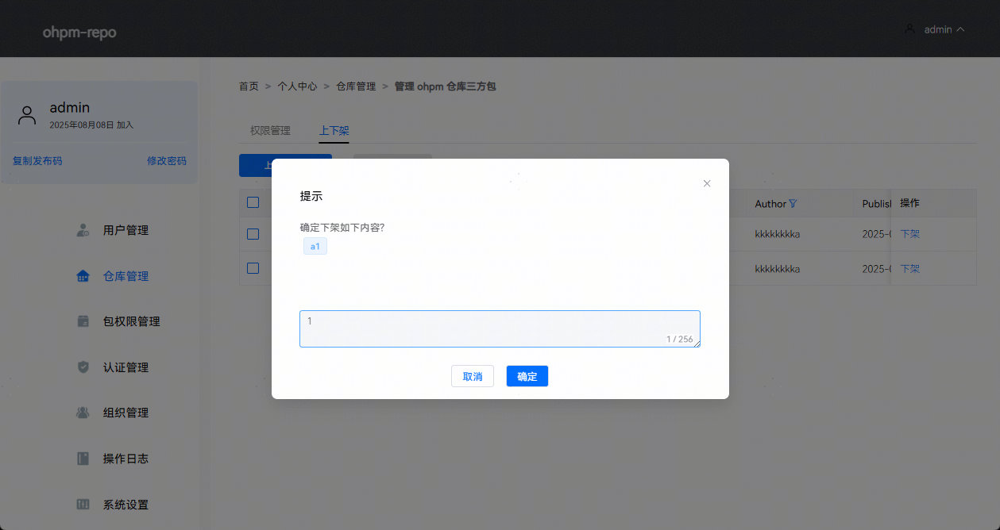
区域3：批量下架，勾选包左边的待选框，点击“批量下架”按钮，能够批量下架已勾选的包，可以通过改变页面底部每页包含的数据值，批量下架更多的包。
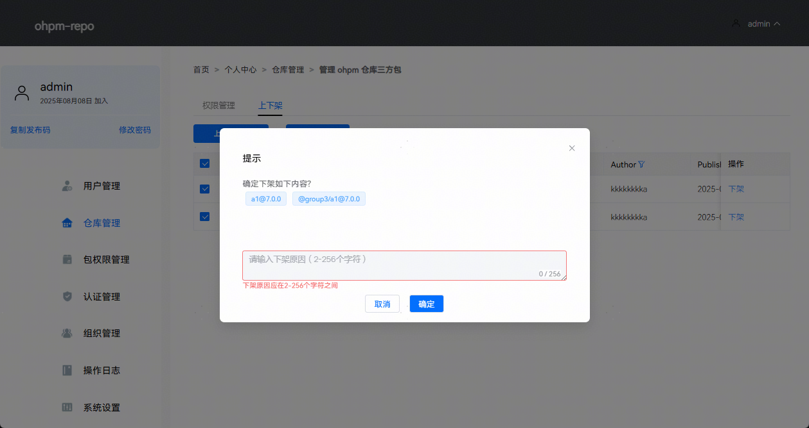
区域4：筛选，点击列表标题旁的漏斗图标，可以进行包数据的筛选。支持通过Name、Version、Publisher、Author和PublishTime字段筛选包数据。例如筛选出Name带有数字3，版本号大于等于2.0.0，发布人为accessToken1的包，数据筛选效果如下图所示：- Name：支持对包名进行模糊搜索。 - Version：支持输入最小版本号和最大版本号，进行版本号区间搜索。 - Publisher：支持对包发布者名称进行模糊搜索。 - Author：支持对包作者名称进行模糊搜索。 - PublishTime：支持对包发布时间进行区间搜索。
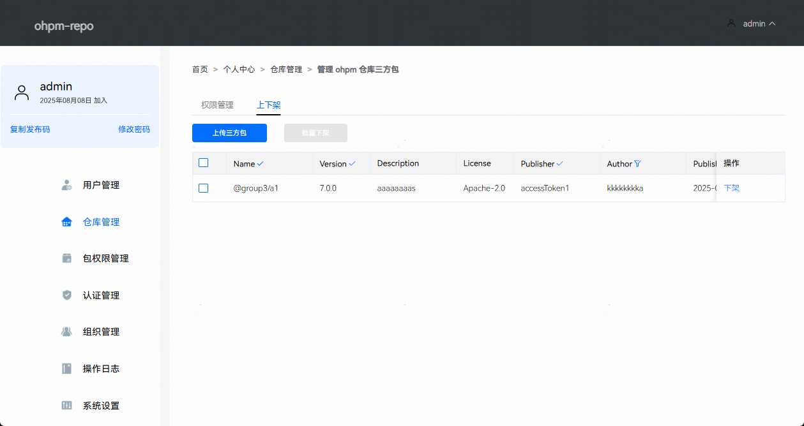

## 编辑仓库

点击指定仓库的“编辑”图标按钮，进入仓库信息编辑界面，可以修改仓库的Name 、Uplink、可读策略、授权可读白名单、可写策略，授权可写白名单、发布策略和描述信息。
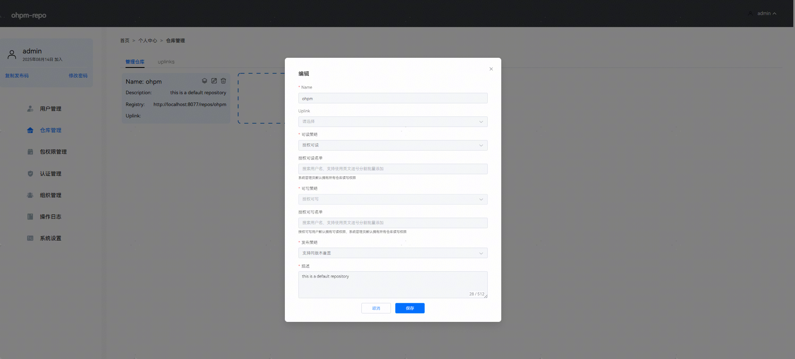
Name：仓库的名称。当仓库发过包或者已添加授权可读白名单或可写白名单时，禁止修改仓库名。Uplink：配置代理仓库地址。其中Uplink为下拉框选择，选项为仓库管理页面的[uplinks](#zh-cn_topic_0000001792256181_uplinks)面板配置的Uplink仓库。可读策略： 分为公开可读和授权可读。当一个仓库被设置为授权可读时，将出现授权可读名单配置项，系统管理员默认具有仓库读和写权限。当仓库设置为公开可读时，所有用户对仓库具有读权限，能够访问仓库中包的信息和下载包；当设置为授权可读时，仅授权可读白名单中用户拥有仓库的读权限。当仓库可读策略设置为授权可读时，可写策略默认选择授权可写，不可修改。授权可读名单：当可读策略选择授权可读时，将出现授权可读名单配置项，能够逐个添加仓库可读用户。授权可读白名单最多添加200个。支持搜索用户名逐个添加，也支持使用英文逗号分隔用户名批量添加。可写策略：分为公开可写和授权可写。当一个仓库被设置为授权可写时，将出现授权可写名单配置项，仅在可写名单中的用户具有仓库的写权限，具有写权限默认具有读权限，系统管理员默认具有仓库读写权限。当仓库设置为公开可写时，所有用户对仓库具有写权限，能够对仓库中的包进行下载，上传，下架和编辑tag操作；当设置为授权可写时，仅授权可写白名单中用户拥有仓库的写权限。授权可写名单：当可写策略选择授权可写时，将出现授权可写名单配置项，能够逐个添加仓库可写用户。授权可写白名单最多添加200个。支持搜索用户名逐个添加，也支持使用英文逗号分隔用户名批量添加。发布策略：分为禁止同版本覆盖和支持同版本覆盖两种模式。在禁止同版本覆盖模式下，若尝试向仓库重复发布同一版本的包，系统会报错提示“该三方库已存在此版本”，确保版本唯一性。在支持同版本覆盖模式下，允许重复发布同版本包，新包将直接覆盖旧包，适用于需要持续更新的场景。用户可通过配置灵活选择适合的发布策略。**覆盖操作不可逆，请谨慎选择**。

## 删除仓库

点击“删除”图标按钮将删除当前选中的仓库。当仓库下存在上架包时禁止删除仓库，当仅剩最后一个仓库时禁止被删除。
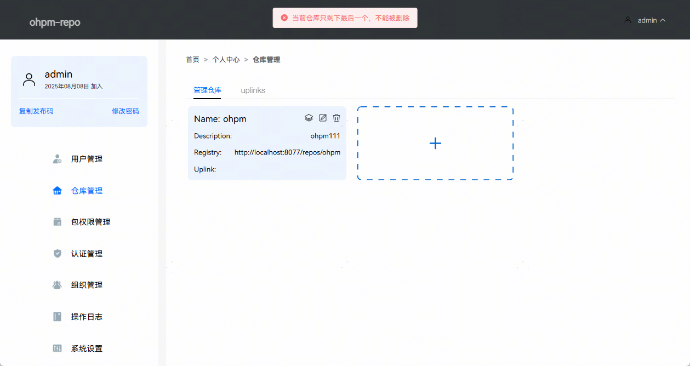

## 新增仓库

点击“+”图标按钮将新增一个仓库，可以对仓库的Name、Uplink、可读策略、可写策略、发布策略和描述信息进行编辑。可读策略默认为公开可读，可写策略默认为公开可写，发布策略默认为禁止同版本覆盖。最多支持创建20个仓库。
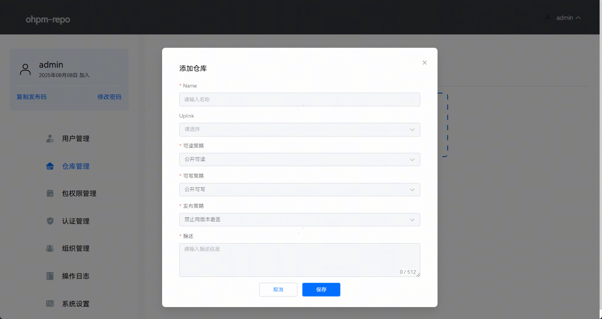

## uplinks

uplinks功能可以让当前仓库获取配置的uplink仓库的所有包，若从某个已配置uplink的仓库下载当前仓库中不存在的三方包时，则会通过uplink仓库下载该包，如果访问uplink仓库需要代理，请配置好所需代理信息，uplink页面如下图所示：
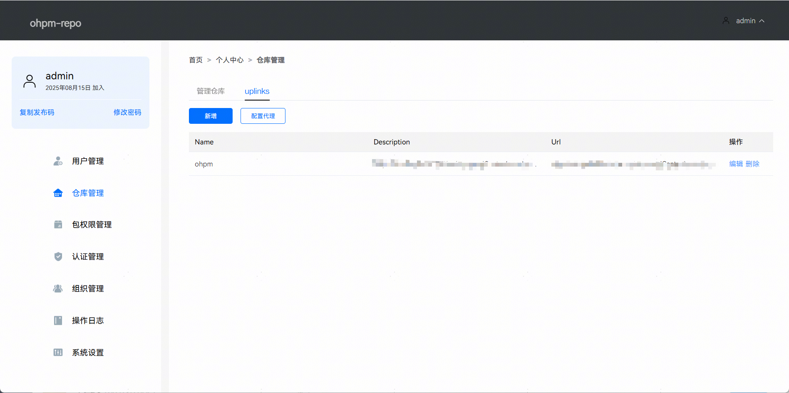
点击新增按钮，可以创建新的uplink仓库。一旦完成新增uplink仓库的设置，必须前往仓库管理 > 管理仓库 > 编辑页面进行应用，这样该功能才会生效，且ohpm-repo只允许同时配置一个uplink仓库。uplink仓库地址不建议配置为其他ohpm-repo的地址，避免出现仓库A配置uplink为仓库B，仓库B配置uplink为仓库A，导致循环查找问题。页面效果如下图所示：
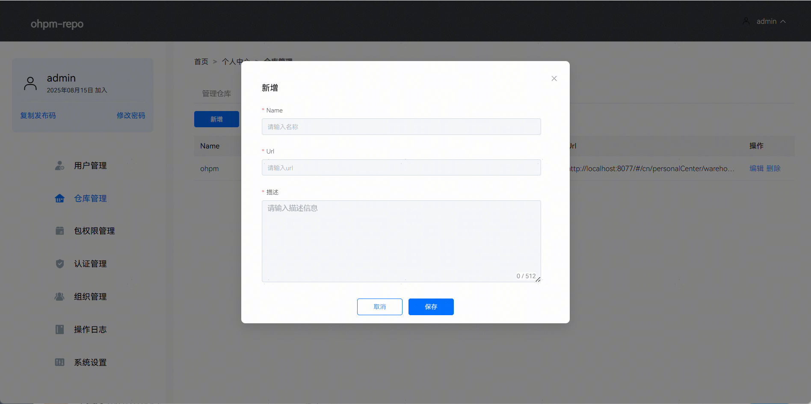
点击编辑，可以修改已配置的uplink仓库信息，页面效果如下图所示：
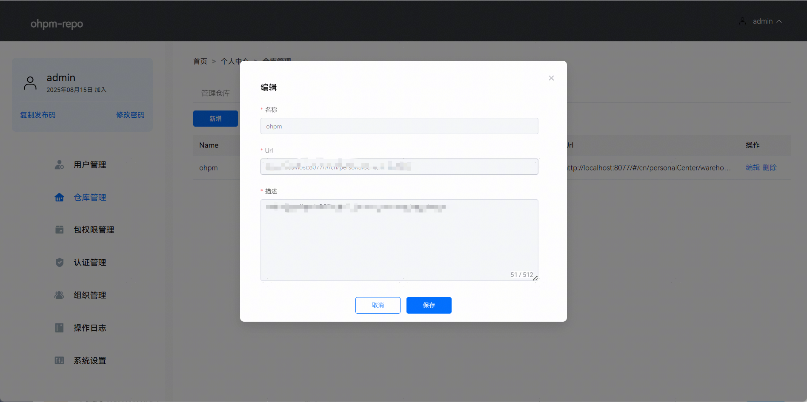
点击删除，可以删除配置的uplink仓库，页面效果如下图所示：
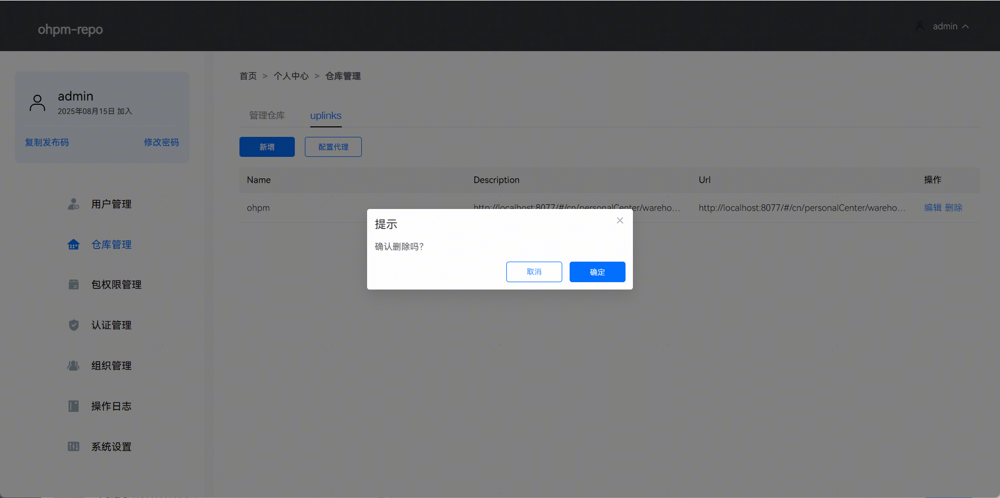
由于搭建的ohpm-repo私仓可能需要通过代理来访问已配置的uplink仓库，因此ohpm-repo提供了代理功能。点击配置代理，可以添加代理信息，页面效果如下图所示：
> [!NOTE]
> HttpProxy、HttpsProxy和uplinks仓库地址有关，与搭建的代理服务器协议无关。若uplinks仓库地址是http协议，则选择HttpProxy配置代理；若uplinks仓库地址是https协议，则选择HttpsProxy配置代理。

 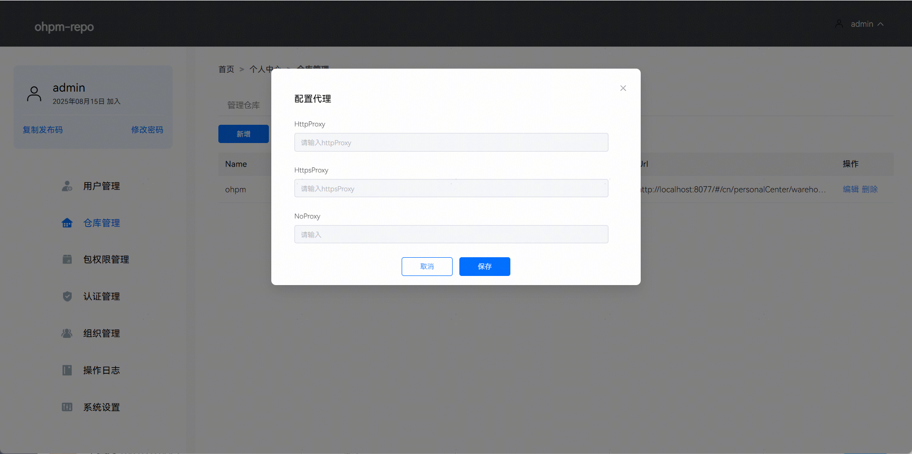
