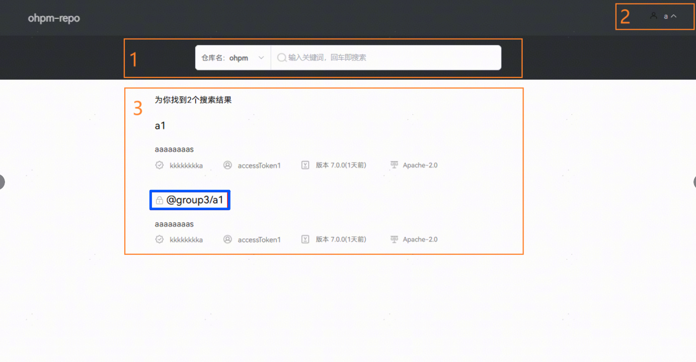
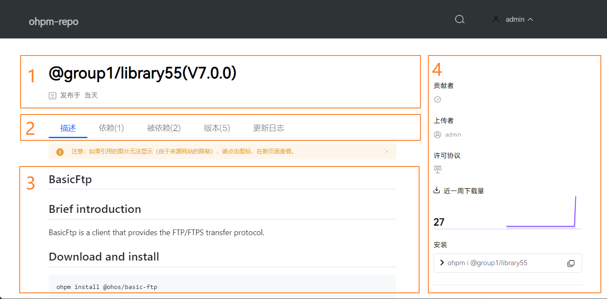

# 前台页面

更新时间：2026-01-15 06:51:04

来源：https://developer.huawei.com/consumer/cn/doc/harmonyos-guides/ide-ohpm-web-front-page

 

ohpm-repo私仓从5.0.2版本开始，新增接口防重放攻击机制。请保持ohpm-repo私仓部署的服务器与访问ohpm-repo私仓管理界面的客户端机器时间同步。如出现访问页面报错“非法请求”，请参考[FAQ](https://developer.huawei.com/consumer/cn/doc/harmonyos-guides/ide-ohpm-repo-faq#section15971414154116)解决。
 

 
启动ohpm-repo私仓后，可以通过浏览器访问ohpm-repo页面，访问路径为http://&lt;部署机器IP&gt;:&lt;监听端口&gt;或者https://&lt;部署机器IP&gt;:&lt;监听端口&gt;。其中，http或者https是ohpm-repo网络协议，&lt;部署机器IP&gt; 是部署ohpm-repo服务器的IP地址，&lt;监听端口&gt; 是所设置的监听端口，均可在ohpm-repo配置文件[listen](https://developer.huawei.com/consumer/cn/doc/harmonyos-guides/ide-ohpm-repo-configuration#zh-cn_topic_0000001745376470_listen)选项中编辑。
 
例如，将ohpm-repo部署在IP为192.168.10.10的服务器上（如不清楚部署ohpm-repo服务器的IP，可在Linux/macOS上运行ifconfig 命令，Windows上运行ipconfig命令查看），同时ohpm-repo配置文件的listen选项配置为0.0.0.0:8088，此时访问ohpm-repo页面的URL就是http://192.168.10.10:8088。
 
> [!NOTE]
> ohpm-repo会自动创建默认管理员账号，账号名称：admin，账号密码：12345Qq!。为保证ohpm-repo账号安全，该账号在首次登录时，强制修改该密码，请设置新密码后重新登录。

 

##### 首页

首页主要展示当前ohpm-repo私仓存储的包信息，同时提供搜索功能，页面效果如下图所示：
 

 
- 区域1：搜索区域，搜索功能采用两级筛选：先通过下拉菜单选择目标仓库，然后基于所选仓库进行包名的模糊查询。
- 区域2：登录注册区域，用户进行登录注册，登录后可通过此区域进入后台管理页面。
- 区域3：包列表区域，全量展示符合查询条件的所有包。点击列表中包的摘要信息可进入包的详情页，查看更多关于该包的信息。若包名前显示

锁图标，表示您暂无该包的访问权限。

 
 

##### 包详情页

包详情页主要展示当前包的详细信息，这些信息主要来源于包的内部文件，同时记录了包的版本信息和下载量数据，页面效果如下图所示：
 

 
- 区域1：包的基本信息区域，包的基本信息取自包的oh-package.json5文件。
- 区域2：标签页区域，通过选择不同的标签展示包的更多信息。
概述：展示包中README.md文件内容，该文件记录开发者对包的介绍。
- 依赖：记录包的依赖信息。
- 被依赖：记录包的被依赖信息。
- 版本：记录包在ohpm-repo私仓中当前存在的所有版本与tag信息，点击版本列表可查看相应版本的包信息，同时包含不同版本包上传的时间和其近一周的下载量数据。
- 更新日志：展示包中CHANGELOG.md文件内容，该文件记录包的更新日志。

 - 区域3：标签详情区域，展示所选标签的详细内容。
- 区域4：包的额外信息，包括贡献者（取自oh-package.json5文件author字段），上传者（ohpm-repo私仓上传此包的用户）和下载量统计信息（仅显示在包最新版本详情页面），其中下载量的统计数据涵盖包所有版本近一年的周下载量数据，通过点击周下载量数据曲线的不同位置，能够获取指定时间段内周下载量数据。
