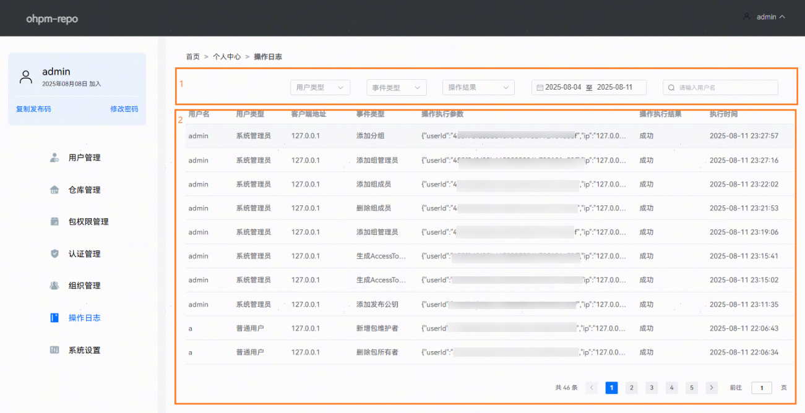

# 操作日志

更新时间：2026-01-15 06:51:04

来源：https://developer.huawei.com/consumer/cn/doc/harmonyos-guides/ide-ohpm-repo-operation-log

操作日志界面显示用户通过ohpm-repo管理界面进行的所有操作，以及通过ohpm命令行工具执行publish，unpublish和dist-tags等相关命令所记录的日志。操作日志界面分为两个部分：第一部分为筛选条件，第二部分是展示符合筛选条件的数据。
 

 

操作日志的数据每隔一天会定时清除，默认保留100天内的操作日志数据，数据保留时间可通过config.yaml中配置项[operation_log_retention](https://developer.huawei.com/consumer/cn/doc/harmonyos-guides/ide-ohpm-repo-configuration#li38847353322)设定。
 

 

 

 
数据筛选：操作日志的数据筛选类别有五类，分别为：用户类型，事件类型，操作类型，操作时间区间和操作对象的用户名。
- 用户类型：分为系统管理员用户和普通用户，当选中普通用户时，只会显示普通用户的操作日志信息。

- 事件类型：包括六种事件类型，包括用户管理，仓库管理，包权限管理，认证管理，组织管理和系统设置，通过选择事件类型进行日志的筛选。
例如当事件类型选择用户管理中的新增用户时，操作日志界面仅显示事件类型为新增用户的日志信息。

- 事件类型具体内容见下表：当选择一级事件类型时，将自动包含所有二级事件类型和三级事件类型；当选择二级事件类型时，自动包含所有三级事件类型。

| 一级事件类型 | 二级事件类型 | 三级事件类型 |

| --- | --- | --- |

| 用户管理 | 新增用户 | - |

| 用户管理 | 删除用户 | - |

| 用户管理 | 修改用户角色 | - |

| 用户管理 | 重置用户密码 | - |

| 仓库管理 | 管理仓库 | 新增仓库 |

| 仓库管理 | 删除仓库 | 管理仓库 |

| 仓库管理 | 更新代码仓 | 管理仓库 |

| 仓库管理 | 上架资源包 | 管理仓库 |

| 仓库管理 | 下架资源包 | 管理仓库 |

| 仓库管理 | 批量下架资源包 | 管理仓库 |

| 仓库管理 | uplink | 更新Uplink代理 |

| uplink | 添加Uplink |

| uplink | 修改Uplink |

| uplink | 删除Uplink |

| tag | 增加Tag |

| tag | 更新Tag |

| tag | 删除Tag |

| 权限管理 | 编辑包可见性 |

| 权限管理 | 新增包白名单用户 |

| 权限管理 | 删除包白名单用户 |

| 包权限管理 | 新增包所有者 | - |

| 包权限管理 | 删除包所有者 | - |

| 包权限管理 | 转移包所有者 | - |

| 包权限管理 | 新增包维护者 | - |

| 包权限管理 | 删除包维护者 | - |

| 认证管理 | 证书认证 | 添加发布公钥 |

| 认证管理 | 删除发布公钥 | 证书认证 |

| 认证管理 | Access Token | 生成Access Token |

| Access Token | 删除Access Token |

| 组织管理 | 组织 | 添加分组 |

| 组织管理 | 修改分组 | 组织 |

| 组织管理 | 删除分组 | 组织 |

| 组织管理 | 组织成员 | 添加组成员 |

| 组织成员 | 删除组成员 |

| 组织管理员 | 添加组管理员 |

| 组织管理员 | 删除组管理员 |

| 系统设置 | 更新oh-package.json5检查规则 | - |

| 系统设置 | 重置系统密钥 | - |

| 系统设置 | 更新系统安全配置 | - |

 
- 操作结果：选择成功/失败进行筛选。如操作结果选择失败，操作日志页面结果如下：

- 操作时间区间：选中操作时间的区间进行筛选。如区间时间选择在2025.8.4到2025.8.11，操作日志页面结果如下：

- 操作对象用户名：输入操作对象用户名进行筛选。如输入用户名为user，操作日志页面结果如下：

