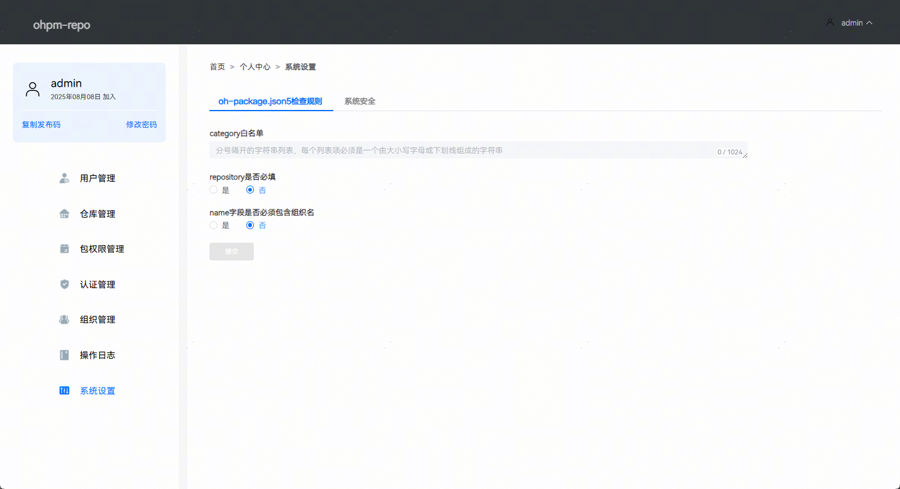
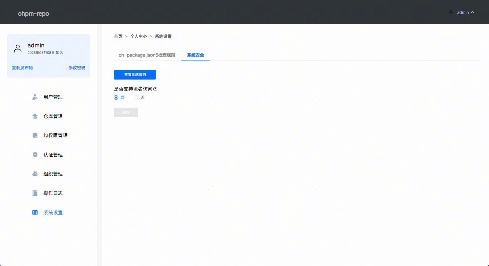
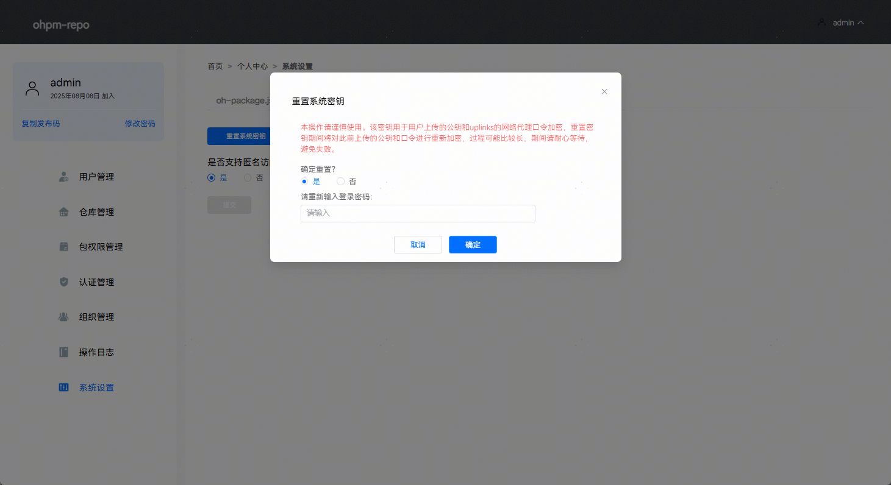
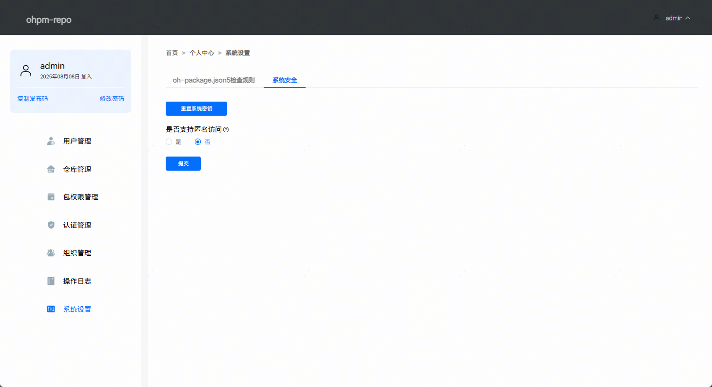
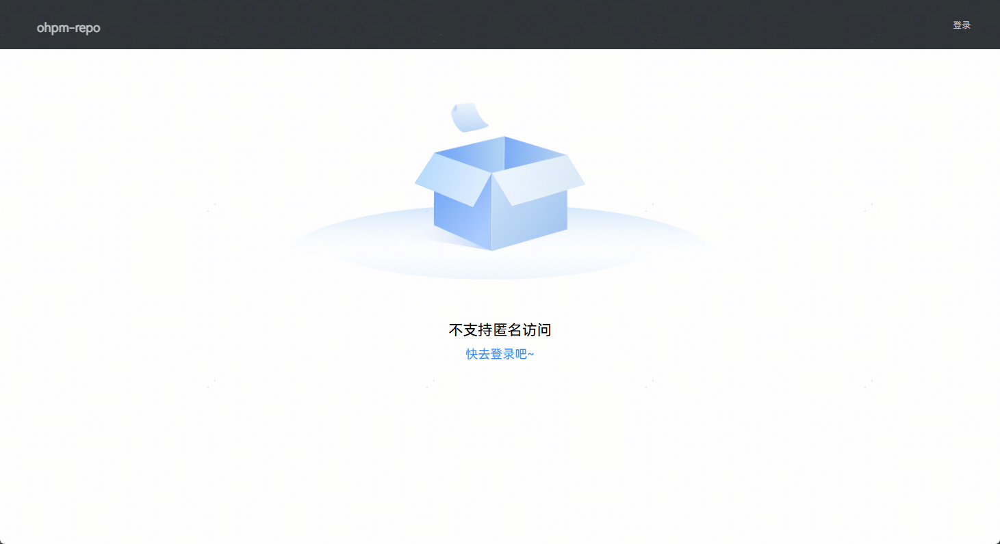

# 系统设置

更新时间：2026-04-20 06:32:02

来源：https://developer.huawei.com/consumer/cn/doc/harmonyos-guides/ide-ohpm-system-settings

系统设置是ohpm-repo系统层面的管理，当前支持"oh-package.json5检查规则"和"系统安全"两大功能。
 

#### oh-package.json5检查规则

oh-package.json5检查规则是ohpm-repo对上传包的oh-package.json5文件进行校验的规则管理。当前主要针对category，repository和name三个字段设定规则。
 
**category白名单：**若其为空，系统将不会对category字段进行校验。若配置了值，则category字段的值就必须存在于白名单中。
 
**repository是否必填**：决定repository字段在oh-package.json5文件中是否必须存在。如果设置为是，那么在上传包时，oh-package.json5文件中就必须包含repository字段。
 
**name****字段是否必须包含组织名**：oh-package.json5文件中name字段是否必须包含组织名，如果设置为是，则上传包时，则name字段必须包含组织名，无组织包名将会上传失败。
 
页面效果如下图所示：
 

 

 
 

#### 系统安全

系统安全页面中有两部分配置项：重置系统密钥和配置是否支持匿名访问。页面效果如下图所示：
 

 

 1. 重置系统密钥系统密钥用于重新加密ohpm-repo服务中用户上传的公钥和uplinks的网络代理口令信息。多实例部署ohpm-repo时不支持重置系统密钥。点击重置系统密钥，将出现重置提示，如果确定重置，需要点击按钮“是”，将出现密码输入框，由于重置系统密钥是敏感操作，故需要输入当前登录账户的密码进行再次认证，页面效果如下图所示：

  

2. ohpm-repo匿名访问配置ohpm-repo从5.0.5版本开始支持配置匿名访问功能。默认情况下，ohpm-repo支持匿名访问。如果需要配置不支持匿名访问，需要点击按钮“否”后提交，页面效果如下图所示：

  

  
当配置禁用匿名访问后，用户未登录状态下，不能够访问ohpm-repo管理界面首页中的包列表页面和包详情页面，只有登录后才能正常访问；首页也不能注册用户，只有登录选项。

3. 配置禁用匿名访问后，当没有在.ohpmrc文件中正确配置AccessToken认证信息时，ohpm没有权限执行需要读权限的install，info和update命令。必须在.ohpmrc文件中正确配置读写/只读AccessToken认证信息。
4. 配置禁用匿名访问后，如果使用ohpm-repo5.0.5版本以前的[认证插件](https://developer.huawei.com/consumer/cn/doc/harmonyos-guides/ide-custom-auth-plugin)模板，必须升级认证插件内容，额外添加方法authWithReadOnly，实现只读AccessToken认证方法。
