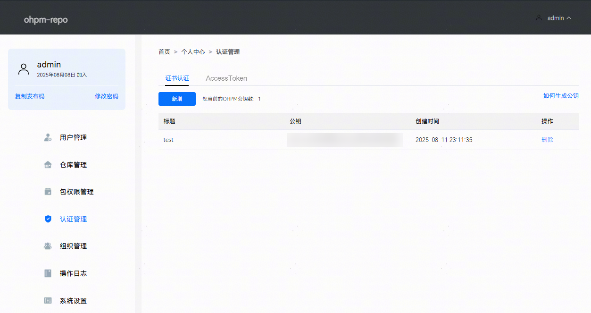
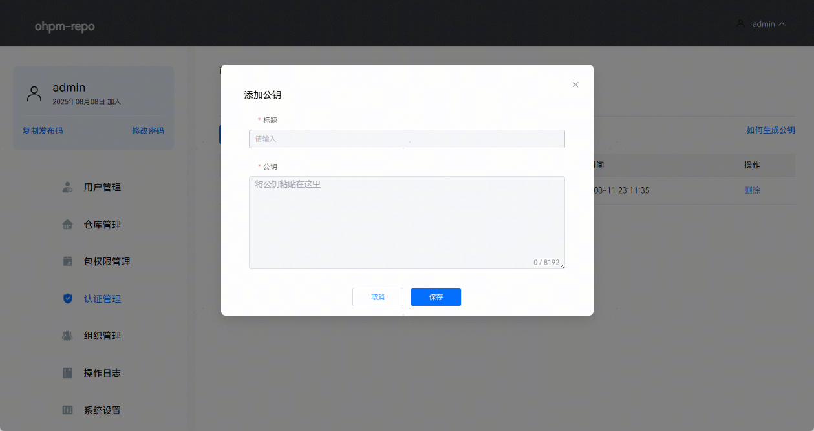
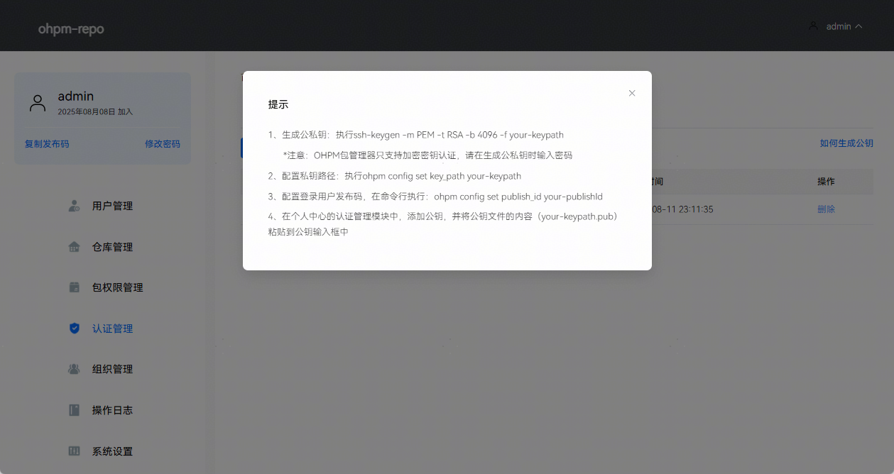
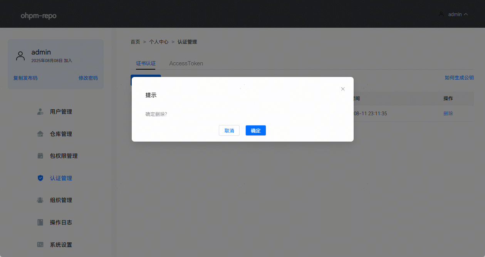
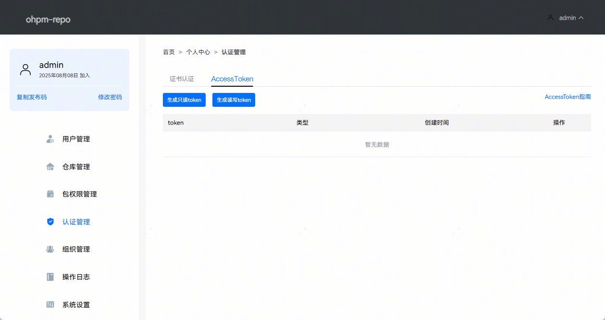
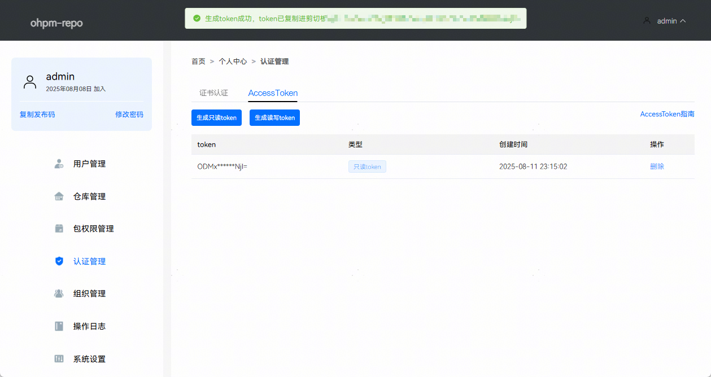
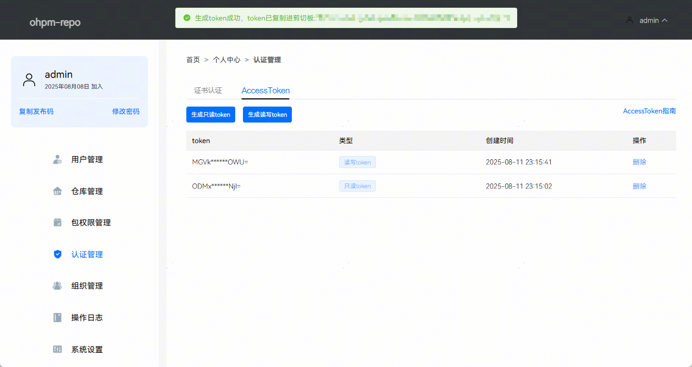
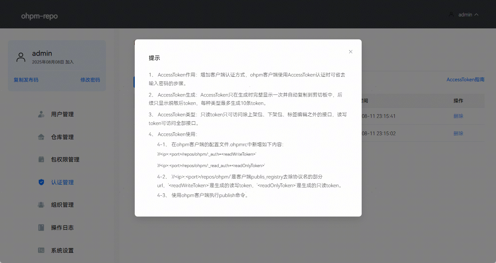
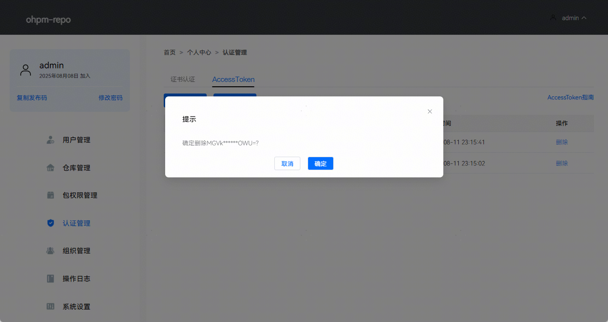

# 认证管理

更新时间：2026-01-15 06:51:04

来源：https://developer.huawei.com/consumer/cn/doc/harmonyos-guides/ide-ohpm-certification

当前ohpm-repo的认证方式有证书认证和AccessToken两种方式：
 
证书认证：在使用ohpm客户端执行publish，unpublish或dist-tags相关命令时，通过嵌入加密ssh证书进行身份验证。
 
AccessToken认证：将ohpm-repo生成的AccessToken配置到ohpm客户端配置文件中，实现publish、unpublish、dist-tags、info和install等操作的免密认证。
 

##### 证书认证

使用ohpm发布包时，需要先在配置文件.ohpmrc文件中配置publish_id和key_path。publish_id对应发布码，key_path对应私钥的地址，其详细发布流程见[使用命令行工具发布](https://developer.huawei.com/consumer/cn/doc/harmonyos-guides/ide-ohpm-repo-quickstart#zh-cn_topic_0000001792256157_使用命令行工具发布)。认证管理主要是管理私钥对应的公钥信息，在用户使用ohpm发布包时进行校验。认证管理页面效果如下图所示：
 



 

 

 1. 点击新增，弹出添加公钥面板，可以添加公钥信息。一个用户最多可以添加十条公钥信息，因此可以通过配置不同的公钥信息实现多人共享该用户使用ohpm进行发布包操作。页面效果如下图所示：


2. 点击如何生成公钥，可查看公钥生成的说明，页面效果如下图所示：


3. 点击删除，可以删除已经存在的公钥信息，页面效果如下图所示：


 
 

##### AccessToken

AccessToken是ohpm-repo 2.1.0版本新引入的认证机制（需配套使用1.6.0及以上版本的ohpm命令行工具），用户通过ohpm-repo界面生成Token，并将其配置至ohpm客户端配置文件中。在与ohpm-repo交互时，客户端会自动附带Token进行身份验证。
 
该Token分两种权限等级：只读Token允许执行info和install操作；读写Token除了包含只读权限外，还支持publish，unpublish和dist-tags相关操作。每位用户每种权限类型的Token最多可生成10个，首次生成时系统自动复制到剪贴板，后续不再显示完整Token内容。AccessToken页面效果如下:
 



 

 1. 点击生成只读Token，ohpm-repo将自动生成一个专用于ohpm客户端进行包信息查询（info）和安装包（install）操作的认证Token，页面效果如下图所示：


2. 点击生成读写Token，ohpm-repo将自动生成一个专用于ohpm客户端进行包信息查询（info）、安装包（install）、发布包（publish）、下架包（unpublish）和版本标记（dist-tags）操作的认证Token。页面效果如下图所示：


3. 点击AccessToken指南，即刻显示使用教程，指导如何有效使用和配置AccessToken。页面效果如下图所示：


4. 点击删除，删除对应的Token。页面效果如下图所示：


5. AccessToken的使用：
- 通过ohpm-repo页面生成Token。

6. 将Token配置在ohpm客户端的.ohpmrc配置文件中，配置示例如下所示:
```text
//127.0.0.1:8088/repos/ohpm/:_auth=readWriteToken
//127.0.0.1:8088/repos/ohpm/:_read_auth=readOnlyToken
```
 其中//127.0.0.1:8088/repos/ohpm/是您ohpm-repo的registry地址去除协议名的部分，:_auth和:_read_auth分别代表配置为读写Token或只读Token，readWriteToken和readOnlyToken代表Token具体的值。ohpm客户端执行info、install操作会优先使用只读Token，如果只读Token不存在才会使用读写Token。ohpm客户端执行publish、unpublish和dist-tags操作时只会使用读写Token。每种Token最多配置三条。
