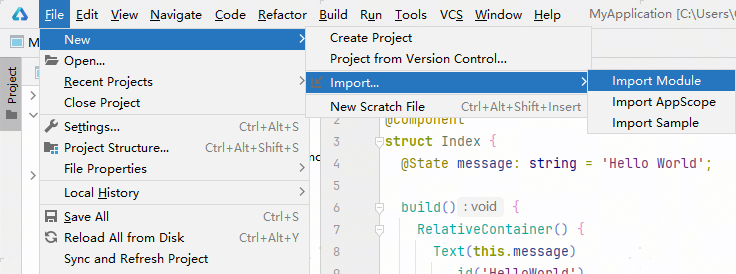
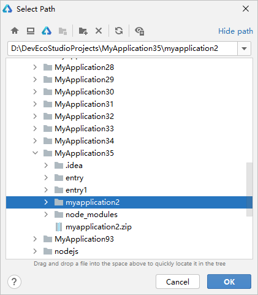
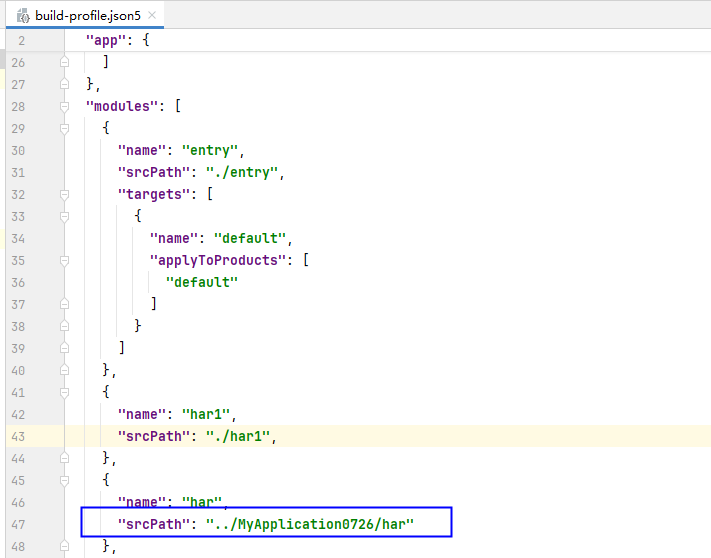

# 导入和引用模块

更新时间：2026-04-30 02:42:31

来源：https://developer.huawei.com/consumer/cn/doc/harmonyos-guides/ide-import-module

DevEco Studio支持通过以下两种方式导入其他工程下的模块：
 1. 通过[Import Module](#section14353041183813)功能，将其它HarmonyOS模块的功能代码复制到当前工程中；当前仅支持FA模型的模块导入到FA模型，Stage模型的模块导入到Stage模型。不支持FA模型的模块导入到Stage模型，或Stage模型的模块导入到FA模型。
2. 通过在[srcPath字段下配置相对路径](#section12737181153918)的方式引用其他工程下的模块，该方式仅引用模块相关信息，不会将模块代码完全复制至本地。当前支持引用其他工程下的HAR和HSP模块。
 

##### 导入模块
1. 在菜单栏单击**File > New > Import... > Import Module。**

  

2. 选择导入的模块。

  在指定路径下，选择导入的模块，单击**OK**。导入的模块可以为文件夹，也可以为zip格式。

  

 
 

##### 引用模块

 
在工程级build-profile.json5文件中，如下图所示在modules > srcPath字段下配置工程外模块的相对路径，即可引用模块相关信息，不会将模块代码完全复制至本工程中。当前支持引用其他工程下的HAR和HSP模块。
 

