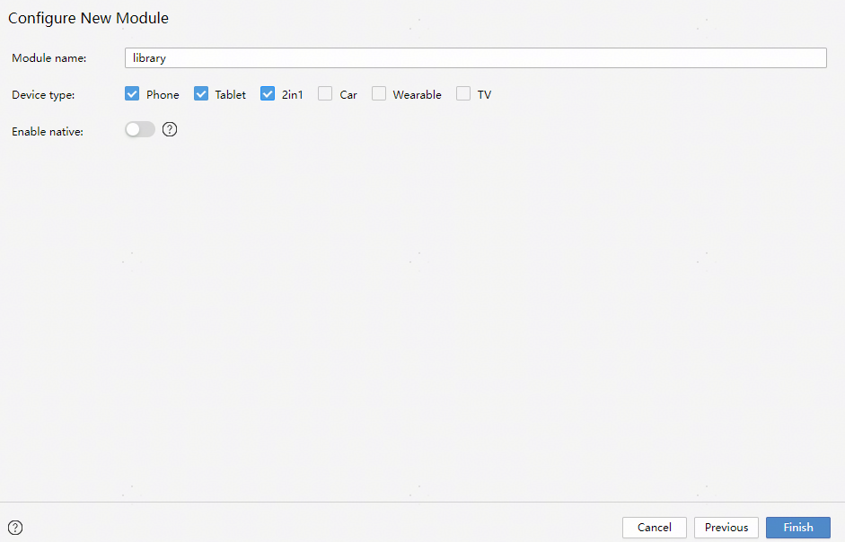
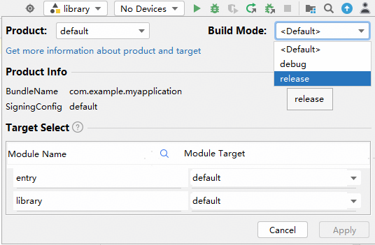
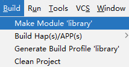
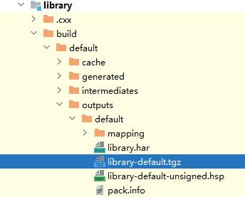

# 开发动态共享包

更新时间：2026-04-30 02:42:31

来源：https://developer.huawei.com/consumer/cn/doc/harmonyos-guides/ide-hsp

DevEco Studio支持开发动态共享包[HSP（Harmony Shared Package）](https://developer.huawei.com/consumer/cn/doc/harmonyos-guides/in-app-hsp)。在应用/元服务开发过程中部分功能按需动态下载，或开发元服务场景时需要分包加载，可使用HSP实现相应功能。当有多个安装包需要资源共享时，也可利用HSP减少公共资源和代码重复打包。

> [!NOTE]
> 应用内HSP：在编译过程中与应用包名（bundleName）强耦合，只能给某个特定的应用使用。 集成态HSP：构建、发布过程中，不与特定的应用包名耦合；使用时，工具链支持自动将集成态HSP的包名替换成宿主应用包名。

##### 使用约束

 - HSP及其使用方都必须是API 10及以上版本Stage模型。
 - HSP及其使用方都必须使用[模块化编译](https://developer.huawei.com/consumer/cn/doc/harmonyos-guides/ide-hvigor-esmodule-compile)模式。
 - 从DevEco Studio 6.0.1 Beta1开始，创建HSP模块时支持选择C++版本。

##### 创建HSP模块

1. 通过如下两种方法，在工程中添加新的Module。

  
方法1：鼠标移到工程目录顶部，单击鼠标右键，选择**New > Module**，开始创建新的Module。
2. 方法2：选中工程目录中任意文件，然后在菜单栏选择**File > New > Module**，开始创建新的Module。
3. 模板类型选择**Shared Library**，点击**Next**。

  

4. 在**Configure New Module**界面中，设置新添加的模块信息，设置完成后，单击**Finish**完成创建。

  
**Module name**：新增模块的名称，如设置为library。
5. **Device type**：支持的设备类型。
6. **Enable native**：是否创建一个用于调用C++代码的模块。
7. **C++ Standard：**C++标准库，取值包括：Toolchain Default、C++11、C++14。仅打开Enable native时需要配置。从DevEco Studio 6.0.1 Beta1开始支持。

##### 编译HSP模块

> [!NOTE]
> 如果HSP未开启 混淆 ，则后续HSP被集成使用时，将不会再对HSP包进行混淆。

参考[应用内HSP开发指导](https://developer.huawei.com/consumer/cn/doc/harmonyos-guides/in-app-hsp)开发完HSP模块后，选中模块名，然后通过DevEco Studio菜单栏的**Build > Make Module ${libraryName}**进行编译构建，生成HSP。

打包HSP时，会同时默认打包出HAR，在模块下build目录下可以看到*.har和*.hsp。

如需在应用内共享HSP，请将HSP共享包上传至私仓（请参考[将三方库发布到 ohpm-repo](https://developer.huawei.com/consumer/cn/doc/harmonyos-guides/ide-ohpm-repo-quickstart#zh-cn_topic_0000001792256157_从ohpm-repo获取三方库)），请先按以下操作编译生成*.tgz包。
1. 点击工具栏

图标将编译模式切换成release模式。

  

2. 选中HSP模块的根目录，点击**Build > Make Module ${libraryName}**启动构建。

  

  构建完成后，build目录下生成HSP包产物，其中.tgz用来上传至私仓。

  

