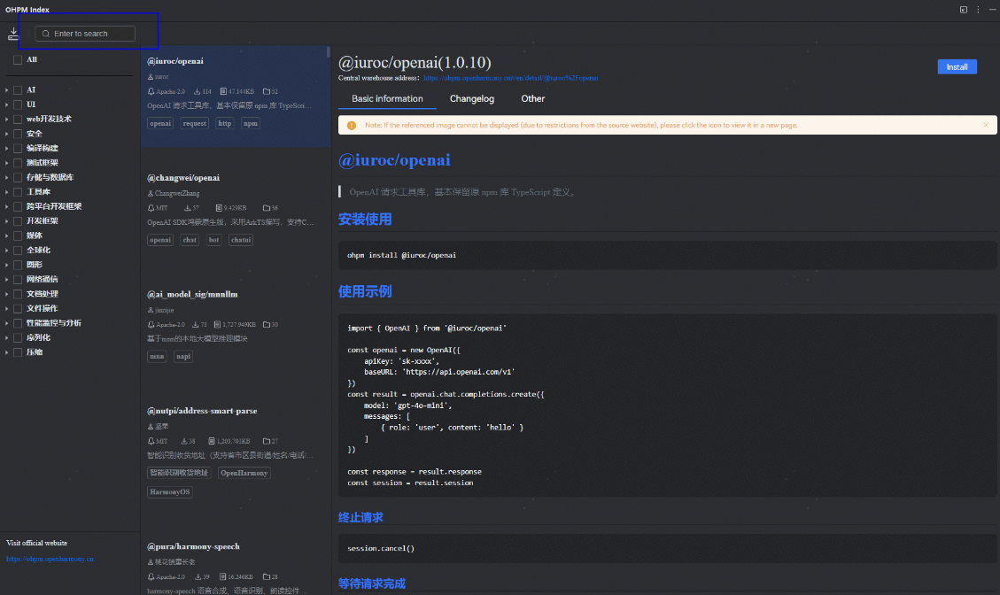
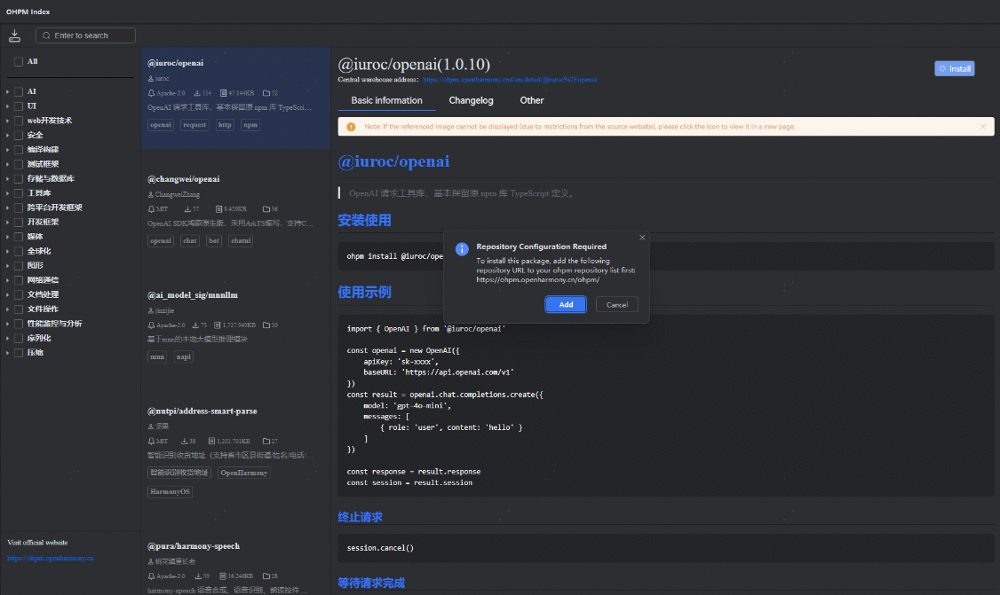
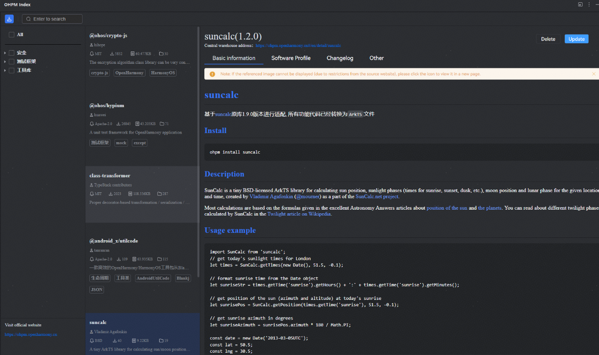
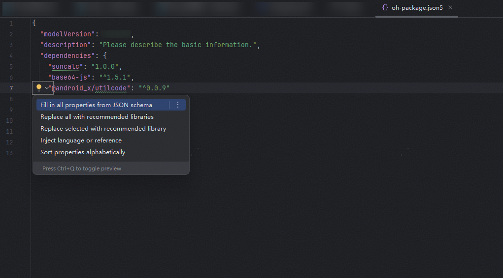

# 引用及管理共享包

更新时间：2026-04-30 02:42:31

来源：https://developer.huawei.com/consumer/cn/doc/harmonyos-guides/ide-har-import

引用三方HAR，包括从ohpm仓库进行安装、从本地文件夹和本地压缩包中进行安装三种方式。


- 方式一：在菜单栏点击**Tools > ****OHPM Index**，进入DevEco Studio内置的OpenHarmony开源中心仓，选择需要的三方包，详情请参考[使用OpenHarmony开源中心仓管理三方包](#section1579838153916)。仅支持中国境内（香港特别行政区、澳门特别行政区、中国台湾除外）。

引用本地模块源码（该本地模块必须与宿主模块归属于同一个工程），如entry模块需要依赖foo模块的源码，有如下两种方式：


方式二：在需要引入三方包的模块的oh-package.json5中设置本地HAR/HSP包。以HAR/HSP包在工程根目录下为例，配置示例如下（实际配置时请以HAR/HSP包实际目录为准）：


依赖设置完成后，需要执行**ohpm install**命令安装依赖包，依赖包会安装在该模块的oh_modules目录下。


```text
ohpm install
```

另外，在安装或卸载共享包时，可在模块或工程的oh-package.json5文件中增加钩子设置，以管理install、uninstall命令的生命周期，配置示例如下：


```text
"hooks": {
    "preInstall": "echo 00 preInstall", // install命令执行之前
    "postInstall": "echo 00 postInstall", // install命令执行之后
    "preUninstall": "echo 00 preUninstall", // uninstall命令执行之前
    "postUninstall": "echo 00 postUninstall"  // uninstall命令执行之后
  }
```


> [!NOTE]
> 目前只支持执行当前模块或工程的oh-package.json5文件中hooks，不支持执行依赖中hooks。 在引用共享包时，请注意当前只支持在模块和工程下的oh-package.json5文件中声明dependencies依赖，才会被当做依赖使用，并在编译构建过程中进行相应的处理。


## 使用OpenHarmony开源中心仓管理三方包


> [!NOTE]
> 该功能仅支持中国境内（香港特别行政区、澳门特别行政区、中国台湾除外）。

从DevEco Studio 6.0.0 Beta5版本开始，新增OHPM Index入口，提供OpenHarmony开源中心仓的高效筛选和管理能力，提升开发者选型开发效率，消减因软件信息不对称导致的选型使用风险，快速选择与定位所需的开源三方库。 在菜单栏点击**Tools > ****OHPM Index**，进入OpenHarmony开源中心仓。 在左侧搜索框可查询三方包名称，或点击目录树，根据分类查看不同分类下推荐的依赖包信息。选定所需要安装的三方包，点击右上角蓝色按钮**Install**进行安装。

安装过程中，如出现下方弹窗，点击**Add**按钮，将OpenHarmony中心仓地址添加到.ohpmrc文件中。

三方包安装完成后，在工程级oh-package.json5文件中可以看到已安装的三方包名称及版本信息，oh_modules中将同时添加该三方包。 点击页面左上角

图标，展示当前已安装的三方包信息。若当前三方包非最新版本，可以点击右上角**Update**按钮，更新至最新版本；点击**Delete**按钮，可以删除当前已安装的三方包。

若对于已使用的三方包依赖存在推荐的同类三方包，可点击编辑界面中黄色灯泡图标，在弹框中选择**Replace selected with recommended library**，将当前依赖替换为推荐的三方包依赖；或选择**Replace all with recommended libraries**，一键替换当前文件中所有同类推荐三方包。

