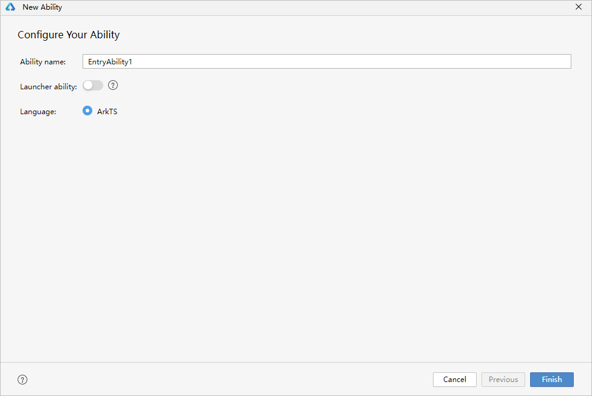
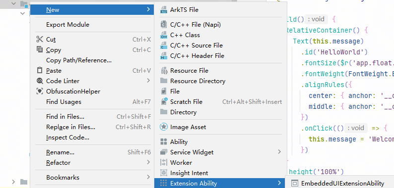
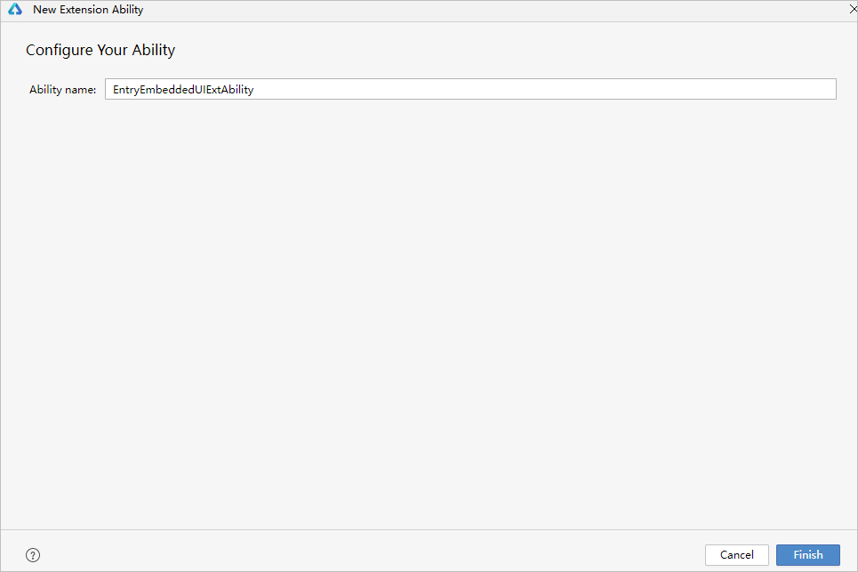
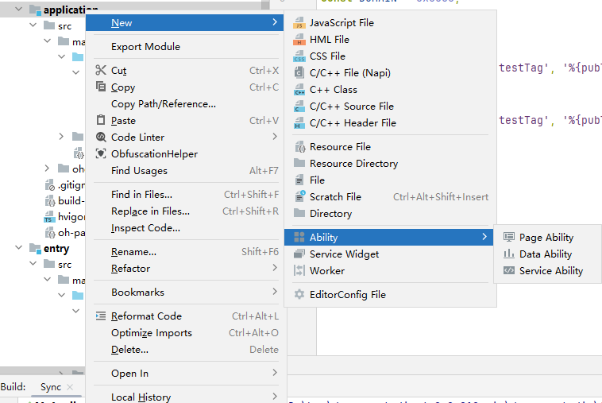

# 添加Ability

更新时间：2026-05-09 03:27:00

来源：https://developer.huawei.com/consumer/cn/doc/harmonyos-guides/ide-add-new-ability

Ability是应用/元服务所具备的能力的抽象，应用的一个Module可以包含一个或多个Ability，元服务仅包含一个Ability。应用/元服务先后提供了两种应用模型：

- FA（Feature Ability）模型： API 7开始支持的模型，已经不再主推。
- UIAbility组件：包含UI界面，提供展示UI的能力，主要用于和用户交互。详细介绍请参见[UIAbility组件概述](https://developer.huawei.com/consumer/cn/doc/harmonyos-guides/uiability-overview)。
- ExtensionAbility组件：提供特定场景的扩展能力，满足更多的使用场景。详细介绍请参见[ExtensionAbility概述](https://developer.huawei.com/consumer/cn/doc/harmonyos-guides/extensionability-overview)。元服务暂不支持使用ExtensionAbility组件。

## Stage模型添加Ability

## 在模块中添加UIAbility

选中对应的模块，单击鼠标右键，选择**New > Ability**。设置Ability名称，选择是否在设备主屏幕上显示该功能的启动图标，单击**Finish**完成Ability创建。

## 在模块中添加Extension Ability

从DevEco Studio 6.1.0 Beta2版本开始，在API 23及以上工程，支持Car设备工程添加RemoteNotificationAbility。 在工程中选中对应的模块，单击鼠标右键，选择**New > Extension Ability**，选择不同的场景类型 。当前仅Application工程支持创建Extension Ability。若创建的模块类型为HAP，支持创建如下Extension Ability：**EmbeddedUIExtensionAbility**：用于提供[跨进程界面嵌入](https://developer.huawei.com/consumer/cn/doc/harmonyos-guides/embeddeduiextensionability)的能力。**Backup****Ability**：用于提供[备份及恢复应用数据](https://developer.huawei.com/consumer/cn/doc/harmonyos-guides/app-file-backup-overview)的能力。**WorkScheduler**：用于提供[延迟任务](https://developer.huawei.com/consumer/cn/doc/harmonyos-guides/work-scheduler)的相关能力。**RemoteNotificationAbility**：用于提供获取场景化消息数据和生命周期销毁的回调的通知能力，当前仅支持在Phone、Tablet、2in1、Car设备中使用。**Driver**：用于提供[驱动相关扩展框架](https://developer.huawei.com/consumer/cn/doc/harmonyos-guides/driverextensionability)。仅在当前工程的设备类型只含有2in1设备时，支持创建该类型。 若创建的模块类型为HAR或HSP，支持创建以下两种Extension Ability：**EmbeddedUIExtensionAbility**：用于提供[跨进程界面嵌入](https://developer.huawei.com/consumer/cn/doc/harmonyos-guides/embeddeduiextensionability)的能力。**WorkScheduler**：用于提供[延迟任务](https://developer.huawei.com/consumer/cn/doc/harmonyos-guides/work-scheduler)的相关能力。

设置Ability名称，单击Finish完成Extension Ability创建。

## FA模型添加Ability

ArkTS工程与JS工程在FA模型中添加Ability的操作方式一致，本节内容以ArkTS工程为例介绍在模块中添加Ability。

## 创建Particle Ability

选中对应的模块，单击鼠标右键，选择**New > Ability **，然后选择对应的Data Ability/Service Ability模板。

根据选择的Ability模板，设置Ability的基本信息。**Ability name**：Ability类名称，由大小写字母、数字和下划线组成。**Language**：该Ability使用的开发语言。 单击**Finish**完成Ability的创建，可以在工程目录对应的模块中查看和编辑Ability。

## 创建Feature Ability

选中对应的模块，单击鼠标右键，选择**New > Ability **，然后选择对应的Page Ability模板。

根据选择的Ability模板，设置Ability的基本信息。**Ability name**：Ability类名称，由大小写字母、数字和下划线组成。**Launcher ability**：表示该Ability在终端桌面上是否有启动图标，一个HAP可以有多个启动图标，来启动不同的FA。**Language**：该Ability使用的开发语言。 单击**Finish**完成Ability的创建，可以在工程目录对应的模块中查看和编辑Ability。
