# 创建HarmonyOS应用工程

更新时间：2026-05-12 02:16:30

来源：https://developer.huawei.com/consumer/cn/doc/harmonyos-guides/agc-harmonyos-create-appproject

##### 新建工程

 

##### 前提条件

- 您已完成[开发准备工作](https://developer.huawei.com/consumer/cn/doc/harmonyos-guides/agc-harmonyos-clouddev-prerequisite)。
- 您已使用[已实名认证](https://developer.huawei.com/consumer/cn/doc/harmonyos-guides/agc-harmonyos-clouddev-account)、且注册地为中国境内（香港特别行政区、澳门特别行政区、中国台湾除外）的华为开发者账号登录DevEco Studio。
- 请确保您的华为开发者账号无欠款，账户欠费将导致云存储服务开通失败。

 
 

##### 选择模板
1. 选择以下任一种方式，打开工程创建向导界面。
- 如果当前未打开任何工程，可以在DevEco Studio的欢迎页点击“Create Project”开始创建一个新工程。

2. 如果已经打开了工程，可以在菜单栏选择“File > New > Create Project”来创建一个新工程。

3. 在“Application”页签，选择合适的云开发模板，然后点击“Next”。
> [!NOTE]
> 当前仅支持通用云开发模板（[CloudDev]Empty Ability）。

  
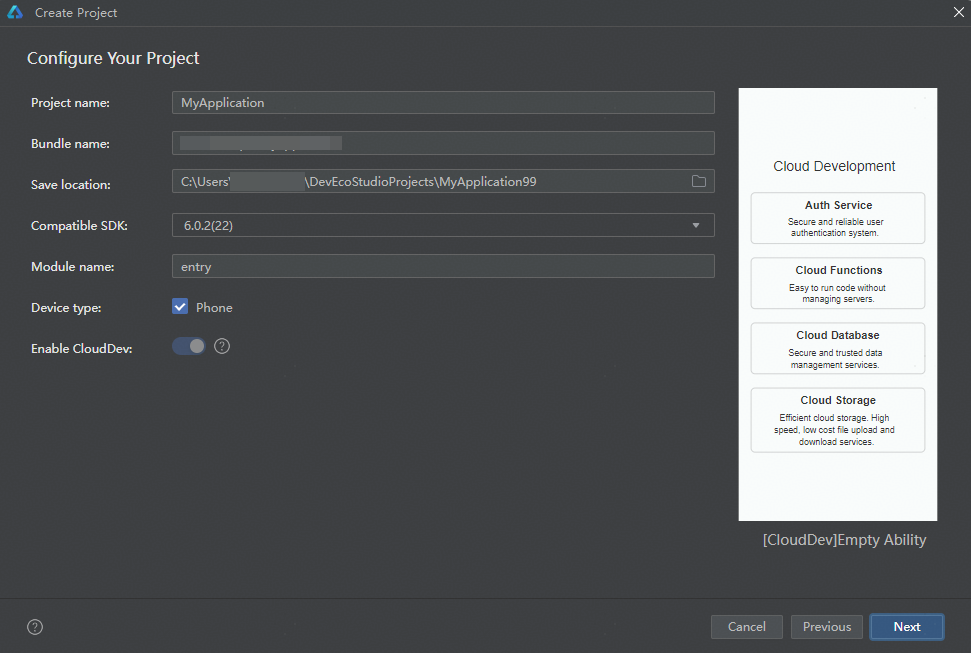

  

  ##### 配置工程信息

1. 在工程配置界面，配置工程的基本信息。其中，Device type和Enable CloudDev参数不可更改，其他参数请参考[创建一个新的工程](https://developer.huawei.com/consumer/cn/doc/harmonyos-guides/ide-create-new-project#section181328285169)内对应的指导进行配置。

| 参数 | 说明 |

| --- | --- |

| Device type | 该工程模板支持的设备类型，目前仅支持手机设备。 |

| Enable CloudDev | 是否启用云开发。云开发模板默认启用且无法更改。 |

  

1. 点击“Next”，开始关联云开发资源。

  

  ##### 关联云开发资源

  为工程关联云开发所需的资源，即将您账号团队在AGC创建的同包名应用关联到当前工程。具体操作如下：

1. （可选）如您尚未登录DevEco Studio，点击“Sign In”，在弹出的账号登录页面，使用[已实名认证](https://developer.huawei.com/consumer/cn/doc/harmonyos-guides/agc-harmonyos-clouddev-account)的华为开发者账号完成登录。

  登录成功后，界面将展示账号昵称。

  

2. 点击“Team”下拉框，选择开发团队。

3. 关联应用。选中团队后，系统根据工程Bundle name在该团队中自动查询AGC上的同包名应用。

  
如查询到应用，选中该应用，点击“Finish”即可。

4. 如查询到的应用尚未关联任何项目（即为游离应用），则无法选中。请先[将游离应用添加到AGC项目下](#section152521927193013)。
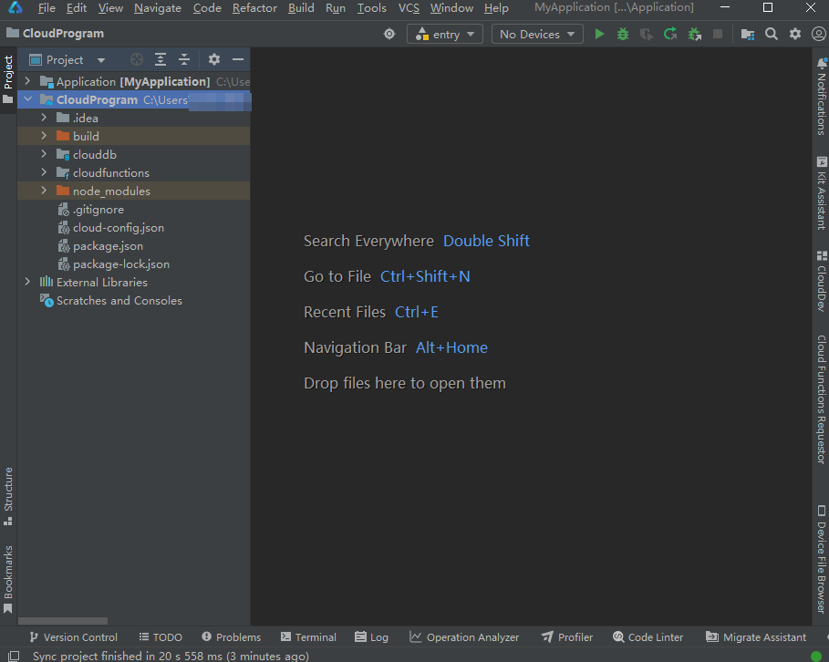

5. 如果查询到的应用所属项目尚未启用数据处理位置，请点击界面提示内的“AppGallery Connect”[设置数据处理位置](https://developer.huawei.com/consumer/cn/doc/app/agc-help-datalocation-0000001160439813)。设置完成后返回DevEco Studio界面，点击Bundle name后的

刷新当前APP ID列表，即可看到设置的数据处理位置。

  

 

  
由于云开发目前仅支持中国境内（香港特别行政区、澳门特别行政区、中国台湾除外），请确保项目启用的数据处理位置包含“中国”。

6. 无论项目启用的默认数据处理位置为哪个站点，后续开发的云服务资源都将部署在“中国”站点。

7. 如查询到应用但出现如下提示，表明查询到的应用类型为元服务，与当前工程类型不一致。请修改以确保当前工程与AGC上同包名应用均为HarmonyOS应用类型。
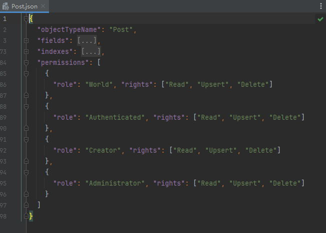

8. 如在当前团队中未查询到同包名应用，请先确认填写的包名是否有误。
如包名有误，点击界面提示中的“go back”返回工程信息配置界面进行修改。

9. 如包名无误，则表明当前团队尚未在AGC控制台创建与当前工程包名相同的应用。您可点击界面提示中的“AppGallery Connect”，[前往AGC控制台进行补充创建](#section397317130308)。

10. 如您所属的团队尚未签署云开发相关协议，点击协议链接仔细阅读协议内容后，勾选同意协议，点击“Finish”。
> [!NOTE]
> 只有账号持有者和法务角色才有权限签署协议。

  
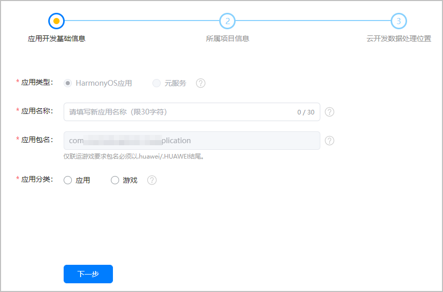

11. 进入主开发界面，DevEco Studio执行工程同步操作，端侧工程会自动执行“ohpm install”，云侧工程会自动执行“npm install”，以分别下载端侧和云侧依赖。
> [!NOTE]
> 若云侧执行“npm install”失败，请排查是否尚未 配置NPM代理 。

  
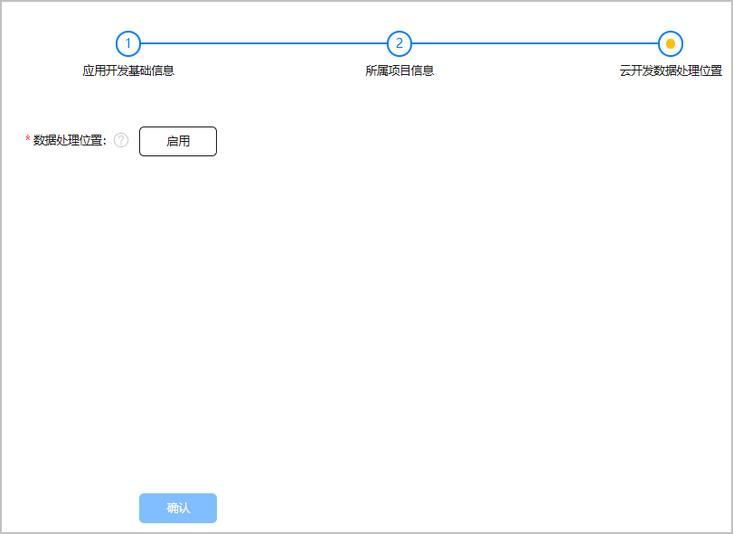

12. 在主开发界面，可查看刚刚新建的工程。关于工程的详细目录结构介绍，请参见[端云一体化开发工程目录结构](#section20250910164411)。

  

  ##### 工程初始化配置

  当您成功创建工程并关联云开发资源后，DevEco Studio会为您的工程自动执行一些初始化配置。

  

  ##### 自动开通云开发服务

  DevEco Studio为工程关联的项目自动开通云函数、云数据库、云存储等云开发服务，您可在“Notifications”窗口查看服务开通状态。

  
> [!NOTE]
> 如服务开通失败，您可通过 CloudDev云开发管理面板 快捷进入AGC控制台进行手动开通。 如云存储服务自动开通与手动开通均失败，可能是账户欠费导致。请您 检查账户是否余额不足 ， 补齐欠款 后再前往AGC控制台进行手动开通。

  

  ##### 端云一体化开发工程目录结构

  端云一体化开发工程主要包含端开发工程（Application）与云开发工程（CloudProgram）。

  

  ##### 端开发工程（Application）

  端开发工程主要用于开发应用端侧的业务代码，使用通用云开发模板创建的端开发工程目录结构如下图所示。“Application/cloud_objects”模块用于存放云对象的端侧调用接口类，“src/main/ets/pages”目录下包含了云存储、云数据库和云函数页面，其他目录文件介绍请参见[工程目录结构](https://developer.huawei.com/consumer/cn/doc/harmonyos-guides/ide-project-structure)。

  
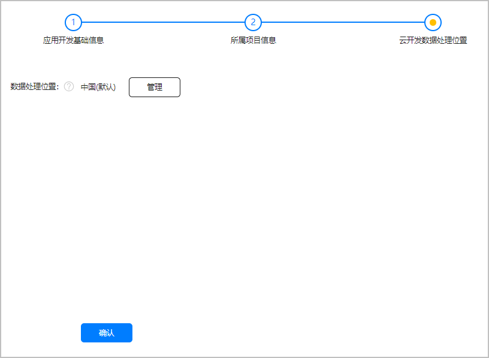

  

  ##### 云开发工程（CloudProgram）

  在云开发工程中，您可为您的应用开发云端代码，包括云函数和云数据库服务代码。使用通用云开发模板创建的云开发工程目录结构如下图所示。

  

  
clouddb：云数据库目录，包含数据条目目录（dataentry）和对象类型目录（objecttype）。
dataentry：用于存放数据条目文件。该目录下一般会根据您选择的云开发模板预置数据条目示例文件。在通用云开发模板工程中，该目录下会预置名为“d_Post.json”的数据条目示例文件，内含两条示例数据。您可按需使用、修改或删除。

  

- objecttype：用于存放对象类型文件。该目录下一般会根据您选择的云开发模板预置对象类型示例文件。在通用云开发模板工程中，该目录下会预置名为“Post.json”的对象类型示例文件，内含对象类型“Post”的权限、索引、字段名称和字段值等。您可按需使用、修改或删除。

  
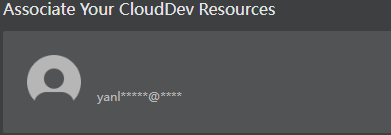

- db-config.json：模块配置文件，主要包含云数据库工程的配置信息，如默认存储区名称、默认数据处理位置。

 - cloudfunctions：云函数目录，包含各个云函数/云对象子目录。每个子目录下包含了云函数/云对象的配置文件、入口文件、依赖文件等。该目录下一般会根据您选择的云开发模板预置示例函数。通用云开发模板工程下预置了一个用于生成UUID的示例云对象“id-generator”，您可按需使用、修改或删除。

  
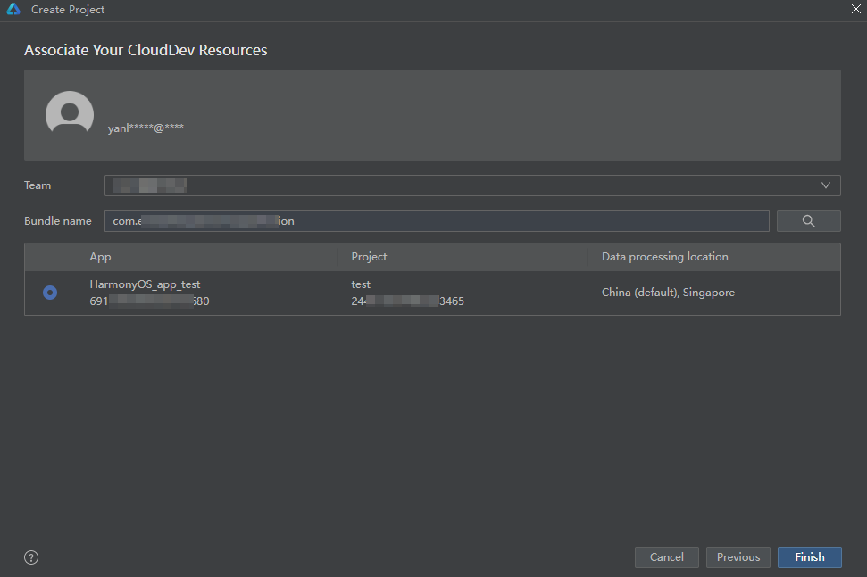

- node_modules：工程同步时执行“npm install”生成，包含“typescript”和“@types/node”公共依赖。
- cloud-config.json：云开发工程配置文件，包含应用名称与ID、项目名称与ID、启用的数据处理位置、支持的设备类型等。
- package.json：定义了“typescript”和“@types/node”公共依赖。
- package-lock.json：工程同步时执行“npm install”生成，记录当前状态下实际安装的各个npm package的具体来源和版本号。

 
 

##### （可选）AGC应用管理

 

##### 从DevEco Studio补充创建同包名应用

如创建工程时，发现尚未在AGC控制台创建与工程包名相同的应用，可进行补充创建。
 1. 点击界面提示内的“AppGallery Connect”，浏览器打开AGC控制台页面。

2. 在“应用开发基础信息”页面，填写待创建的应用信息，完成后点击“下一步”。
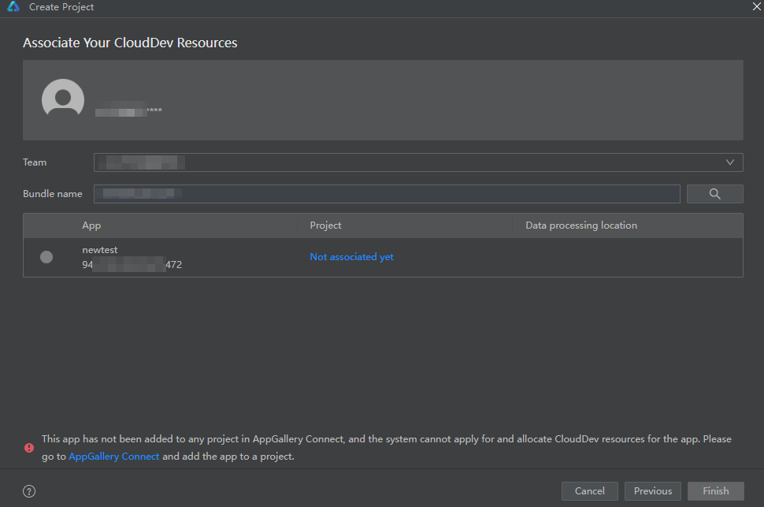

| 参数 | 说明 |

| --- | --- |

| 应用类型 | 创建的HarmonyOS应用形态，默认与您本地工程类型保持一致，不可更改。 |

| 应用名称 | 应用在华为应用市场详情页展示的名称。 |

| 应用包名 | 从DevEco Studio中带入自动填充，且不可更改。 |

| 应用分类 | 请选择普通应用或游戏类应用。 
> [!TIP]
> 应用分类设置后不支持修改，请谨慎选择。
|
3. 进入“所属项目信息”页面，为应用选择所属的项目后点击“下一步”。
- 如需将应用添加到已有项目，点击下拉框进行选择。

4. 如需将应用添加到新项目，直接在框中填写新项目名称。

5. 进入“云开发数据处理位置”页面，设置或管理项目的数据处理位置。
如项目尚未设置数据处理位置：
点击“启用”。
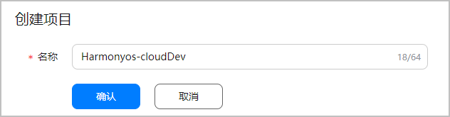

6. 仔细阅读提示框的文字说明后，在“启用”栏为您的项目勾选一个或多个数据处理位置，并在“设为默认”栏将其中一个设置为默认数据处理位置。

  
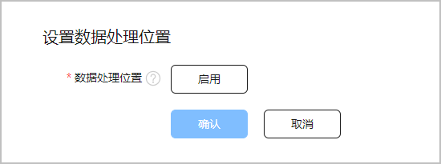
 

  启用的数据处理位置必须包含中国站点。

  

- 如项目已设置过数据处理位置，可点击“管理”启用新的数据处理位置、取消已启用的数据处理位置，或修改默认数据处理位置。
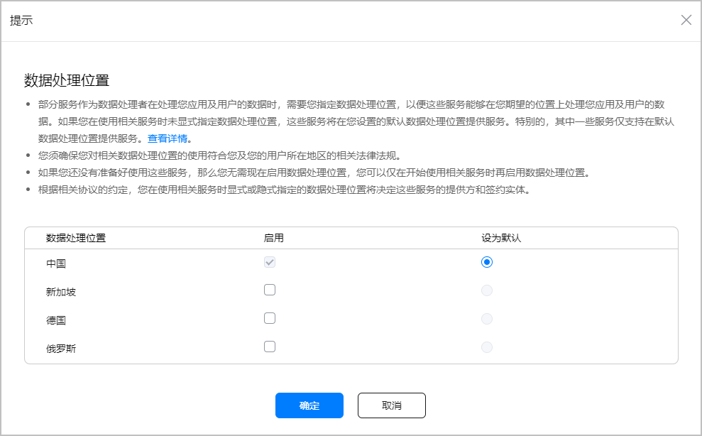

 - 点击“确认”，应用创建完成。
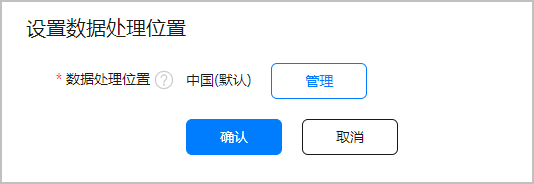

- 返回DevEco Studio，可看到界面已获取并展示了刚刚创建的应用信息。若不展示，可点击Bundle name后的

刷新。
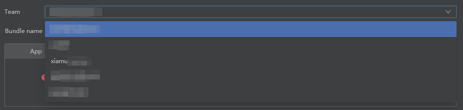

 
 

##### 将游离应用添加到AGC项目下

游离应用指未关联任何AGC项目的应用。创建工程时，如需要关联的AGC应用为游离应用，则您需要将该应用添加到您的AGC项目下。
 

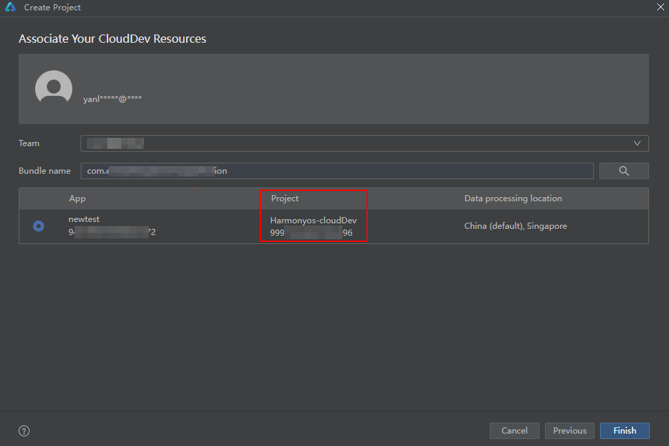
 

应用与项目的关联关系一旦创建则无法再修改，请谨慎操作。
 

1. 点击“Not associated yet”，或点击界面下方提示内的“AppGallery Connect”，可打开AGC控制台“开发与服务”页面。

2. 点击选择希望为应用关联的项目，或者点击“添加项目”新建一个项目。

3. 如选择了新建一个项目，设置项目名称，点击“确认”。如选择了已有项目，则忽略此步骤。

  

4. 设置或管理项目的数据处理位置。
- 如项目尚未设置数据处理位置：
点击“启用”。

5. 仔细阅读提示框的文字说明后，在“启用”栏为您的项目勾选一个或多个数据处理位置，并在“设为默认”栏将其中一个设置为默认数据处理位置。

  
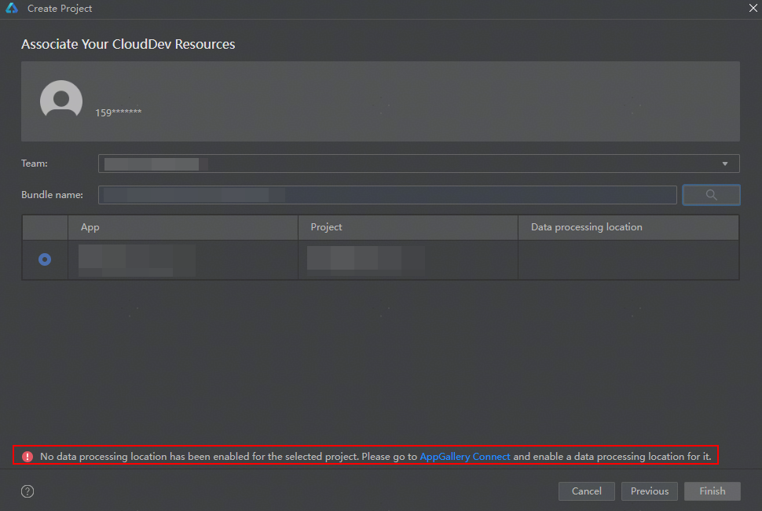
 

  启用的数据处理位置必须包含中国站点。

  

- 如项目已设置过数据处理位置，可点击“管理”启用新的数据处理位置、取消已启用的数据处理位置，或修改默认数据处理位置。

 - 点击“确认”，应用成功关联项目。

- 返回DevEco Studio，可看到应用已关联上了项目。

