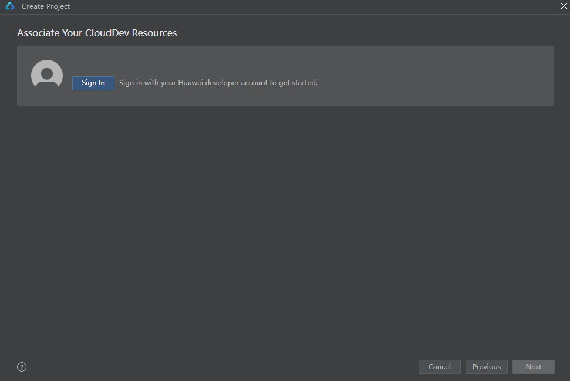
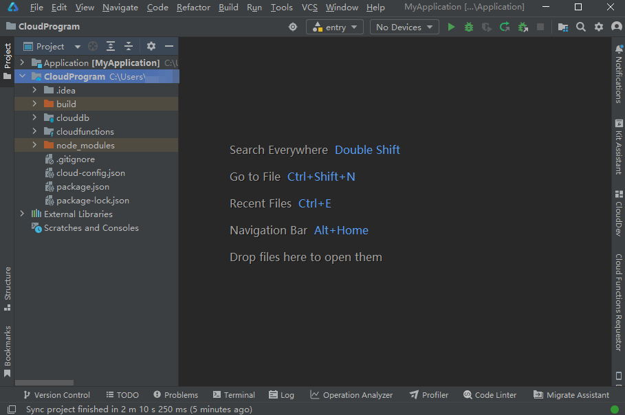
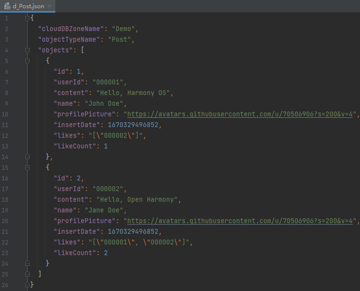
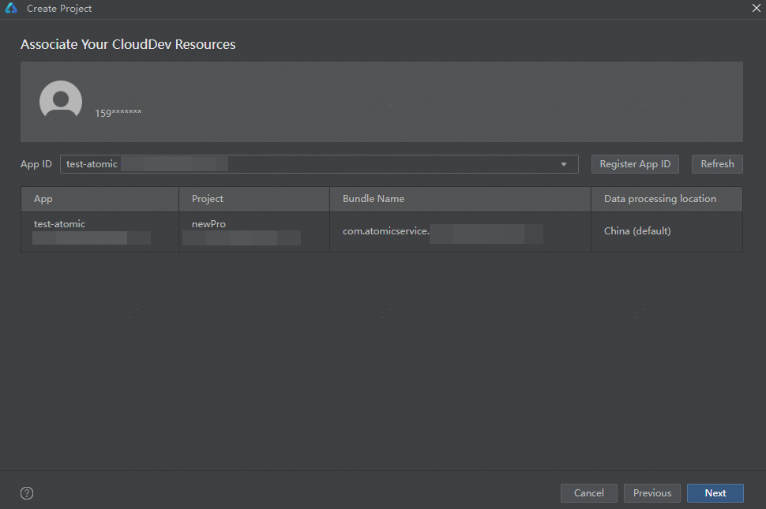
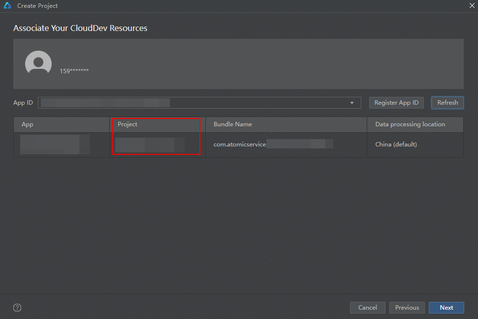
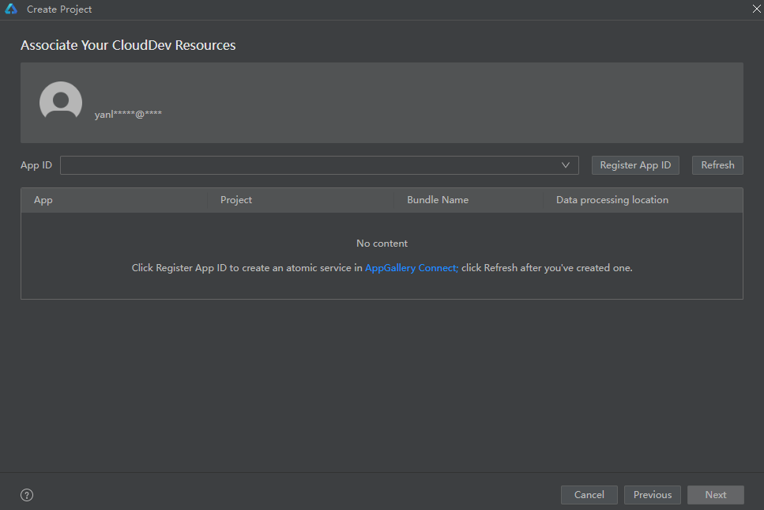
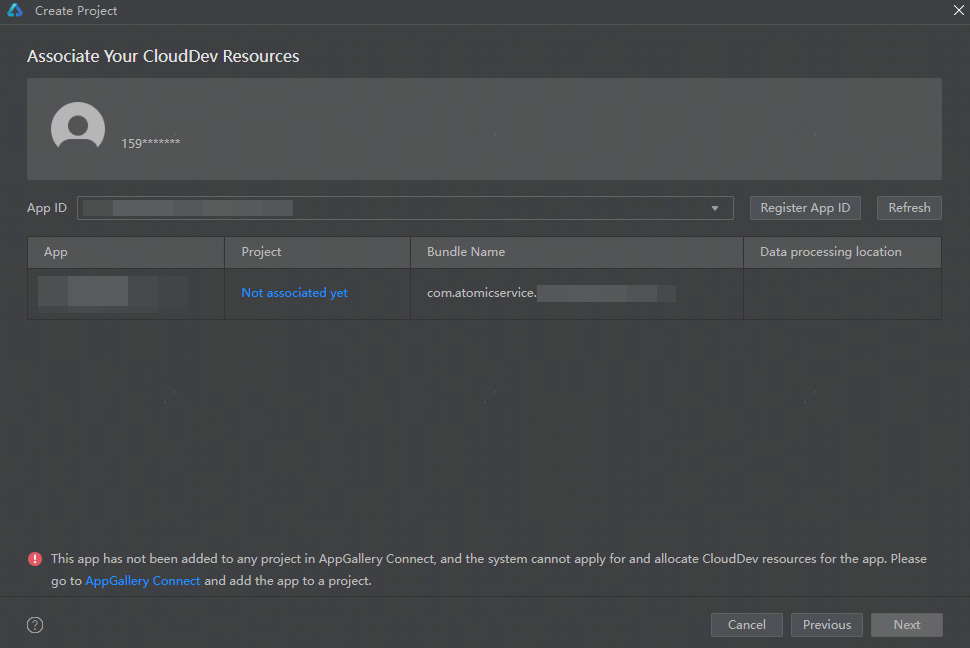
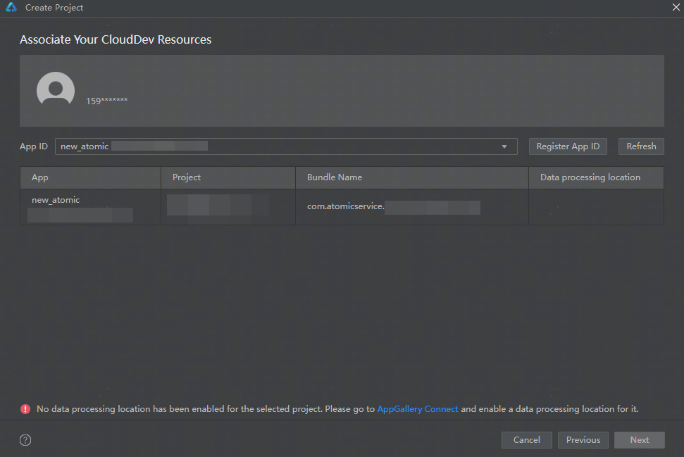
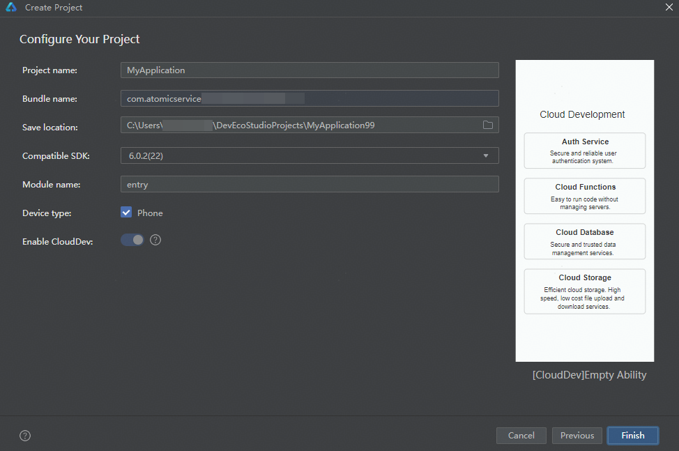
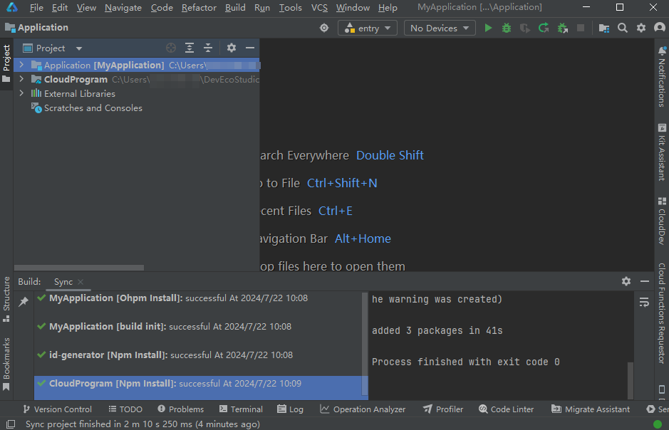

# 创建元服务工程

更新时间：2026-01-30 02:07:01

来源：https://developer.huawei.com/consumer/cn/doc/harmonyos-guides/agc-harmonyos-create-faproject

##### 新建工程

 

##### 前提条件

- 您已完成[开发准备工作](https://developer.huawei.com/consumer/cn/doc/harmonyos-guides/agc-harmonyos-clouddev-prerequisite)。
- 您已使用[已实名认证](https://developer.huawei.com/consumer/cn/doc/harmonyos-guides/agc-harmonyos-clouddev-account)、且注册地为中国境内（香港特别行政区、澳门特别行政区、中国台湾除外）的华为开发者账号登录DevEco Studio。
- 请确保您的华为开发者账号无欠款，账户欠费将导致云存储服务开通失败。

 
 

##### 选择模板
1. 选择以下任一种方式，打开工程创建向导界面。
- 如果当前未打开任何工程，可以在DevEco Studio的欢迎页点击“Create Project”开始创建一个新工程。

2. 如果已经打开了工程，可以在菜单栏选择“File > New > Create Project”来创建一个新工程。

3. 点击“Atomic Service”页签，选择合适的云开发模板，然后点击“Next”。
> [!NOTE]
> 当前仅支持通用云开发模板（[CloudDev]Empty Ability）。

  

  

  ##### 关联云开发资源

  为工程关联云开发所需的资源，即将您账号团队在AGC创建的元服务关联到待创建工程。具体操作如下：

1. （可选）如您尚未登录DevEco Studio，点击“Sign In”，在弹出的账号登录页面，使用[已实名认证](https://developer.huawei.com/consumer/cn/doc/harmonyos-guides/agc-harmonyos-clouddev-account)的华为开发者账号完成登录。

  登录成功后，界面将展示账号昵称。

  

2. 选择已登录账号下的APP ID，以关联AGC上的元服务。
从APP ID下拉列表中选中所需的APP ID后，界面会展示该元服务在AGC控制台的名称、所属项目、包名与数据处理位置。确认无误后，点击“Next”。
> [!NOTE]
> 元服务包名为自动生成，格式为固定前缀与appid的组合（com.atomicservice.[appid]）。不符合命名规范的包名无法在APP ID下拉列表中展示。

  

3. 当出现以下场景时，您可点击“Register App ID”，[前往AGC控制台补充创建元服务](#section397317130308)。创建成功后返回DevEco Studio界面，即可看到新建的元服务信息。
APP ID框为空，即当前账号尚未在AGC控制台创建任何元服务。

4. 您需为待创建工程关联一个新的元服务。

5. 如查询到的元服务尚未关联任何项目，则无法选中。请先[将游离元服务添加到AGC项目下](#section152521927193013)，再返回DevEco Studio界面操作。

6. 如果查询到的元服务所属项目尚未启用数据处理位置，请点击界面提示内的“AppGallery Connect”[设置数据处理位置](https://developer.huawei.com/consumer/cn/doc/app/agc-help-datalocation-0000001160439813)。设置完成后返回DevEco Studio界面，点击“Refresh”刷新当前APP ID列表，即可看到设置的数据处理位置。

  

 

  
由于云开发目前仅支持中国境内（香港特别行政区、澳门特别行政区、中国台湾除外），请确保项目启用的数据处理位置包含“中国”。

7. 无论项目启用的默认数据处理位置为哪个站点，后续开发的云服务资源都将部署在“中国”站点。

  

  ##### 配置工程信息

1. 进入工程配置界面，配置工程的基本信息。其中，Device type和Enable CloudDev参数不可更改，其他参数请参考[创建元服务工程](https://developer.huawei.com/consumer/cn/doc/atomic-guides/atomic-service-create-project)内对应的指导进行配置。

| 参数 | 说明 |

| --- | --- |

| Device type | 该工程模板支持的设备类型，目前仅支持手机设备。 |

| Enable CloudDev | 是否启用云开发。云开发模板默认启用且无法更改。 |

  

1. 点击“Finish”，进入主开发界面，DevEco Studio执行工程同步操作，端侧工程会自动执行“ohpm install”，云侧工程会自动执行“npm install”，以分别下载端侧和云侧依赖。
> [!NOTE]
> 若云侧执行“npm install”失败，请排查是否尚未 配置NPM代理 。

  

2. 在主开发界面，可查看刚刚新建的工程。关于工程的详细目录结构介绍，请参见[端云一体化开发工程目录结构](#section20250910164411)。

  

  ##### 工程初始化配置

  当您成功创建工程并关联云开发资源后，DevEco Studio会为您的工程自动执行一些初始化配置。

  

  ##### 自动开通云开发服务

  DevEco Studio为工程关联的项目自动开通云函数、云数据库、云存储等云开发服务，您可在“Notifications”窗口查看服务开通状态。

  
> [!NOTE]
> 如服务开通失败，您可通过 CloudDev云开发管理面板 快捷进入AGC控制台进行手动开通。 如云存储服务自动开通与手动开通均失败，可能是账户欠费导致。请您 检查账户是否余额不足 ， 补齐欠款 后再前往AGC控制台进行手动开通。

  

  ##### 端云一体化开发工程目录结构

  端云一体化开发工程主要包含端开发工程（Application）与云开发工程（CloudProgram）。

  

  ##### 端开发工程（Application）

  端开发工程主要用于开发应用端侧的业务代码，使用通用云开发模板创建的端开发工程目录结构如下图所示。“Application/cloud_objects”模块用于存放云对象的调用接口类，“src/main/ets/pages”目录下包含了云存储、云数据库和云函数页面，其他目录文件介绍请参见[工程目录结构](https://developer.huawei.com/consumer/cn/doc/harmonyos-guides/ide-project-structure)。

  

  

  ##### 云开发工程（CloudProgram）

  在云开发工程中，您可为您的元服务开发云端代码，包括云函数和云数据库服务代码。使用通用云开发模板创建的云开发工程目录结构如下图所示。

  

  
clouddb：云数据库目录，包含数据条目目录（dataentry）和对象类型目录（objecttype）。
dataentry：用于存放数据条目文件。该目录下一般会根据您选择的云开发模板预置数据条目示例文件。在通用云开发模板工程中，该目录下会预置名为“d_Post.json”的数据条目示例文件，内含两条示例数据。您可按需使用、修改或删除。

  

- objecttype：用于存放对象类型文件。该目录下一般会根据您选择的云开发模板预置对象类型示例文件。在通用云开发模板工程中，该目录下会预置名为“Post.json”的对象类型示例文件，内含对象类型“Post”的权限、索引、字段名称和字段值等。您可按需使用、修改或删除。

  

- db-config.json：模块配置文件，主要包含云数据库工程的配置信息，如默认存储区名称、默认数据处理位置。

 - cloudfunctions：云函数目录，包含各个云函数/云对象子目录。每个子目录下包含了云函数/云对象的配置文件、入口文件、依赖文件等。该目录下一般会根据您选择的云开发模板预置示例函数。通用云开发模板工程下预置了一个用于生成UUID的示例云对象“id-generator”，您可按需使用、修改或删除。

  

- node_modules：工程同步时执行“npm install”生成，包含“typescript”和“@types/node”公共依赖。
- cloud-config.json：云开发工程配置文件，包含应用名称与ID、项目名称与ID、启用的数据处理位置、支持的设备类型等。
- package.json：定义了“typescript”和“@types/node”公共依赖。
- package-lock.json：工程同步时执行“npm install”生成，记录当前状态下实际安装的各个npm package的具体来源和版本号。

 
 

##### （可选）AGC元服务管理

 

##### 从DevEco Studio补充创建元服务

如创建元服务工程时，发现尚未在AGC控制台创建对应的元服务，可直接从DevEco Studio进行补充创建。
 1. 点击“Register App ID”。

2. 在弹窗中填写待创建的元服务信息后，点击“OK”。

| 参数 | 说明 |

| --- | --- |

| Project | 为当前元服务选择所属的项目。可以输入一个新项目名称，或在下拉框中选择已有项目。 |

| App type | 应用形态。默认为“AtomicService”，不支持修改。 |

| App name | 元服务在华为应用市场详情页展示的名称。 |

| App category | 应用分类。元服务暂不支持游戏类别，请选择“App”。 
> [!TIP]
> 应用分类设置后不支持修改，请谨慎选择。
|
3. 返回DevEco Studio界面，可查看到刚刚创建的元服务的名称及APP ID、所属项目及项目ID、包名、数据处理位置。
> [!NOTE]
> 若元服务关联的是一个新建项目或者尚未启用数据处理位置的已有项目，则还会提示尚未启用数据处理位置，参考 上文 处理即可。

  

 
 

##### 将游离元服务添加到AGC项目下

游离元服务指未关联任何AGC项目的元服务。创建工程时，如需要关联的AGC元服务为游离状态，则您需要将该元服务添加到您的AGC项目下。
 

 

元服务与项目的关联关系一旦创建则无法再修改，请谨慎操作。
 

1. 点击“Not associated yet”，或点击界面下方提示内的“AppGallery Connect”，可打开AGC控制台“开发与服务”页面。

2. 点击选择希望为元服务关联的项目，或者点击“添加项目”新建一个项目。

3. 如选择了新建一个项目，设置项目名称，点击“确认”。如选择了已有项目，则忽略此步骤。

  

4. 设置或管理项目的数据处理位置。
- 如项目尚未设置数据处理位置：
点击“启用”。

5. 仔细阅读提示框的文字说明后，在“启用”栏为您的项目勾选一个或多个数据处理位置，并在“设为默认”栏将其中一个设置为默认数据处理位置。

  

 

  启用的数据处理位置必须包含中国站点。

  

- 如项目已设置过数据处理位置，可点击“管理”启用新的数据处理位置、取消已启用的数据处理位置，或修改默认数据处理位置。

 - 点击“确认”，元服务成功关联项目。

- 返回DevEco Studio，点击“Refresh”刷新，可看到元服务已关联上了项目。

