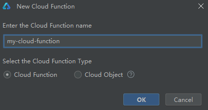
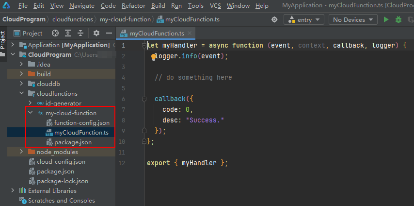
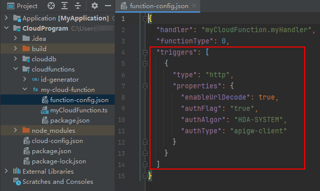

# 创建并配置函数

更新时间：2026-05-07 02:57:00

来源：https://developer.huawei.com/consumer/cn/doc/harmonyos-guides/agc-harmonyos-clouddev-createfunc

您可直接在DevEco Studio创建函数、为函数配置调用的触发器等。


## 创建函数

右击“cloudfunctions”目录，选择“New > Cloud Function”。

在“Select the Cloud Function Type”栏选择“Cloud Function”，输入云函数名称（如“my-cloud-function”），点击“OK”。函数名称长度2-63个字符，仅支持小写英文字母、数字、中划线（-），首字符必须为小写字母，结尾不能为中划线（-）。

“cloudfunctions”目录下生成新建的“my-cloud-function”函数目录，目录下主要包含如下文件： 函数配置文件“function-config.json”函数入口文件“myCloudFunction.ts”依赖配置文件“package.json”


## 配置函数

函数创建完毕后，您可在配置文件“function-config.json”的“triggers”下配置触发器，通过触发器暴露的触发条件来实现函数调用。

> [!NOTE]
> “functionType”表示函数类型，值为创建时自动生成。“0”表示云函数，“1”表示云对象。 如您需在函数部署完成后更新触发器，请先删除之前的触发器配置，再添加新的触发器配置，否则您的更新将不生效。

 HTTP触发器“function-config.json”文件中已为您自动完成HTTP触发器配置。配置了HTTP触发器的函数被部署到云端后，您的应用即可通过Cloud Foundation Kit调用函数。关于如何使用HTTP触发器调用函数，请参见[调用函数](https://developer.huawei.com/consumer/cn/doc/harmonyos-guides/cloudfoundation-call-function)。
```text
{
  "type": "http",
  "properties": {
    "enableUrlDecode": true,
    "authFlag": "true",
    "authAlgor": "HDA-SYSTEM",
    "authType": "apigw-client"
  }
}
```

 type：触发器类型，配置为“http”。properties：触发器属性，属性参数如下表所示。
| 参数 | 说明 |
| --- | --- |
| enableUrlDecode | 通过HTTP触发器触发函数时，对于contentType为“application/x-www-form-urlencoded”的触发请求，是否使用URLDecoder对请求body进行解码再转发到函数中。 true：启用。false：不启用。 |
| authFlag | 是否鉴权，默认为true。 |
| authAlgor | 鉴权算法，默认为HDA-SYSTEM。 |
| authType | HTTP触发器的认证类型。 apigw-client：端侧网关认证，适用于来自APP客户端侧（即本地应用或者项目）的函数调用。cloudgw-client：云侧网关认证，适用于来自APP服务器侧（即云函数）的函数调用。 |

CLOUDDB触发器您需在“function-config.json”文件中手动为函数配置CLOUDDB触发器。配置CLOUDDB完成后，当云数据库发生插入或者更新数据、删除数据、清空数据等变更操作时将触发云函数。
```text
{
  "type": "clouddb",
  "properties": {
    "eventSourceId": "9***-test-user",
    "eventType": "onUpsert",
    "enabled": "true"
  }
}
```

 type：触发器类型，配置为“clouddb”。properties：触发器属性，属性参数如下表所示。
| 参数 | 说明 |
| --- | --- |
| eventSourceId | CLOUDDB触发器的数据源。 格式为：项目ID-CloudDB存储区名称-CloudDB对象类型名称，例如“99034201568569469-StorageArea-student”。 CloudDB存储区名称以字母开头，可选范围为[0-9A-Za-z]，不带下划线，长度为1~20个字符。CloudDB对象类型名称以字母开头，可选范围为[0-9A-Za-z_]，不允许以sqlite_开头，不允许以下划线结尾，长度为1~30个字符。 |
| eventType | 触发器支持的事件类型。 onUpsert：数据表插入或更新数据。onDelete：数据表删除数据。onDeleteAll：数据表清空。onWrite：数据插入或更新事件、数据删除事件、数据表清空事件。 |
| enabled | 标识触发器的状态。默认为启用（true），可设置。 |
