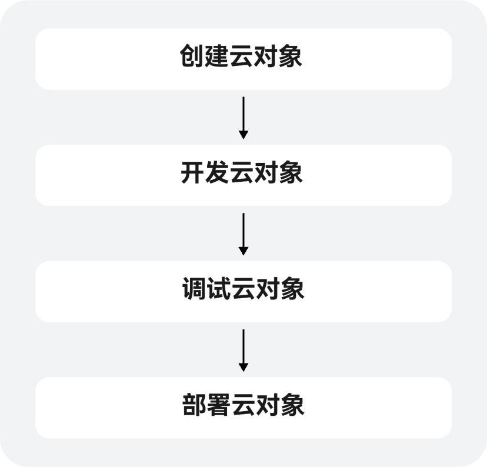

# 开发流程

更新时间：2026-01-21 08:03:01

来源：https://developer.huawei.com/consumer/cn/doc/harmonyos-guides/agc-harmonyos-clouddev-cloudobjprocess

除去传统的云函数，您还可在端云一体化云侧工程下开发云对象。云对象是一种特殊的云函数，本质是对云函数的一种封装，客户端可通过导入一个云对象来直接使用这个对象的方法，为您提供在端侧直接调用云侧代码的开发体验。相比普通云函数方式，云对象代码更精简、逻辑更清晰，大多数场景下推荐使用云对象代替传统云函数。开发流程大致如下：

 

1. [创建云对象](https://developer.huawei.com/consumer/cn/doc/harmonyos-guides/agc-harmonyos-clouddev-createcloudobj)：您可直接在DevEco Studio创建云对象。
2. [开发云对象](https://developer.huawei.com/consumer/cn/doc/harmonyos-guides/agc-harmonyos-clouddev-cloudobj-coding)：云对象创建完成后，您便可以开始编写云对象业务代码了。
3. [调试云对象](https://developer.huawei.com/consumer/cn/doc/harmonyos-guides/agc-harmonyos-clouddev-debugcloudobj)：您可以对云对象进行调试，以测试云对象代码运行是否正确。
4. [部署云对象](https://developer.huawei.com/consumer/cn/doc/harmonyos-guides/agc-harmonyos-clouddev-deploycloudobj)：完成云对象代码开发与调试后，您可将云对象部署到AGC云端，支持单个部署和批量部署。

> [!NOTE]
> 一般建议先将云对象调试无误后再部署至云端，但某些业务场景下需要先部署云对象才能进行调试。请根据实际业务需要操作。
