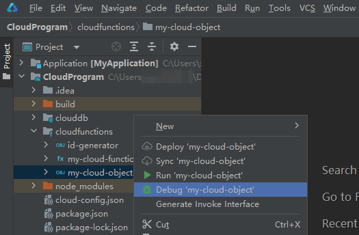
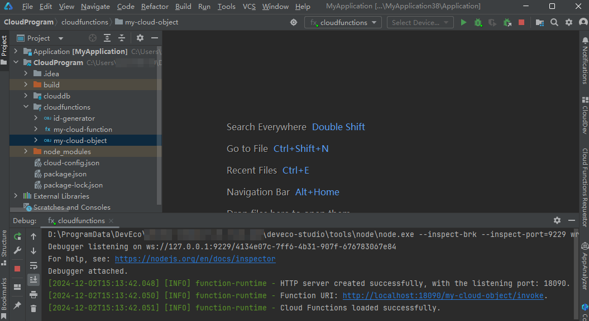
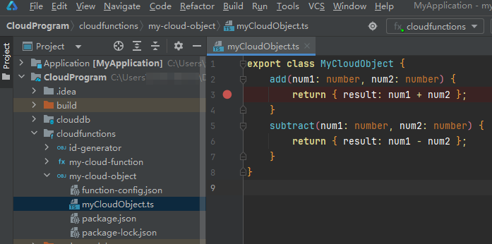
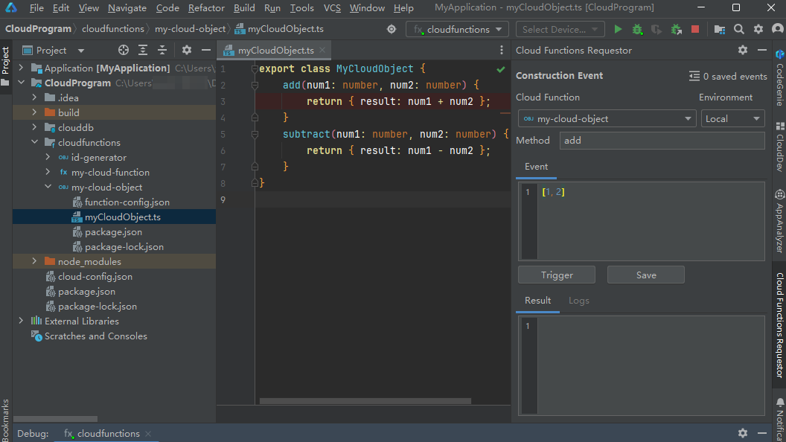
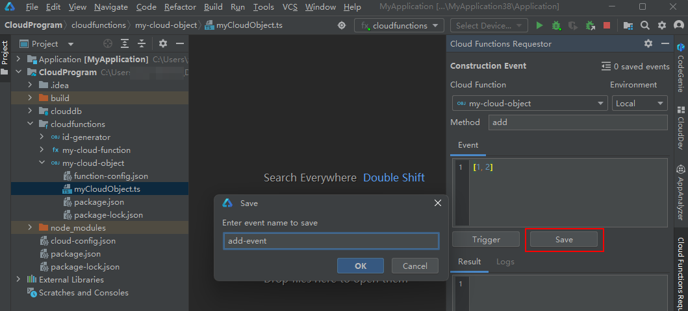
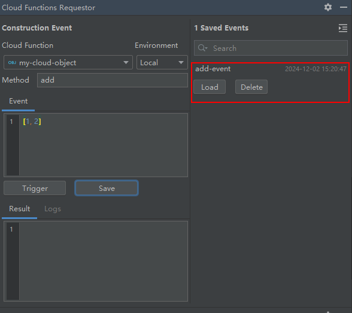
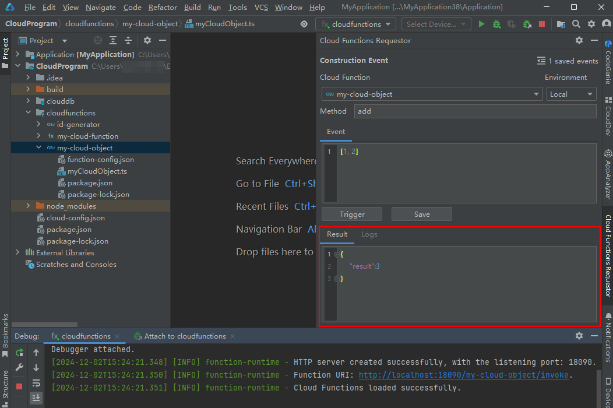
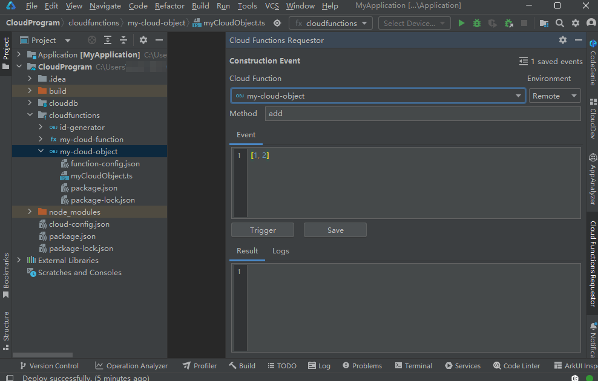
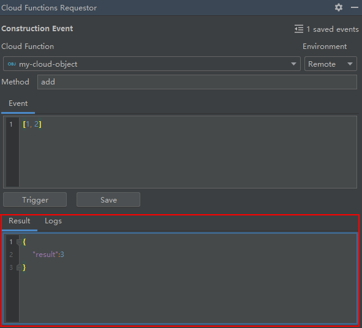

# 调试云对象

更新时间：2026-01-15 06:51:04

来源：https://developer.huawei.com/consumer/cn/doc/harmonyos-guides/agc-harmonyos-clouddev-debugcloudobj

云对象开发完成后，您可以对其进行调试，以验证云对象代码运行是否正常。

 目前DevEco Studio云对象调试支持本地调用和远程调用，请根据实际场景选择使用：

- [通过本地调用方式调试云对象](#section248615546567)：在DevEco Studio调试本地开发好的云对象。支持单个调试和批量调试，并支持Run和Debug两种模式，调试功能丰富，常在云对象开发过程或问题定位过程中使用。
- [通过远程调用方式调试云对象](#section123191549587)：先将云对象部署至AGC云端，然后直接在DevEco Studio调用云端云对象。此方式主要用于测试云对象在云端的运行情况、或补充测试因各种因素限制未能在本地调用方式中发现的问题。

## 前提条件

请确保您已登录。如果您的工程有代码逻辑涉及云对象调用云数据库，您需在调试前先[将整个云工程部署到AGC云端](https://developer.huawei.com/consumer/cn/doc/harmonyos-guides/agc-harmonyos-clouddev-deploy)，否则云端将没有相关数据及环境变量。

## 通过本地调用方式调试云对象

您可在DevEco Studio调试本地开发好的云对象，支持单个调试和批量调试，并支持Run和Debug两种模式。 单个调试和批量调试流程相同，区别仅在于：单个调试是一次只为一个云对象启动本地调试，之后只能调用该云对象；批量调试是一次为“cloudfunctions”目录下所有云对象启动本地调试、然后逐个调用各个云对象。Run模式和Debug模式的区别在于：Debug模式支持使用断点来追踪云对象的运行情况，Run模式则不支持。 下文以Debug模式下调试单个云对象“my-cloud-object”为例，介绍如何在DevEco Studio调试本地云对象。 右击“my-cloud-object”云对象目录，选择“Debug 'my-cloud-object'”。
> [!NOTE]
> 如需批量调试多个云对象，右击“cloudfunctions”目录，选择“Debug Cloud Functions”，即可启动该目录下所有云对象。如“cloudfunctions”目录下同时存在云函数和云对象，将会启动所有的云函数和云对象。

在下方通知栏“cloudfunctions”窗口，查看调试日志。如果出现“Cloud Functions loaded successfully”，表示云对象已成功加载到本地运行的HTTP Server中，并生成对应的Function URI。

如需设置断点调试，在函数代码中选定要设置断点的有效代码行，在行号（如下图行3）后单击鼠标左键设置断点（如下图的红点）。设置断点后，调试能够在断点处中断，并高亮显示该行。

在菜单栏选择“View > Tool Windows > Cloud Functions Requestor”，使用事件模拟器（Cloud Functions Requestor）触发云对象调用。

在弹出的“Cloud Functions Requestor”面板，配置触发事件参数。Cloud Function：选择需要触发的云对象，此处以云对象“my-cloud-object”为例。Environment：选择云对象调用环境。此处选择“Local”，表示本地调用。Method：必填项，输入云对象的方法名称，如“add”。Event：方法参数列表，JSON array格式，依次代表Method的入参。如add方法接收两个number类型的形参，num1与num2，那么填入“[1, 2]”表示构造num1=1，num2=2的请求。

如果Method的入参中的某一个是数组[]类型，那么Event中将至少包含两层方括号，如'[[1, 2], 3]'，外层的方括号表示参数列表。

（可选）点击“Save”，可保存当前触发事件。

点击右上角

可展开保存的触发事件，后续可直接点击“Load”加载事件。对于不需要保存的触发事件，也可以点击“Delete”删除。

点击“Trigger”， 将会触发执行云对象的方法，执行结果将展示在“Result”框内。
> [!NOTE]
> “Result”框右侧的“Logs”面板仅用于在通过远程调用方式调试云对象时查看日志。

点击菜单栏

，可停止调试。根据调试结果修改云对象代码后，点击

重新以Debug模式启动调试，直至没有问题。参考步骤5~9，完成云对象其他方法或其他云对象的调试。

## 通过远程调用方式调试云对象

您还可以将云对象部署至AGC云端，然后在DevEco Studio调用云端云对象，以测试云对象在云端的运行情况、或补充测试因各种因素限制未能在本地调试中发现的问题。 参考[部署云对象](https://developer.huawei.com/consumer/cn/doc/harmonyos-guides/agc-harmonyos-clouddev-deploycloudobj)将需要调试的云对象部署至AGC云端。在菜单栏选择“View > Tool Windows > Cloud Functions Requestor”，使用事件模拟器（Cloud Functions Requestor）触发云对象调用。

在弹出的“Cloud Functions Requestor”面板，配置触发事件参数。Cloud Function：选择需要触发的云对象，此处依然以“my-cloud-object”为例。Environment：选择云对象调用环境。此处选择“Remote”，表示远程调用。Method：输入云对象的方法名称，如“add”。Event：方法参数列表，JSON array格式，按顺序代表Method的入参，如add方法接收两个number类型的形参，num1与num2，那么填入“[1, 2]”表示构造num1=1，num2=2的请求，如“[1, 2]”。

如果Method的入参中的某一个是数组[]类型，那么Event中将至少包含两层方括号，如'[[1, 2], 3]'，外层的方括号表示参数列表。

点击“Trigger”， 将会触发执行云对象方法，执行结果将展示在“Result”框内。

点击“Logs”页签，还可查看打印的日志定位问题。修改云对象代码、重新部署云对象后再次执行远程调用，直至没有问题。参考步骤1~5，完成云对象其他方法或其他云对象的调试。
