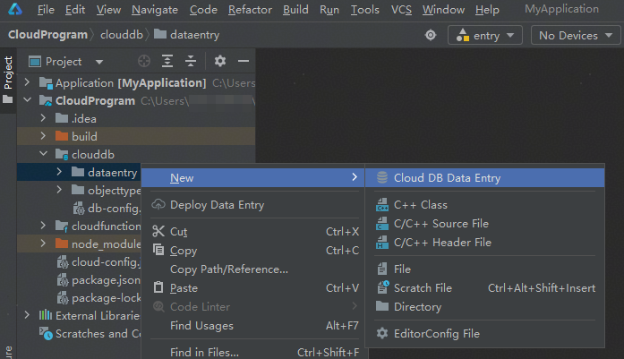
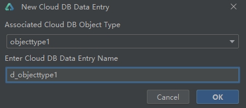
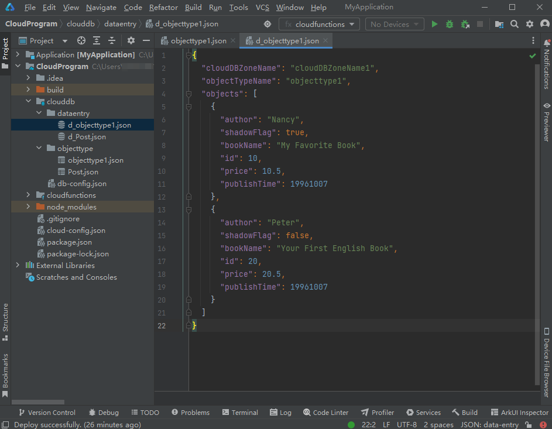
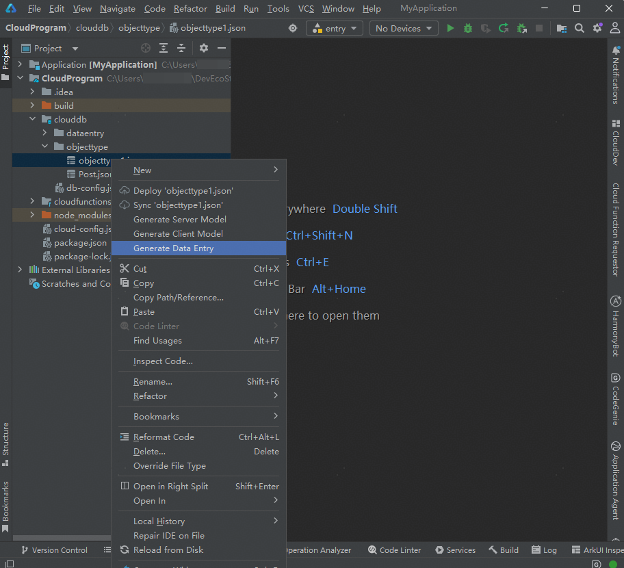
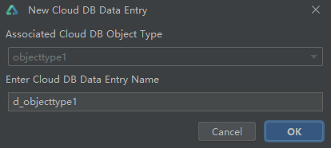
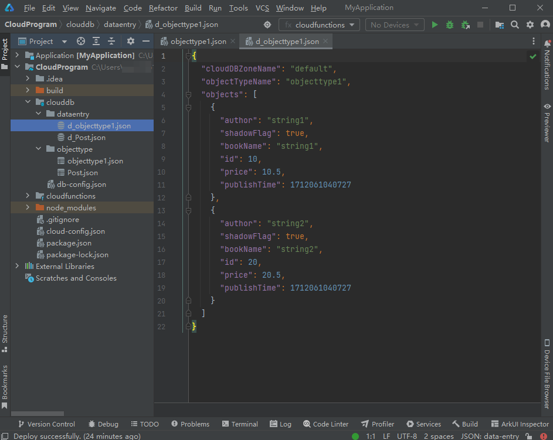

# 添加数据条目

更新时间：2026-01-15 06:51:04

来源：https://developer.huawei.com/consumer/cn/doc/harmonyos-guides/agc-harmonyos-clouddev-dataentry

创建完对象类型后，您可在对象类型内添加数据条目（DataEntry），并配置数据所在的存储区。

 支持手动创建和自动生成数据条目文件。

## 手动创建数据条目文件

右击“clouddb/dataentry”目录，选择“New > Cloud DB Data Entry”。

在“Associated Cloud DB Object Type”栏选择需添加数据条目的对象类型，在“Enter Cloud DB Data Entry Name”栏定义数据条目文件名，完成后点击“OK”。例如，选择刚刚创建的对象类型“objecttype1”，数据条目文件取默认名“d_objecttype1”。

如下图，“clouddb/dataentry”目录下生成并打开新建的数据条目JSON文件“d_objecttype1”，该文件中已为您预置好所属对象类型名称（“objecttype1”）与对象类型的字段名（“id”、“bookName”、“author”、“price”、“publishTime”、“shadowFlag”）。

配置存储区和字段的值（即数据）。“cloudDBZoneName”：配置存储区名称。上图示例中的“default”表示添加数据条目至default存储区。支持修改，如下图“cloudDBZoneName1”。另外，在使用API访问云数据库编码时需要引用该字段。“objects”：配置当前对象类型中所有字段的值，即写入数据。一个对象（object）即为一条数据，您可以通过新建一个对象（object）来为字段赋新值，也可以修改某个对象（object）下字段的值（主键或加密字段的值不支持修改）。如下图，写入了两条数据。
| 字段 | 数据条目1 | 数据条目2 |
| --- | --- | --- |
| author | Nancy | Peter |
| shadowFlag | true | false |
| bookName | My Favorite Book | Your First English Book |
| id | 10 | 20 |
| price | 10.5 | 20.5 |
| publishTime | 19961007 | 19961007 |

## 自动生成数据条目文件

右击对象类型JSON文件，选择“Generate Data Entry”。依旧以对象类型“objecttype1”为例，其包含了“id”、“bookName”、“author”、“price”、“publishTime”、“shadowFlag”六个字段。

在弹出的“New Cloud DB Data Entry”框内，为即将生成的数据条目文件定义名称。此处取默认值“d_objecttype1”为例。

如下图，“clouddb/dataentry”目录下自动为对象类型“objecttype1”生成数据条目文件“d_objecttype1”，该文件中已为您预置好所属对象类型名称（“objecttype1”）与对象类型的字段名（“id”、“bookName”、“author”、“price”、“publishTime”、“shadowFlag”）。

配置存储区和字段的值（即数据）。“cloudDBZoneName”：配置存储区名称。上图示例中的“default”表示添加数据条目至default存储区。支持修改，如下图“cloudDBZoneName1”。另外，在使用API访问云数据库编码时需要引用该字段。“objects”：配置当前对象类型中所有字段的值，即写入数据。一个对象（object）即为一条数据，您可以通过新建一个对象（object）来为字段赋新值，也可以修改某个对象（object）下字段的值（主键或加密字段的值不支持修改）。如下图，写入了两条数据。
| 字段 | 数据条目1 | 数据条目2 |
| --- | --- | --- |
| author | Nancy | Peter |
| shadowFlag | true | false |
| bookName | My Favorite Book | Your First English Book |
| id | 10 | 20 |
| price | 10.5 | 20.5 |
| publishTime | 19961007 | 19961007 |

