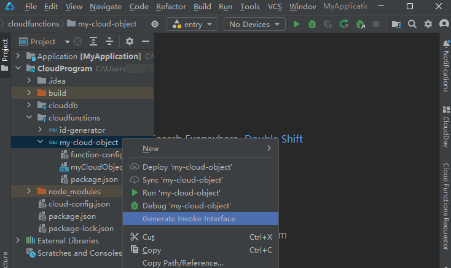
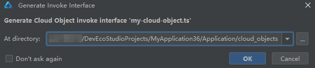
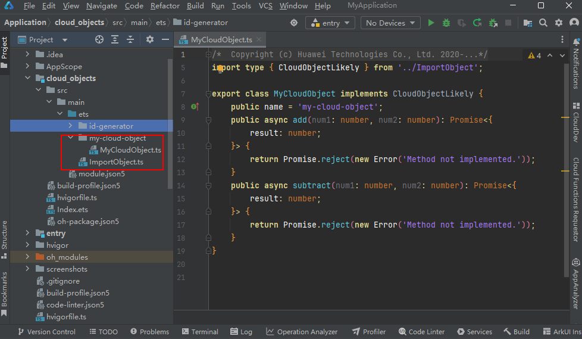
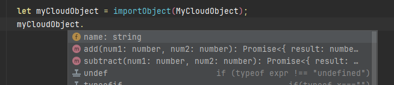

# 在端侧调用云对象

更新时间：2026-01-21 08:03:01

来源：https://developer.huawei.com/consumer/cn/doc/harmonyos-guides/agc-harmonyos-clouddev-invokecloudobj

云对象开发完成后，您可以为其生成端侧调用接口类，供后续端侧工程调用云对象使用。


## 前提条件

请确保[云对象已正确开发并部署](https://developer.huawei.com/consumer/cn/doc/harmonyos-guides/agc-harmonyos-clouddev-deploycloudobj)。

## 操作步骤

右击云对象（以“my-cloud-object”为例），选择“Generate Invoke Interface”。

在弹出的“Generate Invoke Interface”窗口，可以看到生成的端侧调用接口类将默认存储在“Application/cloud_objects”模块目录下，点击“OK”确认。您也可以点击“...”按钮自定义存储目录。

DevEco Studio自动打开指定的端侧调用接口类存储目录，该目录包含“ImportObject.ts”文件和“my-cloud-object”文件夹。“ImportObject.ts”文件：定义了importObject方法，可以通过该方法来实例化一个云对象的代理。“my-cloud-object”文件夹：包含了该云对象在端侧可能用到的所有模型。示例中只有一个“MyCloudObject.ts”文件，如果有其它的模型也将生成在该文件夹下。“MyCloudObject.ts”文件：定义了MyCloudObject class，并且定义了add和subtract两个方法。

在代码文件中引入云对象。
```text
import { MyCloudObject, importObject } from 'cloud_objects';
```

 调用云对象中的方法。
```text
let myCloudObject = importObject(MyCloudObject); // 使用importObject实例化MyCloudObject的代理
myCloudObject.add(1, 2).then(addResult => {
  console.log(`1 + 2 = ${addResult.result}`);
}); // 忽略异常处理
myCloudObject.subtract(6, 3).then(subtractResult => {
  console.log(`6 - 3 = ${subtractResult.result}`);
});
```

由于“Generate Invoke Interface”时已经生成所需要的模型以及importObject方法，因此在编码时可以很方便地使用联想、自动引入等DevEco Studio提供的高阶能力，如下图所示。

