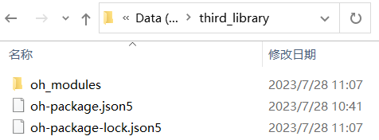

# 离线环境配置指导

更新时间：2026-01-15 06:51:04

来源：https://developer.huawei.com/consumer/cn/doc/harmonyos-guides/ide-no-network

如果开发者所使用的电脑处于完全无网络的离线环境中，需要先在一台可访问网络的电脑上准备好以下文件，将这些文件拷贝到无网络电脑中。


##### 安装hypium

工程模板的工程级oh-package.json5文件中默认配置了hypium依赖，因此需要安装hypium，如果配置了其他依赖，也可参考以下步骤安装。

在可访问网络的电脑上创建一个空文件夹（如命名为third_library），在文件夹中创建一个oh-package.json5文件，配置hypium依赖，配置如下：      
```text
{
  "dependencies": {
    "@ohos/hypium": "1.0.18"
  }
}
```


先配置[环境变量](https://developer.huawei.com/consumer/cn/doc/harmonyos-guides/ide-environment-config#zh-cn_topic_0000001056725590_li1012418311835)，再打开[命令行工具](https://developer.huawei.com/consumer/cn/doc/harmonyos-guides/ide-commandline-get#section21298572437)，执行 ohpm install 命令，会生成oh_modules文件夹和oh-package-lock.json5文件。





将oh_modules文件夹和oh-package-lock.json5文件拷贝到无网络电脑的工程根目录下。

> [!NOTE]
> 有网环境和无网环境下使用的ohpm版本需保持一致，否则可能导致oh-package-lock.json5文件不生效。


##### 安装三方库

通过如下两种方式使用三方库：      
 - 方式一：使用[ohpm-repo](https://developer.huawei.com/consumer/cn/doc/harmonyos-guides/ide-ohpm-repo)搭建私仓，将需要依赖的三方包发布至私仓中，并将[.ohpmrc文件](https://developer.huawei.com/consumer/cn/doc/harmonyos-guides/ide-ohpmrc#zh-cn_topic_0000001792216397_文件)中的registry配置项的值替换为该私仓地址，以此从私仓中获取依赖。
 - 方式二：在可访问网络的电脑上创建一个空文件夹（如命名为third_library），在文件夹中创建一个oh-package.json5文件，设置三方包依赖，配置示例如下：        
```text
{
  "dependencies": {
    "@ohos/hypium": "1.0.17",
    "@ohos/lottie": "^2.0.0" 
  }
}
```
打开命令行工具，执行 ohpm install 命令，会生成oh_modules文件夹和oh-package-lock.json5文件。

  


  将oh_modules文件夹和oh-package-lock.json5文件拷贝到无网络电脑的工程根目录下。

  

 

  使用方法二时，需要确保可访问网络的电脑与无网络电脑中ohpm版本是一致的，以避免因oh-package-lock.json5文件版本不匹配而导致oh-package-lock.json5文件失效的问题。


##### 部署模拟器

请参考[离线部署模拟器](https://developer.huawei.com/consumer/cn/doc/harmonyos-guides/ide-emulator-no-network)。
