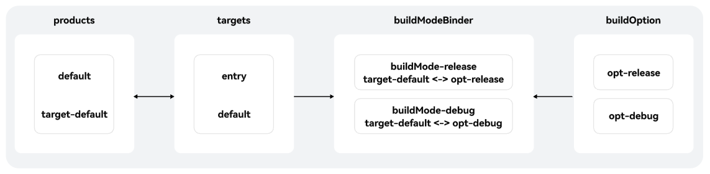
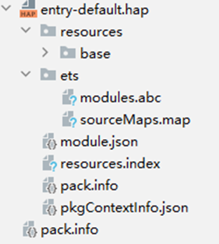
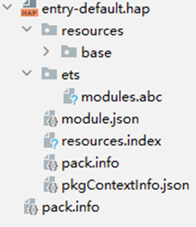

# 实践说明

更新时间：2026-04-30 02:42:31

来源：https://developer.huawei.com/consumer/cn/doc/harmonyos-guides/ide-hvigor-compilation-options-customizing-sample

应用正式对外发布版本前，需要对应用进行代码调试。调试和正式发布版本，两者编译行为可能不同。此时，可以利用buildMode能力，来定制两个版本的编译差异性。
 
假设其中构建产物均为default，但编译行为不同：release模式下使能混淆，debug模式下使能debug调试。
 
示例工程中包含一个模块entry，将entry模块交付到构建产物default中，模块定制两种不同的编译模式debug、release，将两种构建模式均绑定到构建产物default中。工程示例图如下（模块）：
 



 

#### 工程级build-profile.json5示例

```json
{
  "app": {
    "signingConfigs": [],
    "products": [
      {
        "name": "default",
        "signingConfig": "default",
        "compatibleSdkVersion": "6.1.1(24)",
        "runtimeOS": "HarmonyOS",
<span style="color: rgb(135,16,148);">        "buildOption"</span>: {
          <span style="color: rgb(135,16,148);">"strictMode"</span>: {
            <span style="color: rgb(135,16,148);">"caseSensitiveCheck"</span>: <span style="color: rgb(0,51,179);">true</span>,
<span style="color: rgb(135,16,148);">            "useNormalizedOHMUrl"</span>: <span style="color: rgb(0,51,179);">true</span>
          }
        }
      }
    ],
    "buildModeSet": [
      {
        "name": "debug"
      },
      {
        "name": "release"
      }
    ]
  },
  "modules": [
    {
      "name": "entry",
      "srcPath": "./entry",
      "targets": [
        {
          "name": "default",
          "applyToProducts": [
            "default"
          ]
        }
      ]
    }
  ]
}
```
 
 

#### 模块级build-profile.json5示例

 

#### entry模块

```json
{
  "apiType": "stageMode",
  "buildOption": {
  },
  "buildOptionSet": [
    {
      "name": "release",
      "arkOptions": {
        "obfuscation": {
          "ruleOptions": {
            "enable": true,
            "files": [
              "./obfuscation-rules.txt"
            ]
          }
        }
      }
    },
    {
      "name": "debug",
      "debuggable": true,
      "arkOptions": {
        "obfuscation": {
          "ruleOptions": {
            "enable": false
          }
        }
      }
    }
  ],
  "buildModeBinder": [
    {
      "buildModeName": "release",
      "mappings": [
        {
          "buildOptionName": "release",
          "targetName": "default"
        }
      ]
    },
    {
      "buildModeName": "debug",
      "mappings": [
        {
          "buildOptionName": "debug",
          "targetName": "default"
        }
      ]
    }
  ],
  "targets": [
    {
      "name": "default",
    },
    {
      "name": "ohosTest",
    }
  ]
}
```
 
 

#### 指定构建模式

 

#### 命令行

示例1：构建APP时，构建产物为default，指定构建模式为debug，可执行如下命令：
 
```bash
hvigorw --mode project -p product=default -p buildMode=debug assembleApp
```
 
编译产物示例如下：
 



 
示例2：构建APP时，构建产物为default，指定构建模式为release，可执行如下命令：
 
```bash
hvigorw --mode project -p product=default -p buildMode=release assembleApp
```
 
编译产物示例如下：
 



 
 

#### DevEco Studio界面

在DevEco Studio界面进行可视化配置，Build Mode下拉选择对应配置选项debug后，点击Build -> Build Hap(s)/APP(s) -> Build APP(s) ，构建编译模式为debug，构建产物为default的APP包。
 


