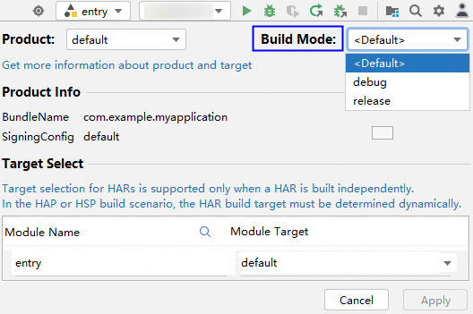

# 能力说明

更新时间：2026-04-20 06:32:02

来源：https://developer.huawei.com/consumer/cn/doc/harmonyos-guides/ide-hvigor-compilation-options-customizing-guide

Hvigor支持灵活定制构建模式，当您创建新工程时，DevEco Studio会自动创建"debug" 、"release"和"test" 构建模式。"test"模式虽然没有出现在工程级build-profile.json5配置文件中，但是利用测试框架开启测试时，会自动使用"test"构建模式。
 

#### 指定构建模式

 

#### 界面设置

DevEco Studio支持界面配置Build Mode配置选项，点击右上角

图标选择构建模式：
 



 
内置三个选项：&lt;Default&gt;，debug，release。
 
如果开发者在build-profile.json5文件中，自定义了其他构建模式，Build Mode配置界面会提供对应选项。
 
- **&lt;Default&gt;**：默认选项，选择此项，构建APP包，使用release构建模式；构建HAP/HSP/HAR包，使用debug构建模式。
- **debug**：构建APP/HAP/HSP/HAR包，均使用debug构建模式，buildOption中的debuggable默认为true。此时的构建产物默认包含大量的调试信息，例如变量名、函数名、行号等，可以直接进行调试。这些调试信息会增加程序的体积，可能导致程序的运行速度降低。
- **release**：构建APP/HAP/HSP/HAR包，均使用release构建模式，buildOption中的debuggable默认为false。此时的构建产物会去掉大量的调试信息，只包含应用程序必要的代码和数据，以减小程序的体积，并且会对编译的字节码进行优化，提高程序的运行速度。

 
> [!WARNING]
> DevEco Studio界面设置或命令行中指定的buildMode构建模式，只代表当前选择的buildMode的名称，最终编译产物是否是Debug应用取决于buildOption配置中的debuggable字段，构建模式使用的具体buildOption配置信息，请参见 模块级buildOption 。 LiteWearable设备使用标准JS运行时，因此对应的应用开发在release模式下的构建产物中包含JS源码，请注意代码资产保护。

 
 

#### 命令行设置

- 使用命令行参数-p buildMode指定构建模式，比如指定"release"模式，构建entry模块的HAP包：
```bash
hvigorw --mode module -p product=default -p module=entry@default -p buildMode=release assembleHap
```

- 使用命令行参数-p debuggable=true指定"debug"构建模式，-p debuggable=false指定"release"构建模式，比如指定"release"模式，构建entry模块的HAP包：
```bash
hvigorw --mode module -p product=default -p module=entry@default -p debuggable=false assembleHap
```


 
 
当未指定构建模式时，构建APP包，默认release模式；构建HAP/HSP/HAR包时，默认debug模式。
 

#### 定制构建模式

Hvigor支持定制构建模式，采用buildOption字段声明编译选项，并通过buildModeBinder来绑定target、 buildOption以及buildMode三者之间的组合关系。
 
 

#### 定义编译选项

**工程级build-profile.json5文件：**
  
| 字段 | 类型 | 是否必填 | 说明 |
| --- | --- | --- | --- |
| buildModeSet | 对象数组 | 否 | 构建模式合集，可配置多个。 |
|    | name | 字符串 | 是 | 构建模式名称。 内置三种类型，此三项无需用户显性配置： debug：开发、调试推荐选项release：打包、发布推荐选项test：运行ohosTest测试套件推荐选项
> [!TIP]
> 1. 项目中全局唯一，不区分大小写 2. 仅允许在工程级build-profile.json5中声明、定义 3. 相同的buildMode会被覆盖，按照配置顺序，后者覆盖前者 4. 三种模式均支持开发者自定义
 |
|    | buildOption | 对象 | 否 | 构建模式使用的具体配置信息，详情请参见工程级buildOption。 |
| products | 对象数组 | 否 | 产品品类，可配置多个。如需配置多个，相关说明请参见配置多目标产物章节。 |
|    | buildOption | 对象 | 否 | 产品的编译构建配置，详情请参见工程级buildOption。 
> [!TIP]
> product的buildOption会对buildMode的buildOption继承覆写，即相同配置项product的优先级更高。
 |
 
 
**模块级build-profile.json5文件：**
 
  
| 字段 | 类型 | 是否必填 | 说明 |
| --- | --- | --- | --- |
| buildOption | 对象 | 否 | 构建模式使用的具体配置信息，详情请参见模块级buildOption，其中不支持配置name、debuggable和copyFrom字段。 |
| buildOptionSet | 对象数组 | 否 | buildOption的集合，定义可用的底层配置选项集。 |
|    | name | 字符串 | 是 | buildOption的名称。 当前模块级build-profile.json5中已有顶层独立的buildOption配置，buildOptionSet优先级比buildOption更高。 
> [!TIP]
> 同模块中唯一，不区分大小写。 相同的名称会被覆盖，按照配置顺序，后者覆盖前者。 内置三种：default、debug、release。
 |
|    | copyFrom | 字符串 | 否 | 配置已定义的buildOption的name，表示从本模块已有的buildOption复制配置，然后再覆写。 
> [!TIP]
> 仅限在同一模块的build-profile.json5中复制。 目标buildOption不存在时，构建告警，回落为从内置的default选项中复制。
 |
| buildModeBinder | 对象数组 | 否 | 为某一buildMode建立target与buildOption之间的映射关系。 |
|    | buildModeName | 字符串 | 是 | 指定待建立映射的buildMode。 
> [!TIP]
> 模块级中无法定义buildMode，此处名称须在工程级的buildModeSet中选取。 对于系统内置的三种buildMode（debug / release / test）, Hvigor会分配默认绑定： debug mode：优先分配debug buildOption，测试包（ohosTest）分配default buildOption。 release mode：优先分配release buildOption，测试包（ohosTest）分配 default buildOption。 test mode：【测试套使用】测试包（ohosTest）分配default buildOption，主包分配debug buildOption。
 |
|    | mappings | 对象数组 | 否 | 绑定target使用的buildOption。 |
|    |    | targetName | 字符串 | 是 | 指定待绑定的target。 
> [!TIP]
> 仅在本模块选择。
 |
|    | buildOptionName | 字符串 | 是 | 指定待绑定的buildOption。 
> [!TIP]
> 仅在本模块选择。
 |
| targets | config | buildOption | 对象 | 否 | 构建模式使用的具体配置信息，详情请参见模块级buildOption，其中不支持配置name、debuggable和copyFrom字段，优先级比buildOptionSet更高。 |
 
 

#### 合并编译选项规则
1. 工程级默认有三种buildMode：debug，release，test。
2. 模块级默认有三种buildOption：default，debug，release。
3. 当buildModeBinder未定义target与buildOption的匹配关系时：
release构建模式：为target匹配release option，但ohosTest分配default option；
4. debug构建模式：为target匹配debug option，但ohosTest分配default option；
5. test构建模式：为target匹配debug option，ohosTest分配default option；
6. 自定义构建模式：所有target均匹配default option。
7. 工程级build-profile.json5中product的buildOption会对buildMode的buildOption继承覆写，即相同配置项product的优先级更高。
8. 模块级别的buildOption作为一个公共配置会被继承到buildOptionSet中的每一个buildOption中，如有copyFrom字段，也是先继承再进行复制，即buildOptionSet优先级比buildOption更高。
9. 根据模块级中的buildModeBinder字段可以找到target对应的唯一buildOption；target中的buildOption优先级更高，采用继承覆盖策略与对应buildOption进行合并。
10. 命令行选项为最高优先级，在已整合的配置项基础上，采用覆写的方式，定点修订。
 
 

#### 编译选项继承覆写关系示意图

优先级：命令行配置>targets配置>buildOptionSet配置>buildOption配置>products配置>buildModeSet配置
 


