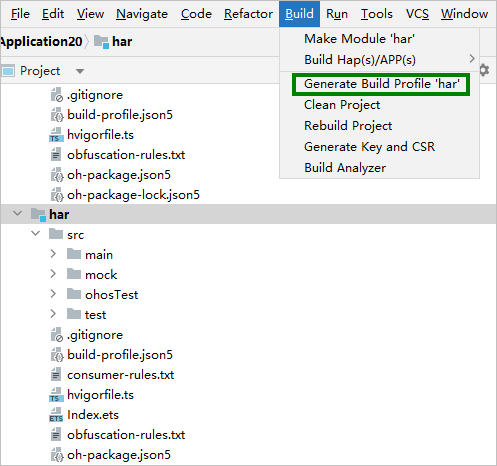
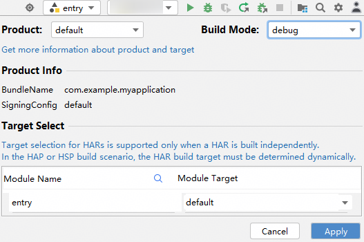
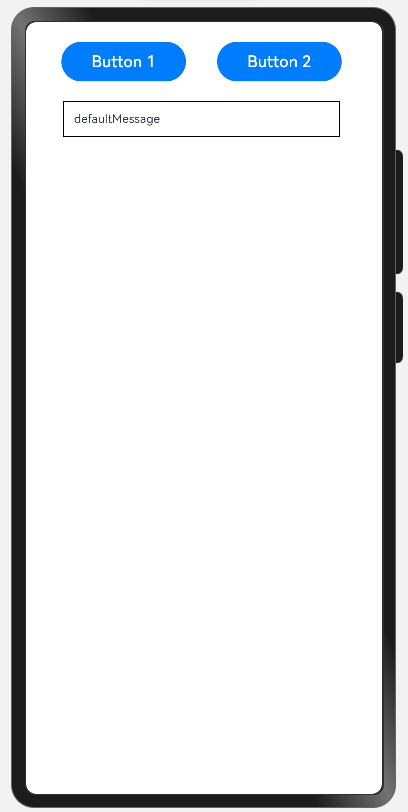
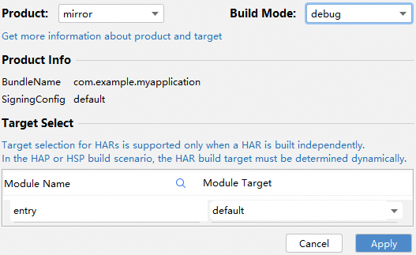
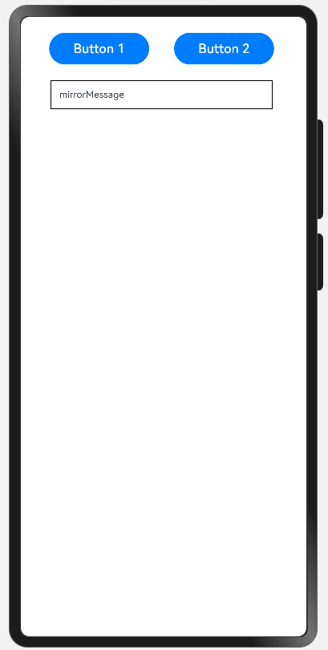
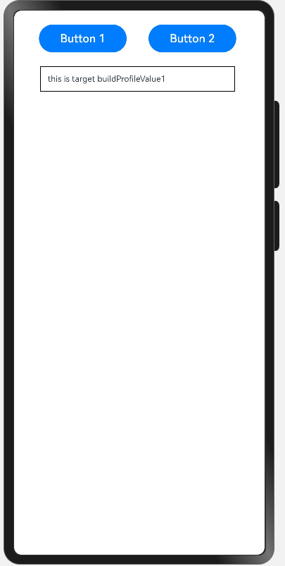
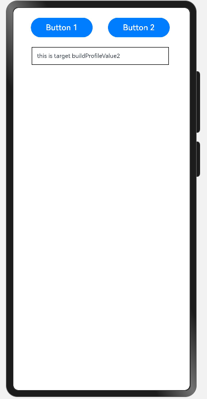

# 实践说明

更新时间：2026-04-30 02:42:31

来源：https://developer.huawei.com/consumer/cn/doc/harmonyos-guides/ide-hvigor-get-build-profile-para-sample

示例：配置工程级和模块级的自定义参数并通过切换product来展示不同的message。


## 新建工程并创建一个har模块

在工程级别的build-profile.json5使用以下配置，目的是为了实现在所有模块中都可以使用到productMessage自定义参数。 通过切换不同的product从而使用到对应的productMessage值。
```text
{
  "app": {
    "products": [
      {
        "name": "default",
        "signingConfig": "default",
        "compatibleSdkVersion": "6.1.1(24)",
        "runtimeOS": "HarmonyOS",
        "buildOption": {
          "arkOptions": {
            // 工程级自定义参数
            "buildProfileFields": {
              "productMessage": 'defaultMessage'
            }
          }
        }
      },
      {
        "name": "mirror",
        "signingConfig": "default",
        "compatibleSdkVersion": "6.1.1(24)",
        "runtimeOS": "HarmonyOS",
        "buildOption": {
          "arkOptions": {
            // 工程级自定义参数
            "buildProfileFields": {
              "productMessage": 'mirrorMessage'
            }
          }
        }
      },
      {
        "name": "product",
        "signingConfig": "default",
        "compatibleSdkVersion": "6.1.1(24)",
        "runtimeOS": "HarmonyOS",
        "buildOption": {
          "arkOptions": {
            // 工程级自定义参数
            "buildProfileFields": {
              "productMessage": 'productMessage'
            }
          }
        }
      }
    ],
    "buildModeSet": [
      {
        "name": "debug",
      },
      {
        "name": "release"
      }
    ]
  },
  "modules": [
    {
      "name": "entry",
      "srcPath": "./entry",
      "targets": [
        {
          "name": "default",
          "applyToProducts": [
            // 关联到多个product
            "default",
            "product",
            "mirror"
          ]
        }
      ]
    },
    {
      "name": "har",
      "srcPath": "./har"
    }
  ]
}
```

 在har模块的build-profile.json5使用以下配置。
```text
{
  "apiType": "stageMode",
  "buildOption": {
    "arkOptions": {
      // har模块的自定义参数
      "buildProfileFields": {
        "targetMessage1": 'this is target buildProfileValue1',
        "targetMessage2": 'this is target buildProfileValue2'
      }
    }
  },
  "buildOptionSet": [
    {
      "name": "release",
      "arkOptions": {
        "obfuscation": {
          "ruleOptions": {
            "enable": true,
            "files": [
              "./obfuscation-rules.txt"
            ]
          },
          "consumerFiles": [
            "./consumer-rules.txt"
          ]
        }
      },
    },
  ],
  "targets": [
    {
      "name": "default"
    }
  ]
}
```

在har模块的MainPage.ets中添加以下代码。
```text
import BuildProfile from "../../../../BuildProfile"

@Preview
@Component
export struct MainPage {
  // 默认赋值为工程级别BuildProfile自定义参数配置的productMessage
  @State message: string = BuildProfile.productMessage
  build() {
    Row() {
      Column() {
        Flex({ direction: FlexDirection.Row, alignItems: ItemAlign.Start, justifyContent: FlexAlign.SpaceAround }) {
          Button("Button 1").width("40%")
            .onClick(() => {
              // 点击展示自定义字段targetMessage1
              this.message = BuildProfile.targetMessage1;
            })
          Button("Button 2").width("40%")
            .onClick(() => {
              // 点击展示自定义字段targetMessage2
              this.message = BuildProfile.targetMessage2;
            })
        }.margin(20)
        .width(315)
        Flex({ direction: FlexDirection.Column, alignItems: ItemAlign.Start, justifyContent: FlexAlign.SpaceBetween }) {
          Text(this.message)
            .textAlign(TextAlign.Start)
            .fontSize(12)
            .border({ width: 1 })
            .padding(10)
            .width('100%')
        }.height(600).width(350).padding({ left: 35, right: 35})
      }
    }
  }
}
```

 在hap的oh-package.json5中引用本地的har模块。
```text
{
  "name": "entry",
  "version": "1.0.0",
  "description": "Please describe the basic information.",
  "main": "",
  "author": "",
  "license": "",
  "dependencies": {
    "har": "file:../har"
  }
}
```

 在hap的Index.ets文件中引用该har包并且使用MainPage方法。
```text
import { MainPage } from "har"

@Entry
@Component
struct Index {
  build() {
    Row() {
      MainPage()
    }
  }
}
```


## 执行预览或签名后推包到设备调试

点击har模块执行以下按钮。

default模式下初始化的message为defaultMessage。


通过切换不同的product可以使用不同的自定义参数用来初始化message。 切换product为mirror。

可以观察到初始化参数为mirrorMessage：

点击不同的Button可以改变message为对应的自定义参数： **图1 **点击Button1**

图2 **点击Button2

