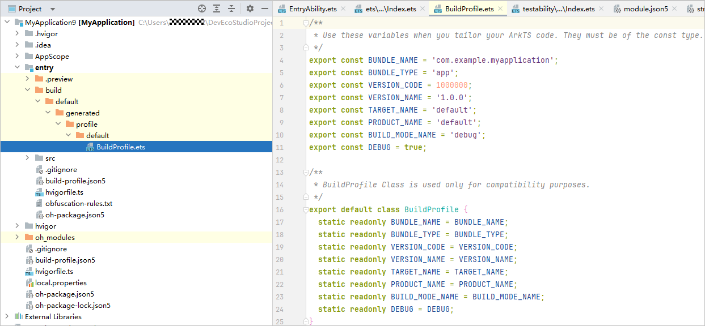

# 能力说明

更新时间：2026-04-30 02:42:31

来源：https://developer.huawei.com/consumer/cn/doc/harmonyos-guides/ide-hvigor-get-build-profile-para-guide

在编译构建时，Hvigor会生成BuildProfile类，开发者可以通过该类在运行时获取编译构建参数，也可以在build-profile.json5中通过buildProfileFields增加自定义字段，从而在运行时获取自定义的参数。
 

##### 使用说明

buildProfileFields的优先级：模块级target > 模块级buildOptionSet > 模块级buildOption > 工程级product > 工程级buildModeSet
 
 

##### HAP/HSP运行时获取编译构建参数

 

##### 生成BuildProfile类文件

当前有以下几种方式可以生成BuildProfile类文件：
 
- 选中需要编译的模块，在菜单栏选择“Build > Generate Build Profile ${moduleName}”。
- 在菜单栏选择“Build > Build Hap(s)/APP(s) > Build Hap(s)”或“Build > Build Hap(s)/APP(s) > Build APP(s)”。
- 在Terminal中执行如下命令：
```bash
hvigorw GenerateBuildProfile
```


 
执行完上述操作后，将在“${moduleName} / build / ${productName} / generated / profile / ${targetName} ”目录下生成BuildProfile.ets文件。示例如下所示：
 



 
 

##### 在代码中获取构建参数

生成BuildProfile类文件后，在代码中可以通过如下方式引入该文件，其中packageName是模块级oh-package.json5文件中name字段对应的值。
```text
import BuildProfile from '${packageName}/BuildProfile';
```
 
 
> [!NOTE]
> 在HSP中使用import BuildProfile from 'BuildProfile'在跨包集成HSP的时候可能会产生编译错误，推荐使用import BuildProfile from '${packageName}/BuildProfile'。

 
通过如下方式获取到构建参数：
 
```text
@State message: string = BuildProfile.BUNDLE_NAME;
```
 
 

##### 默认参数

生成BuildProfile类文件时，Hvigor会根据当前工程构建的配置信息生成一部分默认参数，开发者可以在代码中直接使用。
  
| 参数名 | 类型 | 说明 |
| --- | --- | --- |
| BUNDLE_NAME | string | 应用的Bundle名称。 |
| BUNDLE_TYPE | string | 应用的Bundle类型。 |
| VERSION_CODE | number | 应用的版本号。 |
| VERSION_NAME | string | 应用版本号的文字描述。 |
| TARGET_NAME | string | Target名称。 |
| PRODUCT_NAME | string | Product名称。 |
| BUILD_MODE_NAME | string | 编译模式。 |
| DEBUG | boolean | 应用是否可调试。 |
 
 
 

##### 自定义参数

开发者可以在模块级的build-profile.json5文件中增加自定义参数，在生成BuildProfile类文件后，在代码中使用自定义参数。
 
自定义参数可以在buildOption、buildOptionSet、targets节点下的arkOptions子节点中通过增加buildProfileFields字段实现，自定义参数通过key-value键值对的方式配置，其中value取值仅支持number、string、boolean类型。
 
配置示例如下所示：
 
```json
{
  "apiType": "stageMode",
  "buildOption": {
    "arkOptions": {
      "buildProfileFields": {
        "data": "Data",
      }
    }
  },
  "buildOptionSet": [
    {
      "name": "release",
      "arkOptions": {
        "buildProfileFields": {
          "buildOptionSetData": "BuildOptionSetDataRelease",
          "data": "DataRelease"
        }
      }
    },
    {
      "name": "debug",
      "arkOptions": {
        "buildProfileFields": {
          "buildOptionSetData": "BuildOptionSetDataDebug",
          "data": "DataDebug"
        }
      }
    }
  ],
  "targets": [
    {
      "name": "default",
      "config": {
        "buildOption": {
          "arkOptions": {
            "buildProfileFields": {
              "targetData": "TargetData",
              "data": "DataTargetDefault"
            }
          }
        }
      }
    },
    {
      "name": "default1",
      "config": {
        "buildOption": {
          "arkOptions": {
            "buildProfileFields": {
              "targetData": "TargetData1",
              "data": "DataTargetDefault1"
            }
          }
        }
      }
    },
    {
      "name": "ohosTest",
    }
  ]
}
```
 
 

##### HAR运行时获取编译构建参数

 

##### 生成BuildProfile类文件

当前有以下几种方式可以生成BuildProfile类文件：
 
- 选中需要编译的模块，在菜单栏选择“Build > Generate Build Profile ${moduleName}”。
- 选中需要编译的模块，在菜单栏选择“Build > Make Module ${moduleName}”。
- 在Terminal中执行如下命令：
```bash
hvigorw GenerateBuildProfile
```


 
执行完上述操作后，将在模块根目录下生成BuildProfile.ets文件（该文件可放置在.gitignore文件中进行忽略）。示例如下所示：
 


 
 

##### 在代码中获取构建参数

生成BuildProfile类文件后，在代码中可以通过相对路径引入该文件，如在HAR模块的Index.ets文件中使用该文件：
 
```text
import BuildProfile from './BuildProfile';
```
 
通过如下方式获取到构建参数：
 
```text
const <span style="color: rgb(17,64,142);">HAR_VERSION</span><span style="color: rgb(133,152,1);">: </span><span style="color: rgb(0,0,128);">string </span><span style="color: rgb(133,152,1);">= </span><span style="color: rgb(17,64,142);">BuildProfile</span><span style="color: rgb(133,152,1);">.</span><span style="color: rgb(17,64,142);">HAR_VERSION</span><span style="color: rgb(133,152,1);">;</span>
```
 
 


 

##### 默认参数

生成BuildProfile类文件时，Hvigor会根据当前工程构建的配置信息生成一部分默认参数，开发者可以在代码中直接使用。
  
| 参数名 | 类型 | 说明 |
| --- | --- | --- |
| HAR_VERSION | string | HAR版本号。 |
| BUILD_MODE_NAME | string | 编译模式。 |
| DEBUG | boolean | 应用是否可调试。 |
| TARGET_NAME | string | 目标名称。 |
 
 
 

##### 自定义参数

开发者可以在模块级的build-profile.json5文件中增加自定义参数，在生成BuildProfile类文件后，在代码中使用自定义参数。
 
自定义参数可以在buildOption、buildOptionSet节点下的arkOptions子节点中通过增加buildProfileFields字段实现，自定义参数通过key-value键值对的方式配置，其中value取值仅支持number、string、boolean类型。
 
配置示例如下所示：
 
```json
{
  "apiType": "stageMode",
  "buildOption": {
    "arkOptions": {
      "buildProfileFields": {
        "data": "Data",
      }
    }
  },
  "buildOptionSet": [
    {
      "name": "release",
      "arkOptions": {
        "buildProfileFields": {
          "buildOptionSetData": "BuildOptionSetDataRelease",
          "data": "DataRelease"
        }
      }
    },
    {
      "name": "debug",
      "arkOptions": {
        "buildProfileFields": {
          "buildOptionSetData": "BuildOptionSetDataDebug",
          "data": "DataDebug"
        }
      }
    }
  ],
  "targets": [
    {
      "name": "default",
    }
  ]
}
```
 
 

##### 工程级配置自定义构建参数

开发者可以在工程级的build-profile.json5文件中增加自定义参数，该自定义参数会生成到所有模块的BuildProfile类文件，在代码中使用自定义参数。
 
自定义参数可以在工程级products、buildModeSet中的buildOption节点下的arkOptions子节点中通过增加buildProfileFields字段实现，自定义参数通过key-value键值对的方式配置，其中value取值仅支持number、string、boolean类型。
 
配置示例如下所示：
 
```json
{
  <span style="color: rgb(135,16,148);">"app"</span>: {
    <span style="color: rgb(135,16,148);">"signingConfigs"</span>: [],
    <span style="color: rgb(135,16,148);">"products"</span>: [
      {
        <span style="color: rgb(135,16,148);">"name"</span>: <span style="color: rgb(6,125,23);">"default"</span>,
        <span style="color: rgb(135,16,148);">"signingConfig"</span>: <span style="color: rgb(6,125,23);">"default"</span>,
        <span style="color: rgb(135,16,148);">"compatibleSdkVersion"</span>: <span style="color: rgb(6,125,23);">"6.1.1(24)"</span>,
        <span style="color: rgb(135,16,148);">"runtimeOS"</span>: <span style="color: rgb(6,125,23);">"HarmonyOS"</span>,
        <span style="color: rgb(135,16,148);">"buildOption"</span>: {
          <span style="color: rgb(135,16,148);">"arkOptions"</span>: {
            <span style="color: rgb(135,16,148);">"buildProfileFields"</span>: {
              <span style="color: rgb(135,16,148);">"productValue"</span>: <span style="color: rgb(6,125,23);">"defaultValue"</span>
            }
          }
        }
      }
    ],
    <span style="color: rgb(135,16,148);">"buildModeSet"</span>: [
      {
        <span style="color: rgb(135,16,148);">"name"</span>: <span style="color: rgb(6,125,23);">"debug"</span>,
        <span style="color: rgb(135,16,148);">"buildOption"</span>: {
          <span style="color: rgb(135,16,148);">"arkOptions"</span>: {
            <span style="color: rgb(135,16,148);">"buildProfileFields"</span>: {
              <span style="color: rgb(135,16,148);">"productBuildModeValue"</span>: <span style="color: rgb(6,125,23);">"debugValue"</span>
            }
          }
        }
      },
      {
        <span style="color: rgb(135,16,148);">"name"</span>: <span style="color: rgb(6,125,23);">"release"</span>
      }
    ]
  },
  <span style="color: rgb(135,16,148);">"modules"</span>: [
    {
      <span style="color: rgb(135,16,148);">"name"</span>: <span style="color: rgb(6,125,23);">"entry"</span>,
      <span style="color: rgb(135,16,148);">"srcPath"</span>: <span style="color: rgb(6,125,23);">"./entry"</span>,
      <span style="color: rgb(135,16,148);">"targets"</span>: [
        {
          <span style="color: rgb(135,16,148);">"name"</span>: <span style="color: rgb(6,125,23);">"default"</span>,
          <span style="color: rgb(135,16,148);">"applyToProducts"</span>: [
            <span style="color: rgb(6,125,23);">"default"</span>
          ]
        }
      ]
    }
  ]
}
```
