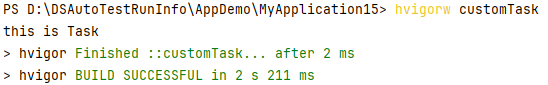

# 开发Hvigor任务

更新时间：2026-04-20 06:32:02

来源：https://developer.huawei.com/consumer/cn/doc/harmonyos-guides/ide-hvigor-task

## 了解任务

任务是Hvigor构建过程中的基本执行单元，通常包含一段可执行代码；一个任务可以依赖其他多个任务。Hvigor任务调度执行时通过解析依赖关系确定任务执行时序。  UP-TO-DATE 任务标识，表示任务未实际执行。Hvigor任务增量跳过机制，在二次执行任务时检测任务输入输出条件未发生变化，则任务跳过执行提高构建效率。 示例：
```text
> hvigor UP-TO-DATE ::PackageApp...
```

Finished 任务执行完成标识，表示任务已执行完成。 示例：
```text
> hvigor Finished ::PackageApp... after 310 ms
```


## 注册任务

使用HvigorNode节点对象注册任务。 编辑工程下hvigorfile.ts文件。
```text
// 导入模块
import { getNode, HvigorNode, HvigorTask } from '@ohos/hvigor';
```

 编写任务代码。
```text
// 获取当前hvigorNode节点对象
const node: HvigorNode = getNode(__filename);

// 注册Task
node.registerTask({
  name: 'customTask',
  run() {
    console.log('this is Task');
  }
});
```

 执行任务。使用hvigor命令行工具执行任务：
```text
hvigorw customTask
```

查看任务执行结果。

