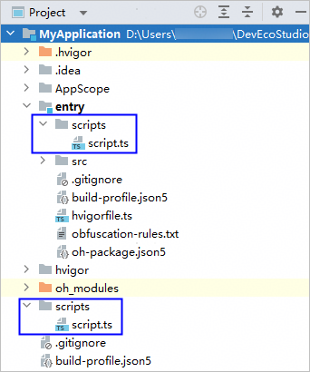
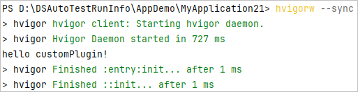
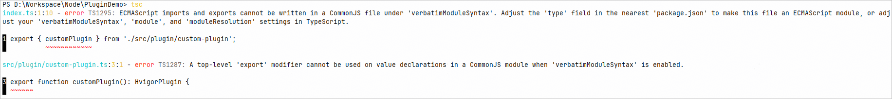

# 开发Hvigor插件

更新时间：2026-04-20 06:32:02

来源：https://developer.huawei.com/consumer/cn/doc/harmonyos-guides/ide-hvigor-plugin

Hvigor允许开发者实现自己的插件，开发者可以定义自己的构建逻辑，并与他人共享。

Hvigor主要提供了两种方式来实现插件：基于hvigorfile脚本开发插件、基于typescript项目开发。

关于插件开发的具体实践请参考[定制hvigor插件开发实践](https://developer.huawei.com/consumer/cn/doc/best-practices/bpta-custom-hvigor-plugin)。


## 基于hvigorfile脚本开发

基于hvigorfile.ts脚本开发的方式，其优点是可实现快速开发，直接编辑工程或模块下hvigorfile.ts即可编写插件代码，不足之处是在多个项目中，无法方便地进行插件代码的复用和共享分发。 从DevEco Studio 6.0.2 Beta1版本开始，在构建脚本中编写代码时，支持代码补全、代码生成、代码重构等代码编辑能力，具体使用方式请参考[代码阅读](https://developer.huawei.com/consumer/cn/doc/harmonyos-guides/ide-editer-overview)、[代码生成/补全](https://developer.huawei.com/consumer/cn/doc/harmonyos-guides/ide-code-completion)、[代码重构](https://developer.huawei.com/consumer/cn/doc/harmonyos-guides/ide-code-refactoring)。 若开发者需要创建新的构建脚本，推荐将这些脚本统一放在工程或模块的scripts目录下，以便与应用代码进行隔离，示例如下。

以工程级hvigorfile.ts脚本为例，开发步骤如下。 导入模块依赖，更多接口请参考[扩展构建API](https://developer.huawei.com/consumer/cn/doc/harmonyos-guides/ide-hvigor-apis)。
```text
// 工程级hvigorfile.ts
import { appTasks } from '@ohos/hvigor-ohos-plugin';
import { HvigorPlugin, HvigorNode } from '@ohos/hvigor';
```

编写插件代码，实现HvigorPlugin接口。
```text
// 工程级hvigorfile.ts
function customPlugin(): HvigorPlugin {
  return {
    pluginId: 'customPlugin',
    apply(node: HvigorNode) {
      // 插件主体
      console.log('hello customPlugin!');
    }
  }
}
```

在导出声明中使用插件。
```text
// 工程级hvigorfile.ts
export default {
  system: appTasks,
  plugins:[
    customPlugin()  // 应用自定义Plugin
  ]
}
```

执行Hvigor命令。 执行Hvigor命令时，在Hvigor生命周期配置阶段执行插件中的apply方法。


## 基于typescript项目开发

基于typescript项目开发较好地弥补了上一小节中使用hvigorfile脚本方式编写插件代码不易复用和共享分发的问题。因此通常情况下推荐此方式开发。

## 初始化typescript项目

创建一个空目录。 在命令行工具中使用cd命令进入空目录下。 安装typescript模块。
```text
// 全局安装TypeScript
npm install typescript -g
```

初始化npm项目。 执行如下命令，根据命令行指示配置项目。初始化完成后会生成package.json文件。
```text
// 初始化一个npm项目
npm init
```

生成typescript配置文件。 执行如下命令生成tsconfig.json文件。
```text
// 初始化typeScript配置文件
tsc --init
```


删除verbatimModuleSyntax字段。 检查tsconfig.json文件是否存在verbatimModuleSyntax字段，如果存在且配置为true，会导致无法使用ESM语法，编译时会报错，因此需要删除该字段。

## 开发插件

配置npm镜像仓库地址，用于安装@ohos/hvigor插件。 在工程目录下创建.npmrc文件，配置如下信息：
```text
registry=https://repo.huaweicloud.com/repository/npm/
@ohos:registry=https://repo.harmonyos.com/npm/
```

添加依赖声明。 打开package.json添加devDependencies配置。
```text
"devDependencies": {
    "@ohos/hvigor": "5.2.2"
}
```

安装依赖。 执行如下命令安装依赖。
```text
npm install
```

编写插件代码。 在src/plugin目录下创建custom-plugin.ts文件，编写插件代码，更多接口请参考[扩展构建API](https://developer.huawei.com/consumer/cn/doc/harmonyos-guides/ide-hvigor-apis)。
```text
import type { HvigorNode, HvigorPlugin } from '@ohos/hvigor';

export function customPlugin(): HvigorPlugin {
  return {
    pluginId: 'customPlugin',
    apply(node: HvigorNode) {
      console.log('hello customPlugin!');
    }
  }
}
```

导出插件。 创建index.ts文件，并在该文件中声明插件方法的导出。由于.ts最终会编译成.js文件，因此需要导出.js文件。
```text
export { customPlugin } from './src/plugin/custom-plugin.js';
```


## 发布插件

typescript项目本质上是一种npm项目，插件发布流程遵循npm发布规范。详情请查询npm官方资料。 发布npm包流程： 配置registry。 打开工程目录下的.npmrc文件，配置您需要发布的镜像仓库。
```text
registry=[npm镜像仓库地址]
```

生成AccessToken。 执行如下命令，注册并登录npm仓库，在工程目录下.npmrc文件中自动生成token信息。
```text
npm login
```

编译npm包。
```text
tsc
```

如果编译时报以下错误，请检查初始化项目时是否[删除了verbatimModuleSyntax](#li88369101451)。

发布npm包。 执行如下命令，将npm项目打包并发布至镜像仓库。
```text
npm publish
```


## 使用插件

添加依赖。 在工程下hvigor/hvigor-config.json5中添加自定义插件依赖，依赖项支持离线插件配置。
```text
"dependencies": {
  "custom-plugin": "1.0.0"   // 添加自定义插件依赖
}
```

安装依赖。 方式1：执行编辑区右上角**Sync**** Now**或执行菜单**File -> Sync and Refresh Project**进行工程Sync后，DevEco Studio将会根据hvigor-config.json5中的依赖配置自动安装。 方式2：使用hvigorw命令行工具执行任一命令，命令行工具会自动执行安装构建依赖。
```text
hvigorw --sync
```

导入插件。 根据插件编写时基于的node节点，确定导入的节点所在的hvigorfile.ts文件，在hvigorfile.ts中导入插件。
```text
import { customPlugin } from 'custom-plugin';
```

使用插件。 将自定义插件添加到export default的plugins中。
```text
export default {
  system: appTasks,  // 以工程级hvigorfile.ts为例
  plugins:[
    customPlugin()  // 应用自定义插件
  ]
}
```
