# 混淆加固

更新时间：2026-05-26 06:48:01

来源：https://developer.huawei.com/consumer/cn/doc/harmonyos-guides/ide-build-obfuscation

DevEco Studio原先默认开启源码混淆功能，会对API 10及以上的Stage工程，且编译模式是release时，自动进行简单的源码混淆，仅对参数名和局部变量名进行混淆。
 
从DevEco Studio NEXT Developer Beta3（5.0.3.600）版本开始，新建工程及模块默认关闭源码混淆功能，如果在模块级build-profile.json5配置文件中开启源码混淆，则混淆规则配置文件obfuscation-rules.txt中默认开启推荐的混淆规则，包含-enable-property-obfuscation、-enable-toplevel-obfuscation、-enable-filename-obfuscation、-enable-export-obfuscation四项混淆项，开发者可进一步在obfuscation-rules.txt文件中选择开启的混淆项，关于混淆项的介绍请查看[混淆规则](https://developer.huawei.com/consumer/cn/doc/harmonyos-guides/source-obfuscation#混淆选项)。
 

##### 使用约束

- 仅支持Stage工程。
- 在[构建模式](https://developer.huawei.com/consumer/cn/doc/harmonyos-guides/ide-hvigor-compilation-options-customizing-guide#section192461528194916)为release模式时生效。
- 模块及模块依赖的HAR和HSP均未关闭混淆。

 
 

##### 字段说明

可在模块级build-profile.json5文件中进行源码混淆相关配置。obfuscation字段说明如下：
  
| 配置项 | 类型 | 是否必填 | 说明 |
| --- | --- | --- | --- |
| ruleOptions | 对象 | 否 | 混淆规则配置。 |
|    | enable | 布尔值 | 是 | 是否启用源码混淆： true：启用。false（默认值）：不启用。 
> [!TIP]
> 从DevEco Studio NEXT Developer Beta3（5.0.3.600）版本开始，默认值由true改为false。
|
|    | files | 字符串数组 | 否 | 配置混淆规则文件的相对路径，默认使用obfuscation-rules.txt文件。文件中配置的混淆规则仅在本模块编译时生效（包含依赖代码）。 
> [!TIP]
> 规则文件中支持配置所有 混淆规则 。 支持配置多个文件，文件名称支持自定义，当存在多个混淆规则文件时，规则合并以及合并后的作用范围可参考 混淆规则合并策略 。
|
| consumerFiles | 字符串/字符串数组 | 否 | 仅HAR/HSP模块可配置，配置传递给集成方的混淆规则文件的相对路径，支持配置多个文件，文件名称支持自定义。 
> [!TIP]
> 为保证HAR/HSP模块可被正确集成使用，若有不希望被集成方混淆的内容，建议在规则文件中配置对应的 保留选项 ，例如HAR/HSP模块中导出的变量或函数。 规则文件中配置的 混淆选项 会与集成方的混淆规则进行合并，进而影响集成方的编译混淆，因此，建议仅配置 保留选项 。 从DevEco Studio 5.1.0 Release版本开始支持在HSP模块中配置该字段。
|
 
 
 

##### 使能混淆

为保护代码资产，建议开启混淆，您可以在模块级的build-profile.json5配置文件中开启源码混淆功能：
 
```json
"arkOptions": {
  "obfuscation": {
    "ruleOptions": {
      "enable": true  // 配置true，即可开启源码混淆功能
    }
  }
}
```
 
从DevEco Studio NEXT Developer Beta3（5.0.3.600）版本开始，开启混淆后，混淆规则配置文件obfuscation-rules.txt中默认开启推荐的混淆规则，包含-enable-property-obfuscation、-enable-toplevel-obfuscation、-enable-filename-obfuscation、-enable-export-obfuscation四项混淆项。
 
> [!NOTE]
> 使用 release模式 编译发布时，建议开启混淆，需要正确配置混淆规则，否则可能会有 运行时问题 。

 
 

##### 使能高阶混淆

在[开启混淆](#section18326541833)后，若您需要更高阶的混淆能力，可以通过以下操作配置高阶混淆规则。
 
 

##### 配置所有混淆规则
1. 打开模块级build-profile.json5文件，在"files"字段下配置混淆规则文件的相对路径，支持配置多个文件，默认为./obfuscation-rules.txt。
```json
{
  "apiType": "stageMode",
  ...
  "buildOptionSet": [
    {
      "name": "release",
      "arkOptions": {
        "obfuscation": {
          "ruleOptions": {
            "enable": true,
            "files": [
              "./obfuscation-rules.txt"  // 混淆规则文件
            ]
          }
        }
      }
    },
  ],
  ...
}
```

2. 打开模块目录内的obfuscation-rules.txt文件配置混淆规则，具体的配置规则请参见[配置混淆规则](https://developer.huawei.com/consumer/cn/doc/harmonyos-guides/source-obfuscation)，对于不需要混淆的内容，请配置[保留选项](https://developer.huawei.com/consumer/cn/doc/harmonyos-guides/source-obfuscation#保留选项)。当存在多个混淆规则文件时，规则合并以及合并后的作用范围可参考[混淆规则合并策略](https://developer.huawei.com/consumer/cn/doc/harmonyos-guides/source-obfuscation#混淆规则合并策略)。

  
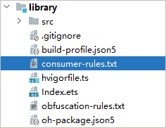

 
 

##### HAR/HSP配置保留选项

为保证HAR/HSP模块可被正确集成使用，若有不希望被集成方混淆的内容，建议在规则文件中配置对应的[保留选项](https://developer.huawei.com/consumer/cn/doc/harmonyos-guides/source-obfuscation#保留选项)，例如HAR/HSP模块中导出的变量或函数。
 1. 打开模块级build-profile.json5文件，在"consumerFiles"字段下配置传递给集成方的混淆规则文件的相对路径，支持配置多个文件，默认为./consumer-rules.txt，对应编译后HAR包中的obfuscation.txt文件。
```json
{
  "apiType": "stageMode",
  ...
  "buildOptionSet": [
    {
      "name": "release",
      "arkOptions": {
        "obfuscation": {
          "ruleOptions": {
            "enable": true,
            "files": [
              "./obfuscation-rules.txt"   
            ]
          },
          "consumerFiles": [              // 该模块被依赖时的混淆规则
            "./consumer-rules.txt"   
          ]
        }
      }
    },
  ],
  ...
}
```

2. 打开模块目录内的consumer-rules.txt文件配置[保留选项](https://developer.huawei.com/consumer/cn/doc/harmonyos-guides/source-obfuscation#保留选项)。当存在多个混淆规则文件时，规则合并以及合并后的作用范围可参考[混淆规则合并策略](https://developer.huawei.com/consumer/cn/doc/harmonyos-guides/source-obfuscation#混淆规则合并策略)。

  
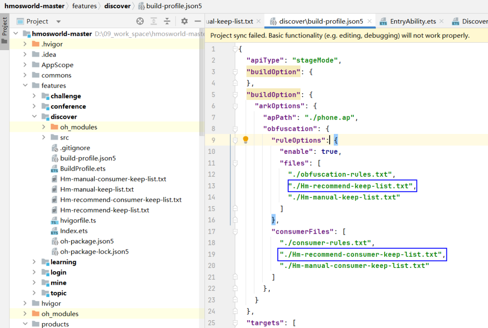

 
 

##### 通过混淆助手配置保留选项

开启混淆后，代码中的方法、属性或路径被混淆，但运行的时候访问的是未混淆的方法、属性或路径，可能导致功能不可用，因此需要将对应的字段配置保留选项。关于保留选项的排查场景及配置方式请参考[保留选项](https://developer.huawei.com/consumer/cn/doc/harmonyos-guides/source-obfuscation#保留选项)。
 
需要排查的场景和配置的字段有很多，因此DevEco Studio提供了混淆助手工具（ObfuscationHelper），可以根据模块和场景对源码进行扫描，快速[识别需要配置的保留选项和白名单字段](#section3989185975217)，开发者可以一键生成白名单混淆规则文件。由于某些场景是动态访问名称、属性，需要在运行的时候才能确定的字段，ObfuscationHelper会识别该类场景，开发者需要根据业务进一步[排查识别白名单后进行配置](#section42331014105310)。
 
 

##### 扫描代码
1. 通过以下任意一种方式打开ObfuscationHelper：
- 点击菜单栏**Tools > ****ObfuscationHelper**。

2. 在模块目录上点击鼠标右键，在弹出的菜单中选择**ObfuscationHelper**。
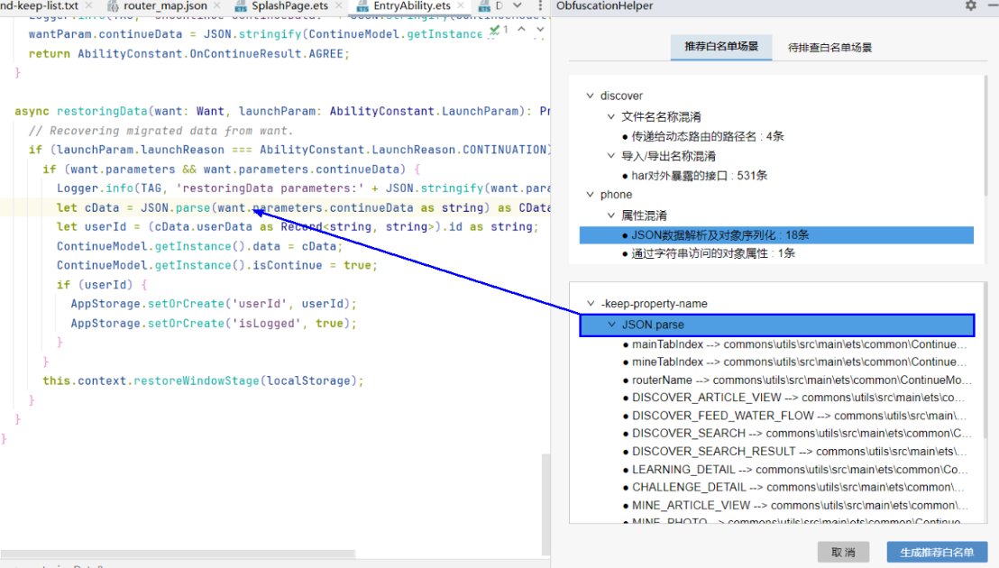


3. 点击模块下拉选择框，选择待扫描的模块。

4. 如果模块之前被扫描过，并且生成了排查白名单，则会生成相应的历史记录。选择对应的历史记录，在本次扫描完成后，会自动关联历史的排查记录，历史已经排查过的白名单字段无需再重复排查。从DevEco Studio 6.0.0 Beta1开始支持关联历史记录。

  
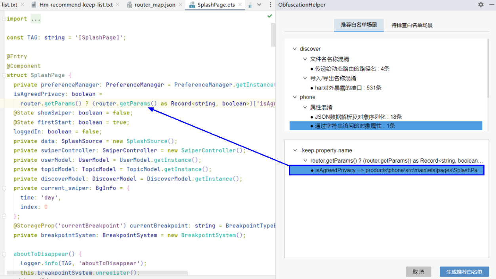


5. 根据涉及的混淆场景，选择一个或多个扫描任务，点击**开始扫描**。关于扫描任务的介绍请参考[扫描任务](#section18125192133818)。
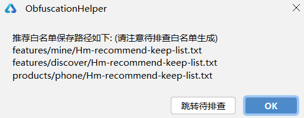


6. 等待扫描成功后，进入[推荐白名单](#section3989185975217)和[待排查白名单](#section42331014105310)配置页面。在扫描的过程中，也可以点击**停止扫描**按钮，结束扫描。
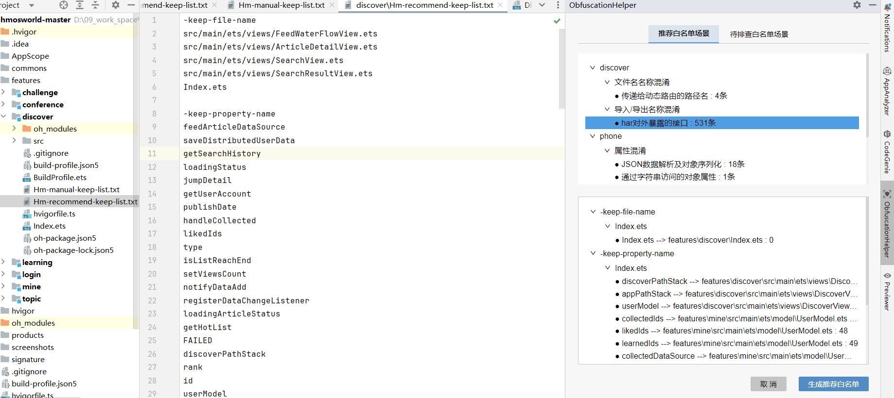


  

  ##### 配置推荐白名单

  在推荐白名单配置页面，可以查看扫描出来的推荐配置的保留选项和白名单字段，并一键生成白名单混淆规则文件。

  
**使用DevEco Studio 6.0.0 Beta1及以上版本，按以下步骤操作：**1. 在页面上方，按照以下的树状结构呈现扫描结果。
```text
模块名
----混淆选项
--------扫描任务：扫描出来推荐配置白名单字段的数量
```
 选中一个扫描任务，在页面下方会按照以下的树状结构，显示推荐的保留选项和白名单字段。

  
```text
保留选项
----关键代码
--------白名单字段 --> 字段所在文件:代码行
```
 
**关键代码**：点击关键代码，可以跳转到代码所在的文件和代码行。
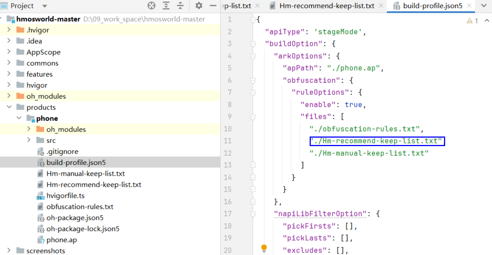


2. **白名单字段**：点击白名单字段，可以跳转到字段所在的文件和代码行。
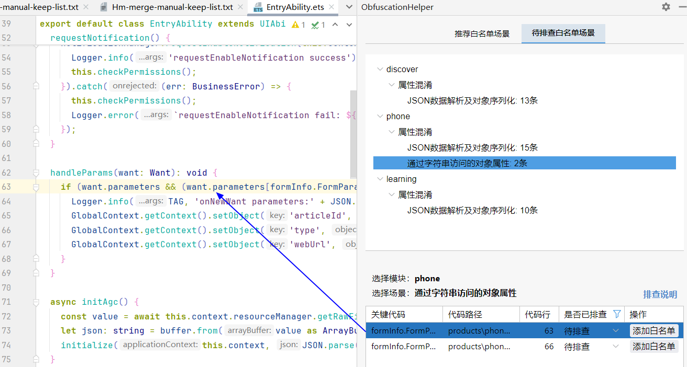


3. 如果需要将白名单文件生成到工程中，可以点击**生成推荐白名单**按钮，ObfuscationHelper会在对应模块下生成推荐白名单文件Hm-recommend-keep-list.txt/Hm-recommend-consumer-keep-list.txt，并提示对应的文件路径。同时在工程根目录下生成对应的白名单Excel表格obfuscation-helper-xxx.xlsx。
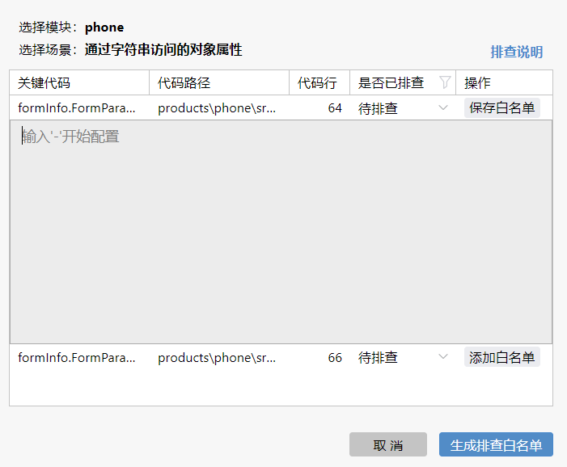


  
点击**OK**，会关闭提示框，停留在推荐白名单场景。

4. 点击**跳转待排查**，会关闭提示框，进入到待排查白名单场景。

5. 在混淆配置中添加白名单文件，有两种方式。
在各模块的build-profile.json5中，将Hm-recommend-keep-list.txt加入到混淆配置files字段下，将Hm-recommend-consumer-keep-list.txt加入到consumerFiles字段下。关于字段的介绍请参考[字段说明](#section88021016154414)。

6. 将合并后的文件Hm-merge-recommend-keep-list.txt配置在entry模块build-profile.json5的files字段下。
- **使用DevEco Studio 6.0.0 Beta1以下版本，按以下步骤操作：**1. 在页面上方，按照以下的树状结构呈现扫描结果。
```text
模块名
----混淆选项
--------扫描任务：扫描出来推荐配置白名单字段的数量
```
 选中一个扫描任务，在页面下方会按照以下的树状结构，显示推荐的保留选项和白名单字段。

  
```text
保留选项
----关键代码
--------白名单字段 --> 字段所在文件:代码行
```
 
**关键代码**：点击关键代码，可以跳转到代码所在的文件和代码行。
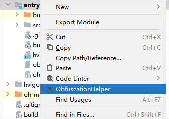


2. **白名单字段**：点击白名单字段，可以跳转到字段所在的文件和代码行。
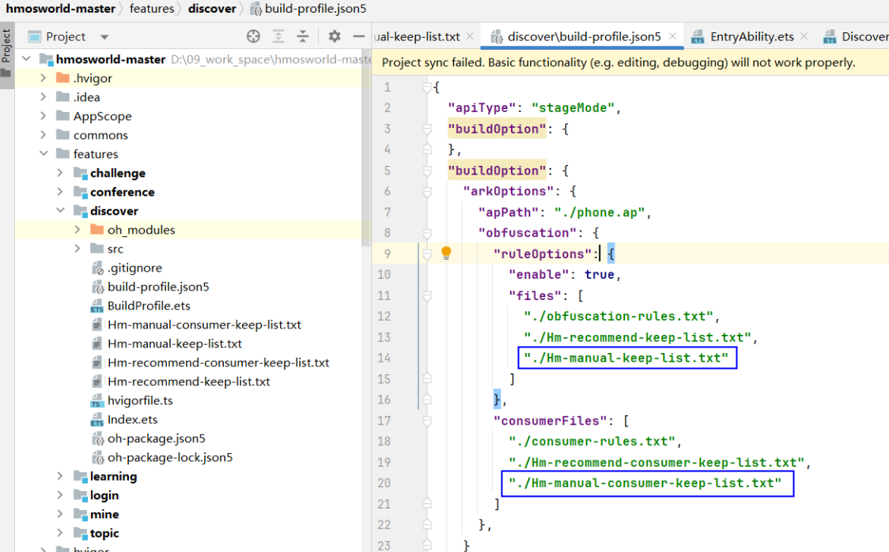


3. 如果需要将白名单文件生成到工程中，可以点击**生成推荐白名单**按钮，ObfuscationHelper会在对应模块下生成Hm-recommend-keep-list.txt文件，并提示对应的文件路径。同时在工程根目录下生成对应的白名单Excel表格obfuscation-helper-xxx.xlsx。
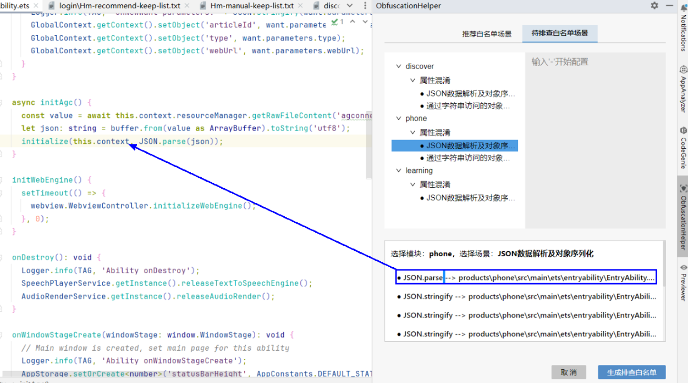


  
点击OK，会关闭提示框，停留在推荐白名单场景。

4. 点击跳转待排查，会关闭提示框，进入到待排查白名单场景。

5. 在模块下的build-profile.json5中，将模块下生成的推荐白名单文件Hm-recommend-keep-list.txt加入到混淆配置files或consumerFiles字段下。关于字段的介绍请参考[字段说明](#section88021016154414)。
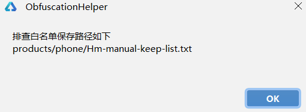


 
 

##### 配置待排查白名单

在待排查白名单配置页面，可以查看扫描出来的关键代码，需要开发者根据业务进一步排查，识别白名单字段并配置到文件中。
 
- **使用DevEco Studio 6.0.0 Beta1及以上版本，按以下步骤操作：**1. 在页面上方，按照以下的树状结构呈现扫描结果。
```text
模块名
----混淆选项
--------扫描任务：扫描出来待排查的关键代码的数量
```
 选中一个扫描任务，在页面下方会显示待排查的代码。点击关键代码，可以跳转到代码所在的文件和代码行。

  
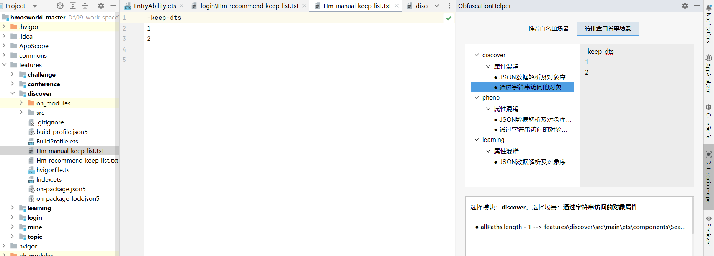


2. 跳转到关键代码后，根据具体场景识别是否需要配置白名单字段，排查方式请参考[扫描任务](#section18125192133818)。
如果排查后不需要配置白名单，点击**待排查**，选择**已排查**，标记该项已经排查。

3. 如果排查后需要配置白名单，点击**添加白名单**，在输入框中输入保留选项和白名单字段，点击**保存白名单**。保存后该排查项会被标记为已排查。

4. 排查完成后，点击**生成排查白名单**按钮，ObfuscationHelper会在对应模块下生成排查白名单文件Hm-manual-keep-list.txt/Hm-manual-consumer-keep-list.txt，并提示对应的文件路径。同时在工程根目录下生成对应的白名单Excel表格obfuscation-helper-xxx.xlsx。
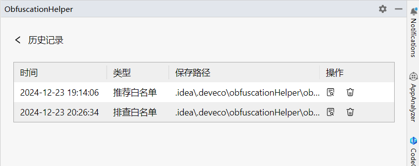


  如果勾选**合并白名单文件**，点击**OK**，会在工程根目录下生成合并后的白名单文件Hm-merge-manual-keep-list.txt，该文件会合并entry模块的Hm-manual-keep-list.txt和所有模块的Hm-manual-consumer-keep-list.txt。

  如以下模块下生成排查白名单文件：

  


5. 在混淆配置中添加白名单文件，有两种方式。
在各模块的build-profile.json5中，将Hm-manual-keep-list.txt加入到混淆配置files字段下，将Hm-manual-consumer-keep-list.txt加入到consumerFiles字段下。关于字段的介绍请参考[字段说明](#section88021016154414)。

6. 将合并后的文件Hm-merge-manual-keep-list.txt配置在entry模块build-profile.json5的files字段下。
- **使用DevEco Studio 6.0.0 Beta1以下版本，按以下步骤操作：**1. 在页面上方，按照以下的树状结构呈现扫描结果。
```text
模块名
----混淆选项
--------扫描任务：扫描出来待排查的关键代码的数量
```
 选中一个扫描任务，在页面下方会按照“关键代码 --> 代码所在文件: 代码行”的结构，显示待排查的代码。点击关键代码，可以跳转到代码所在的文件和代码行。

  
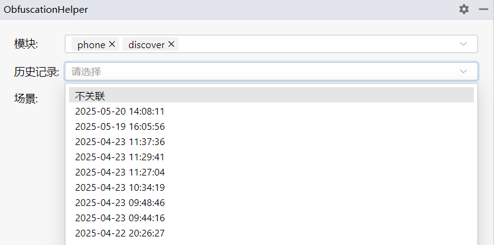


2. 跳转到关键代码后，根据具体场景识别是否需要配置白名单字段，排查方式请参考[扫描任务](#section18125192133818)。如果存在需要配置的字段，在上方的输入框中，输入保留选项和对应的白名单字段。
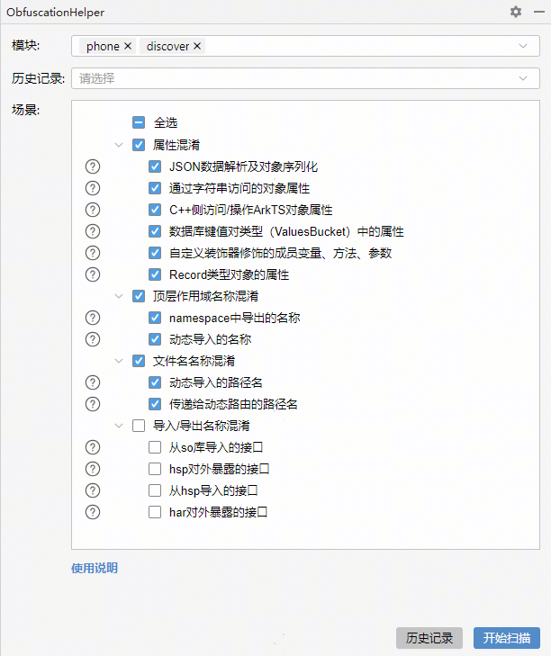


3. 排查完成后，点击**生成排查白名单**按钮，ObfuscationHelper会在对应模块下生成Hm-manual-keep-list.txt文件，并提示对应的文件路径。同时在工程根目录下生成对应的白名单Excel表格obfuscation-helper-xxx.xlsx。
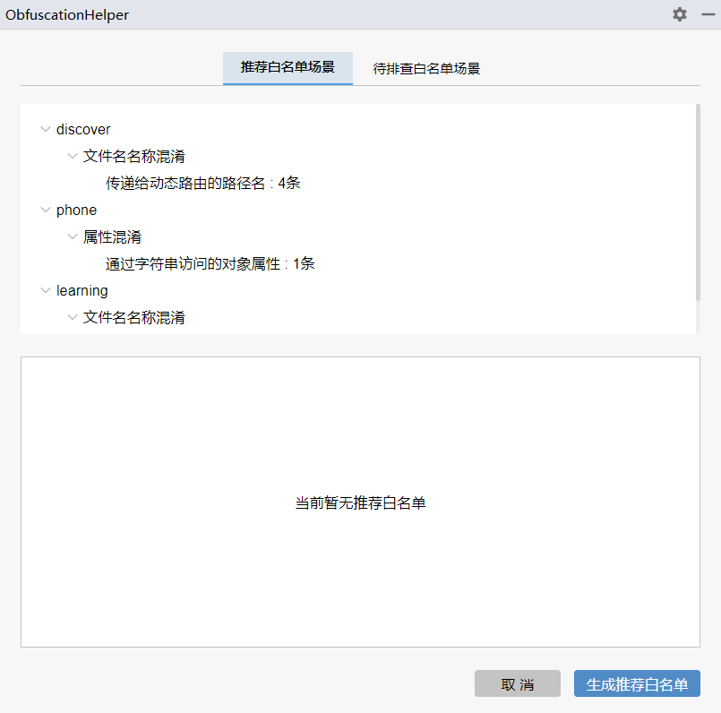


  如以下模块下生成排查白名单文件：

  
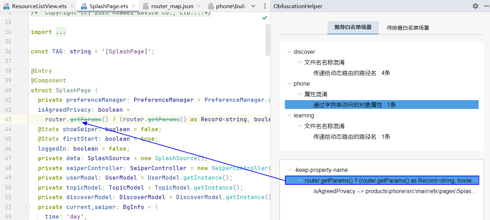


4. 在模块下的build-profile.json5中，将模块下生成的排查白名单文件Hm-manual-keep-list.txt加入到混淆配置files或consumerFiles字段下。关于字段的介绍请参考[字段说明](#section88021016154414)。
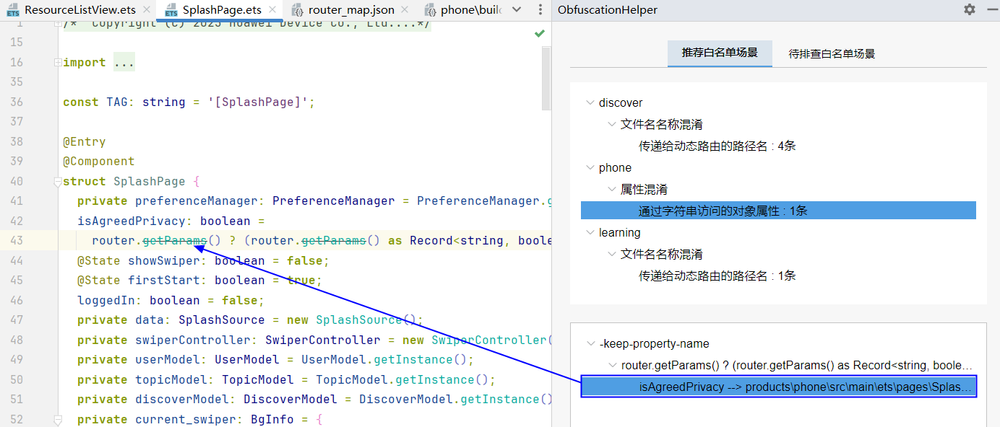


 
 

##### 查看历史记录

点击生成推荐白名单或者待排查白名单后，会生成一条历史记录，方便开发者后续查看和继续排查白名单。
 
在ObfuscationHelper的首页，点击底部的**历史记录**按钮，可查看所有的历史记录。
 

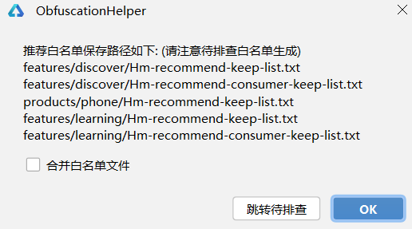

 

 
- 保存路径是历史记录的缓存文件，鼠标悬停在保存路径上，可以查看白名单文件和Excel表格保存的路径。
- 点击查看详情图标
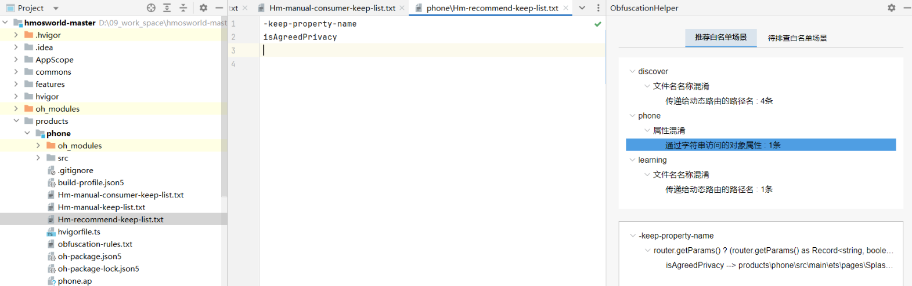
，可以跳转到对应的白名单场景配置页面。
- 点击删除图标，可以删除指定的历史记录，以及对应的缓存文件和Excel表格，但是不会删除白名单文件。

 
 

##### 扫描任务

以下是ObfuscationHelper的扫描任务，关于保留选项的原理介绍和排查场景请参考[混淆规则](https://developer.huawei.com/consumer/cn/doc/harmonyos-guides/source-obfuscation)。
 
**属性混淆**
 
- **JSON数据解析及对象序列化**在使用JSON/ArkTSUtils.ASON进行转换时，对象类型中的属性需要被保留。

  
```json
// JSON.parse
class JSONTest {
  prop1: string = ""
  prop2: number = 0
}
// 示例JSON文件test.json
/*
{
  "prop1": "value",
  "prop2": 10
}
*/
const jsonData = buffer.from(this.context.resourceManager.getRawFileContentSync("test.json")).toString();
let demo: JSONTest = JSON.parse(jsonData)       // JSONTest加入keep-property-name
let demo = JSON.parse(jsonData) as JSONTest     // JSONTest加入keep-property-name
let demo = JSON.parse(jsonData) as ESObject as JSONTest      // JSONTest加入keep-property-name
let demo: ESObject = JSON.parse(jsonData)       // 没有明确类型的，包括(ESObject、Object、object)加入待排查白名单中，需要将jsonData中所有的key，如prop1/prop2加入keep-property-name

// ArkTSUtils.ASON.parse
let demo: JSONTest = ArkTSUtils.ASON.parse(jsonData)      // JSONTest加入keep-property-name
let demo = ArkTSUtils.ASON.parse(jsonData) as JSONTest    // JSONTest加入keep-property-name
let demo = ArkTSUtils.ASON.parse(jsonData) as ESObject as ESObject as JSONTest    // JSONTest加入keep-property-name
let demo: ESObject = ArkTSUtils.ASON.parse(jsonData)      // 没有明确类型的，包括(ESObject、Object、object)加入待排查白名单中，需要将jsonData中所有的key，如prop1/prop2加入keep-property-name

// JSON.stringify
let type = new JSONTest()
let str = JSON.stringify(type)    // JSON.stringify加入待排查白名单，需要将JSONTest中的所有属性加入-keep-property-name

// ArkTSUtils.ASON.stringify
let type = new JSONTest()
let str = ArkTSUtils.ASON.stringify(type)  // ArkTSUtils.ASON.stringify加入待排查白名单，需要将JSONTest中的所有属性加入-keep-property-name
```

- **通过字符串访问的对象属性**通过中括号形式访问的对象属性，以及Object.defineProperty/Object.defineProperties/Object.getOwnPropertyDescriptor接口中的属性需要被保留。

  
```text
// 通过中括号形式访问的属性如obj['name']，如果name是变量，加入待排查白名单，需要将name对应的内容加入-keep-property-name
Object.defineProperty(obj, 'y', {})   // 如果y是变量，加入待排查白名单，需要将y对应的内容加入-keep-property-name
Object.defineProperties(obj, {        // 属性prop1/prop2加入推荐白名单-keep-property-name
  prop1: {
    value: 'Hello',
    writable: true,
    enumerable: true,
    configurable: true
  },
  prop2: {
    value: 'Hello',
    writable: true,
    enumerable: true,
    configurable: true
  } 
});
Object.getOwnPropertyDescriptor(obj, 'bbb');    // 如果bbb是变量，加入待排查白名单，需要将bbb对应的内容加入-keep-property-name
obj.s=0; let key='s'; obj[key]    // key是变量，加入待排查白名单，需要将key对应的内容s加入keep-property-name
```

- **C++侧访问/操作ArkTS对象属性**开发者需要根据C++接口来排查与其相关的ArkTS中的属性字符串，并手动加入白名单中，涉及的C++接口参考[使用Node-API接口设置ArkTS对象的属性](https://developer.huawei.com/consumer/cn/doc/harmonyos-guides/use-napi-about-property)。

  
```ArkTS
//index.ets
func() {
  let obj: NapiTestClassObj = { napiTestClassObjData: 0, napiTestClassObjMessage: "hello world" };
  let result: ESObject = testNapi.setProperty(obj, "napiTestClassObjMessage", "100");    // 根据napi_set_property接口排查到ArkTS中的属性napiTestClassObjMessage被修改，需要将napiTestClassObjMessage加入-keep-property-name白名单
  if (obj.napiTestClassObjMessage === "100") {
    console.log("setProperty success");
    return true;
  }
  return false;
}
//napi_init.cpp
static napi_value SetProperty(napi_env env, napi_callback_info info) {
    size_t argc = 3;
    napi_value args[3];
    napi_status status = napi_get_cb_info(env, info, &argc, args, nullptr, nullptr);
    if (status != napi_ok) {
        napi_throw_error(env, nullptr, "Node-API napi_get_cb_info fail");
    }
    status = napi_set_property(env, args[0], args[1], args[2]);    // 扫描napi_set_property关键API
    if (status != napi_ok) {
        napi_throw_error(env, nullptr, "Node-API napi_set_property fail");
        return nullptr;
    }
    return args[0];
}
```

- **数据库键值对类型（ValuesBucket）中的属性**数据库键值对类型（ValuesBucket）中的属性需要被保留。

  
```text
const valueBucket: ValuesBucket = {
  'ID1': ID1,    // ID1、NAME1、AGE1、SALARY1加入到-keep-property-name
  'NAME1': name,
  'AGE1': age,
  'SALARY1': salary
};
```

- **自定义装饰器修饰的成员变量、方法、参数**自定义装饰器修饰的成员变量、方法、参数，需要排查是否加入白名单。

  
```text
function logClass(target: any) {
  console.log('类被创建：', target);    // MyClass未参与混淆，因此被@logClass修饰的类名不需要加入白名单
  return target;
}
export function logMethod(target: any, methodName: string, descriptor: PropertyDescriptor) {
  const originalMethod = descriptor.value;
  descriptor.value = function (...args: any[]) {
   if(methodName === 'myMethod'){    // methodName会被混淆，与'myMethod'作比较不符合预期，因此被@logMethod修饰的方法名myMethod需要加入白名单
      console.log('调用myMethod方法')
    }
    console.log(`方法 ${methodName} 即将被调用，参数为：`, args);
    const result = originalMethod.apply(this, args);
    console.log(`方法 ${methodName} 调用完毕，结果为：`, result);
    return result;
  };
  return descriptor;
}
function logProperty(target: any, propertyName: string) {
  let value;
  const getter = function () {
    console.log(`正在获取属性 ${propertyName}`);   // propertyName会被混淆，但不影响运行结果，不需要加入白名单
    return value;
  };
  const setter = function (newValue: any) {
    console.log(`正在设置属性 ${propertyName}，新值为：${newValue}`);
    value = newValue;
  };
  Object.defineProperty(target, propertyName, {
    get: getter,
    set: setter,
    enumerable: true,
    configurable: true
  });
  return;
}
@logClass
class MyClass {    // 自定义装饰器修饰的类名，需要排查MyClass是否加入白名单
  @logProperty
  myProperty: number;    // 自定义装饰器修饰的属性，需要排查myProperty是否加入白名单
  constructor() {
    this.myProperty = 10;
  }
  @abcd
  @logMethod
  myMethod(arg1: number, arg2: number) {    // 自定义装饰器修饰的方法，需要排查myMethod是否加入白名单
    return arg1 + arg2;
  }
}
```

- **Record类型对象的属性**Record类型对象的属性需要被保留。该场景从DevEco Studio 6.0.1 Beta1版本开始支持。

  
```text
// 支持扫描的场景
export function hello() {
  const person: Record<string, Object> = {
    ddName: 'zhangsan',    // Record类型对象person的属性ddName、ggAge、isWfStudent，加入到-keep-property-name
    ggAge: 25,
    isWfStudent: true
  }
  person.wwArea = '112';     // 通过点语法新增的属性wwArea，加入到-keep-property-name
  return person;
}
// 不支持扫描的场景
// 1、调用该方法获取Record类型对象，通过点语法添加sssd属性不支持扫描，该属性会被混淆
let ret = hello();
ret.sssd = '1111';
// 2、隐式Record类型的对象parameters的属性a123、b123不支持扫描，会被混淆
export function sendPost3() {
  const want: Want = {
    action: 'ohos.want.action.viewData',
    entities: ['entity.system.browsable'],
    uri: '123',
    parameters: {
      a123: 1,
      b123: 2
    }
  };
}
```


 
**顶层作用域名称混淆**
 
- **namespace中导出的名称**namespace中导出的名称、嵌套namespace中导出的名称都需要被保留。

  
```text
export namespace namespace1 {
  export class namespace1Class1 {      // namespace1Class1加入推荐白名单-keep-global-name
  }
  export namespace namespace1_1 {      // namespace1_1加入推荐白名单-keep-global-name
    export let namespace1Property1_1: string = '111';      // namespace1Property1_1加入推荐白名单-keep-global-name
    export function namespace1Func1_1() {      // namespace1Func1_1加入推荐白名单-keep-global-name
      console.log('namespace1Func1_1 execute success');
    }
    export class namespaceClass1_1{      // namespaceClass1_1加入推荐白名单-keep-global-name
      func(){
        console.log(""namespaceClass1_1 success"")
      }
    }
  }
}
```

- **动态导入的名称**动态导入的接口名、属性名和类名，需要被保留。该场景从DevEco Studio 6.0.0 Beta2版本开始支持。

  
```ArkTS
// 导入模块后，使用的类名TestClass加入推荐白名单keep-global-name
try {
  let test = (await import('../model/TestClass')).TestClass
  console.warn(TAG, 'test = ', test);
  // console.warn(TAG, 'test TestClass = ', test.);
  console.warn(TAG, 'test staticGlsAdd = ', test.staticGlsAdd(5, 6));
} catch (e) {
  console.warn(TAG, `error = ${e}`);
}
// 导入模块后，使用的方法名componentClass加入推荐白名单keep-global-name
let util = await import('harlibrary/src/main/ets/utils/Util');
try {
    console.warn(TAG, 'util = ', util);
    console.warn(TAG, 'call util function = ', await util.componentClass());
} catch (e) {
    console.warn(TAG, `error = ${e}`);
}
// 导入模块后，使用default后调用的方法warn加入推荐白名单keep-global-name
import('hsplibrary/src/main/ets/utils/Logger').then(logger => {
    try {
    console.warn(TAG, 'import Logger success.');
    logger.default.warn('this is logger warn')
    } catch (e) {
    console.warn(TAG, `error = ${e}`);
    }
})
// 将动态导入封装为方法，导出的类实例如果是变量，加入待排查白名单，需要排查后将变量对应的值加入keep-global-name
public static importFile<T>(modulePath: string, resultClassName: string) {
    return import(modulePath).then((ns: ESObject) => {
      let res: T = new ns[resultClassName]();   // 该行加入待排查白名单，排查后将resultClassName对应的值TestClass加入keep-global-name
      return res;
    }).catch((err: Error) => {
      console.warn('chisj debug: importFile error = ', err);
      return undefined;
    });
  }
// Index.ets
let modulePath = '../model/TestClass';
let className = 'TestClass';
ImportUtil.importFile<ESObject>(modulePath, className).then((ns:ESObject) => {
    try {
    console.warn(TAG, 'import importFile success')
    console.warn(TAG, 'ns = ', ns)
    console.warn(TAG, 'calcAdd = ', ns?.calcAdd(1, 2));
    } catch (e) {
    console.warn(TAG, `error = ${e}`);
    }
})
// 将动态导入封装为方法，导出的模块myModule调用的方法Calc加入推荐白名单
// ImportUtil.ts
export function dynamicImport<T>(modulePath: string): Promise<T> {
  return import(modulePath).then(module => {
    // 有些模块可能有默认导出，这里处理一下
    return module.default || module as T;
  });
}
// Index.ets
const myModule = await dynamicImport<typeof import('harlibrary')>('harlibrary');
console.warn(TAG, '1 calc = ', myModule.Calc(1, 2))
```


 
**文件名名称混淆**
 
- **动态导入的路径名**模块下build-profile.json5文件中，sources字段对应的路径名需要被保留。

  
```json
// 模块级build-profile.json5
{
  "apiType": "stageMode",
  "buildOption": {
    "arkOptions": {"runtimeOnly": {"sources": ["./aaa/bbb", "./ccc/dddd"]}}  //./aaa/bbb和./ccc/dddd加入keep-file-name
  },
  "buildOptionSet": [
    {
      "name": "release",
      "arkOptions": {
        "runtimeOnly": {"sources": ["./e/f", "./g/h"]},  // ./e/f和./g/h加入keep-file-name
        "obfuscation": {
          "ruleOptions": {
            "enable": true,
            "files": [
              "./obfuscation-rules.txt"
            ]
          }
        }
      },
    },
  ],
......
}
```

- **传递给动态路由的路径名**模块下resources/base/profile/route_map.json中，pageSourceFile字段对应的路径名需要被保留。

  
```ArkTS
// 模块下resources/base/profile/route_map.json文件
{
  "routerMap": [
    {
      "name": "PageOne",
      "pageSourceFile": "src/main/ets/pages/directory/PageOne.ets",  // src/main/ets/pages/directory/PageOne.ets加入keep-file-name
      "buildFunction": "PageOneBuilder",
      "data": {
        "description" : "this is PageOne"
      }
    }
  ]
}
```


 
**导入/导出名称混淆**
 
- **从so库导入的接口**从so库中导入的接口及其点式调用的属性，需要被保留。DevEco Studio 6.1.1 Release之前的版本，仅支持扫描src/main/cpp/lib{模块名}/Index.d.ts中导出的方法。

  
```text
import testNapi from "xxxx.so"    // testNapi加入keep-global-name
import {testNapi} from "xxxx.so"  // testNapi加入keep-global-name
import {testNapi as napi} from "xxxx.so"    // testNapi加入keep-global-name
testNapi.add()    // add加入-keep-property-name
```

- **hsp对外暴露的接口**

  hsp的入口文件(一般为index.ets)中导出的接口名及其属性名，需要被保留。
```ArkTS
// 导出的常量
export const LOCAL_NUM = 100  // LOCAL_NUM加入keep-global-name
// 导出的方法
export function harFun() {    // harFun加入keep-global-name
}
// 导出的类名及其属性(包括该类的父类和属性)，如果属性也是一个类，该类也需要以同样的方式保留。
class FatherClass {
  prop4: string = "bbb"
}
class SubClass {
  prop3: string = "bbb"
}
export class HSPClass extends FatherClass{    // 类名称HSPClass加入到-keep-global-name
  prop1: string = "aaa" 
  prop2: SubClass = new SubClass()    // 属性prop1,prop2,prop3,prop4加入到-keep-property-name
}

// 导出的namespace，包括其中的方法、常量、类(保留方式同上)、子namespace
export namespace NmSpace {
  export const NUM_NAME_SPACE = 100   // 常量NUM_NAME_SPACE加入-keep-global-name
  export class classNameSpace {       // 类名称classNameSpace加入-keep-global-name
     prop: string = "bbb"             // 类属性prop加入-keep-property-name
  }
  export function funNameSpace() {    // 方法funNameSpace加入-keep-global-name
  }
}
// 将入口文件相对路径,如 ./index.ets加入keep保留选项。
// 将入口文件名如index.ets加入keep-file-name保留选项。
```

- **从hsp导入的接口**从hsp中导入的接口及其点式调用的属性，需要被保留。

  
```text
import MyClass1 from "xxxx"     // MyClass1加入keep-global-name
import {MyClass2} from "xxxx"   // MyClass2加入keep-global-name
import {MyClass3 as MyClass} from "xxxx"    // MyClass3加入keep-global-name
MyClass1.add()    // add加入keep-property-name
```

- **har对外暴露的接口**参考[hsp对外暴露的接口](#li15198347161014)。

  仅当hap->hsp->har，同时hap->har时，该har会被扫描，其中->表示依赖关系。

  

