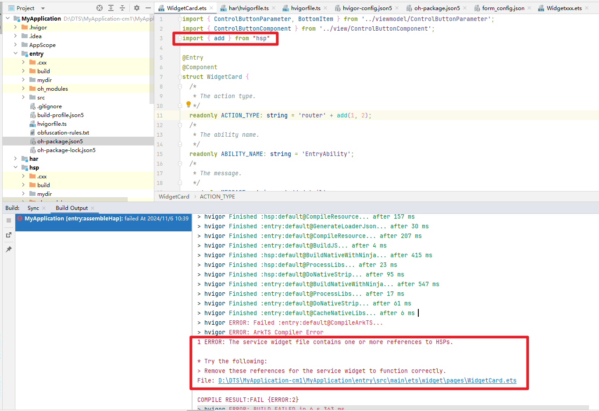

# 版本说明

更新时间：2026-04-30 02:42:31

来源：https://developer.huawei.com/consumer/cn/doc/harmonyos-guides/ide-hvigor-releasenote

## DevEco Studio 6.1.0 Beta1

Hvigor支持可视化查看和执行任务。具体请参考[任务可视化与执行](https://developer.huawei.com/consumer/cn/doc/harmonyos-guides/ide-task-visualization)。 工程级build-profile.json5文件的packOptions下新增enableIncrementalSoCompress字段，用于构建HAP/HSP时，指定是否开启增量压缩，复用上一次构建已经压缩好的so，加快打包速度。具体请参考[工程级build-profile.json5文件](https://developer.huawei.com/consumer/cn/doc/harmonyos-guides/ide-hvigor-build-profile-app)。 模块级build-profile.json5文件的resOptions下新增qualifiersConfig字段，用于配置HAP/HSP模块的限定词目录，编译时会进行过滤，匹配到的限定词目录会被打包到产物中。具体请参考[模块级build-profile.json5文件](https://developer.huawei.com/consumer/cn/doc/harmonyos-guides/ide-hvigor-build-profile)。

## DevEco Studio 6.0.2 Beta1

hvigor-config.json5文件新增parameterFile字段，用于在编译构建时开启参数化配置功能。具体请参考[parameterFile](https://developer.huawei.com/consumer/cn/doc/harmonyos-guides/ide-hvigor-set-options#section24539147532)。 hvigor-config.json5文件的properties下新增ohos.defaults.autoLazyImport字段，用于指定编译时是否自动将符合lazy-import语法规范的import语句添加"lazy"关键字，同时支持通过命令行参数-c或--config配置该字段。具体请参考[hvigor-config.json5文件](https://developer.huawei.com/consumer/cn/doc/harmonyos-guides/ide-hvigor-set-options)。 工程级build-profile.json5文件的packOptions下新增appWithSignedPkg字段，用于指定构建APP时，除了默认的app包之外，是否额外生成产物名称带all的app包，app包里的hap和hsp都是签名的包。具体请参考[工程级build-profile.json5文件](https://developer.huawei.com/consumer/cn/doc/harmonyos-guides/ide-hvigor-build-profile-app)。 工程级build-profile.json5文件的strictMode下新增disableSendableCheckRules字段，用于指定需要关闭校验的Sendable规则。具体请参考[工程级build-profile.json5文件](https://developer.huawei.com/consumer/cn/doc/harmonyos-guides/ide-hvigor-build-profile-app)。 在DevEco Studio中单独构建HAR模块时，支持指定target。具体请参考[定制HAR多目标构建产物](https://developer.huawei.com/consumer/cn/doc/harmonyos-guides/ide-customized-multi-targets-and-products-guides#section173102213445)。

## DevEco Studio 6.0.1 Beta1

hvigor-config.json5文件的properties下新增ohos.defaults.release.cmakebuildtype字段，用于在release模式下构建时，指定cmake构建类型。具体请参考[hvigor-config.json5文件](https://developer.huawei.com/consumer/cn/doc/harmonyos-guides/ide-hvigor-set-options)。 工程级build-profile.json5的packOptions下新增deduplicateHar，resOptions下新增idDefinedFilePath字段，用于构建APP/HAP/HSP时，当HAP/HSP依赖相同的HAR时，指定是否去除HSP中重复的HAR，减少包体积。具体请参考[工程级build-profile.json5文件](https://developer.huawei.com/consumer/cn/doc/harmonyos-guides/ide-hvigor-build-profile-app)。 工程级build-profile.json5的strictMode下新增enableStrictCheckOHModule字段，用于调用远程HAR/HSP包中的方法时，指定是否严格校验传入参数的类型。具体请参考[工程级build-profile.json5文件](https://developer.huawei.com/consumer/cn/doc/harmonyos-guides/ide-hvigor-build-profile-app)。 工程级、模块级build-profile.json5的arkOptions下新增autoLazyFilter字段，用于自定义添加"lazy"关键字的模块。具体请参考[工程级build-profile.json5文件](https://developer.huawei.com/consumer/cn/doc/harmonyos-guides/ide-hvigor-build-profile-app)和[模块级build-profile.json5文件](https://developer.huawei.com/consumer/cn/doc/harmonyos-guides/ide-hvigor-build-profile)。 DevEco Studio新增一个开关，用于提升C++增量编译效率。具体请参考[通过IClang提升C++增量编译效率](https://developer.huawei.com/consumer/cn/doc/harmonyos-guides/ide-hvigor-experimental-properties#section324586847)。

## DevEco Studio 6.0.0 Beta3

DevEco Studio的Settings界面新增一个开关，用于优化增量编译速度。具体请参考[增量判断模块级跳过](https://developer.huawei.com/consumer/cn/doc/harmonyos-guides/ide-hvigor-experimental-properties#section730523404612)。 工程级、模块级build-profile.json5的buildOption/arkOptions下新增expandImportPath对象，用于配置import路径展开相关能力，提升应用的运行时性能。具体请参考[工程级build-profile.json5文件](https://developer.huawei.com/consumer/cn/doc/harmonyos-guides/ide-hvigor-build-profile-app)和[模块级build-profile.json5文件](https://developer.huawei.com/consumer/cn/doc/harmonyos-guides/ide-hvigor-build-profile)。 工程级build-profile.json5的buildOption下新增preloadSystemSo字段，用于指定是否收集应用入口所使用的系统so，收集的系统so会在应用冷启动时进行预加载，优化应用的冷启动性能。具体请参考[工程级build-profile.json5文件](https://developer.huawei.com/consumer/cn/doc/harmonyos-guides/ide-hvigor-build-profile-app)。 Hvigor新增线程池相关API，用于向线程池提交并执行worker。具体请参考[submitWorker](https://developer.huawei.com/consumer/cn/doc/harmonyos-guides/ide-hvigor-api#section94763341419)。 Hvigor新增获取SDK相关信息的API。具体请参考[getSdkDetails](https://developer.huawei.com/consumer/cn/doc/harmonyos-guides/ide-build-expanding-context#section085712212299)。

## DevEco Studio 6.0.0 Beta2

## 新增特性

工程级、模块级build-profile.json5新增以下字段。具体请参考[工程级build-profile.json5文件](https://developer.huawei.com/consumer/cn/doc/harmonyos-guides/ide-hvigor-build-profile-app)和[模块级build-profile.json5文件](https://developer.huawei.com/consumer/cn/doc/harmonyos-guides/ide-hvigor-build-profile)。 buildOption/resOptions下新增excludeHarRes，用于编译HAP/HSP模块时，指定不参与资源编译的三方HAR包的包名，配置后，依赖HAR包中的资源不会被打包到产物中。 buildOption/resOptions下新增includeAppScopeRes，用于编译HSP时，指定是否将AppScope目录下的资源打包到产物中。 buildOption/resOptions/copyCodeResource下新增includes，用于指定打包的资源文件，其他资源文件均不会打包到产物中，支持glob语法。 模块级build-profile.json5新增excludePackages，用于编译HAP/HSP模块时，指定不参与变量动态import的源码HAR的包名，配置的源码HAR不会参与编译，支持直接/间接依赖。具体请参考[模块级build-profile.json5文件](https://developer.huawei.com/consumer/cn/doc/harmonyos-guides/ide-hvigor-build-profile)。 工程级、模块级build-profile.json5的buildOption/nativeLib/filter/select下新增includePattern、excludePattern字段，用于选择打包或排除的native产物，支持glob语法。具体请参考[配置CPP](https://developer.huawei.com/consumer/cn/doc/harmonyos-guides/ide-hvigor-cpp)。 hvigor-config.json5文件properties下新增以下字段。具体请参考[hvigor-config.json5文件](https://developer.huawei.com/consumer/cn/doc/harmonyos-guides/ide-hvigor-set-options)。 新增ohos.arkCompile.writeRollupCache，用于指定build目录下是否写入rollup缓存。 新增ohos.align.deviceTypes，用于指定归一的设备类型，构建APP时，当HAP/HSP的module.json5中的设备类型是ohos.align.deviceTypes的超集时，模块才会被打包到APP中。 Hvigor的API dependencies、postDependencies支持依赖其他模块的任务，在任务前加上“模块名:”即可。具体请参考[基础构建能力](https://developer.huawei.com/consumer/cn/doc/harmonyos-guides/ide-hvigor-api)。

## 变更特性

新建工程或模块时，模块级build-profile.json5的buildOption/resOptions/copyCodeResource下默认配置enable字段并且值为false，即默认不打包src/main/ets目录下的资源文件。

## DevEco Studio 6.0.0 Beta1

## 新增特性

hvigor-config.json5文件的properties下新增以下字段。具体请参考[hvigor-config.json5文件](https://developer.huawei.com/consumer/cn/doc/harmonyos-guides/ide-hvigor-set-options)。 新增ohos.rollupCache.usePathPlaceholder字段，用于指定是否将build目录下rollup缓存中的绝对路径替换为占位符。 新增ohos.rollupCache.useSourceHash字段，用于指定是否将build目录下rollup缓存中的源码替换为对应的hash内容，减少缓存大小。 工程级和模块级build-profile.json5文件buildOption/arkOptions下新增skipOhModulesLint字段，用于指定是否跳过工程中oh_modules目录的[ArkTS规则检查](https://developer.huawei.com/consumer/cn/doc/harmonyos-guides/typescript-to-arkts-migration-guide)。具体请参考[工程级build-profile.json5文件](https://developer.huawei.com/consumer/cn/doc/harmonyos-guides/ide-hvigor-build-profile-app)和[模块级build-profile.json5文件](https://developer.huawei.com/consumer/cn/doc/harmonyos-guides/ide-hvigor-build-profile)。 Build Analyzer构建分析新增支持超精细化模式，与advanced模式相比，在ArkTS编译阶段记录更详细的打点数据，但开启后可能导致编译构建时间更长。具体请参考[设置构建分析模式](https://developer.huawei.com/consumer/cn/doc/harmonyos-guides/ide-hvigor-build-analyzer#section207890565217)和[hvigorw](https://developer.huawei.com/consumer/cn/doc/harmonyos-guides/ide-hvigor-commandline)。

## 变更特性

**ArkTS日志位置调整** 升级到DevEco Studio 6.0.0 Beta1及以上版本，ArkTS日志位置变更如下。
| 场景 | hvigor日志参数 | 输出位置 | ArkTS的日志信息（变更前） | ArkTS的日志信息（变更后） |
| --- | --- | --- | --- | --- |
| ArkTS报错 | --info | stdout | null | info |
| stderr | info、warn、error | warn、error |  |  |
| --warn | stdout | null | null |  |
| stderr | info、warn、error | warn、error |  |  |
| --error | stdout | null | null |  |
| stderr | info、warn、error | error |  |  |
| 编译成功 | --info | stdout | info、warn | info |
| stderr | error | warn、error |  |  |

**变更影响** 通过hvigor-config.json5文件的[level](https://developer.huawei.com/consumer/cn/doc/harmonyos-guides/ide-hvigor-set-options#section85176471028)字段指定日志级别，或通过[命令行方式](https://developer.huawei.com/consumer/cn/doc/harmonyos-guides/ide-hvigor-commandline#section682961710111)指定日志级别，不同的日志级别打印的信息变化如下： ArkTS报错场景： --info：info日志的输出位置从stderr移动到stdout。 --warn：不再打印info日志。 --error：不再打印info、warn日志。 编译成功场景： ArkTS的warn日志从stdout移动到stderr。 **适配指导** 根据上面表格找到变更后的日志位置进行适配。

## DevEco Studio 5.1.1 Release

hvigor-config.json5文件的execution下新增optimizationStrategy字段，用于指定构建模式。同时命令行参数支持--optimization-strategy=performance/memory。具体请参考[hvigor-config.json5文件](https://developer.huawei.com/consumer/cn/doc/harmonyos-guides/ide-hvigor-set-options)和[hvigorw](https://developer.huawei.com/consumer/cn/doc/harmonyos-guides/ide-hvigor-commandline)。 新建Native C++工程默认使用毕昇编译器，打开历史工程会弹窗提示，点击**立即体验**可以切换使用毕昇编译器。

## DevEco Studio 5.1.1 Beta1

工程级、模块级build-profile.json5新增以下字段。具体请参考[工程级build-profile.json5文件](https://developer.huawei.com/consumer/cn/doc/harmonyos-guides/ide-hvigor-build-profile-app)和[模块级build-profile.json5文件](https://developer.huawei.com/consumer/cn/doc/harmonyos-guides/ide-hvigor-build-profile)。 buildOption下新增generateSharedTgz，用于指定编译HSP模块时是否生成tgz包。 buildOption/resOptions下新增ignoreResourcePattern，用于对资源目录resources或开发者自定义的资源目录下的文件/文件夹名称进行过滤，匹配到的文件不会被打包到产物中。 hvigor-config.json5的properties下新增以下字段。具体请参考[hvigor-config.json5文件](https://developer.huawei.com/consumer/cn/doc/harmonyos-guides/ide-hvigor-set-options)。 新增ohos.byteCodeHar.integratedOptimization，用于指定是否开启字节码HAR集成行为优化。 新增hvigor.incremental.optimization，用于指定是否开启任务增量判断优化。 新增hvigor.task.schedule.optimization，用于指定是否开启任务调度优化。 Build Analyzer支持查看构建过程的内存消耗情况。具体请参考[查看构建过程内存消耗曲线图](https://developer.huawei.com/consumer/cn/doc/harmonyos-guides/ide-hvigor-build-analyzer#section71431248981)。

## DevEco Studio 5.1.0 Release

OhosHapContext、OhosHspContext、OhosHarContext新增getBuildMode接口，用于获取当前构建指定的BuildMode。具体请参考[插件上下文](https://developer.huawei.com/consumer/cn/doc/harmonyos-guides/ide-build-expanding-context#section122861615474)。 hvigor-config.json5中nodeOptions下新增maxSemiSpaceSize字段，同时hvigorw命令行工具新增参数--max-semi-space-size，用于设置daemon进程新生代内存最大的半空间大小。具体请参考[hvigor-config.json5文件](https://developer.huawei.com/consumer/cn/doc/harmonyos-guides/ide-hvigor-set-options)和[hvigorw](https://developer.huawei.com/consumer/cn/doc/harmonyos-guides/ide-hvigor-commandline#section101034488138)。 hvigor-config.json5的properties下新增以下字段。具体请参考[hvigor-config.json5文件](https://developer.huawei.com/consumer/cn/doc/harmonyos-guides/ide-hvigor-set-options)。 新增ohos.har.excludeHspDependencies，用于构建har包时，指定产物module.json中是否排除依赖的hsp。 新增ohos.obfuscationRules.optimization，用于在release模式开启混淆时，指定是否优化三方依赖中混淆配置文件的收集方式，优化后可以减少收集耗时，加快编译速度。 HSP模块的build-profile.json5文件中obfuscation下新增consumerFiles字段，用于配置传递给集成方的混淆规则文件的相对路径。具体请参考[混淆加固](https://developer.huawei.com/consumer/cn/doc/harmonyos-guides/ide-build-obfuscation)。 HAR模块的build-profile.json5文件新增以下字段。具体请参考[模块级build-profile.json5文件](https://developer.huawei.com/consumer/cn/doc/harmonyos-guides/ide-hvigor-build-profile)。 buildOption下新增packingOptions/asset对象，用于自定义打包到产物中的文件或目录。 buildOption/arkOptions下新增packSourceMap，用于编译字节码HAR时，指定是否将sourceMap文件打包到产物中。 工程级build-profile.json5中buildOption/arkOptions/tscConfig下新增maxFlowDepth字段，用于设置最大递归深度。具体请参考[工程级build-profile.json5文件](https://developer.huawei.com/consumer/cn/doc/harmonyos-guides/ide-hvigor-build-profile-app)。 工程级和模块级build-profile.json5文件的buildOption/resOptions下新增resCompileThreads字段，用于指定资源编译的线程数量。具体请参考[工程级build-profile.json5文件](https://developer.huawei.com/consumer/cn/doc/harmonyos-guides/ide-hvigor-build-profile-app)和[模块级build-profile.json5文件](https://developer.huawei.com/consumer/cn/doc/harmonyos-guides/ide-hvigor-build-profile)。 hvigorw命令行工具新增任务buildInfo，用于打印工程级或模块级build-profile.json5中的配置信息。具体请参考[公共命令](https://developer.huawei.com/consumer/cn/doc/harmonyos-guides/ide-hvigor-commandline#section25791735141720)。 hvigorw部分命令支持在任意目录下执行，无需切换到工程根目录。具体请参考[命令行使用方式](https://developer.huawei.com/consumer/cn/doc/harmonyos-guides/ide-hvigor-commandline#section10533193217911)。 编译构建新增错误码。具体请参考[编译构建错误码](https://developer.huawei.com/consumer/cn/doc/harmonyos-guides/ide-hvigor-errorcode)。

## DevEco Studio 5.0.5 Release

hvigor-config.json5文件的properties下新增ohos.uiTransform.Optimization字段，用于指定是否对ArkTS编译转换后的产物中的bundleName字段开启优化，开启后，bundleName字段的值是变量。具体请参考[hvigor-config.json5文件](https://developer.huawei.com/consumer/cn/doc/harmonyos-guides/ide-hvigor-set-options)。 工程级和模块级build-profile.json5文件buildOption/arkOptions下新增reExportCheckMode，用于指定以下场景，编译时是否进行拦截报错：使用lazy import导入的变量，在同文件中被再次导出。具体请参考[工程级build-profile.json5文件](https://developer.huawei.com/consumer/cn/doc/harmonyos-guides/ide-hvigor-build-profile-app)和[模块级build-profile.json5文件](https://developer.huawei.com/consumer/cn/doc/harmonyos-guides/ide-hvigor-build-profile)。

## DevEco Studio 5.0.3 Release

工程级和HAR模块的build-profile.json5中buildOption/arkOptions下新增branchElimination字段，用于指定是否启用代码分支裁剪，减少编译产物大小，开启后，在release编译模式下，不会被执行到的代码分支会被裁剪掉。具体请参考[工程级build-profile.json5文件](https://developer.huawei.com/consumer/cn/doc/harmonyos-guides/ide-hvigor-build-profile-app)和[模块级build-profile.json5文件](https://developer.huawei.com/consumer/cn/doc/harmonyos-guides/ide-hvigor-build-profile)。 工程级、模块级build-profile.json5中新增以下参数。具体请参考[工程级build-profile.json5文件](https://developer.huawei.com/consumer/cn/doc/harmonyos-guides/ide-hvigor-build-profile-app)和[模块级build-profile.json5文件](https://developer.huawei.com/consumer/cn/doc/harmonyos-guides/ide-hvigor-build-profile)。 buildOption下新增removePermissions数组，用于指定编译时需要删除的依赖包中的冗余权限，模块本身的权限不会被删除，仅对HAP/HSP模块生效。 buildOption/resOptions下新增copyCodeResource对象，用于指定是否将src/main/ets目录下的资源文件（非源码文件）打包到产物中，支持根据glob语法排除匹配到的文件，匹配到的文件不会被打包到产物中。 hvigor-config.json5的properties下新增ohos.arkCompile.emptyBundleName字段，用于指定编译后的产物，bundleName字段是否为空值。具体请参考[hvigor-config.json5文件](https://developer.huawei.com/consumer/cn/doc/harmonyos-guides/ide-hvigor-set-options)。

## DevEco Studio 5.0.2 Release

hvigor-config.json5新增以下字段。具体可参考[hvigor-config.json5文件](https://developer.huawei.com/consumer/cn/doc/harmonyos-guides/ide-hvigor-set-options)。 properties下新增ohos.collect.debugSymbol字段，用于指定是否将sourceMap、nameCache和带调试信息的so文件归档到产物路径下。 新增javaOptions/Xmx字段，用于设置JVM最大堆内存，单位为MB，默认为512MB。 工程级和模块级build-profile.json5文件新增以下字段。具体可参考[工程级build-profile.json5文件](https://developer.huawei.com/consumer/cn/doc/harmonyos-guides/ide-hvigor-build-profile-app)和[模块级build-profile.json5文件](https://developer.huawei.com/consumer/cn/doc/harmonyos-guides/ide-hvigor-build-profile)。 buildOption/nativeLib下新增excludeSoFromInterfaceHar字段，用于指定编译HSP模块时，打包的HAR产物是否排除so文件，减少.tgz包体积大小。 buildOption/arkOptions下新增autoLazyImport字段，用于指定编译时是否自动将符合lazy-import语法规范的import语句添加"lazy"关键字。 BuildAnalyzer新增支持导入report.json文件，查看历史或其他工程的构建日志。具体请参考[导入日志](https://developer.huawei.com/consumer/cn/doc/harmonyos-guides/ide-hvigor-build-analyzer#section26761217305)。

## DevEco Studio 5.0.2 Beta1

## 变更特性

**编译构建对签名配置的name字段增加非空字符串校验** 升级到DevEco Studio 5.0.2 Beta1及以上版本，工程级build-profile.json5文件中signingConfigs下的name字段不允许为空字符串。 **变更影响** 如果历史工程的工程级build-profile.json5文件中signingConfigs下的name字段为空字符串，编译时会报错。

**适配指导** 将signingConfigs下的name字段配置为非空字符串。

## DevEco Studio 5.0.1 Release

## 新增特性

hvigor-config.json5中properties下新增ohos.arkCompile.noEmitJs字段，用于指定ArkTS编译过程中是否生成js中间产物，不生成js中间产物可以降低编译过程的峰值内存，加快编译速度。具体请参考[hvigor-config.json5文件](https://developer.huawei.com/consumer/cn/doc/harmonyos-guides/ide-hvigor-set-options)。 hvigor新增以下API。具体可参考[插件上下文](https://developer.huawei.com/consumer/cn/doc/harmonyos-guides/ide-build-expanding-context)和[基础构建能力](https://developer.huawei.com/consumer/cn/doc/harmonyos-guides/ide-hvigor-api)。 getOverrides：获取工程下oh-package.json5中配置的overrides字段。 setOverrides：设置工程下oh-package.json5中的overrides字段。 setProperty：设置hvigor-config.json5配置文件中properties对象指定key值的value值。 hvigorw命令行工具支持--max-old-space-size参数，用于设置守护进程内存大小。具体可参考[设置守护进程内存](https://developer.huawei.com/consumer/cn/doc/harmonyos-guides/ide-hvigor-daemon#section327617383145)和[hvigorw](https://developer.huawei.com/consumer/cn/doc/harmonyos-guides/ide-hvigor-commandline#section101034488138)。

## 变更特性

**编译构建对卡片引用HSP增加校验** 升级到DevEco Studio 5.0.1 Release及以上版本，Form卡片直接或间接引用HSP的场景，编译构建会报错。 **变更影响** 如果历史工程使用了Form卡片并且在卡片页面文件（form_config.json文件src字段对应的值）中直接或间接引用了HSP模块，则编译会报错，并提示相关文件。

**适配指导** 根据报错提示的信息，找到直接或间接引用HSP的卡片文件，将对应的HSP模块移除，并修改为引用HAR模块的方式。

## DevEco Studio 5.0.0 Release

hvigor-config.json5文件新增ohos.nativeResolver字段，用于指定ArkTS编译过程中是否使用高性能插件进行依赖寻址，使用高性能插件可以降低编译过程的峰值内存，加快编译速度。具体可参考[hvigor-config.json5文件](https://developer.huawei.com/consumer/cn/doc/harmonyos-guides/ide-hvigor-set-options)。 hvigor新增获取远程hsp路径的API：getOhpmRemoteHspDependencyInfo。具体请参考[插件上下文](https://developer.huawei.com/consumer/cn/doc/harmonyos-guides/ide-build-expanding-context)。 支持通过Build Analyzer工具可视化分析排查构建过程中的性能问题。具体请参考[分析构建过程](https://developer.huawei.com/consumer/cn/doc/harmonyos-guides/ide-hvigor-build-analyzer)。 支持开发者自定义Hvigor任务和插件。具体请参考[扩展构建](https://developer.huawei.com/consumer/cn/doc/harmonyos-guides/ide-build-expanding)。 提供hvigor生命周期的hook，便于开发者使用hook在生命周期中按需进行逻辑处理。具体可供开发者使用的hook请参考[构建生命周期](https://developer.huawei.com/consumer/cn/doc/harmonyos-guides/ide-hvigor-life-cycle)。 新增运行时获取编译构建参数的功能。具体请参考[获取自定义编译参数](https://developer.huawei.com/consumer/cn/doc/harmonyos-guides/ide-hvigor-get-build-profile-para)。 hvigor-config.json5新增以下字段。具体可参考[hvigor-config.json5文件](https://developer.huawei.com/consumer/cn/doc/harmonyos-guides/ide-hvigor-set-options)。 properties下新增ohos.fallback.target字段，当找不到指定target时，如果模块中存在该fallback target，则使用fallback target进行构建。 properties下新增hvigor.memoryThreshold字段，当编译构建占用内存超过此阈值时，新加入的编译任务会等待，直到正在进行的编译任务结束，新的编译任务才能开始。 工程级和模块级build-profile.json5新增compression字段，用于对图片资源进行纹理压缩。具体请参考[工程级build-profile.json5文件](https://developer.huawei.com/consumer/cn/doc/harmonyos-guides/ide-hvigor-build-profile-app)和[模块级build-profile.json5文件](https://developer.huawei.com/consumer/cn/doc/harmonyos-guides/ide-hvigor-build-profile)。
