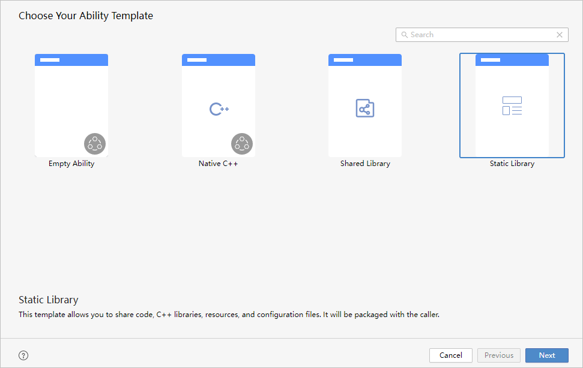
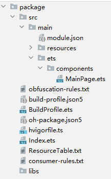
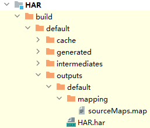
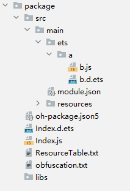
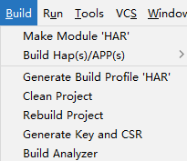
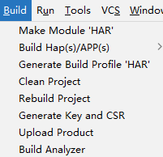
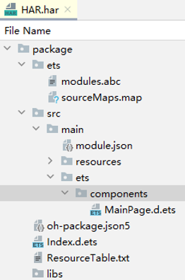
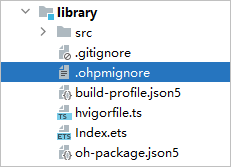
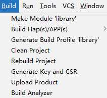

# 构建HAR

更新时间：2026-04-20 06:32:02

来源：https://developer.huawei.com/consumer/cn/doc/harmonyos-guides/ide-hvigor-build-har

构建模式：DevEco Studio默认提供debug和release两种构建模式，同时支持开发者自定义构建模式。

产物格式：构建出的HAR包产物分为包含源码的HAR、包含js中间码的HAR以及包含字节码的HAR三种产物格式。

从DevEco Studio NEXT Beta1（5.0.3.800）版本开始，默认构建字节码HAR，用于提升发布产物的安全性。


#### 使用约束

HAR自身的构建不建议引用本地模块，可能导致其他模块依赖该HAR包时安装失败，如果安装失败，需要在工程级oh-package.json5中配置[overrides](https://developer.huawei.com/consumer/cn/doc/harmonyos-guides/ide-oh-package-json5#zh-cn_topic_0000001792256137_overrides)。


#### 创建模块
1. 新建工程时选择API 10及以上的Stage模型，工程创建完成后，新建“Static Library”模块。模块创建方法可参考[在工程中添加Module](https://developer.huawei.com/consumer/cn/doc/harmonyos-guides/ide-add-new-module)。

  


2. 编写代码。

  
```ArkTS
library  // HAR根目录
  ├─libs  // 存放用户自定义引用的Native库，一般为.so文件
  └─src
  │   └─main
  │     ├─cpp
  │     │  ├─types  // 定义Native API对外暴露的接口  
  │     │  │  └─liblibrary  
  │     │  │      ├─index.d.ts
  │     │  │      └─oh-package.json5 
  │     │  ├─CMakeLists.txt  // CMake配置文件  
  │     │  └─napi_init.cpp  // C++源码文件
  │     └─ets  // ArkTS源码目录
  │     │  └─components
  │     │     └─MainPage.ets
  │     ├─resources  // 资源目录，用于存放资源文件，如图片、多媒体、字符串等  
  │     └─module.json5  // 模块配置文件，包含当前HAR的配置信息  
  ├─build-profile.json5  // Hvigor编译构建所需的配置文件，包含编译选项
  ├─hvigorfile.ts  // Hvigor构建脚本文件，包含构建当前模块的插件、自定义任务等
  ├─Index.ets  // HAR的入口文件，一般作为出口定义HAR对外提供的函数、组件等   
<strong>  └─oh-package.json5</strong>  // HAR的描述文件，定义HAR的基本信息、依赖项等
```

3. 在oh-package.json5中“main”字段定义导出文件入口。若不设置“main”字段，默认以当前目录下Index.ets为入口文件，依据.ets>.ts>.js的顺序依次检索。以将ets/components/MainPage.ets文件设置为入口文件为例：

  
```ArkTS
{
  ...
  <span style="color: rgb(102,14,122);">"main"</span>: <span style="color: rgb(0,128,0);">"./src/main/ets/components/MainPage.ets"</span>,
  ...
}
```


#### 字节码HAR

默认产物是包含字节码的HAR包，其中包含abc字节码、资源文件、配置文件、readme、changelog声明文件、license证书文件，提升发布到ohpm中心仓产物的安全性。

字节码HAR包中包含的是编译后的abc字节码，当字节码HAR被其他应用模块(HAP/HSP)依赖时，执行应用模块的编译构建，不需要再对依赖的HAR进行语法检查和编译等操作，相比源码HAR，可以有效提升应用模块的编译构建效率，提高安全性，降低代码泄漏的风险。

> [!NOTE]
> 由于构建字节码HAR需要生成二进制的格式，所以单独构建字节码HAR会比构建非字节码HAR耗时更多。


#### 收益

 - 字节码HAR可以降低代码泄漏的风险，增加反编译获取代码逻辑的难度。


 - 采用ArkTS/TS语言开发的字节码HAR，被HAP/HSP集成时，可以减少语法检查、转换的耗时，提高构建性能。
 - 字节码HAR可以减少编译时node的进程占用，有效降低内存占用。
 - 通过其他代码生成工具生成的js语言HAR包，编译构建成字节码HAR后，被HAP/HSP集成时，可以减少编译阶段处理的文件和代码数量，降低内存，提高构建性能。


#### 使用场景

从功能上来说所有的源码HAR包都可以按照任意顺序切换成字节码HAR。但是由于字节码HAR编译和集成的特点，按照推荐场景或顺序来逐步切换字节码HAR可能会获得比较好的性能、内存收益。以下场景中推荐切换使用字节码HAR：

 - 适用于SDK厂商对外提供SDK，以及高安全的场景，字节码HAR可以降低源码泄漏的风险。
 - 采用muti-repo的开发模式，在被主工程合并集成时，所有依赖的HAR均可以发布成字节码HAR，从而提高主HAP的构建效率。
 - 采用mono-repo的开发模式，工程中含有单个代码文件较大，或通过代码生成工具生成的代码量较大的ArkTS/TS/JS 的二方、三方SDK(HAR包)时，可考虑将这些HAR包构建成字节码HAR。
 - 对内存要求较高的场景，可以通过切换字节码HAR，降低内存的占用。
 - 通过ArkTS/TS/JS编写的HAR，且在依赖链条中处于较为底层的叶子节点，含有较少的源码依赖时，切换为字节码HAR会有较好的收益。


#### 约束条件

 - 字节码HAR使用的依赖需要配置在本模块的oh-package.json5的dependencies或dynamicDependencies中，如果不配置，后续字节码HAR被集成时可能会出现运行时异常。如果出现异常，部分场景可通过在hvigor-config.json5中配置ohos.byteCodeHar.integratedOptimization后重新编译，具体请参考[编译行为差异说明](https://developer.huawei.com/consumer/cn/doc/harmonyos-guides/ide-hvigor-dependencies#section957371853712)。
 - 字节码HAR的oh-package.json5中配置的依赖名和依赖包的包名（即包内oh-package.json5中的name）需要保持一致。
 - 依赖字节码HAR包时，该工程的build-profile.json5中的[useNormalizedOHMUrl](https://developer.huawei.com/consumer/cn/doc/harmonyos-guides/ide-hvigor-build-profile-app#section13181758123312)必须设置为true。
 - HAP/HSP/HAR依赖字节码HAR包时，HAP/HSP/HAR的oh-package.json5中配置的依赖名和字节码HAR包的oh-package.json5中的name需要保持一致。
 - HAP/HSP/HAR代码中import使用字节码HAR包时，`import xxx from 'yyy'`的依赖名yyy要和本模块oh-package.json5中配置的依赖名保持一致（包括大小写）。
 - 依赖字节码HAR包时，字节码HAR的compatibleSdkVersion不能大于工程的compatibleSdkVersion。


#### 操作步骤
1. 将工程级build-profile.json5的useNormalizedOHMUrl设置为true。

  
> [!NOTE]
> 从DevEco Studio NEXT Beta1（5.0.3.800）版本开始，工程级build-profile.json5中useNormalizedOHMUrl字段默认为true，byteCodeHar缺省默认值为true，无需执行步骤1和2。


  
```json
{
  <span style="color: rgb(102,14,122);">"app"</span>: {
    "products": [
      {
         "buildOption": {
           "strictMode": {
             "useNormalizedOHMUrl": true
           }
         }
      }
    ]
  }
}
```

2. 在HAR模块的build-profile.json5中，将byteCodeHar设置为true。

  
```json
{
  <span style="color: rgb(102,14,122);">"buildOption"</span>: {
    "arkOptions": {
      "byteCodeHar": true
    }
  }
}
```

3. 点击DevEco Studio右上角图标

，选择**Build Mode，**默认为**&lt;Default&gt;**模式：在编译App时使用release模式，编译HAP/HSP/HAR时使用debug模式。

  


4. （可选）在编译模式为release时，为保护代码资产，建议开启混淆，在模块级build-profile.json5文件的release的buildOptionSet配置中，将obfuscation/ruleOptions下的enable字段设置为true。混淆相关能力和具体规则请参考[代码混淆](https://developer.huawei.com/consumer/cn/doc/harmonyos-guides/ide-build-obfuscation)。

  
```json
{
  <span style="color: rgb(135,16,148);">"apiType"</span>: <span style="color: rgb(6,125,23);">"stageMode"</span>,
  <span style="color: rgb(135,16,148);">"buildOption"</span>: {
  },
  <span style="color: rgb(135,16,148);">"buildOptionSet"</span>: [
    {
      <span style="color: rgb(135,16,148);">"name"</span>: <span style="color: rgb(6,125,23);">"release"</span>,
      <span style="color: rgb(135,16,148);">"arkOptions"</span>: {
        // 混淆相关参数
        <span style="color: rgb(135,16,148);">"obfuscation"</span>: {
          <span style="color: rgb(135,16,148);">"ruleOptions"</span>: {
            // true表示进行混淆，false表示不进行混淆。5.0.3.600及以上版本默认为false
            <span style="color: rgb(135,16,148);">"enable"</span>: <span style="color: rgb(0,51,179);">true</span>,
            // 混淆规则文件
            <span style="color: rgb(135,16,148);">"files"</span>: [
              <span style="color: rgb(6,125,23);">"./obfuscation-rules.txt"</span>
            ]
          },
          // consumerFiles中指定的混淆配置文件会在构建依赖这个library的工程或library时被应用
          <span style="color: rgb(135,16,148);">"consumerFiles"</span>: [
            <span style="color: rgb(6,125,23);">"./consumer-rules.txt"</span>
          ]
        }
      },
    },
  ],
  <span style="color: rgb(135,16,148);">"targets"</span>: [
    {
      <span style="color: rgb(135,16,148);">"name"</span>: <span style="color: rgb(6,125,23);">"default"</span>
    }
  ]
}
```

5. （可选）如果开发者希望自定义打包到HAR产物中的文件，可在HAR模块的build-profile.json5文件中，配置include或exclude字段，支持glob语法。

  
```json
<span style="color: rgb(135,16,148);">"buildOption"</span>: {
  <span style="color: rgb(135,16,148);">"packingOptions"</span>: {
    <span style="color: rgb(135,16,148);">"asset"</span>: {
      <span style="color: rgb(135,16,148);">"include"</span>: [<span style="color: rgb(6,125,23);">"./src/router.json5"</span>,<span style="color: rgb(6,125,23);">"router.json5"</span>],    // 配置打包到HAR产物中的文件
      <span style="color: rgb(135,16,148);">"exclude"</span>: [<span style="color: rgb(6,125,23);">"./config/*"</span>]     // 配置不打包到HAR产物中的文件
    }
  }
}
```

> [!NOTE]
> 配置include字段时，以下目录不生效，即不会被打包到产物中：node_modules、oh_modules、.preview、build、.cxx、.test。 配置exclude字段时，以下文件不生效，默认会打包：oh-package.json5。

6. 选中HAR模块的根目录，点击**Build > Make Module '<module-name>'**启动构建。

  
> [!NOTE]
> 若修改了HAR模块级oh-package.json5文件的version字段，请先执行 Build > Clean Project 操作，再重新进行Build全量构建。


  



  构建完成后，build目录下生成HAR包产物。

  



  HAR包产物解压后，结构如下：

  



#### 源码HAR


#### 以debug模式构建

产物是包含源码的HAR包，其中包含源码、资源文件以及配置文件等，方便开发者进行本地调测，不包含build、node_modules、oh_modules、.cxx、.preview、.hvigor、.gitignore、.ohpmignore、.gitignore/.ohpmignore中配置的文件、cpp工程的CMakeLists.txt。

> [!NOTE]
> 源码HAR包中包含源代码，请谨慎分发，避免造成源代码泄露。 如果是native工程，以debug模式构建的native产物中不包含调试信息和符号表，如需调试，请参考 三方源码调试 。 从5.0.3.403版本开始，不再建议使用相对路径跨模块引用代码文件，若历史工程存在此场景的跨模块引用，会出现warning告警，请尝试将该文件移至本模块内，再重新进行编译。 从5.0.3.403版本开始，以debug/release模式构建HAR的流程使用相同的语法校验规则，若历史工程出现ArkTS语法报错，请按照报错信息修改代码，以符合ArkTS语言规范。

1. 在HAR模块的build-profile.json5中，将byteCodeHar设置为false。

  
```json
{
  <span style="color: rgb(102,14,122);">"buildOption"</span>: {
    "arkOptions": {
      "byteCodeHar": false
    }
  }
}
```

> [!NOTE]
> 使用DevEco Studio NEXT Beta1（5.0.3.800）之前的版本，模块级build-profile.json5的byteCodeHar字段的缺省默认值为false，无需执行本步骤。

2. 点击DevEco Studio右上角图标

，**Build Mode**选择**debug。**默认为**&lt;Default&gt;**模式：在编译App时使用release模式，编译HAP/HSP/HAR时使用debug模式。

  


3. （可选）若部分工程源文件无需构建到HAR包中，可在模块目录下新建.ohpmignore文件，或者在模块目录下的.gitignore文件中，配置打包时要忽略的文件，.ohpmignore文件中支持正则表达式写法，.gitignore文件中支持glob语法。DevEco Studio构建时将过滤掉.ohpmignore或.gitignore文件中所包含的文件/文件夹。

  


4. （可选）如果开发者希望自定义打包到HAR产物中的文件，可在HAR模块的build-profile.json5文件中，配置include或exclude字段，支持glob语法。配置include或exclude字段后，.gitignore和.ohpmignore文件将不再生效。

  
```json
<span style="color: rgb(135,16,148);">"buildOption"</span>: {
  <span style="color: rgb(135,16,148);">"packingOptions"</span>: {
    <span style="color: rgb(135,16,148);">"asset"</span>: {
      <span style="color: rgb(135,16,148);">"include"</span>: [<span style="color: rgb(6,125,23);">"./src/router.json5"</span>,<span style="color: rgb(6,125,23);">"router.json5"</span>],    // 配置打包到HAR产物中的文件
      <span style="color: rgb(135,16,148);">"exclude"</span>: [<span style="color: rgb(6,125,23);">"./config/*"</span>]     // 配置不打包到HAR产物中的文件
    }
  }
}
```

> [!NOTE]
> 配置include字段时，以下目录不生效，即不会被打包到产物中：node_modules、oh_modules、.preview、build、.cxx、.test。 配置exclude字段时，以下文件不生效，默认会打包：oh-package.json5。

5. 选中HAR模块的根目录，点击**Build > Make Module '<module-name>'**启动构建。

  
> [!NOTE]
> 若修改了HAR模块级oh-package.json5文件的version字段，请先执行 Build > Clean Project 操作，再重新进行Build全量构建。


  



  构建完成后，build目录下生成HAR包产物。

  



  HAR包产物解压后，结构如下：

  


#### 以release模式构建

从DevEco Studio NEXT Developer Beta3（5.0.3.600）版本开始，默认不开启混淆，构建产物和debug模式相同，请参考[以debug模式构建](#section197792874110)。

为保护代码资产，建议开启混淆，开启后，构建产物是包含js中间码的HAR包，其中包含源码混淆后生成的js中间码文件、资源文件、配置文件、readme、changelog声明文件、license证书文件，用于发布到ohpm中心仓。
1. 在HAR模块的build-profile.json5中，将byteCodeHar设置为false。

  
```json
{
  <span style="color: rgb(102,14,122);">"buildOption"</span>: {
    "arkOptions": {
      "byteCodeHar": false
    }
  }
}
```

> [!NOTE]
> 使用DevEco Studio NEXT Beta1（5.0.3.800）之前的版本，模块级build-profile.json5的byteCodeHar字段的缺省默认值为false，无需执行本步骤。

2. 点击DevEco Studio右上角图标

，**Build Mode**中选择**release。**默认为**&lt;Default&gt;**模式：在编译App时使用release模式，编译HAP/HSP/HAR时使用debug模式。

  


3. 在[编译模式](https://developer.huawei.com/consumer/cn/doc/harmonyos-guides/ide-hvigor-compilation-options-customizing-guide#section192461528194916)为release时，为保护代码资产，建议开启混淆，在模块级build-profile.json5文件的release的buildOptionSet配置中，将obfuscation/ruleOptions下的enable字段设置为true。混淆相关能力和具体规则请参考[代码混淆](https://developer.huawei.com/consumer/cn/doc/harmonyos-guides/ide-build-obfuscation)。

  
```json
{
  <span style="color: rgb(135,16,148);">"apiType"</span>: <span style="color: rgb(6,125,23);">"stageMode"</span>,
  <span style="color: rgb(135,16,148);">"buildOption"</span>: {
  },
  <span style="color: rgb(135,16,148);">"buildOptionSet"</span>: [
    {
      <span style="color: rgb(135,16,148);">"name"</span>: <span style="color: rgb(6,125,23);">"release"</span>,
      <span style="color: rgb(135,16,148);">"arkOptions"</span>: {
        // 混淆相关参数
        <span style="color: rgb(135,16,148);">"obfuscation"</span>: {
          <span style="color: rgb(135,16,148);">"ruleOptions"</span>: {
            // true表示进行混淆，false表示不进行混淆。5.0.3.600及以上版本默认为false
            <span style="color: rgb(135,16,148);">"enable"</span>: <span style="color: rgb(0,51,179);">true</span>,
            // 混淆规则文件
            <span style="color: rgb(135,16,148);">"files"</span>: [
              <span style="color: rgb(6,125,23);">"./obfuscation-rules.txt"</span>
            ]
          },
          // consumerFiles中指定的混淆配置文件会在构建依赖这个library的工程或library时被应用
          <span style="color: rgb(135,16,148);">"consumerFiles"</span>: [
            <span style="color: rgb(6,125,23);">"./consumer-rules.txt"</span>
          ]
        }
      },
    },
  ],
  <span style="color: rgb(135,16,148);">"targets"</span>: [
    {
      <span style="color: rgb(135,16,148);">"name"</span>: <span style="color: rgb(6,125,23);">"default"</span>
    }
  ]
}
```

4. （可选）如果开发者希望自定义打包到HAR产物中的文件，可在HAR模块的build-profile.json5文件中，配置include或exclude字段，支持glob语法。

  
```json
<span style="color: rgb(135,16,148);">"buildOption"</span>: {
  <span style="color: rgb(135,16,148);">"packingOptions"</span>: {
    <span style="color: rgb(135,16,148);">"asset"</span>: {
      <span style="color: rgb(135,16,148);">"include"</span>: [<span style="color: rgb(6,125,23);">"./src/router.json5"</span>,<span style="color: rgb(6,125,23);">"router.json5"</span>],    // 配置打包到HAR产物中的文件
      <span style="color: rgb(135,16,148);">"exclude"</span>: [<span style="color: rgb(6,125,23);">"./config/*"</span>]     // 配置不打包到HAR产物中的文件
    }
  }
}
```

> [!NOTE]
> 配置include字段时，以下目录不生效，即不会被打包到产物中：node_modules、oh_modules、.preview、build、.cxx、.test。 配置exclude字段时，以下文件不生效，默认会打包：oh-package.json5。

5. 选中HAR模块的根目录，点击**Build > Make Module '<module-name>'**启动构建。

  
> [!NOTE]
> 若修改了HAR模块级oh-package.json5文件的version字段，请先执行 Build > Clean Project 操作，再重新进行Build全量构建。


  


  构建完成后，build目录下生成HAR包产物。

  


  HAR包产物解压后，结构如下：

  


#### 对HAR进行签名

DevEco Studio在构建HAR流程的基础上，支持对HAR进行签名。签名后的HAR包后续可用于接入生态市场，接入流程请参考[SDK类商品接入说明](https://developer.huawei.com/consumer/cn/doc/start/dev-mall-marketplace-sp-sdkservice-access-explain-0000001866499490)。

> [!NOTE]
> 1. 该能力只在Compatible SDK 5.0.0(12)及以上版本的SDK中支持。 2. 该能力需开启Hvigor的Daemon能力，请确保当前工程开启了Daemon，打开 File > Settings （macOS为 DevEco Studio > Preferences/Settings） > Build, Execution, Deployment > Build Tools > Hvigor ，勾选字段 Enable the Daemon for tasks 。

1. 在hvigor-config.json5中，开启构建签名HAR开关：

  
```text
{
  <span style="color: rgb(102,14,122);">"properties"</span>: {
    "ohos.sign.har": true
  }
}
```

2. 配置工程签名信息，配置流程请参考[配置签名信息](https://developer.huawei.com/consumer/cn/doc/harmonyos-guides/ide-publish-app#section793484619307)。
3. 选中HAR模块的根目录，点击**Build > Make Module '<module-name>'**启动构建。

  


  构建完成后，build目录下生成签名HAR包产物。

  

