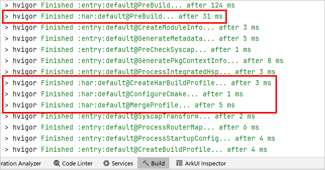

# 添加依赖项

更新时间：2026-04-20 06:32:02

来源：https://developer.huawei.com/consumer/cn/doc/harmonyos-guides/ide-hvigor-dependencies

应用/元服务支持通过包管理工具ohpm来安装、共享、分发代码，管理项目的依赖关系。本文介绍了在您的项目中如何配置依赖项，以及不同的配置方式在编译期间的处理逻辑和编译结果。

您可在工程或模块下的oh-package.json5文件中的dependencies（生产依赖）/devDependencies（开发依赖）字段中指定依赖项，以上两种依赖字段均支持引用远程三方包、本地模块和本地HAR/HSP三种方式。oh-package.json5文件中的dynamicDependencies（动态依赖）仅限于动态依赖HSP的使用场景。以下配置以dependencies为例，更多关于依赖的设置方式请参考[oh-package.json5](https://developer.huawei.com/consumer/cn/doc/harmonyos-guides/ide-oh-package-json5)。


##### 配置依赖项


##### 远程三方包

在需要引入三方包的模块的oh-package.json5文件中设置三方包依赖，配置示例如下：      
```json
"dependencies": {
  "@ohos/lottie": "^2.0.0"
}
```


##### 本地模块

在模块的oh-package.json5文件中设置本地模块依赖，有两种方式：

 - 配置本地文件夹路径，示例如下：       
```json
"dependencies": {
  "folder": "file:../folder"
}
```

 - 配置本地模块名，例如依赖本地模块moduleA（从DevEco Studio 6.0.0 Beta1版本开始支持）：       
```json
"dependencies": {
  "moduleA": "@module:moduleA"
}
```


##### 本地HAR/HSP包

 - 引用HAR：       
```json
"dependencies": {
  "package": "file:../package.har"
}
```


 - 引用HSP（在release模式下，构建HSP会生成tgz包）：       
```json
"dependencies": {
  "package": "file:../package.tgz"
}
```


依赖设置完成后，需要执行**ohpm install**命令安装依赖包，依赖包会存储在对应模块的oh_modules目录下。


##### 编译行为差异说明

根据当前的依赖配置规格，您可以在以下字段中指定依赖项：

 - 工程级oh-package.json5文件中的dependencies、dynamicDependencies、devDependencies
 - 模块级oh-package.json5文件中的dependencies、dynamicDependencies、devDependencies


虽然以上字段都可以指定依赖项，但使用不同的字段，在编译期间的处理逻辑和编译结果是不同的。举个例子：
1. 新建工程，新建HAR模块。
2. 在entry模块级oh-package.json5的dependencies设置HAR本地文件夹，编译entry：       
```json
"dependencies": {
  "har": "file:../har"
}
```

3. 在entry模块级oh-package.json5的devDependencies设置HAR本地文件夹，编译entry：       
```json
"devDependencies": {
  "har": "file:../har"
}
```


对比步骤2和3的构建日志，您会发现，步骤2会打印HAR相关的日志，如下图红框所示，步骤3并没有任何关于HAR的日志打印。





以上仅仅是日志的差异，为了确保编译正常，不建议将依赖项配置在工程级oh-package.json5中，下文将通过表格说明编译时具体的处理逻辑和可能造成的异常结果。

为方便后续说明，需要了解以下名词，仅在本文内有效：

 - 三方包依赖：通过[远程三方包](#section0999112011818)和[本地HAR/HSP包](#section636814917176)的方式指定依赖项
 - 本地依赖：通过[本地模块](#section91117398178)的方式指定依赖项
 - 开启bundledDependencies的字节码HAR：字节码HAR的build-profile.json5的buildOption/arkOptions下的bundledDependencies字段配置为true
 - 依赖项的自身配置：依赖项自身的resources/workers/runtimeOnly/UIAbilities/ExtensionAbilities/C++编译产物/路由表等


> [!TIP]
> 下表的devDependencies指工程级和模块级oh-package.json5中的devDependencies。 下表仅对可能导致编译异常的场景进行说明，其他编译正常的场景不进行说明，例如在模块级oh-package.json5中配置dependencies。


| 依赖项 | 编译HAP | 编译HSP | 编译未开启 bundledDependencies 的字节码HAR | 编译开启 bundledDependencies 的字节码HAR |
| --- | --- | --- | --- | --- |
| 源码HAR | 三方包依赖 | devDependencies | 1 | 1 | 2 | 1 |
| 源码HAR | 工程级的dependencies | 三方包依赖 | / | / | 3 | 3 |
| 源码HAR | 本地依赖 | devDependencies | 1 | 1 | 2 | 1 |
| 本地依赖 | 工程级的dependencies | / | 1 | 2 | 1 |
| 字节码HAR | 三方包依赖 | devDependencies | 2 | 2 | 2 | 2 |
| 字节码HAR | 工程级的dependencies | 三方包依赖 | / | / | 3 | 3 |
| HSP | 三方包依赖 | devDependencies | 1 | 1 | 2 | 1 |
| HSP | 工程级的dependencies、dynamicDependencies | 三方包依赖 | / | / | / | / |
| HSP | 本地依赖 | devDependencies | 1 | 1 | 2 | 1 |
| 本地依赖 | 工程级的dependencies、dynamicDependencies | / | 1 | 2 | 1 |


表格中各符号的含义如下：

 - 1：依赖项仅代码文件（ets/ts/js等）参与编译，依赖项的自身配置不会参与收集，可能造成编译/运行时异常。
 - 2：依赖项没有被收集，会导致编译异常。
 - 3：编译正常，后续集成时可能会造成运行时异常。
 - /：编译和运行都正常。


针对以上几类编译/运行时可能异常的场景，从DevEco Studio 5.1.1 Beta1版本开始，hvigor-config.json5文件提供一个字段ohos.byteCodeHar.integratedOptimization，开启后，可以优化表格中**加粗符号**对应的场景。

但该开关只是优化了依赖收集的逻辑，并没有优化依赖项的自身配置收集的逻辑，因此，加粗符号对应的场景中，只有编译字节码HAR，并且依赖配置在工程级的dependencies或dynamicDependencies对应的场景才能完全优化，其他场景无法保证编译/运行时无异常。

```json
<span style="color: rgb(135,16,148);">"properties"</span>: {
  <span style="color: rgb(135,16,148);">"ohos.byteCodeHar.integratedOptimization"</span>: <span style="color: rgb(0,51,179);">true</span>
}
```

> [!NOTE]
> 依赖包提供方和集成方都需要配置该字段。


综上所述，我们建议您：

 - 当前模块使用到的依赖配置在本模块的oh-package.json5中。
 - 除辅助语法检查TypeScript的类型声明包（如：@types/commonmark）外，其他类型的依赖项，都不要配置在devDependencies中。
