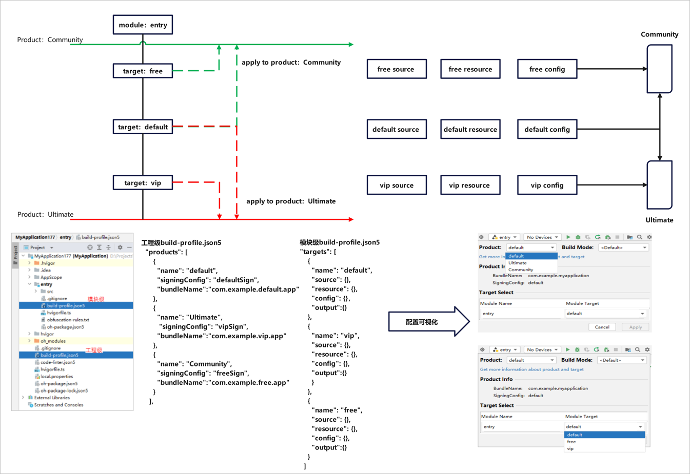
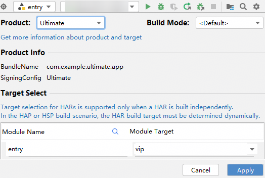
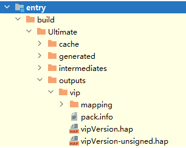

# 实践说明

更新时间：2026-04-30 02:42:31

来源：https://developer.huawei.com/consumer/cn/doc/harmonyos-guides/ide-customized-multi-targets-and-products-sample

某对外发布应用共有两个版本：

 1. Community社区版本，免费，向个人开发者用户提供该应用绝大部分基础功能，但是不提供部分定制化限定功能及技术支持。

 2. Ultimate终极版本，收费，向个人、政企等开发者用户提供该应用全部基础功能，同时提供定制化限定功能及技术支持。

 可以看出在Community版本与Ultimate版本之间，部分功能存在重合，同时也存在某些特定功能，所以期望通过一次开发以实现差异化，根据不同配置完成多种特定运行环境的开发、预览、打包、调试等功能。

 

 1. 两个不同版本的软件，可能存在差异：如不同的应用标题、应用图标、版本声明。我们可以在工程级build-profile.json5->app{}->products[]中，可以对两种不同的外发版本进行差异化定制，新增两个product：Community和Ultimate。根据已支持的字段进行定制修改。


```text
{
  "name": "Ultimate",
  // ultimate版本签名
  "signingConfig": "Ultimate",
  // ultimate版本包名
  "bundleName": "com.example.ultimate.app",
  // ultimate版本应用图标
  "icon": "$media:app_icon",
  // ultimate版本应用标签
  "label": "$string:app_name",
  "versionCode": 10000,
  "versionName": "1.0.0",
  // ultimate版本指定资源目录
  "resource": {
    "directories": [
      "./AppScope/ultimateRes"
    ]
  },
  // ultimate版本指定输出产物名
  "output": {
    "artifactName": "ultimate_version"
  },
  "bundleType": "app",
  "compatibleSdkVersion": "6.1.1(24)",
  "runtimeOS": "HarmonyOS"
},
{
  "name": "Community",
  "signingConfig": "Community",
  // community版本签名
  "bundleName": "com.example.community.app",
  // community版本包名
  "icon": "$media:app_icon",
  // community版本应用图标
  "label": "$string:app_name",
  // community版本应用标签
  "versionCode": 10000,
  "versionName": "1.0.0",
  // community版本指定资源目录
  "resource": {
    "directories": [
      "./AppScope/communityRes"
    ]
  },
  // community版本指定输出产物名
  "output": {
    "artifactName": "community_version"
  },
  "bundleType": "app",
  "compatibleSdkVersion": "6.1.1(24)",
  "runtimeOS": "HarmonyOS",
}
```


 2. 应用软件部分功能可能针对特定场景存在定制场景：如ultimate版本的功能A在phone设备类型上免费，在TV设备类型上需要收费；再如community版本的功能B在2in1设备类型上的启动页与在wearable设备类型上呈现效果存在差异。在模块级build-profile.json5->targets[]中新增2个 target：vip和free。


```text
{
  "name": "vip",
  // 定制vip包输出产物名
  "output": {
    "artifactName": "vipVersion"
  },
  // 定制vip包源码指定页面
  "source": {
    "pages": [
      "pages/vipIndex"
    ]
  },
  // 指定vip包资源目录
  "resource": {
    "directories": [
      "./src/main/ultimateRes"
    ]
  },
  "config": {
    // 指定vip包适用设备类型
    "deviceType": [
      "phone",
      "tablet",
      "2in1"
    ]
  }
},
{
  "name": "free",
  // 定制free包输出产物名
  "output": {
    "artifactName": "freeVersion"
  },
  // 定制free包源码指定页面
  "source": {
    "pages": [
      "pages/freeIndex"
    ]
  },
  // 指定free包资源目录
  "resource": {
    "directories": [
      "./src/main/communityRes"
    ]
  },
  "config": {
    // 指定free包适用设备类型
    "deviceType": [
      "phone",
      "tablet"
    ]
  }
}
```


 3. 新增product、target后，需要在工程级build-profile.json5->modules[]->targets[]->applyToProducts中，指定关联关系。此处表示当前模块的target具体应用到工程product的配置。


```text
"targets": [
  {
    "name": "default",
    "applyToProducts": [
      "default",
      "Community",
      "Ultimate"
    ]
  },
  {
    "name": "free",
    "applyToProducts": [
      "default",
      "Community"
    ]
  },
  {
    "name": "vip",
    "applyToProducts": [
      "default",
      "Ultimate"
    ]
  }
]
```

 由上配置：


- target：default被应用至product：default、Ultimate、Community中；
- target：vip被应用至product：default、Ultimate中；
- target：free被应用至product：default、Community中。


 4. 在实际构建中，可通过可视化窗口灵活选择product-target的关联关系以构建出需要的APP/HAP包。

 例：用户需要构建Ultimate版本的且具有vip特性的应用，可以选择product：Ultimate，target：vip，apply之后执行构建。

 

 查看构建产物

 
