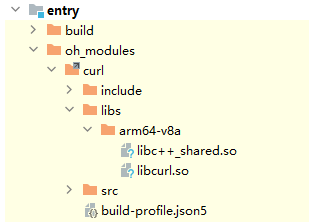

# 预构建库快速链接

更新时间：2026-04-20 06:32:02

来源：https://developer.huawei.com/consumer/cn/doc/harmonyos-guides/ide-hvigor-so

在工程中使用依赖模块时，如果希望使用依赖模块中native相关的so库与接口文件（.h/.hpp），Hvigor提供了快速链接功能。
 

#### 头文件

- 对于共享包：在共享包中include目录下如存在.h等接口文件，Hvigor会自动将此目录添加到CMake接口目录中，无需手动添加。
- 对于本地依赖模块：

  在本地依赖模块中如存在.h等接口文件，可通过在build-profile.json5文件buildOption/nativeLib/headerPath中指定接口文件目录。
```json
"buildOption": {
  "nativeLib": {
    "headerPath": <span style="color: rgb(221,17,68);">"src/main/cpp/include"</span>
  }
}
```


 
 

#### 预构建库

在工程中引用了共享包/本地依赖模块中的so库，编译时，Hvigor会生成cmake [Config-file Packages](https://cmake.org/cmake/help/latest/manual/cmake-packages.7.html#config-file-packages)，自动通过cmake [find_package](https://cmake.org/cmake/help/latest/command/find_package.html#find-package)引入这些so。开发者只需根据此依赖模块的模块名、so库名，在CMakeLists.txt脚本中以${moduleName::soName}库名称的形式来声明链接。
 
例如工程依赖了curl共享包，共享包中存在libcurl.so，在oh-package.json5中添加依赖。
 
```json
<span style="color: rgb(153,153,136);">// oh-package.json5</span>
"dependencies": { 
  "curl": <span style="color: rgb(221,17,68);">"1.0.0"</span> 
}
```
 



 
在工程的CMakeLists.txt脚本中声明链接：
 
```cpp
<span style="color: rgb(153,153,136);">// CMakeLists.txt</span>
add_library(entry SHARED napi_init.cpp)
# ${moduleName::soName}.
target_link_libraries(entry PUBLIC curl::curl)
```
 
> [!NOTE]
> 对于本地模块，HAR仅暴露本模块构建的so库，HSP暴露本模块构建及所依赖的so库。
