# 代码重构

更新时间：2026-03-24 06:03:01

来源：https://developer.huawei.com/consumer/cn/doc/harmonyos-guides/ide-code-refactoring

#### ArkTS/TS代码重构

 

#### Refactor-Extract代码提取

在编辑器中支持将函数内、类方法内等区域代码块或表达式，提取为新方法/函数（Method）、常量（Constant）、接口（Interface）、变量（Variable）或类型别名（Type Alias）。准确便捷的将所选区域代码从当前作用域内进行提取，提升编码效率。选中所需要提取的代码块，右键单击**Refactor**，选择需要提取的类型。
 
> [!NOTE]
> Refactor-Extract代码提取为类型别名（Type Alias）能力仅TS语言支持。

 
方法/函数（Method）支持选中代码块或完整语句进行提取：
 

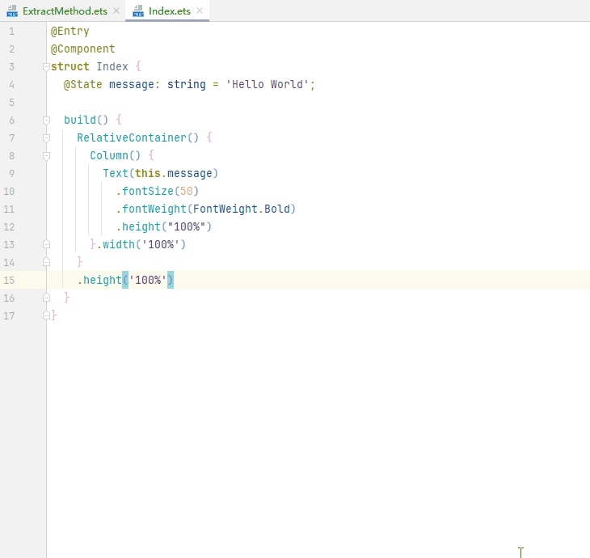

 
在ArkTS语言中，支持将组件调用代码块提取为@Builder装饰器装饰的方法，组件属性调用表达式可提取为@Styles或@Extend装饰器装饰的方法。
 
**使用方式**：选中需要提取的组件或属性，右键单击**Refactor**，选择**Extract Method...**，组件私有属性可提取为@Extend装饰的方法，通用属性可提取为@Styles或@Extend装饰的方法。
 

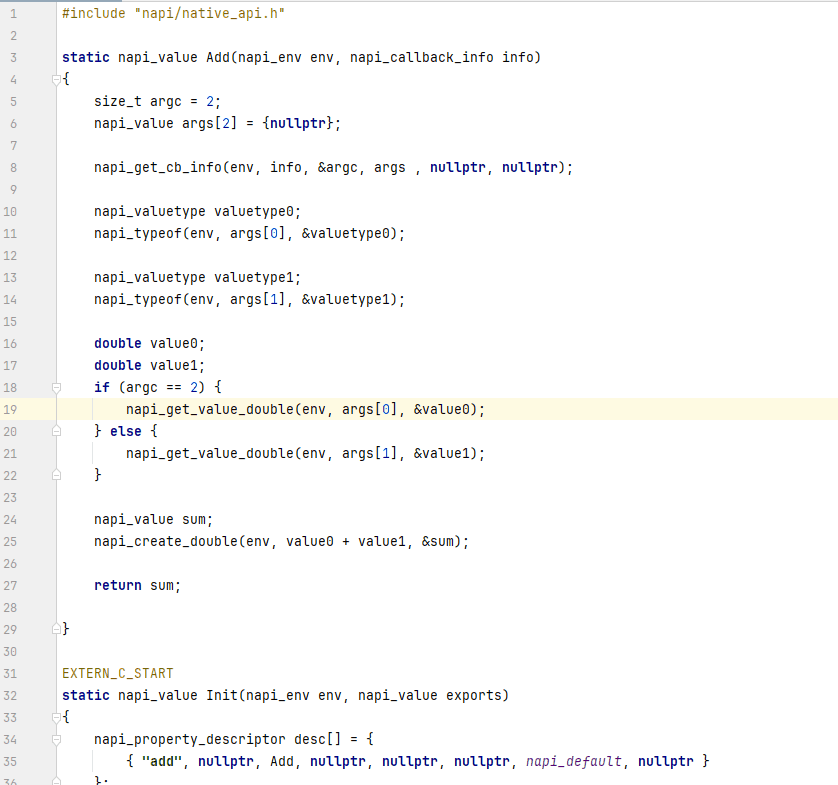

 
常量（Constant）支持选中单行表达式进行提取：
 

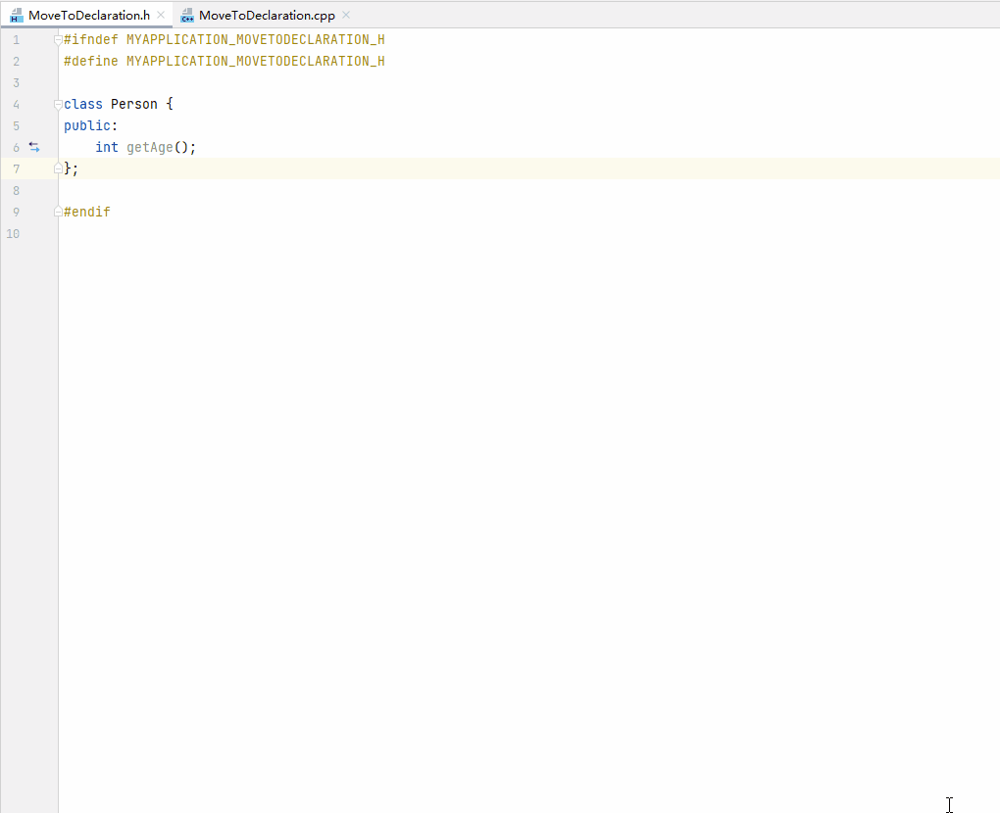

 
接口（Interface）支持选中对象自变量进行提取：
 

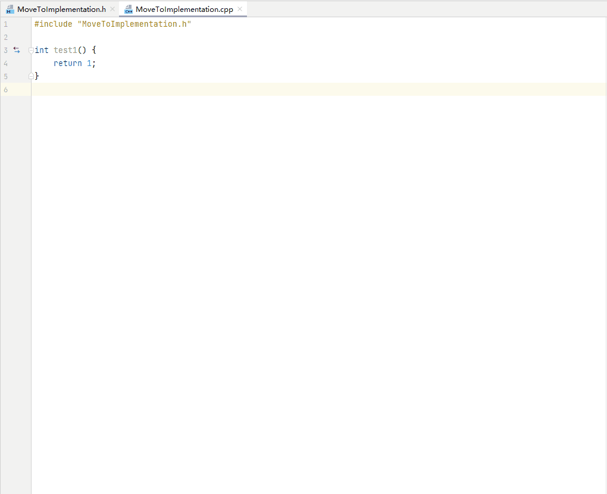

 
支持选中表达式提取为变量（Variable）：
 

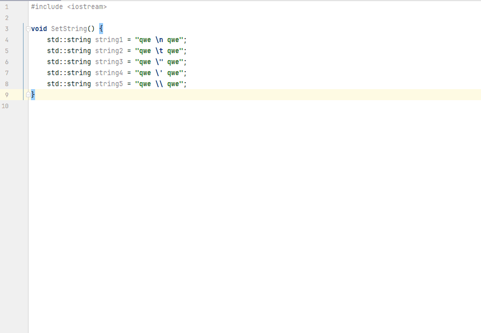

 
 

#### Refactor-Convert代码转换

编辑器内提供Convert重构能力，支持Convert between named imports and namespace imports等高频转换操作，辅助开发者高效重构代码，提升代码质量。
  
| 功能 | 说明 | 使用方法 | 支持转换的源码类型 |
| --- | --- | --- | --- |
| Convert to class | 将JS源码中的function转换为符合ES6标准的类 | 点击或选中function名，右键单击Refactor > Convert，或使用快捷键Ctrl+Alt+Shift+R（macOS为Option+Shift+Command+R），在弹窗中选择转换的方式。 
> [!TIP]
> 若当前工程中已引用该方法，执行Convert to class后，在Find Usages中可查看引用的具体位置，点击 Do Refactor 可忽略冲突并执行转换；也可以逐条修改引用位置的代码后，重新执行上述操作。
 | JS |
| Convert to anonymous function | 将箭头函数转换为匿名函数 | 选中箭头函数赋值变量，右键单击Refactor > Convert，或使用快捷键Ctrl+Alt+Shift+R（macOS为Option+Shift+Command+R），在弹窗中选择转换的方式。 | JS/TS |
| Convert to named function | 将箭头函数转换为普通函数 | 选中箭头函数赋值变量，右键单击Refactor > Convert，或使用快捷键Ctrl+Alt+Shift+R（macOS为Option+Shift+Command+R），在弹窗中选择转换的方式。 | JS/TS/ArkTS |
| Convert to arrow function | 将匿名函数转换为箭头函数 | 选中匿名函数赋值变量，右键单击Refactor > Convert，或使用快捷键Ctrl+Alt+Shift+R（macOS为Option+Shift+Command+R），在弹窗中选择转换的方式。 | JS/TS/ArkTS |
| Convert default export to named export | 支持named export和default export相互转换 | 完整选中export default语句，右键单击Refactor > Convert，或使用快捷键Ctrl+Alt+Shift+R（macOS为Option+Shift+Command+R），在弹窗中选择转换的方式。 | JS/TS/ArkTS |
| Convert named export to default export | 支持named export和default export相互转换 | 完整选中export语句，右键单击Refactor > Convert，或使用快捷键Ctrl+Alt+Shift+R（macOS为Option+Shift+Command+R），在弹窗中选择转换的方式。 | JS/TS/ArkTS |
| Convert named imports to namespace import | 支持在命名import和命名空间import形态间转换 | 完整选中import语句，右键单击Refactor > Convert，或使用快捷键Ctrl+Alt+Shift+R（macOS为Option+Shift+Command+R），在弹窗中选择转换的方式。 | JS/TS/ArkTS |
| Convert namespace import to named imports | 支持在命名import和命名空间import形态间转换 | 完整选中命名空间import语句，右键单击Refactor > Convert，或使用快捷键Ctrl+Alt+Shift+R（macOS为Option+Shift+Command+R），在弹窗中选择转换的方式。 | JS/TS/ArkTS |
| Convert to template string | 将字符串转换为模板字面量 | 选中字符串或完整表达式，右键单击Refactor > Convert，或使用快捷键Ctrl+Alt+Shift+R（macOS为Option+Shift+Command+R），在弹窗中选择转换的方式。 | JS/TS/ArkTS |
| Convert to optional chain expression | 将判空逻辑转换为可选链式调用 | 选中连续判空表达式，右键单击Refactor > Convert，或使用快捷键Ctrl+Alt+Shift+R（macOS为Option+Shift+Command+R），在弹窗中选择转换的方式。 | JS/TS/ArkTS |
 
 
 

#### Refactor-Rename代码重命名

代码编辑支持Rename功能，可以快速更改变量、方法、对象属性等相关标识符及文件、模块的名称，并同步到整个工程中对其进行引用的位置。
 
**使用方式**：选中需要重新命名的标识符（变量、类、接口、自定义组件等），右键单击**Refactor**，选择**Rename...**（或使用**快捷键Shift+F6**），在弹框中输入新的标识符名称，并在**Scope**中选择替换的范围，点击**Refactor**完成重新命名。
 

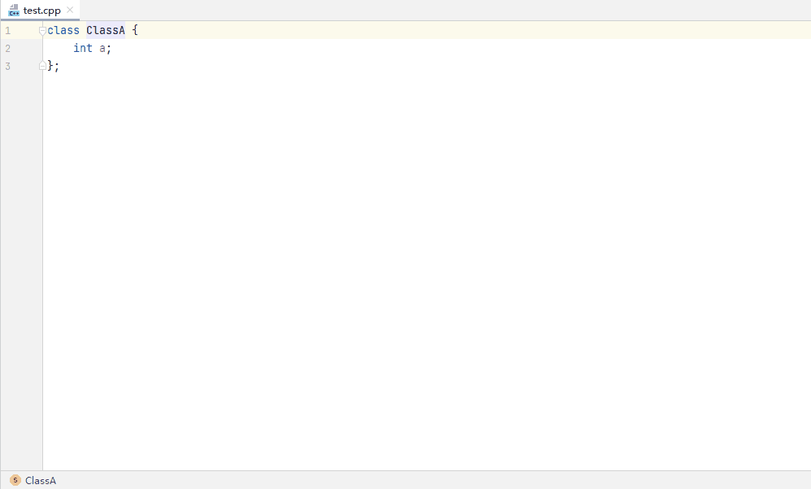

 
代码编辑支持筛选并过滤不需要rename的引用位置。在**Rename...**弹窗中点击**Preview**，在弹出预览窗口中，用户选中无需Rename的选项，单击右键菜单**Exclude****/Remove**进行过滤/删除，完成筛选后点击左下角**Do Refactor**，重新执行Rename操作。
 

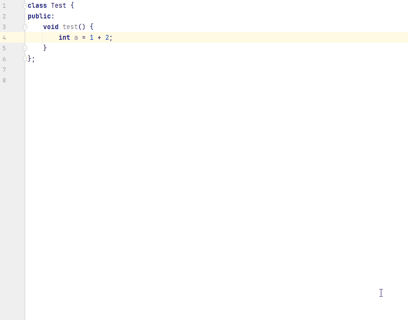

 
> [!NOTE]
> 若ArkTS文件中存在C++接口调用，使用Rename进行重命名时，C++文件中涉及的函数名也会被重命名。

 
 

#### Move File

在文件中单击右键，选择**Refactor > Move File...**，在弹窗中输入或点击**...**选择指定的目录，点击**Refactor**，可将当前文件移动至该目录下。勾选**Search for references**，可查找并更新工程中对该文件的引用；勾选**Open in editor**，可在编辑器中查看移动的文件。
 

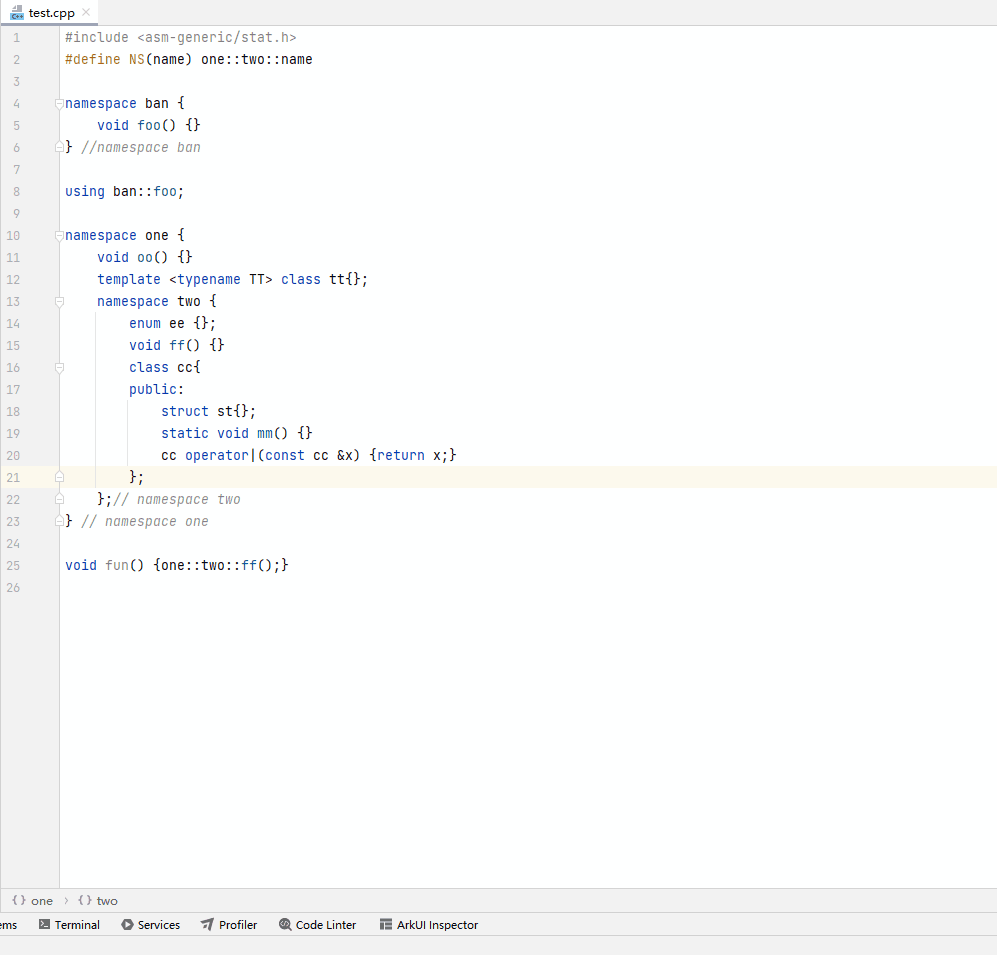

 
 

#### Safe Delete

编辑器支持Safe Delete功能，帮助您安全地删除代码中的标识符对象（变量、函数或类等）或删除指定文件。在删除前，编辑器将先在代码中搜索对该对象的引用，如果存在引用，编辑器将提示您进行必要的检查和调整。
 
**使用方式**：在编辑器内选中需要删除的标识符对象或在工程目录选择待删除的文件，右键单击**Refactor**，选择**Safe Delete**，单击**OK**将自动检查当前对象在代码中被引用的情况，点击**View Usages**可查看具体使用的代码内容，点击**Delete Anyway**将直接删除该对象的定义。
 

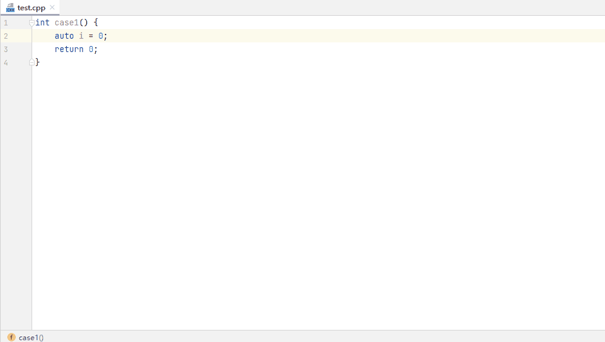

 
 

#### C++代码重构

编辑器提供C++代码重构能力，当前支持展开宏、交换if分支、移动函数体到声明处等使用场景下的重构能力，提升开发效率。
 
 

#### 展开宏

支持在当前宏引用处展开宏。将光标移动至需要展开的宏，右键单击**Refactor**，选择**Inline**，展开此处引用的宏。
 

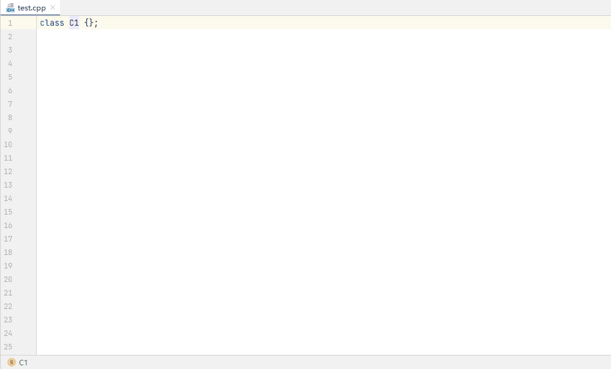

 
 

#### 交换if分支

编辑器支持在选中if-else完整代码块的情况下，实现对if-else代码块的位置交换，并对条件取反。
 
**使用约束**
 
- 需要重构的代码块必须为完整的if-else代码结构，{}不能省略；
- if-else中的statement包含嵌套if-else语句时，只反转最外层的if-else语句。对于if() -else if()-else() 结构，仅支持对最后一层if-else结构进行交换；
- 不支持赋值语句的判断条件取反。

 
**使用方式**
 
编辑器内选择需要转换的代码区域，右键单击**Refactor**，选择**Swap If Branches**，对原有if条件取反，并交换if-else原代码块顺序。
 

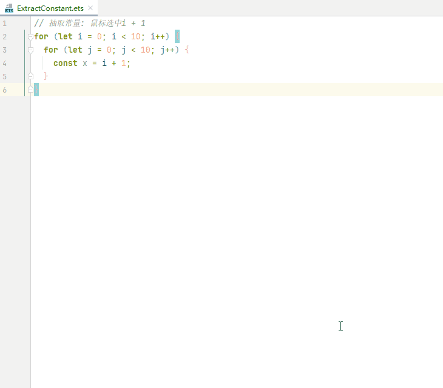

 
 

#### 移动函数体到声明处

编辑器支持将函数体从源文件移动到头文件中，提高代码可读性。编辑器内选中函数名，右键单击**Refactor**，选择**Move to Declaration**，源文件中的函数实现将移动至头文件中。
 

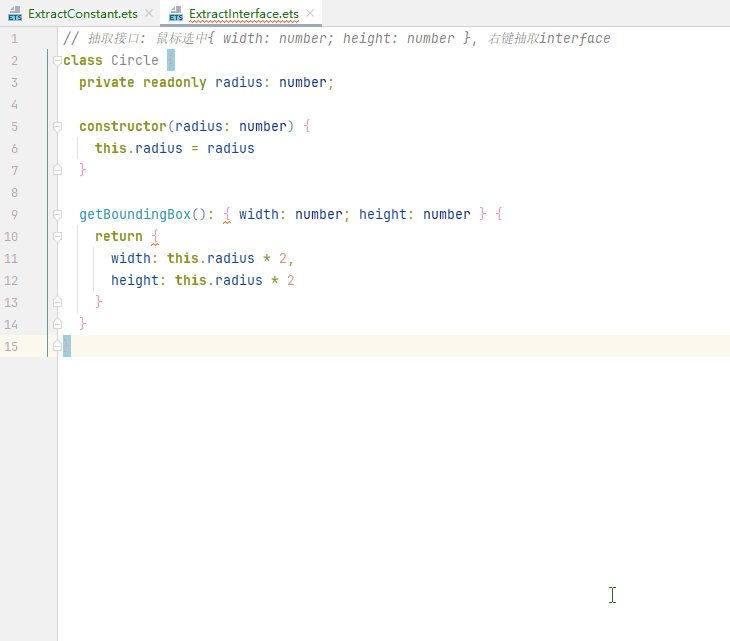

 
 

#### 移动函数体到实现处

在编辑器内将光标放在或选中函数名，右键单击**Refactor**，选择**Move to Implementation**，选择移动到的文件，将函数定义移动到该文件。
 

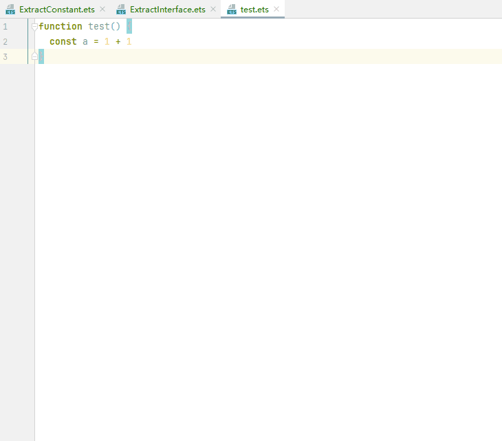

 

 
 

#### 将语句转为原始字符串

编辑器提供重构能力，支持将带有 \n, \t, \", \\, \'五类转义字符的字符串转换为原始字符串。当前仅支持标准字符串，不支持 u8""等其他字符串。
 
在编辑器内选择字符串代码区域，右键单击**Refactor**，选择**Convert To Raw String**，将语句转换为原始字符串。
 

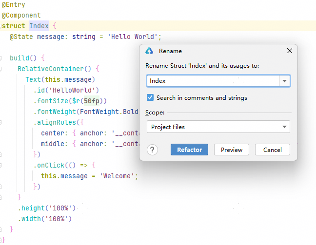

 
 

#### 定义构造函数

编辑器提供重构能力，支持为类的成员变量生成默认的构造函数。
 
**规格限制**
 1. 不支持未初始化成员变量的类
2. 不支持在（class标识符，类名，大括号）以外的位置触发
3. 不支持类已存在有入参的构造函数
 
**使用方法：**在类的定义的类名处，右键单击**Generate****...**，选择**Constructor**，在弹框中点击**Define**，为成员变量定义一个构造函数。
 

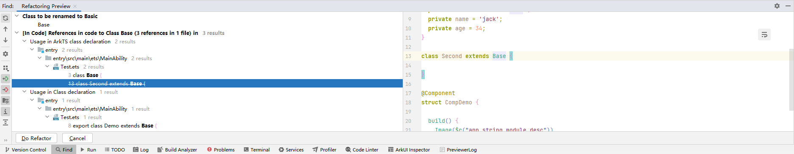

 
 

#### 提取表达式到变量

在编辑器内，选中需要提取的表达式范围，右键单击**Refactor**，选择**Extract Variable**，支持提取表达式到变量。
 

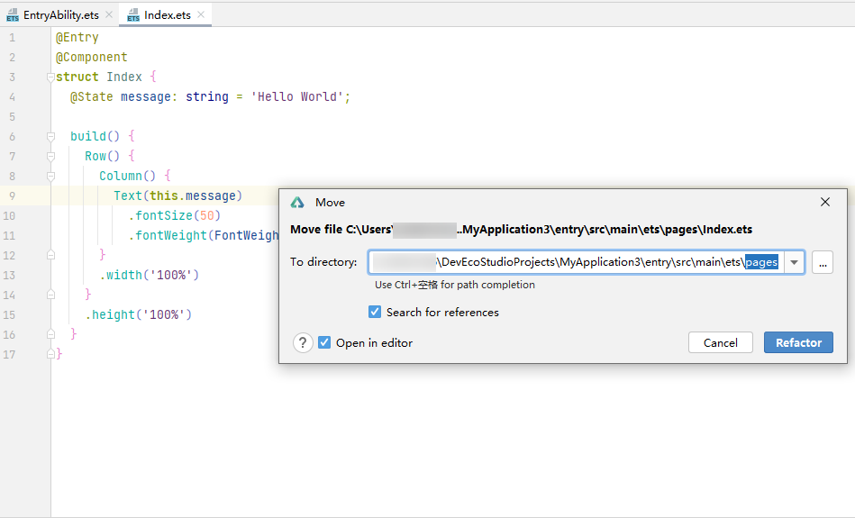

 
 

#### 移除namespace

光标停留在需要移除的namespace处，右键单击**Refactor**，选择**Remove Using Namespace**进行移除，可以避免命名冲突，提高代码可读性。
 

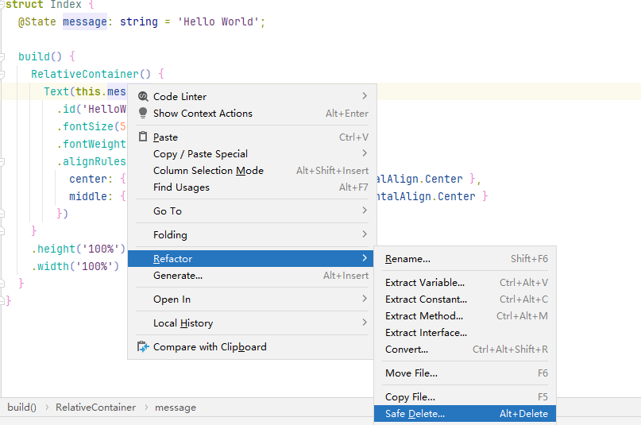

 
 

#### 添加using声明

编辑器内，光标停留在需要添加using声明处，右键单击**Refactor**，选择**Add Using**完成使用using定义类型别名。
 

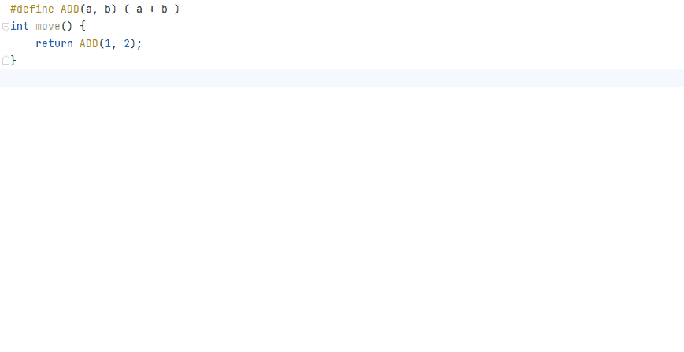

 
 

#### auto自动展开

在auto关键字处右键单击**Refactor**，选择**Expand Auto Type**，可以使用推断类型替换auto类型。
 

 
 

#### 声明隐式成员

编辑器支持在类中声明隐式复制/移动成员。光标停留在需要生成的类处，右键单击**Generate**..., 选择**Copy/Move Members**。
 

