# 代码阅读

更新时间：2026-04-30 02:42:31

来源：https://developer.huawei.com/consumer/cn/doc/harmonyos-guides/ide-editer-overview

DevEco Studio支持使用多种语言进行应用/元服务的开发，包括ArkTS、JS和C/C++。在编写应用/元服务阶段，可以通过掌握代码编写的各种常用技巧，来提升编码效率。
 

#### 代码高亮

支持对代码关键字、运算符、字符串、类、标识符、注释等进行高亮显示，您可以打开**File > ****Settings**（macOS为**DevEco Studio > Preferences/Settings**）面板，在**Editor > Color Scheme**自定义各字段的高亮显示颜色**。**默认情况下，您可以在**Language Defaults**中设置源代码中的各种高亮显示方案，该设置将对所有语言生效；如果您需要针对具体语言的源码高亮显示方案进行定制，可以在左侧边栏选择对应的语言，然后取消“Inherit values from”选项后设置对应的颜色即可。
 

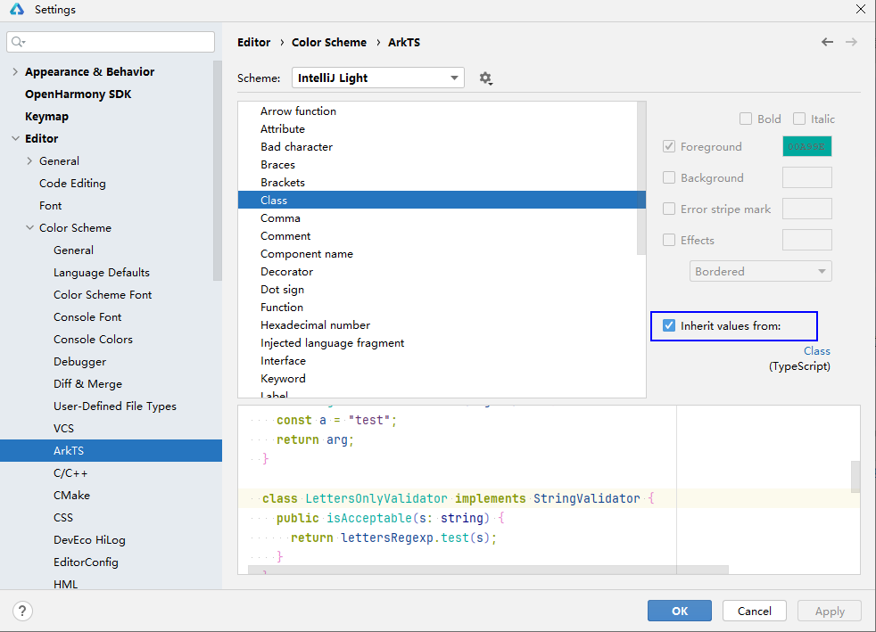

 
 

#### 代码跳转

在编辑器中，可以按住**Ctrl**键（macOS为**Command**键），鼠标单击代码中引用的类、方法、参数、变量等名称，自动跳转到定义处。若单击定义处的类、变量等名称，当仅有一处引用时，可直接跳转到引用位置；若有多处引用，在弹窗中可以选择想要查看的引用位置。
 

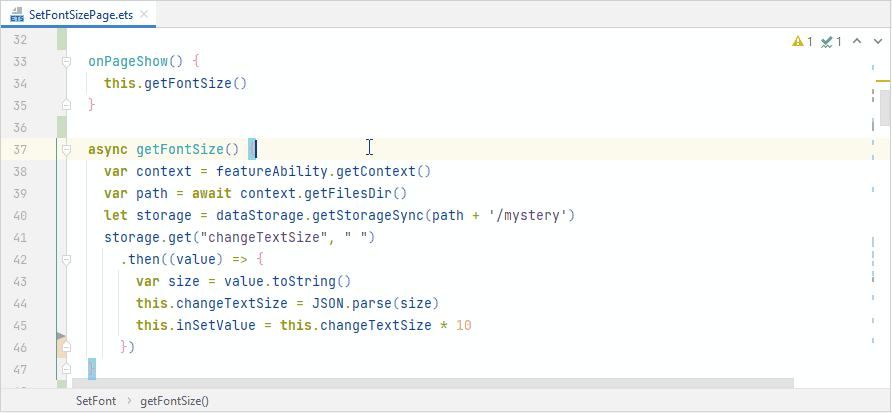

 
 

#### 跨语言跳转

DevEco Studio支持在声明或引用了Native接口的文件中（如d.ts）跨语言跳转其对应的C/C++函数，从而提升混合语言开发时的开发效率。您可以选中接口名称单击右键，在弹出的菜单中选择**Go To > Implementation(s)**（或使用快捷键**Ctrl+Alt+B**，macOS为**Command**+Option+B）实现跨语言跳转。
 


 
 

#### 代码格式化

代码格式化功能可以帮助您快速的调整和规范代码格式，提升代码的美观度和可读性。默认情况下，DevEco Studio已预置了代码格式化的规范，您也可以个性化的设置各个文件的格式化规范，设置方式如下：在**File > Settings > Editor > Code Style**（macOS为**DevEco Studio > Preferences/Settings > Editor > Code Style**）下，选择需要定制的文件类型，如ArkTS，然后自定义格式化规范即可。
 


 
在使用代码格式化功能时，您可以使用快捷键**Ctrl + Alt + L**（macOS为**Option+Command +L**） 快速对选定范围的代码进行格式化。
 
如果部分代码片段不需要进行自动的格式化处理，可以通过如下方式进行设置：
 1. 在**File > Settings >Editor > Code Style**（macOS为**DevEco Studio > Preferences/Settings > Editor > Code Style**），单击“Formatter”，勾选“Turn formatter on/off with markers in code comments”。

  
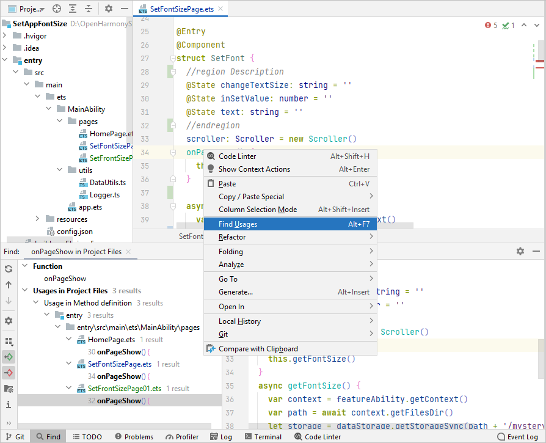

2. 在不需要进行格式化操作的代码块前增加“//@formatter:off”，并在该代码块的最后增加“//@formatter:on”，即表示对该范围的代码块不需要进行格式化操作。

  
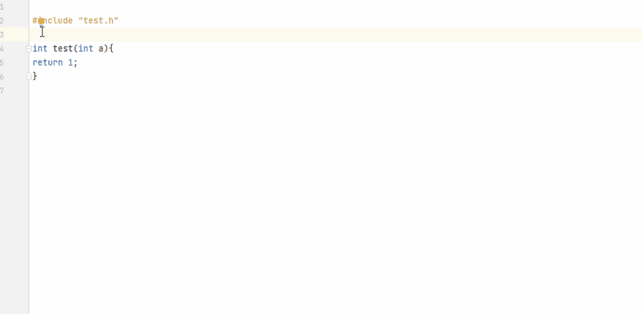

 
若工程已配置code-linter.json5文件，选中code-linter.json5文件右键选择**Apply CodeLinter Style Rules**，代码格式化规则将与已配置的code-linter.json5文件中相关规则保持一致。code-linter.json5文件配置请参考[配置代码检查规则](https://developer.huawei.com/consumer/cn/doc/harmonyos-guides/ide-code-linter#section19310459444)。
 

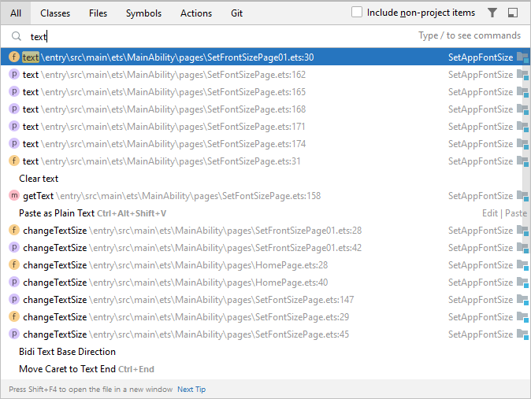

 
 

#### 代码折叠

支持对代码块的快速折叠和展开，既可以单击编辑器左侧边栏的折叠和展开按钮对代码块进行折叠和展开操作，还可以对选中的代码块单击鼠标右键选择折叠方式，包括折叠、递归折叠、全部折叠等操作。
 

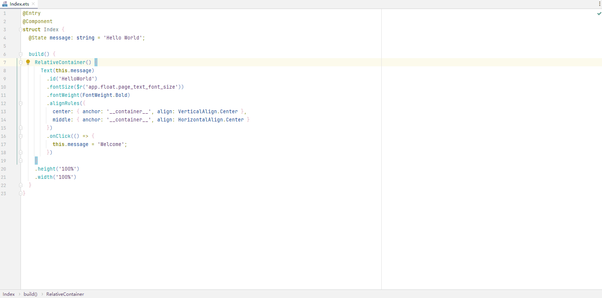

 
 

#### 代码快速注释

支持对选择的代码块进行快速注释，使用快捷键**Ctrl+/**（macOS为**Command+/**）进行快速注释。对于已注释的代码块，再次使用快捷键**Ctrl+/**（macOS为**Command+/**）取消注释。
 

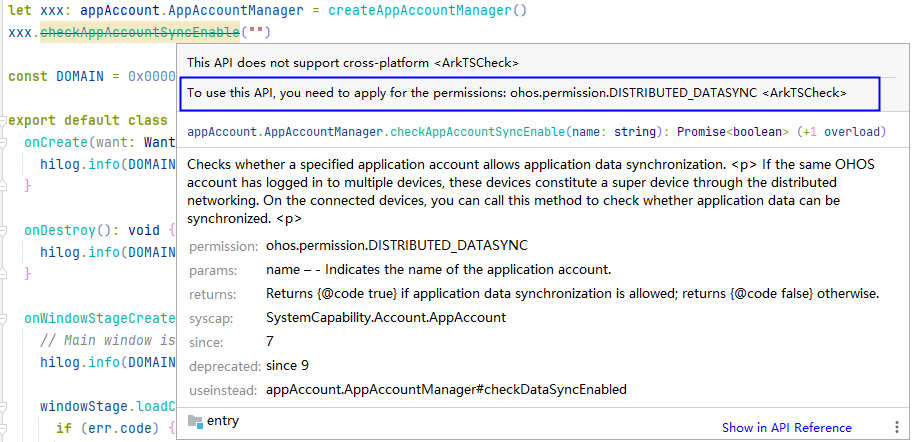

 
 

#### 代码结构树

使用快捷键**Alt + 7 / Ctrl + F12**（macOS为**Command+7**）打开代码结构树，快速查看文件代码的结构树，包括全局变量和函数，类成员变量和方法等，并可以跳转到对应代码行。
 

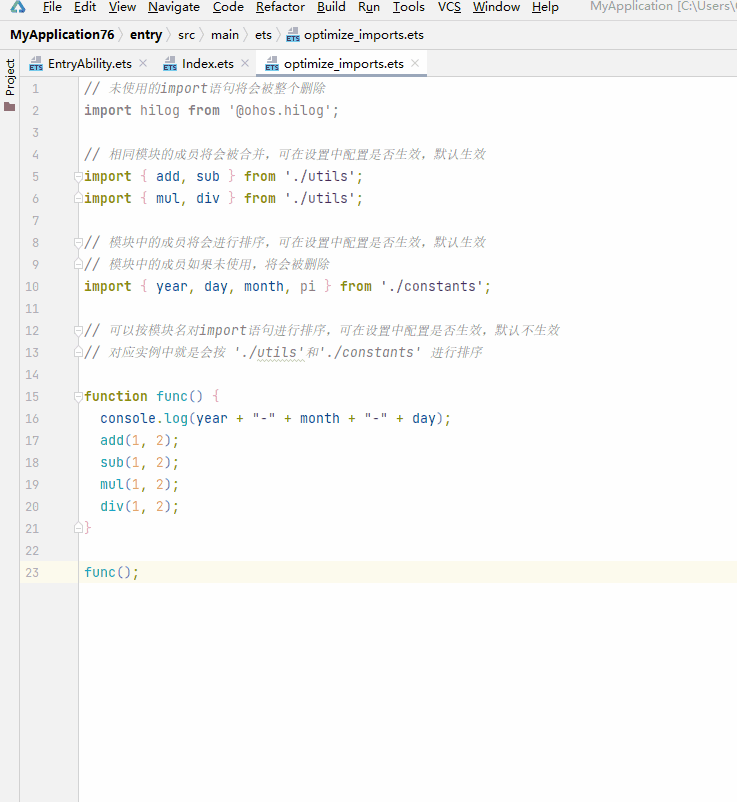

 
 

#### 代码引用查找

提供Find Usages代码引用查找功能，帮助开发者快速查看某个对象（变量、函数或者类等）被引用的地方，用于后续的代码重构，可以极大的提升开发者的开发效率。
 
使用方法：在要查找的对象上，单击鼠标**右键 > Find Usages**或使用快捷键**Alt +F7**（macOS为**Option +** **F7**）。可点击
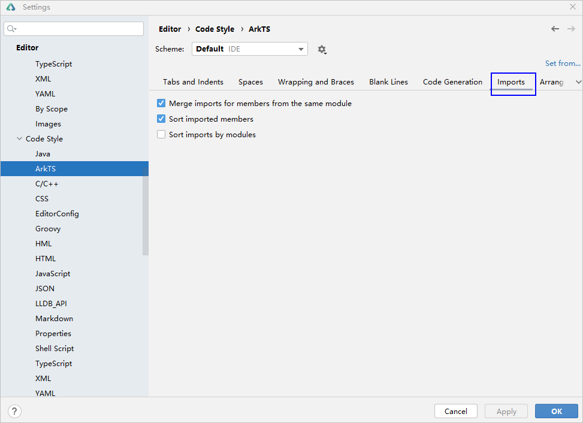
图标查看变量赋值位置，点击
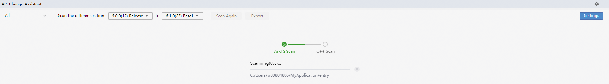
图标查看变量引用情况。
 

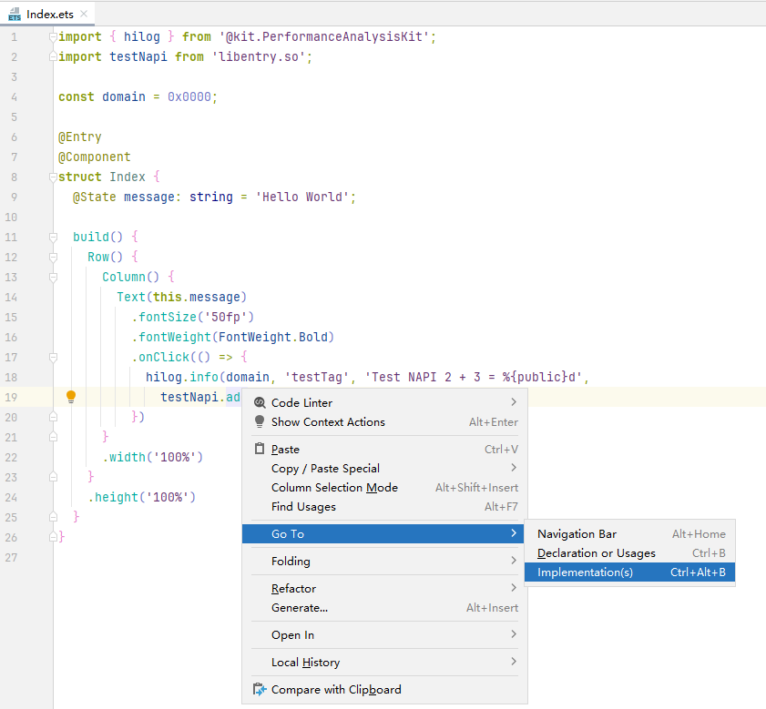

 
 

#### 函数注释生成

DevEco Studio支持在函数定义处，快速生成对应的注释。在函数定义的代码块前，输入**“/**”+回车键**，快速生成注释信息。
 
> [!NOTE]
> C++文件同时支持使用 “//!”+回车 键 快速生成注释。

 

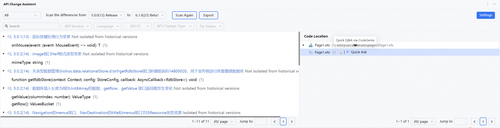

 
 

#### 代码查找

通过对符号、类或文件的即时导航来查找代码。检查调用或类型层次结构，轻松地搜索工程里的所有内容。通过连续点击**两次****Shift**快捷键，打开代码查找界面，在搜索框中输入需要查找内容，下方窗口实时展示搜索结果。单击查找的结果可以快速打开所在文件的位置。
 

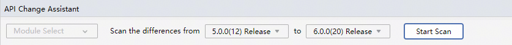

 
 

#### 快速查阅API接口及组件参考文档

从DevEco Studio 6.0.2 Beta1开始，Show in API Reference新增快捷键功能。
 
在编辑器中调用ArkTS/JS API或组件时，支持在编辑器中快速、精准调取出对应的参考文档。
 
可在编辑器中，鼠标悬停在需要查阅的接口或组件，弹窗将显示当前接口/组件在不同API版本下的参数等信息，单击弹窗右下角**Show in API Reference**；或选中接口或组件，右键点击**Show in API Reference**（或使用快捷键**Alt+A**，macOS为**Option+A**），可以快速查阅更详细的API文档。
 
> [!NOTE]
> DevEco Studio集成了离线版API参考类文档，最新版本请参考官网 HarmonyOS API参考 。

 

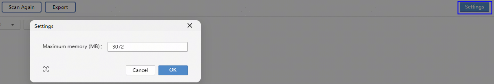

 
在弹窗中可以查看：
 1. 使用的API是否涉及权限申请或仅支持在测试框架下使用。
2. 使用的接口状态。**deprecated**标签表示即将废弃的API接口，可使用**useinstead**标记的API进行替代，请开发时关注。
 


 
 

#### Optimize Imports功能

使用编辑器提供的Optimize Imports，可以快速清除未使用的import，并根据设置的规则对import进行合并或排序。选择文件或目录，使用快捷键**Ctrl+Alt+O**（macOS为**Control+Option+O**），或单击菜单栏**Code > Optimize Imports**。
 


 
如需修改优化配置，进入**File > Settings**（macOS为**DevEco Studio > Preferences/Settings**）** > Editor > Code Style**，选择开发语言（当前以ArkTS为例），在**Imports**标签页中，可选择在优化时是否需合并来自同一模块的import，是否需要对同一条import语句导入的元素进行排序，或对多条import语句按模块排序。
 


 
 

#### API变更查询

从DevEco Studio 5.1.0 Release版本开始，DevEco Studio中支持查询、对比从某个选定的SDK版本开始，当前工程中使用到的ArkTS API是否存在行为变更，并提供相应适配指导链接，帮助开发者完成工程代码适配修改。
 
从DevEco Studio 5.1.1 Release版本开始，支持对C API的变更情况进行查询，提供跨版本查询能力。
 
从DevEco Studio 6.0.2 Beta1版本开始，新增扫描进度提示功能，以及变更接口在代码文件中具体位置需在Code Location中查看。
 
从DevEco Studio 6.1.0 Beta2版本开始，API变更查询接入CodeGenie快速问答功能，CodeGenie提供根据代码文件和变更文档输出非兼容API的修改建议，以及新增筛选API变更类型功能。
 
 

#### 使用约束

- 仅支持中国境内（香港特别行政区、澳门特别行政区、中国台湾除外）。
- API废弃情况不在API变更查询的扫描范围。

 
- ArkTS API函数调用过程中，当开发者使用的API存在泛型参数和包含extends或keyof关键字时，不支持变更查询。示例如下：
```text
// API定义
interface ProgressInterface {
  <Type extends keyof ProgressStyleMap>(options: ProgressOptions<Type>): ProgressAttribute<Type>;   //包含extends或keyof关键字不支持变更查询
}
// API调用
Progress({ value: 10, type: ProgressType.Capsule })
.style({content:'Install'})
```


 
- 使用C++语法实现的API函数变更，不支持查询。示例如下：
```text
template <class _Rep, class _Period>
cv_status condition_variable::wait_for(unique_lock<mutex>& __lk,const chrono::duration<_Rep, _Period>& __d)  //C++语法实现的API函数不支持查询
```


 
 
- C API扫描过程中，若存在与变更接口同名的函数，扫描结果可能会出现误报。
- 特殊调用方式下，不支持API变更查询。示例如下：
```text
// 反例：函数指针方式
int (*sigptr)(int, const struct sigaction *__restrict, struct sigaction *__restrict) = &sigaction;
sigptr(NULL,NULL);
// 反例：回调方式
callback(sigaction);
// 反例：自定义宏
#define MySig sigaction
MySig(NULL,NULL);
```


 

#### 操作步骤

**使用DevEco Studio 6.0.0 Release及以上版本，按以下步骤操作：**
 1. 在菜单栏点击**Tools > API Change Assistant**，编辑区下方的API Change Assistant页签中，支持按模块查看API变更情况，选择需要对比的SDK版本号范围，点击**Start Scan**开始扫描。同时，有进度条提示扫描进度。

  
> [!NOTE]
> API变更查询以选择的起始版本为基线，查询当前工程中所使用的API是否存在行为变更。如选择的SDK版本为5.0.0(12) Release 到 6.0.0(20) Release，查询的是5.0.1(13) Beta3到6.0.0(20) Release版本相比5.0.0(12) Release的API变更。


  
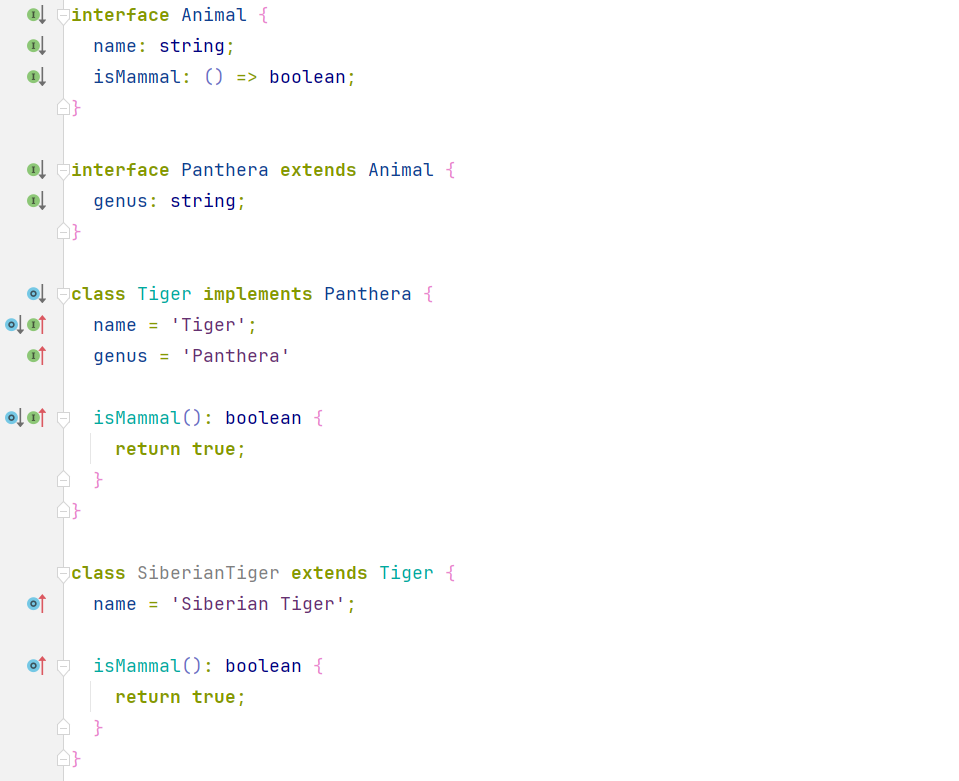

2. 点击扫描结果中的代码地址，跳转到相应的代码编写位置；点击蓝色高亮的变更描述，跳转至版本说明文档中查看详情；修改完后可点击
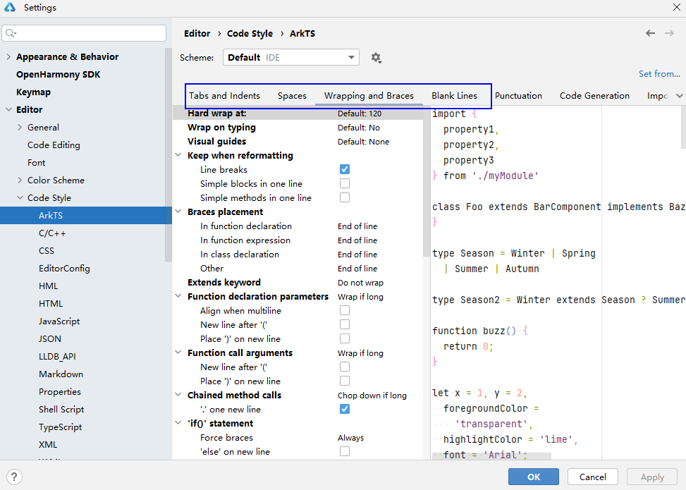
图标，标注已修改。同时，可通过如下入口搜索或筛选API变更扫描结果、导出扫描结果数据等。

  
- **Search**：支持在Search框中输入API名称或文件路径，对扫描结果搜索。

3. **API Version**：通过选择API版本，对扫描结果筛选。

4. **Language**：通过ArkTS或C语言，对扫描结果筛选。

5. **API ID**：通过行为变更的API接口，对扫描结果筛选。

6. **API Change Type**：API变更类型，取值包括All、UX visual Layout Change（UX视觉布局变更）、UX Interaction Behavior Change（UX交互行为变更）、API Behavior Change（接口行为变更）、API Change Deprecation（接口废弃变更）、API Definition Change（接口定义变更）。

7. **Fix Status**：API变更扫描结果的修复情况，All表示所有，Fixed表示已修复，Unfixed表示未修复。通过修复情况，对扫描结果筛选。

8. **Scan Again**：重新扫描。

9. **Export**：将API变更扫描结果数据导出到本地。

10. **Settings**：设置在扫描API时，可使用的最大堆内存的大小，默认值为3072MB。当工程代码量较大导致扫描缓慢时，可以调整该参数。

11. **Code Location**：变更接口在代码文件中的具体位置，点击可跳转至接口所在的代码行。点击位置右侧的**Quick Ask**可打开CodeGenie，在CodeGenie对话框点击发送，会根据代码文件和变更文档输出不兼容API修改建议；若文件中存在多处变更，CodeGenie根据文件中所有变更点输出不兼容API修改建议。

  **使用DevEco Studio 6.0.0 Release以下版本，按以下步骤操作：**

1. 在菜单栏点击**Tools > API Change Assistant**，编辑区下方的API Change Assistant页签中，支持按模块查看API变更情况，选择需要对比的SDK版本号范围，点击**Start Scan**开始扫描。

  
> [!NOTE]
> API变更查询以选择的起始版本为基线，查询当前工程中所使用的API是否存在行为变更。如选择的SDK版本为5.0.0(12) Release 到 6.0.0(20) Release，查询的是5.0.1(13) Beta3到6.0.0(20) Release版本相比5.0.0(12) Release的API变更。


  
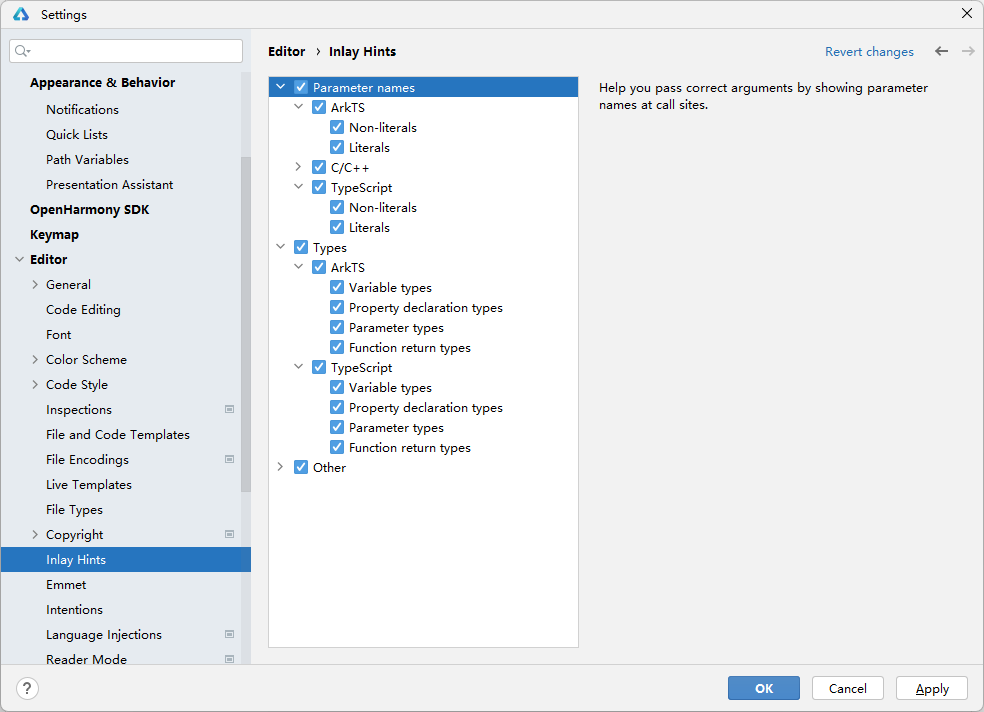


2. 点击Code Location中的代码地址，跳转到相应的代码编写位置；如需更多指导，可点击Guidance link中的链接，跳转至版本说明文档中查看详情。

  
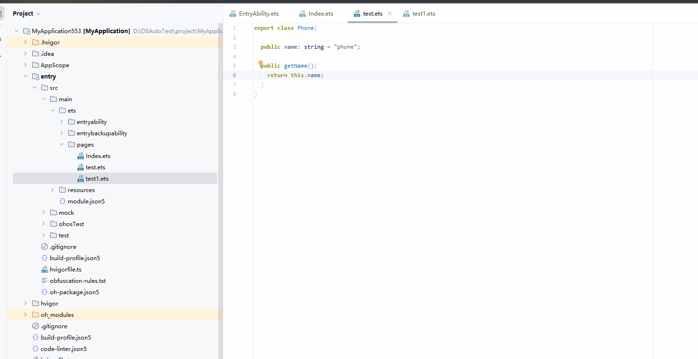


3. 点击**Export**，选择API变更的存放位置后导出变更数据；点击**Scan Again**可重新进行扫描。通过右侧**Settings**按钮，可以设置在扫描API时，可使用的最大堆内存的大小，默认值为3072MB，当工程代码量较大导致扫描缓慢时，可以调整该参数。

  
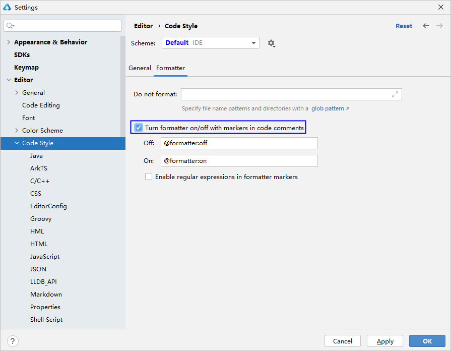


  

  #### 父/子类快速跳转

  编辑器支持快速跳转至当前接口、类、方法、属性的子类/父类。点击代码编辑区域左侧的Gutter Icons（装订线图标）可以跳转到对应的父/子接口或类。如有多个继承关系，在弹窗的文件列表中选择需要查看的接口/类即可。

  

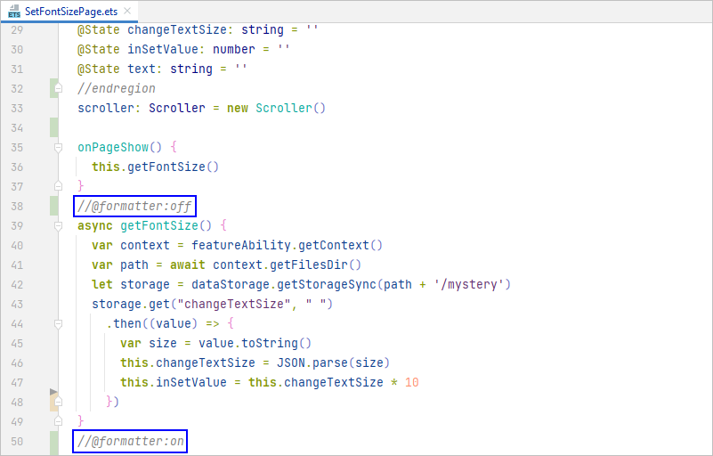
Implemented：支持跳转到对应的实现类或子接口及其对应的属性/方法。
- 
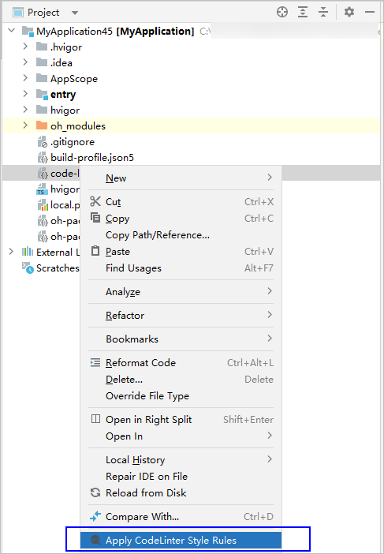
Implementing：支持跳转到对应的父接口或父接口的属性/方法。
- 
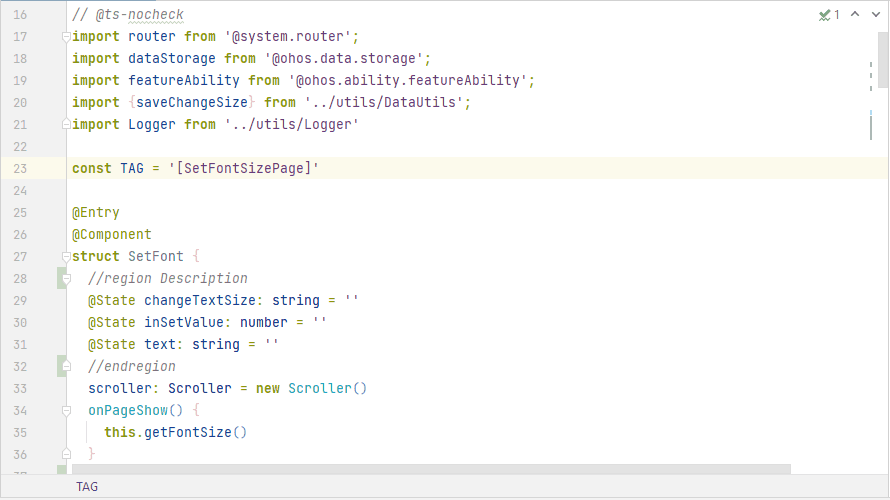
Overridden：支持跳转到对应的子类或子类的属性/方法。
- 
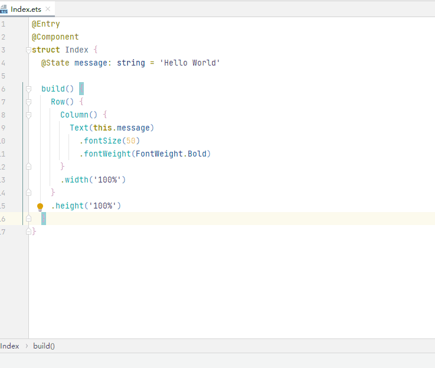
Overriding：支持跳转到对应的父类或父类的属性/方法。

 

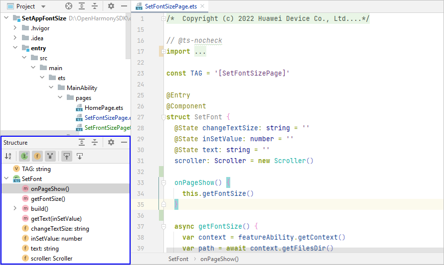

 
本功能默认开启，可以通过菜单栏进入**File > Settings**（macOS为**DevEco Studio > Preferences/Settings**）** > Editor > General > Gutter Icons**，通过勾选或取消勾选Implemented、Implementing、Overridden、Overriding四项可以开启或关闭该功能。
 


 
 

#### 查看接口/类的层次结构

编辑器支持查看当前接口/类父类或子类的层次结构。选中或将光标放置于类/接口名称处，使用**快捷键Ctrl+H**（macOS为**Control+H**），或在菜单栏**Navigate**页签下选择**Type Hierarchy**，在弹出的Hierarchy窗口中查看接口/类的继承关系结构。
 


 
Hierarchy窗口按钮功能：
 
  
| 图标 | 功能 |
| --- | --- |
|  | 显示所选类的父类和子类。 该功能不支持查看接口的继承关系。 |
|  | 显示当前类/接口的父类。 |
|  | 显示当前类/接口的子类。 |
|  | 按字母顺序对继承关系结构树中的所有同级元素进行排序。 |
|  | 更新显示所有的类/接口的继承关系结构。 |
|  | 默认双击结构树中类/接口名称时，编辑窗口将跳转至所选类/接口所在的代码位置。勾选该选项后，单击结构树中类/接口名称，即可跳转访问。 |
|  | 展开/折叠继承关系结构。 |
|  | 锁定当前Hierarchy窗口显示于编辑窗口上。 |
|  | 将类/接口的继承关系结构导出到文本文件中。 |
|  | 关闭工具窗口。 |
 
 

#### 添加嵌入提示

从DevEco Studio 6.0.0 Beta2 版本开始，在编辑时启用Inlay Hints嵌入提示功能，可以提供有关参数名称、类型等代码说明信息，提升代码可读性。
 


 
进入**File > Settings**（macOS为**DevEco Studio > Preferences****/Settings**）** > Editor > ****Inlay Hints**，配置勾选希望展示的变量名称、属性、参数、返回值类型，点击**OK**后生效。
 
 


 

 

#### Copy Reference

从DevEco Studio 6.0.0 Beta2 版本开始，在编辑页面选中代码行或类、方法、参数、变量等名称，右键选择**Copy / Paste Special > Copy Reference**，将自动复制定义处的地址。复制成功的地址可以在双击**Shift**弹出的搜索框中进行搜索，帮助开发者快速找到该接口的定义位置。
 


