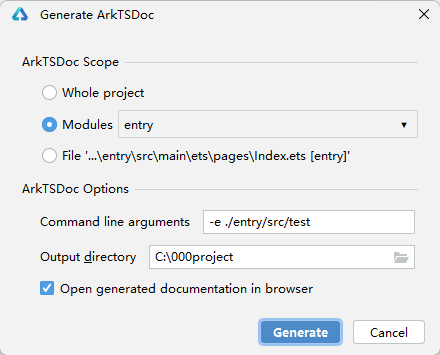
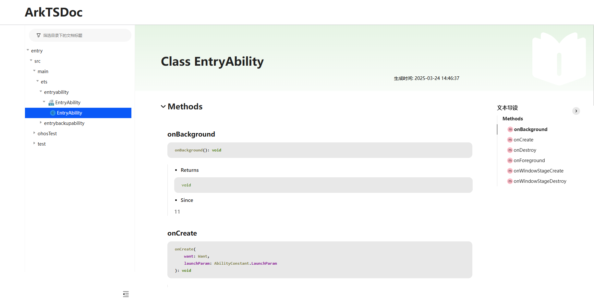

# 文档生成

更新时间：2026-05-14 10:06:01

来源：https://developer.huawei.com/consumer/cn/doc/harmonyos-guides/ide-arktsdoc-generation

DevEco Studio支持通过Generate ArkTSDoc功能，将代码文件中变量、方法、接口、类等需要对外暴露的信息快速生成相应的参考文档。
 
从DevEco Studio 6.1.0 Beta1版本开始，ArkTSDoc功能支持多模块导出，以及导出时支持设置不需要被导出的目录。
 
> [!NOTE]
> 当前支持对工程或目录下.ets/.ts/.js/.md格式文件生成ArkTSDoc文档。 文件中export的变量、方法、接口、类等将生成相应的ArkTSDoc文档，未export的对象不支持生成。 若选择对工程/目录整体导出ArkTSDoc文档，生成后的ArkTSDoc文档目录和原目录结构一致。

 

##### 生成步骤

1. 在菜单栏选择**Tools > ****Generate ArkTSDoc...**进入ArkTSDoc生成界面。
2. 设置生成ArkTSDoc的范围，可选择整个工程、单个模块或多个模块，某个目录或单个文件进行导出。

  点击**Modules**后的下拉箭头，会弹出所有模块，可以选择单个或多个模块作为导出范围。当模块数量较多时，可以使用检索功能，快速定位模块。

  


3. 在导出时，可以在**Command line arguments**设置无需被导出的目录，使用"-e"子命令进行指定，多个目录使用英文";"分隔，使用"./"开头路径代表项目根路径。

  



  
> [!NOTE]
> 从DevEco Studio 6.1.0 Release版本开始， Command line arguments 填写时支持Ant风格的路径匹配模式。在Ant风格中，使用'?'匹配单字符、'*'匹配单层目录/文件、'**'匹配任意层目录等。

4. 在**Output directory**中输入导出ArkTSDoc的存储路径后，点击**Generate**。
5. 若勾选**Open generated documentation in browser**选项，在生成ArkTSDoc后，将自动打开相应页面查看生成的文档。配置完毕后点击Generate，开始扫描并生成ArkTSDoc文档。

  生成的ArkTSDoc左侧文档目录和原工程目录结构一致，右侧可点击跳转到当前文件包含的某个变量、方法、接口或类的文档位置。

  


  若没有勾选**Open generated documentation in browser**选项，在生成ArkTSDoc后，DevEco Studio右下角弹出对应提示框，可以点击Go to Folder跳转到生成的ArkTSDoc文件夹，用浏览器打开文件夹中index.html文件即可查看ArkTSDoc文档。
 

##### 生成效果示例

**注释格式要求：**当前仅支持“/** */”文档注释格式；支持param等[标准标签](https://developer.huawei.com/consumer/cn/doc/harmonyos-guides/ide-arktsdocs-standard-label)和myTag等自定义标签生成相应文档。
```text
/**
 * Prints "log" logs.
 *
 * @param { string } message - Text to print.
 * @myTag
 * @since 11
 */
```
 
 
 
**代码示例：**
 
```text
/**
 * Defines the demo class
 *
 * @since 11
 */
export class Demo {
    /**
     * Prints "log" logs.
     *
     * @param { string } message - Text to print.
     * @myTag
     * @since 11
     */
    static log(message: string): void {
        
    }
}
```
 
**ArkTSDoc文档生成结果：**
 


