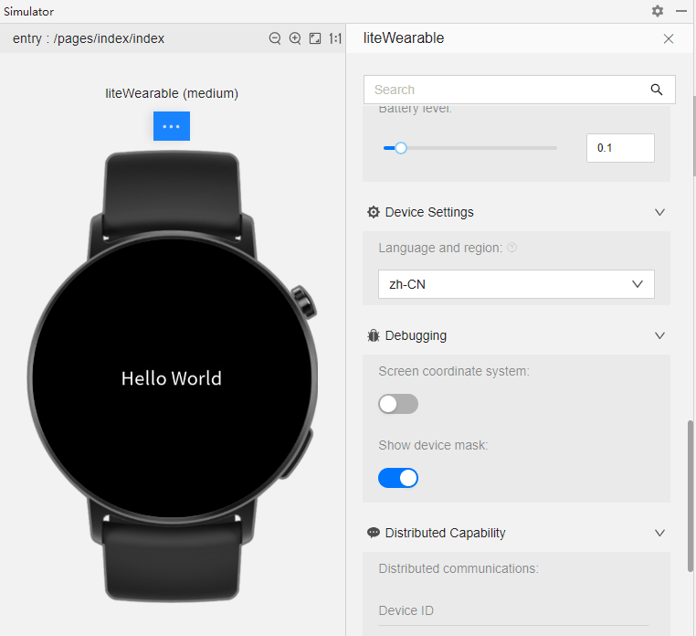
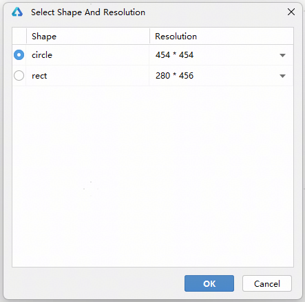
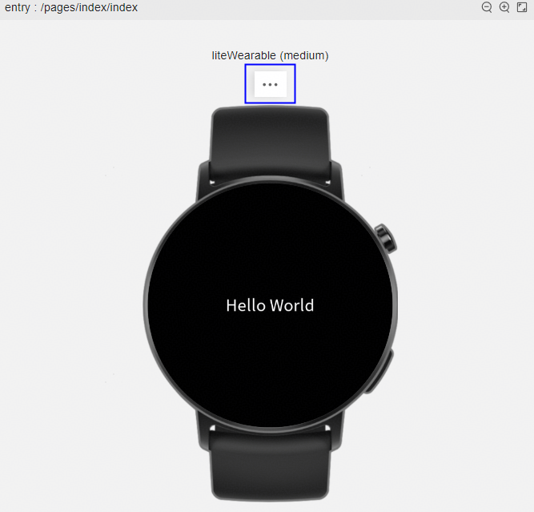
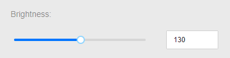
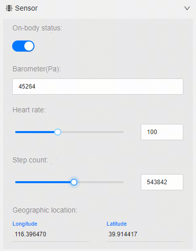
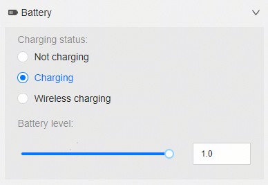
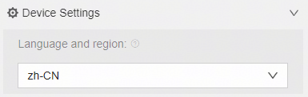
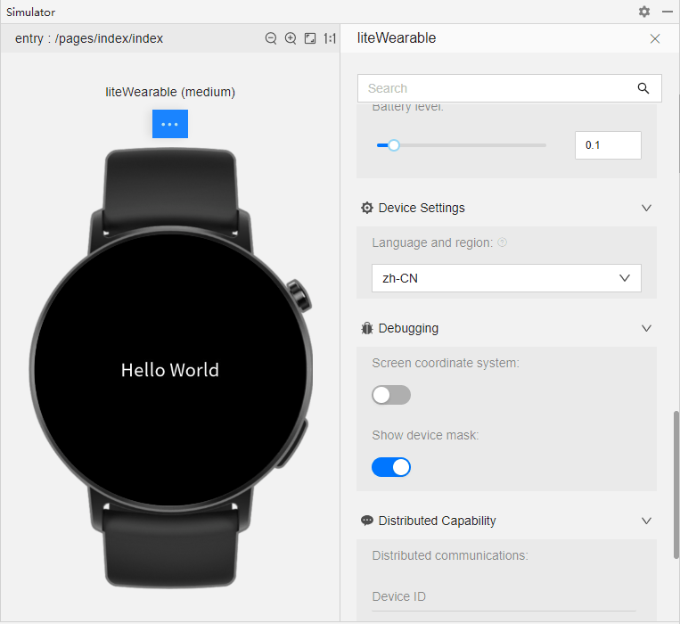

# 使用仿真器运行轻量级穿戴应用

更新时间：2026-01-15 06:51:04

来源：https://developer.huawei.com/consumer/cn/doc/harmonyos-guides/ide-run-simulator

DevEco Studio提供的**Simulator**可以运行和调试Lite Wearable设备上的HarmonyOS应用，兼容签名与不签名两种类型的HAP。
 

##### 操作步骤
1. 在DevEco Studio右上角的设备框中选择**Huawei Lite Wearable Simulator。**

2. 点击**Run **

或**Debug **

按钮，在弹框中选择设备形状和分辨率，点击**OK**按钮，开始运行或调试应用。

3. DevEco Studio会启动编译构建和安装，完成后应用即可运行在Simulator上。
 
 

##### 功能介绍

在Simulator界面中，点击设备上方的**More**可展开更多功能。
 

 
 

##### 屏幕

- **Turn screen on：**控制屏幕开关。
- **Keep screen on：**控制屏幕是否保持常亮状态。关闭开关时，息屏计时结束后，屏幕自动关闭，同时**Turn screen on**开关自动关闭。开启屏幕后，打开**Keep screen on**开关才能使屏幕常亮。
- **Brightness adjustment mode：**调节屏幕亮度。
**Manual：**手动调节，可拖动滑动条，或直接输入亮度。

- **Automatic：**自动调节。

 - **Resolution：**运行/调试模式下暂不支持调整分辨率，如需调整，请停止运行后，按照[操作步骤](#section1332819367496)选择分辨率。

 
 

##### 传感器

仿真器提供了虚拟传感器来模拟硬件传感器的能力。在该界面，您可以调节不同的传感器来测试您的应用，使用[@system.sensor](https://developer.huawei.com/consumer/cn/doc/harmonyos-references/js-apis-system-sensor)模块监听传感器值的变化，使用[@system.geolocation](https://developer.huawei.com/consumer/cn/doc/harmonyos-references/js-apis-system-location)模块监听地理位置的变化。仿真器提供以下虚拟传感器：
 
- **On-body status**：传感器所在设备穿戴状态，包括已穿戴和未穿戴。
- **Barometer：**气压传感器用于测量环境气压，单位为Pa。
- **Heart rate：**心率传感器用于测量心率数值，拖动滑动条，或直接输入心率大小。
- **Step count：**计步传感器用于统计行走步数，拖动滑动条，或直接输入步数。
- **Geographic location：**输入经度、纬度，模拟设备所处的地理位置。

 

 
 

##### 电池

您可以通过仿真器模拟不同的电池状态，包括以下三种充电状态，也可以手动输入或拖动滑动条来改变电量大小。在应用中，您可以通过[@system.battery](https://developer.huawei.com/consumer/cn/doc/harmonyos-references/js-apis-system-battery)模块查询仿真器的剩余电量以及充电状态。
- Not charging：未充电。
- Charging：正在充电。
- Wireless charging：无线充电。

 
 

 
 

##### 设备设置

您可以更改设备的语言和地区，当前仅运行模式可以更改，调试模式暂不支持。
 

 
 

##### 调试

- **Screen coordinate system****：**开启屏幕坐标系后，将光标移动到表盘上时，会显示屏幕坐标。

- **Show device mask****：**关闭开关后，表盘周围的表冠颜色淡化。

