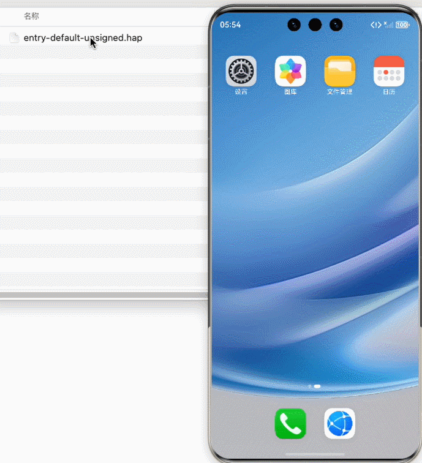

# 安装应用程序包和上传文件

更新时间：2026-04-20 06:32:02

来源：https://developer.huawei.com/consumer/cn/doc/harmonyos-guides/ide-emulator-install-upload

- 安装应用程序包您可以将本地的HAP包安装到模拟器上，只需要将本地的HAP包拖动到屏幕上即可进行安装，支持一次性拖拽安装多个HAP包。模拟器也支持安装包含HSP文件的应用，只需要将HSP和HAP一起拖动到屏幕上即可进行安装。

  您也可以在命令行窗口进入DevEco Studio安装目录的sdk\default\openharmony\toolchains目录下，使用hdc app install命令安装包。安装完成后，可在应用列表里查看已安装的应用。
- 上传文件您可以将本地文件上传到模拟器中，只需要将文件拖动至模拟器屏幕上即可。模拟器支持批量上传文件，上传的文件存放在虚拟设备的/storage/media/100/local/files/Docs/Download/目录下。您可以在模拟器上打开**文件管理 > 我的手机 > 下载**查看上传的文件。

  此外，您也可以在命令行窗口进入DevEco Studio安装目录的sdk\default\openharmony\toolchains目录下，使用hdc file send命令上传文件。

  从DevEco Studio 6.1.0 Beta2版本开始，使用API 21及以上的镜像时，上传的图片类文件将保存在图库中。

 

