# 更多的扩展能力

更新时间：2026-05-26 06:48:01

来源：https://developer.huawei.com/consumer/cn/doc/harmonyos-guides/ide-emulator-more-features

模拟器支持电池、GPS、虚拟传感器等扩展能力，具体使用方式参考以下介绍。点击模拟器菜单栏的

，打开扩展菜单栏。
 

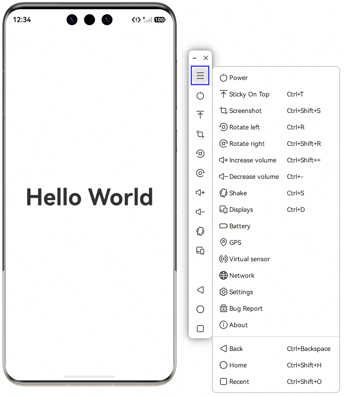

 

##### 电池

您可以在模拟器上模拟不同电池状态。在扩展菜单栏上点击

打开电池模拟界面。在该界面，您可以手动输入或拖动滑块来改变电量百分比，也可以点击
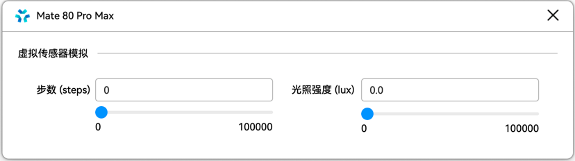
切换电池的充电/放电状态。电池具有以下三种充电状态：
 
- ENABLE：开启充电按钮，此时正在充电且电量没充满。
- NONE：关闭充电按钮，此时停止充电。
- FULL：开启充电按钮，且电量为100%，电量已充满。

 
在应用中，您可以通过[@ohos.batteryInfo](https://developer.huawei.com/consumer/cn/doc/harmonyos-references/js-apis-battery-info)模块查询模拟器的剩余电量以及充电状态。
 

 
 

##### GPS定位

模拟器可以模拟设备所处的位置。您可以打开扩展菜单，并点击
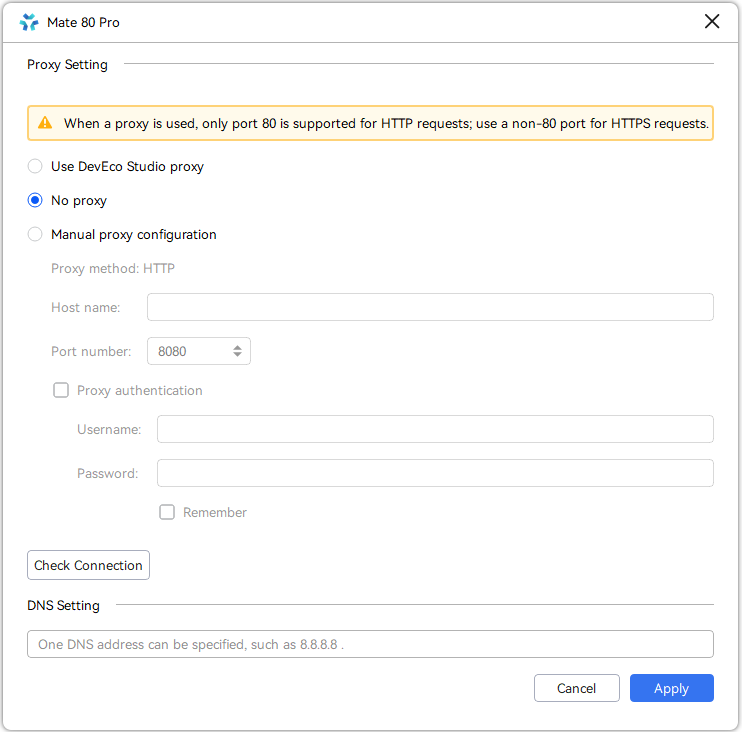
进行位置信息的设置。模拟器提供以下方式的GPS位置模拟：
 
- 手动设置：在该界面，您可以手动输入此时所处位置的经度，纬度，海拔以及方位角。您也可以通过点击城市下拉框，快速定位到所选城市。
- 导入：在导入界面您可以注入一段时间内的连续位置信息。点击

导入本地的GPX文件，点击
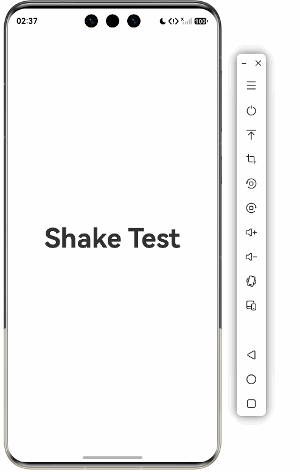
即可开始模拟GPX文件中的轨迹。此外，您还可以选择不同回放速率来改变移动的速度。
- 场景模拟：如果没有本地的GPX文件，您可以在场景模拟界面使用我们预置的GPX文件。我们在模拟器内部预置了户外跑步、户外骑行、驾驶导航三种场景的GPX文件，点击
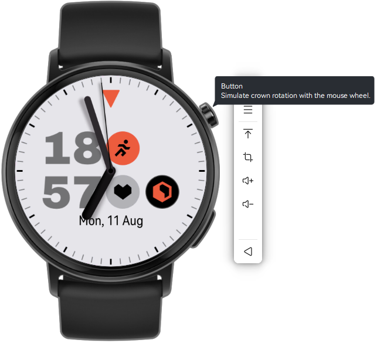
即可开始轨迹模拟。
> [!NOTE]
> 场景模拟功能仅支持中国境内（香港特别行政区、澳门特别行政区、中国台湾除外）。

 
在应用中，您可以通过[@ohos.geoLocationManager](https://developer.huawei.com/consumer/cn/doc/harmonyos-references/js-apis-geolocationmanager)模块获取模拟器的位置信息。
 

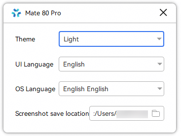

 
 

##### 虚拟传感器

模拟器提供了虚拟传感器来模拟硬件传感器的能力。在扩展菜单上点击

打开虚拟传感器界面。在该界面，您可以调节不同的传感器来测试您的应用，使用[@ohos.sensor](https://developer.huawei.com/consumer/cn/doc/harmonyos-references/js-apis-sensor)模块监听传感器值的变化。模拟器提供以下虚拟传感器：
 
- 计步传感器：用于测量步数，对应的SensorId为PEDOMETER。
- 环境光传感器：用于测量光照强度，对应的SensorId为AMBIENT_LIGHT。
- 心率传感器：用于测量心率，对应的SensorId为HEART_RATE。从DevEco Studio 6.1.0 Beta1版本开始，Wearable设备支持心率传感器。

 
您可以拖动滑动条或者直接在文本框输入来改变不同传感器的值。
 

 

 
 

##### 网络

模拟器的网络功能支持配置代理服务器和DNS地址，打开扩展菜单栏，并点击
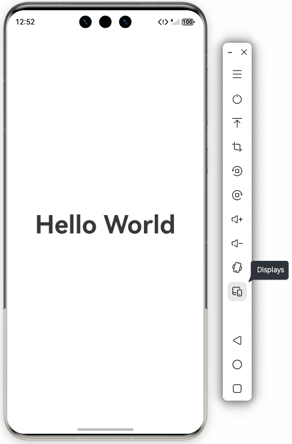
打开网络界面。
 
**代理设置**
 
模拟器可以将网络请求代理到代理服务器，利用代理服务器去请求目标服务器。从而满足以下开发场景：
 
- 开发者处于内网环境，希望通过设置代理的方式访问外网；
- 开发者已经在DevEco Studio上配置了网络代理，不希望在模拟器上重复配置代理；
- 开发者需要将网络请求代理到三方抓包工具，方便查看请求信息。

 
模拟器提供以下三种代理模式：
 
- **使用DevEco Studio代理：**读取并应用[DevEco Studio上的网络代理配置](https://developer.huawei.com/consumer/cn/doc/harmonyos-guides/ide-environment-config#section10369436568)。
> [!NOTE]
> 使用DevEco Studio代理时，模拟器不支持以下能力： 不支持 自动检测代理（Auto-detect proxy settings）和SOCKS代理 ，会自动切换到无代理模式； 不支持 HTTP代理 下的 No proxy for 功能。

- **无代理：**不使用代理，即发送网络请求时会直接去请求目标服务器。
- **手工配置代理：**配置代理服务器的信息，将网络请求代理到代理服务器上。

 
配置代理后，可以点击**Check Connection**对当前的代理配置进行校验，并点击**Apply**按钮进行保存。在发起https请求时，需要安装网站的数字证书，请参考[使用模拟器发起https请求时如何安装数字证书](https://developer.huawei.com/consumer/cn/doc/harmonyos-faqs/faqs-app-running-27)。
 
**DNS设置**
 
从DevEco Studio 6.1.0 Beta2版本开始，新增DNS设置功能，开发者可以手动设置DNS服务器用于域名解析。
 

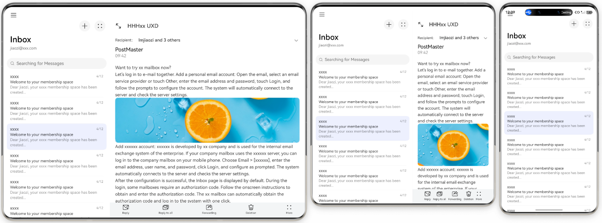

 
 

##### 摇一摇

模拟器可以模拟用户对设备的摇一摇操作。点击工具栏上的
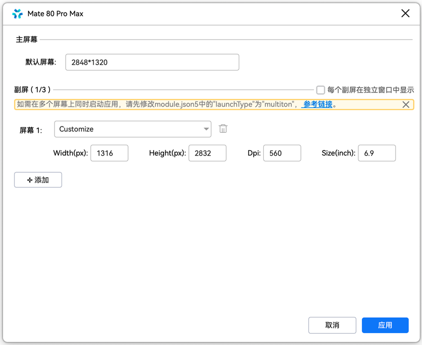
，您可以模拟时长为1s的摇一摇操作。您的应用可以通过[@ohos.sensor](https://developer.huawei.com/consumer/cn/doc/harmonyos-references/js-apis-sensor)模块监听加速度传感器变化，当加速度传感器的变化量达到设定阈值时，触发摇一摇对应的业务逻辑。
 
> [!NOTE]
> 仅phone和tablet类型的设备支持摇一摇。

 

 

 
 

##### 音频输入

模拟器当前仅支持Audio Kit（音频服务）提供的音频输入能力，您可以使用本地计算机上的麦克风设备向模拟器中传输音频数据。使用步骤如下：
 1. 首先，请确保本地计算机已连接上麦克风设备。
2. 应用调用Audio Kit提供的API接口（如AudioCapturer、OHAudio）开始接收音频数据。
3. 使用本地麦克风进行语音输入。
 
模拟器上的应用在调用相关API时，推荐使用如下格式的音频流信息格式，以保证清晰流畅的音质。
  
| 音频流信息 | 推荐值 |
| --- | --- |
| samplingRate（采样率） | 48000Hz |
| channels（通道数） | 2 |
| sampleFormat（采样格式） | 带符号的16位整数 |
| encodingType（编码格式） | PCM编码 |
 
 
 

##### 摄像头

从DevEco Studio 5.1.0 Release版本开始，模拟器支持调用本地计算机摄像头。例如，通过调用Camera Kit（相机服务）提供的接口，可以在模拟器上实现拍照和预览功能；通过Scan Kit（统一扫码服务），在API 20及以上版本的模拟器上实现扫码功能，等等。其他依赖摄像头能力的Kit，请参考对应Kit简介中的模拟器支持情况。
 
模拟器调用摄像头的开发步骤如下：
 1. 请确保本地计算机上存在可用的摄像头，不支持通过USB连接的摄像头。
2. 应用调用对应Kit提供的API接口，通过电脑摄像头实现预览、拍照、扫码等功能。

  
> [!NOTE]
> 使用模拟器开发相机时， 相机配置信息 请使用：RGBA_8888格式、1280 * 720分辨率。

 
 

##### 表冠

穿戴模拟器可以模拟表冠功能。
 
- 鼠标单击表冠：根据当前所在页面，单击后跳转到表盘或桌面。
- 鼠标双击表冠：进入多任务管理界面。
- 在屏幕上使用鼠标滚轮：模拟表冠旋转。

 

 
 

##### 设置

模拟器支持设置主题、语言和截屏保存路径。打开扩展菜单栏，并点击
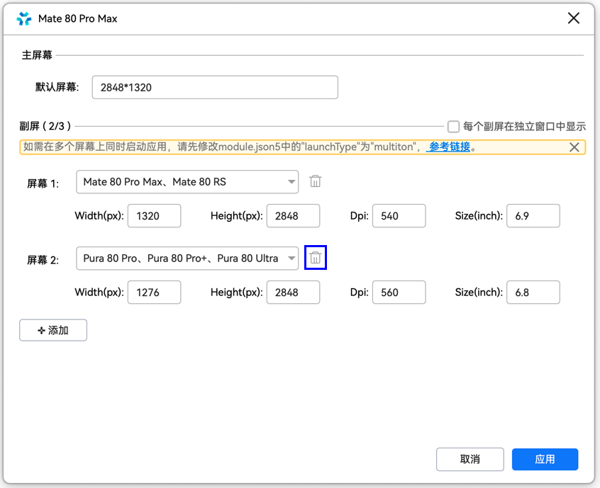
打开设置面板。
 
- **主题****：**支持Light和Dark两种主题。
- **语言：**
**界面语言：**设置模拟器工具栏的语言。从DevEco Studio 6.1.0 Beta2版本开始，设置界面语言后，对所有模拟器都生效。
- **OS语言：**从DevEco Studio 6.1.0 Beta2版本开始，支持设置模拟器镜像中的语言。此处的OS语言设置和模拟器的**设置 > 系统**中的语言设置效果相同。

 
首次启动模拟器时，会根据当前计算机的系统语言，对模拟器的界面语言和OS语言进行初始化。如果计算机的系统语言不在模拟器的支持范围内，则模拟器语言默认使用英文。
 
如需重置OS语言，可通过**Wipe User Data**进行清除重置。界面语言不支持重置，只能再次修改。
 - **截屏保存路径：**设置模拟器工具栏的截屏功能对应的图片保存路径。

 

 
 

##### 多屏

从DevEco Studio 6.0.0 Beta1版本开始，模拟器可以使用多屏能力，基于同一个镜像创建不同分辨率、DPI的多屏幕模拟器，满足开发者快速测试不同分辨率、DPI场景下的UI布局等需求。
 
 

##### 使用约束

- 模拟器旋转功能和多屏功能互斥，不能同时使用。
- 仅phone类型的模拟器支持多屏能力。从DevEco Studio 6.0.1 Beta1版本开始，新增tablet类型的模拟器支持多屏能力。
- 多屏状态下扩展屏不支持使用画中画功能、不支持鼠标滚轮操作。

 
 

##### 添加屏幕
1. 启动模拟器，点击工具栏的多屏按钮
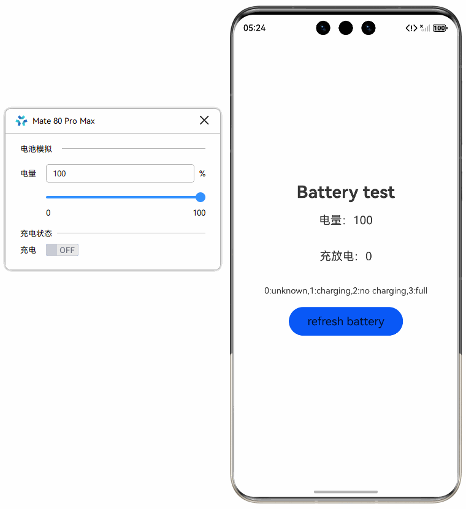
，打开多屏界面。

2. 点击**添加**，可以选择Mate系列、Pura系列、Nova系列等产品型号，点击**应用**即可添加对应的屏幕。默认情况下，所有的屏幕是整体拖动和缩放的，如需单独拖动和缩放单个屏幕，请勾选界面上的**每个副屏在独立窗口中显示**，并点击**应用**按钮。从DevEco Studio 6.0.1 Beta1版本开始支持。

  

3. 如需在多个屏幕上同时启动应用，请按界面提示，将module.json5中的launchType字段配置为multiton，具体请参考[UIAbility组件启动模式](https://developer.huawei.com/consumer/cn/doc/harmonyos-guides/uiability-launch-type)。

 
 

##### 修改屏幕参数

如需自定义屏幕分辨率、DPI或尺寸，可以在多屏界面上直接修改屏幕参数，取值范围参考界面提示，修改后点击**应用**。
 
- **Width**：宽度，单位为px。
- **Height**：高度，单位为px。
- **DPI**：像素密度，DPI 越高，UI组件占用的像素点越多，从而提供更精细的显示效果。
- **Size：**屏幕的对角线长度，单位为inch。

 

 
 

##### 使用扩展屏

- 点击扩展屏，再点击模拟器工具栏返回按键
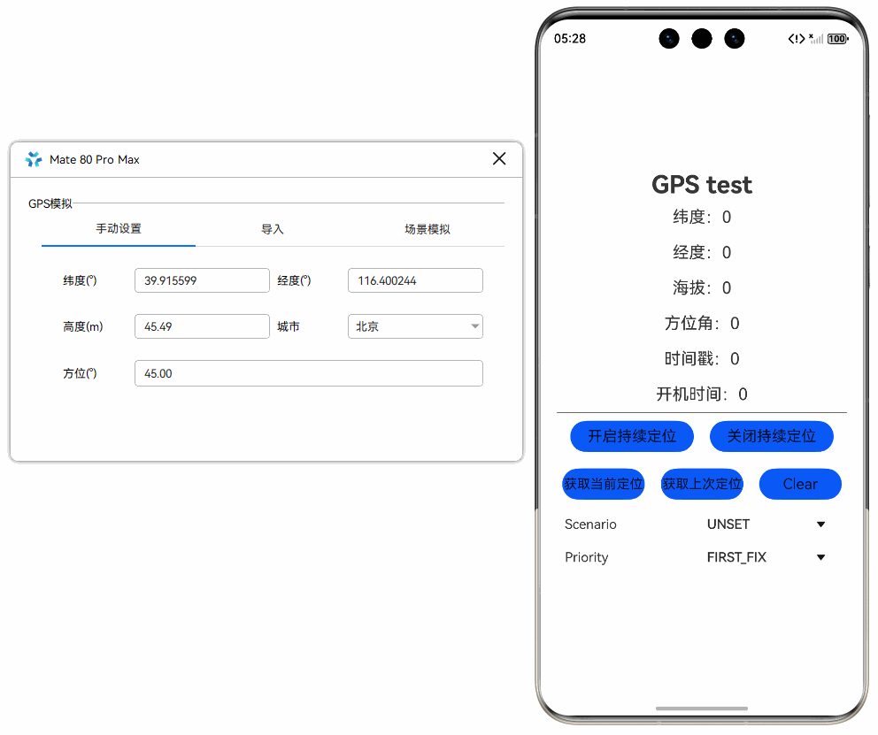
，即可返回上一级目录。按键主屏

和最近

暂不支持在扩展屏上使用。
- 从扩展屏底部上滑，可直接清除应用。

 
 

##### 删除屏幕

点击多屏界面上的删除按钮

，再点击**应用**，即可删除一块屏幕。
 

