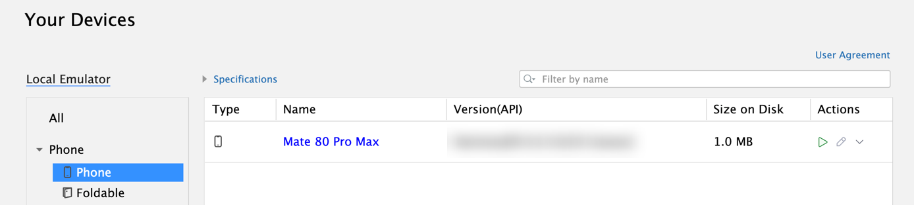
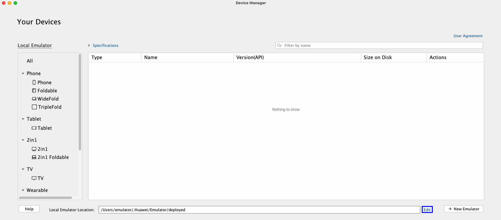
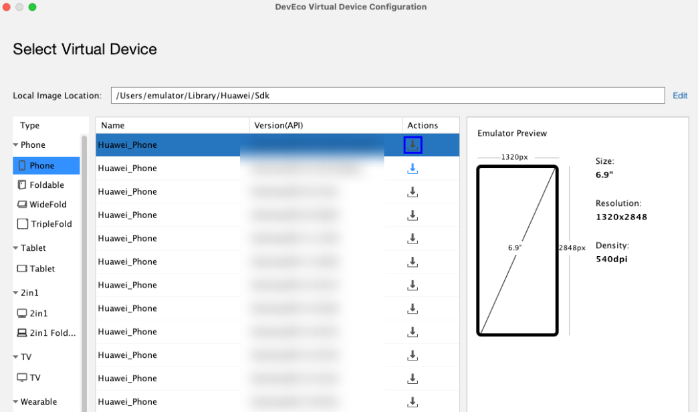
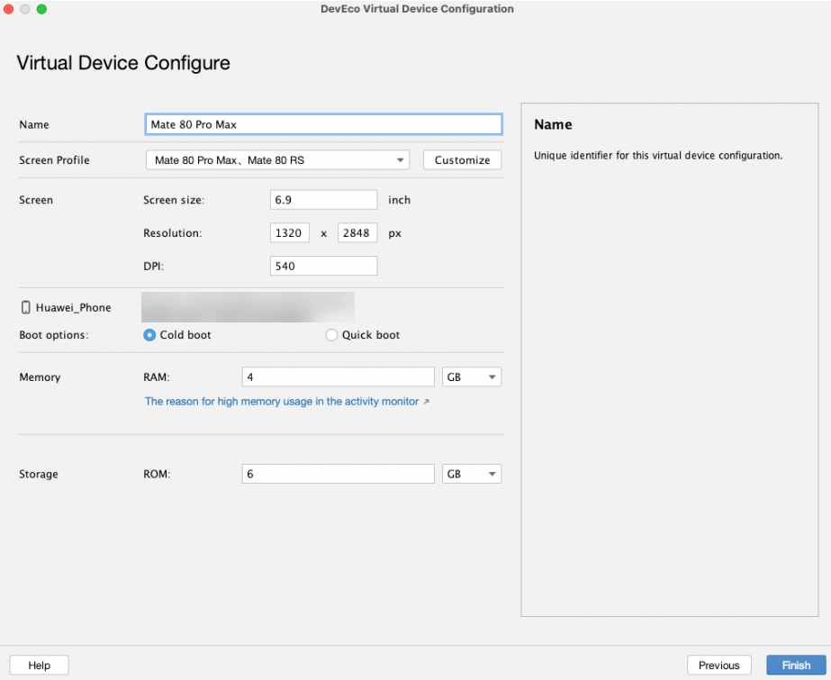
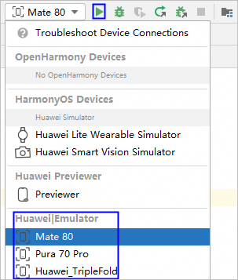
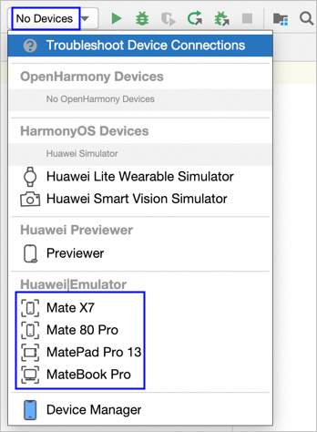

# 创建模拟器

更新时间：2026-05-26 06:48:01

来源：https://developer.huawei.com/consumer/cn/doc/harmonyos-guides/ide-emulator-create

有网络环境可参考以下步骤创建模拟器，如果是无网络环境，请查看[离线部署模拟器](https://developer.huawei.com/consumer/cn/doc/harmonyos-guides/ide-emulator-no-network)。
 
> [!NOTE]
> 在macOS中，您可能在活动监视器中发现模拟器进程占用的内存超过设置的内存。实际上，活动监视器中的 Memory 并不代表模拟器进程实际使用的物理内存，更多详情请参考 macOS上活动监视器中显示模拟器内存偏高 。

 

##### 使用预置的模拟器

从DevEco Studio 6.1.0 Beta2版本开始，如果本地没有模拟器，DevEco Studio会预置模拟器，开发者无需创建即可快速使用。
 
> [!NOTE]
> 该功能仅支持中国境内（香港特别行政区、澳门特别行政区、中国台湾除外）。

 

 
在设备选择框中，选择预置的模拟器并点击运行按钮

后，根据界面提示下载镜像，或点击菜单栏**Tools > Device Manager** >

下载镜像后，即可快捷使用模拟器。
 

 
 

##### 创建新的模拟器
1. 点击菜单栏的**Tools > Device Manager**，点击右下角的**Edit**设置模拟器实例的存储路径**Local Emulator Location**，Mac默认存储在~/.Huawei/Emulator/deployed下，Windows默认存储在C:\Users\xxx\AppData\Local\Huawei\Emulator\deployed下。

  

2. 在**Local Emulator**页签中，单击右下角的**New Emulator**按钮，创建一个模拟器。

  在模拟器配置界面，可以选择一个默认的设备模板，首次使用时请点击设备右侧的

下载模拟器镜像，您也可以在该界面更新或删除不同设备的模拟器镜像。

  单击**Edit**可以设置镜像文件的存储路径。macOS默认存储在~/Library/Huawei/Sdk下，Windows默认存储在C:\Users\xxx\AppData\Local\Huawei\Sdk下。

  
> [!NOTE]
> 如果配置界面显示异常，例如设备列表为空等，可先关闭DevEco Studio，并进入~/Library/Huawei（Windows路径为C:\Users\xxx\AppData\Local\Huawei）目录，删除DevEcoStudiox.x文件夹（如DevEcoStudio6.0，具体文件夹名称和安装的DevEco Studio版本相关）以清理缓存。

  

3. 单击**Next**，设置设备相关的参数。

  
**Name**：设置模拟器的名称。
4. **Screen Profile**：从DevEco Studio 6.0.0 Beta1版本开始，部分设备支持选择预置的机型配置或自定义屏幕配置，具体支持的设备请参考[自定义屏幕配置](https://developer.huawei.com/consumer/cn/doc/harmonyos-guides/ide-emulator-customize-screen-configuration)。可点击下拉框选择预置的机型配置，也可点击**Customize**自定义配置，在自定义配置的情况下可以对屏幕尺寸、分辨率和DPI进行修改，取值范围参考界面提示。
**Screen size：**屏幕的对角线长度，单位为inch。
5. **Resolution**：分辨率，包括宽度和高度，单位为px。
6. **DPI**：像素密度，DPI 越高，UI组件占用的像素点越多，从而提供更精细的显示效果。
7. **Boot options**：模拟器启动方式。从DevEco Studio 6.1.0 Beta1版本开始支持。
**Cold boot**：以开机启动的方式重新启动。
8. **Quick boot**：启动时加载上次关闭时保存的快照，启动后会恢复至上次关闭时的状态。
9. **Memory**：设置模拟器的内存。
10. **Storage**：设置模拟器的存储空间。
11. 启动模拟器，有两种方式。

  
从DevEco Studio 6.1.0 Beta2版本开始，创建后的模拟器会展示在设备列表中（最多10个），选择模拟器后，点击运行按钮

，即可一键完成启动模拟器、编译构建、推包运行操作。

12. 在设备管理器页面，单击

启动模拟器。

13. 单击DevEco Studio的**Run > Run'模块名称'**或

。

  

14. DevEco Studio会启动应用/元服务的编译构建与推包，完成后应用/元服务即可运行在模拟器上。

  

